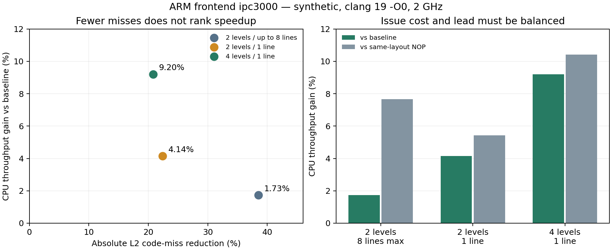

# Class A: 5% search and static-policy transfer (2026-09-22)

FleetBench Arena did not reach the requested 5% target. Twenty-two additional
executable policies failed to improve meaningfully on the previously confirmed
3.44–3.48% CPU throughput gain. The unchanged policy transfers to the upstream
NoArena operation mix with a 2.18% CPU gain. A generic static call-graph policy
does produce a larger gain on the large ARM frontend synthetic workload:
9.20% CPU / 9.23% wall throughput, and 10.42% CPU versus its NOP twin. This is
an ideal-case mechanism result, not a 9% result on a production application.
Verilator transfer was negative: 0.98792x for the dense graph policy and
0.98627x for the sparse policy at the dense layout (three repeats each).

## Measurement contract

- Xeon 6787P, CPU 36, 2 GHz fixed in both cpufreq and HWP, fixed uncore,
  turbo and selected-core C6 disabled during measurements; exact settings
  restored after every context. No change to `perf_event_paranoid`.
- FleetBench uses the unchanged upstream workset of 10 and operation mix.
  Arena exploration uses 50 iterations. NoArena transfer uses 100 iterations,
  seed 0, three interleaved rounds, with the existing Arena-selected binary.
- ARM uses the existing upstream generated `ipc1000` and `ipc3000` inputs,
  clang 19, the generator's default `-O0` Makefile, and `-l 10000`. Both
  baseline and injected builds have identical compiler flags apart from the
  pass. These are synthetic frontend stress tests; the larger input is not
  claimed to represent a service's normal request setting.
- Builds never execute during accepted timing runs. The long Verilator build process group
  is explicitly stopped around the other measurements, then resumed in a
  `finally` block. Pause/resume timestamps are retained.
  An initial Verilator campaign overlapped a short compiler regression test;
  the entire campaign was excluded, platform restoration checked, and a fresh
  full campaign started. Its interrupted logs are retained with `excluded.json`.
- Timing is randomized within each round. Same-layout NOP twins remove only
  injected T1 instructions, preserving existing native data-prefetch hints.
  Speedup means baseline time / modified time; reported gains are throughput
  gains, not the percentage reduction in execution time.

## Additional FleetBench search

The 22 executed candidates comprise deeper schema frontiers (3/4), round-robin
issuance, 16/32-hint budgets, separate constructor-source paths, 16/32-line
coverage, 16/32-child limits, T0/T2/NTA substitutions, a generic direct graph
with GOT addressing, copy-constructor C2 sites, and own-function body lookahead
at offsets 256/512/1024. Two earlier generic-graph builds failed to link because
of direct references to preemptible symbols; their commands and errors are
retained separately from successful experiments.

The first 19-arm screen includes 16 new policies and three controls. The second
nine-arm screen includes six new policies and the same controls. These 28 runs
are exploratory and are not pooled with the prior independent confirmations.
The original policy remains selected. A copy-constructor variant differed by
only about 0.01% from the incumbent in its screen, which is not a meaningful
improvement or grounds to report a new winner.

Increasing coverage can lower misses without improving time. For example,
32 children / 16 lines reduces absolute speculative code misses by about 24.6%
in its screen, but is slower than the incumbent, whose reduction is about
21.1%. Generic whole-binary call-graph injection adds too much work; the
GOT-based arm takes approximately 159 ms versus 140 ms for baseline.
Changing the incumbent's T1s to NTA is substantially worse. These negative
results are included in the raw tables.

The earlier alias limitation is now explicitly tested: additional copy sites
use C2 function bodies rather than C1 aliases. All requested copy-policy hints
were emitted (20,596 for `copy2`), but the extra coverage did not improve time.
The selected FleetBench candidate is therefore unchanged rather than expanded by
ineffective hints.

## Transfer results

| Workload / policy | Repeats | CPU speedup | Wall speedup | CPU vs NOP | Interpretation |
|---|---:|---:|---:|---:|---|
| FleetBench NoArena / unchanged schema policy | 3 | 1.02181x | 1.02175x | 1.03115x | Positive operation-mix transfer within protobuf |
| ARM default `ipc1000` / depth 2, up to 8 size-capped lines | 3 | 0.88102x | 0.87675x | 1.00091x | Added footprint/cost overwhelms benefit |
| ARM large `ipc3000` / same depth-2 policy | 3 | 1.01730x | 1.01719x | 1.07659x | Prefetch benefit mostly consumed by insertion cost |
| ARM large / depth 2, one entry line | 3 | 1.04140x | 1.04103x | 1.05417x | Lower issuance cost helps |
| ARM large / depth 4, one entry line | 5 fresh | 1.09198x | 1.09226x | 1.10418x | Selected synthetic policy; independent confirmation |
| ARM default / selected depth-4 policy | 3 held out | 1.00764x | approximately 1.000x | 1.00008x | No demonstrated prefetch benefit versus NOP |

The sparse depth policy is selected after a separate one-round depth-3/4/8
screen. Confirmation uses fresh runs, not the selection samples. The default
size is tested afterward with the selected depth-4 policy unchanged. Its small
baseline CPU improvement is also present in the NOP binary, so it is not
credited to prefetching. The earlier GCC screening MPKIs are not used here;
all transfer comparisons have new clang baselines.

The broad depth-2 ARM policy issues about 8.35% more instructions. One-line
depth 2 reduces that to about 4.30%; depth 4 reduces it further to about 3.82%.
In the large workload, depth 2 / one line actually reduces absolute code misses
more than depth 4 / one line, yet the latter is faster. Miss count alone does
not rank these policies correctly.

Static size inspection reveals another useful constraint. On `ipc3000`, the
baseline `.text` is 4,773,220 bytes; the broad policy grows it to 5,589,444
(about 17.1%), whereas both one-line policies use 4,773,324 bytes, only 104
bytes more. Most single hints fit within existing function-alignment slack.
This does not mean all instruction addresses are unchanged, but it suggests
bounding code growth as well as the number of issued hints. The small input's
corresponding sizes are 1,591,348 / 1,863,572 / 1,591,468 bytes.



## Mechanism check on the large ARM workload

Separate profiles use 3,000 loops, with three event groups in separate runs.
These are diagnostic measurements, not additional timing repetitions.

| Metric | Baseline | Depth 2 / one line | Depth 4 / one line |
|---|---:|---:|---:|
| Top-down frontend bound | 89.80% | 89.41% | 89.02% |
| Top-down backend bound | 2.35% | 2.35% | 2.35% |
| I-cache stall cycles | 4,302,048,999 | 3,881,389,586 | 3,502,284,949 |
| FE retired latency >=64 events, without intervening backend stalls | 20,393,463 | 14,673,618 | 10,623,439 |
| L1D-pending stall cycles / cycles | 0.00087% | 0.00438% | 0.00698% |

The selected policy reduces I-cache stall cycles by 18.6% and long frontend
starvation events by 47.9%. The very small backend contribution makes this a
useful ideal case for the user's lead-time hypothesis. However, changing graph
depth also changes coverage and emitted-code layout; these counters do not
isolate a pure runtime-lead effect. No claim is made that data prefetch warms
the ITLB or BTB, or that overlapping stall counters can be added together.

## Static methodology and its limits

`static_prefetch_graph.py` provides common frontier traversal and bounded
symbol-relative code-line selection. The protobuf adapter obtains hidden
dispatch edges from static field-type descriptors. `callgraph_prefetch_plan.py`
instead extracts direct calls and tail calls from the baseline binary, groups
aliases, traverses local nodes, and emits plans only for global symbols. It
cannot reconstruct arbitrary indirect calls or branch probabilities.
File-local symbols with the same name in separate translation units now have
distinct address-qualified graph identities. Rebuilding the frozen public
plans after this correction reproduces the measured plans exactly; comparison
records are retained, and stale graph caches are versioned.

The method is profile-free when producing a plan. Choosing its parameters has
used performance measurements, so it is not an untuned universal heuristic.
Different adapters and different lead/coverage settings are required by the
results so far. A shared implementation is not evidence of broad performance
generalization.

Verilator has a different static structure: its largest function is about
7.84 MB, or 32.65% of the defined-function bytes, versus 1.36% for FleetBench.
Entry-target prediction may miss much of the opportunity inside such a large
function.

## Verilator transfer protocol

The unchanged generated Chipyard DualMegaBoomAndSingleRocket model is rebuilt
with clang 19 and the existing O3 settings. The first policy is the same generic
depth-2 / size-capped-8-line policy tested above. The linked binary contains
132,998 injected direct T1s; every original target resolves inside executable
code. Compiler module counts differ because runtime objects do not all use the
pass and linking removes some generated entries.

To test the selected sparse policy at an identical layout, the depth-4 / one-line
plan is applied inside the existing seven-byte T1 slots. Of 40,360 requested
hints, 39,238 have allocated sites; 281 requested sites have no emitted slots.
The applied subset is archived. Unused slots become NOPs. Both variants produce
byte-identical all-T1-removed twins, checked with SHA-256 and a full byte
comparison. This is a fixed-layout transfer test, not a clean sparse rebuild;
it retains the original slot footprint and cannot rule out benefits from a
different clean placement/layout if it fails.

Measurements use the same qsort payload and `+max-cycles=100000`, three
interleaved rounds each for baseline, dense policy, sparse policy and one shared
NOP control. The expected timeout at exactly 100,001 simulation cycles is
checked on every run. This is an established fixed-cycle simulation prefix,
not a measurement of a completed qsort payload.

The completed clean campaign gives 0.98792x CPU / 0.98800x wall for depth 2,
and 0.98627x CPU / 0.98612x wall for depth 4 at the fixed layout. Relative to
their shared NOP twin the results are 0.99541x and 0.99375x. MPKI increases
from 57.21 to 57.49 / 57.56. All twelve runs reach the same simulation cycle
and have the same output hash. The generic function-entry policy does not
improve this application under this protocol.

A separate baseline Top-down run at the same 100k-cycle prefix measures
61.18% frontend bound, 6.67% backend bound and 21.18% bad speculation.
Thus this failure is not explained by an absence of frontend pressure. It is
consistent with a mismatch between function-entry targets and the enormous
function bodies. These negative results do not invalidate the earlier successful
intra-function sequential policy, which uses different targets and placement.

## Next static-policy design

The evidence favors choosing policies from code structure rather than applying
one fixed graph depth everywhere. Small-function chains are candidates for a
single future entry line; huge flattened functions need the already established
intra-function sequential-lookahead family. Schema descriptors can recover
edges that a direct binary graph cannot see. This is a design direction, not
a newly validated automatic selector.

The next compiler experiment should estimate intervening work along a static
path and bound both dynamic hint issuance and emitted code growth. Alignment
slack is a useful cost signal in these results. Depth alone is not a time unit,
and a larger miss reduction is not a sufficient selection objective. Select on
CPU and wall time, then require independent repetitions and a same-layout NOP
comparison before crediting a gain to prefetching.

## Literature connection

[AsmDB (ISCA 2019)](https://skanev.org/papers/isca19asmdb.pdf) motivates a bounded
timeliness window and pruning high fan-in/fan-out or redundant loop issuance.
Its scheme uses dynamic miss/flow feedback and proposed L1-I prefetch support;
its miss-elimination results are not native T1 speedups and are not a promised
ceiling for this experiment. We use its timeliness/overhead reasoning rather
than transplanting its numerical instruction-distance window to this machine.

[Call Graph Prefetching for Database Applications](https://pages.cs.wisc.edu/~jignesh/publ/cgp-HPCA.pdf)
motivates predicting future function entries, but its evaluated CGP mechanism
is hardware based. It does not establish that unconditional software hints
along a static binary call graph will help. The failed broad FleetBench policy
and the ARM footprint dependence demonstrate that distinction here.

## Reproduction and evidence

Raw results: `llvm_prefetchit/results/class_a_general_20260922/`.
The `variants1.json` through `variants4.json` files contain the complete extra
protobuf planner arguments. `build/*.command.json` and metadata capture the
actual build invocation and binary/plugin hashes. `summarize.py` regenerates
`summary.csv` from per-context runs without pooling exploratory and confirmed
campaigns. The baseline and incumbent binaries are byte-identical to those in
the previous [lead/coverage report](class_a_proto_lead_20260922.md).

Generate the selected ARM policy from each workload's own baseline:

```bash
python3 llvm_prefetchit/tools/callgraph_prefetch_plan.py \
  BASELINE PLAN.json --cache GRAPH.json --min-depth 4 --depth 4 --lines 1
```

Rebuild the generated sources with the unchanged upstream Makefile and
`CC="clang-19 -fpass-plugin=/absolute/path/PrefetchITPass.so"`, exporting
`PREFETCHIT_COLD_PLAN=/absolute/path/PLAN.json` and
`PREFETCHIT_COLD_DIRECT_IN_PIC=1`. Build the baseline with `CC=clang-19` and
the same sources. Use a fresh directory and remove only that build directory's
object files between variants. Make the twin with
`make_nop_control_binary.py --mnemonics prefetcht1` and measure using
`measure_class_a_transfer.py --workload arm --work 10000` under the temporary
platform controls. A new output directory is required for every campaign.

Validation: 30 tests passed. Exact platform/HWP restoration, perf counter
running fractions, binary hashes and accepted Verilator work/output equality
are audited in `migration/evidence/class_a_general_20260922/final_audit.json`.
The interrupted campaign is archived but excluded from every summary.
