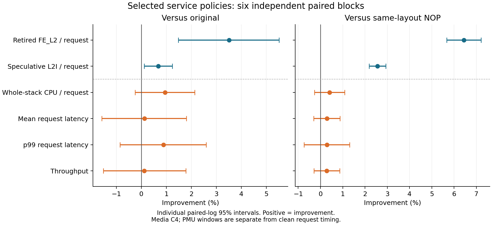
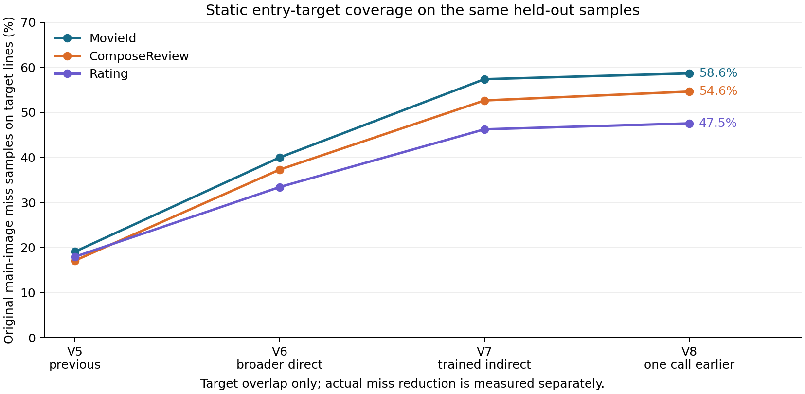

# 코드 미스 타깃 확대와 경로 보존: 독립 검증

Media 전체 스택의 유효한 clean E2E 실행 42회를 완료했다. 학습·잔여 미스 진단은 이 실행 수와 성능 판정에 섞지 않았다. 최종 조합은 MovieId=V7 간접 타깃, ComposeReview=V8 상위 caller, Rating=V6 직접 확대다.

- 합산 FE_L2/request 절감 vs 원본: **+3.512% [+1.476, +5.506]**
- 합산 FE_L2/request 절감 vs 동일 배치 NOP 조합: **+6.446% [+5.668, +7.218]**

독립 코드 미스 기준: **통과**. 별도 E2E 승격 기준: **미통과**. 미스 감소만으로 요청 성능 개선을 선언하지 않는다.

모든 절감률은 양수가 개선이다. 6개 새 seed block의 개별 paired-log t95 구간이며, 탐색 자료를 합치거나 요청들을 독립 반복으로 세지 않았다.

## 독립 확인: 요청 성능

| 비교 기준 | 전체 CPU/request 절감 | 평균 지연 절감 | p99 절감 | 처리량 증가 |
|---|---:|---:|---:|---:|
| 원본 | +0.955% [-0.243, +2.138] | +0.125% [-1.576, +1.798] | +0.887% [-0.851, +2.595] | +0.118% [-1.517, +1.780] |
| 자체 NOP | +0.415% [-0.267, +1.092] | +0.291% [-0.299, +0.876] | +0.291% [-0.740, +1.310] | +0.286% [-0.295, +0.871] |

| 조건 | CPU µs/request | 평균 ms | 실행별 p99 평균 ms | RPS | CPU util % |
|---|---:|---:|---:|---:|---:|
| base | 5960.78 | 3.37671 | 5.89967 | 1160.59 | 85.21 |
| selected_nop | 5928.37 | 3.38197 | 5.86402 | 1158.54 | 84.59 |
| selected_it0 | 5903.86 | 3.37219 | 5.84698 | 1161.86 | 84.49 |

수정한 세 서비스의 원본 user CPU 합계는 631.60 µs/request로 전체 CPU/request의 10.60%였다. 이는 지연 개선의 엄격한 상한은 아니지만, 대상 코드의 미스 감소율을 전체 CPU 절감률로 옮길 수 없는 이유다. C4 closed-loop 처리량과 평균 지연은 서로 연결된 지표이며, 최대 처리량을 새로 측정한 결과는 아니다.

## 독립 확인: 서비스별 미스

| 서비스 / 적용 정책 | 원본 FE_L2/request | 선택 FE_L2/request | 절감 vs 원본 | 절감 vs 자체 NOP |
|---|---:|---:|---:|---:|
| MovieId / V7 간접 타깃 | 488.05 | 466.13 | +4.493% [+1.771, +7.139] | +8.265% [+6.204, +10.282] |
| ComposeReview / V8 상위 caller | 1000.84 | 966.05 | +3.482% [+0.796, +6.096] | +5.986% [+4.523, +7.427] |
| Rating / V6 직접 확대 | 498.50 | 485.45 | +2.615% [+0.644, +4.546] | +5.559% [+3.718, +7.364] |

동일 배치 NOP 조합 자체의 합산 FE_L2/request 절감 vs 원본은 -3.136% [-4.979, -1.326]였다. 이 차이를 모두 prefetch 발행 효과로 계산하지 않았다.

## 별도 PMU 지표

| 지표 / 세 서비스 정규화 값의 합 | 절감 vs 원본 | 절감 vs 자체 NOP |
|---|---:|---:|
| Speculative L2I/request | +0.681% [+0.123, +1.236] | +2.560% [+2.190, +2.929] |
| User cycles/request | -0.360% [-1.070, +0.345] | -0.030% [-0.490, +0.428] |
| Retired instructions/request | -1.410% [-1.514, -1.307] | +0.027% [-0.062, +0.116] |
| ITLB walks/request | +0.347% [-4.166, +4.665] | +0.971% [-1.279, +3.172] |
| Retired FE_L1/request | -4.642% [-5.276, -4.012] | -1.494% [-2.317, -0.678] |
| I-cache data-stall events/request | +0.451% [-1.681, +2.538] | +1.753% [+0.902, +2.598] |
| I-cache tag-stall events/request | -0.431% [-6.249, +5.068] | -0.171% [-3.338, +2.899] |
| BACLEAR events/request | +0.647% [-0.820, +2.094] | +0.292% [-0.976, +1.545] |
| ITLB walk-active events/request | -1.811% [-6.433, +2.611] | -1.603% [-5.633, +2.272] |

| 이벤트 / 1,000 retired instructions | 원본 | 선택 조합 |
|---|---:|---:|
| Retired FE_L2 | 4.140 | 3.939 |
| Speculative L2I | 47.471 | 46.492 |
| Retired FE_L1 | 17.922 | 18.501 |

이 비율은 해당 PMU 묶음의 세 서비스 request-normalized 평균을 합산해 계산했다. PMU와 PEBS는 대상 cgroup의 모든 사용자 스레드를 포함한다. 요청 critical path에 속하는 미스만을 별도로 식별하지 않았으므로, event 감소율을 지연 감소율로 바꾸지 않았다. Speculative 요청과 retired 이벤트의 모집단이 달라 두 값의 차이를 wrong-path 비중이나 노출된 stall로 환산하지 않았다.

FE_L2는 retired frontend event, L2I는 speculative instruction-fetch miss 집합이다. 정지·page-walker 이벤트는 서로 겹칠 수 있어 합산 손실률이나 특정 미스 원인의 비중으로 바꾸지 않았다. 서로 다른 frontend selector는 별도 PMU 창에서 측정했다.

이번 조합의 이득은 retired L2 미스 감소에서 가장 뚜렷하다. 원본 대비 retired L1 미스는 4.64%, 명령어 수는 1.41% 증가했고, I-cache data/tag 정지와 user cycles의 감소는 확인되지 않았다. 추가 실행과 L1 동작이 L2 이득을 상쇄했을 가능성은 있지만, 이 카운터만으로 각각의 인과 효과를 분해할 수는 없다. ITLB walk와 BACLEAR에도 일관된 개선이 없어 BTB/FDIP 또는 ITLB를 단일 원인으로 확정하지 않았다.

## 탐색 결과: 독립 확인과 분리

| 구현 | 합산 FE_L2 절감 vs 원본 | vs 자체 NOP | 전체 CPU 절감 vs 원본 | 평균 절감 vs 원본 |
|---|---:|---:|---:|---:|
| V6 직접 확대 | +1.287% | +3.943% | +0.169% | +0.734% |
| V6 발행 축소 | +0.221% | +2.906% | +0.438% | +0.780% |
| V7 간접 타깃 | +2.081% | +6.631% | -0.303% | -0.217% |
| V8 상위 caller | -0.496% | +3.935% | -0.088% | -1.695% |
| V9 경로 보존 | +1.449% | +6.397% | +0.311% | -0.001% |

각 행은 해당 단계의 2-block 탐색 점추정이다. 정책별 자체 NOP와 원본을 비교했고 단계끼리 표본을 합치지 않았다. 서비스별 반응 차이를 보고, 각 서비스에서 양쪽 대조군보다 두 block 모두 FE_L2가 낮았던 정책 중 최소 비교 효과가 가장 큰 것을 선택했다. 이 조합 자체의 성능은 탐색 수치를 더해 추정하지 않고 6개 새 seed의 전체 스택 실행으로 검증했다. 선택 방식 변경 시점과 이유는 `confirmation_strategy_amendment.json`에 보존했다.

## 선택 조합의 잔여 미스와 선행 힌트

| 서비스 | main-image 표본 비중 | 잔여 main 미스 중 정적 target line 중첩 | 잔여 main 미스 중 선행 LBR 경로에서 matching hint 관측 |
|---|---:|---:|---:|
| MovieId | 83.15% | 52.36% | 33.98% |
| ComposeReview | 80.14% | 48.89% | 28.98% |
| Rating | 91.53% | 30.76% | 19.17% |

분모는 선택 조합에서 관측된 미스이며 피한 미스는 포함되지 않는다. 유한한 retired LBR 경로에서 같은 line을 겨냥한 힌트가 관측됐다는 뜻으로, 하드웨어 발행 수·fill 성공·정확한 fetch lead·BTB 실패 원인의 증명이 아니다. PEBS와 LBR profiling 결과는 clean E2E 결과에 섞지 않았다.

Matching hint가 관측된 잔여 미스 중 LBR retired-cycle 최소 나이 proxy가 0–31인 비중은 MovieId 56.5%, ComposeReview 57.6%, Rating 53.1%였다. 이는 retired 분기 기록으로 만든 하한 proxy이며 실제 issue-to-fetch lead time은 아니다. 후속 실험에서는 이미 겨냥한 MovieId/ComposeReview 타깃의 발행 위치·예산을 바꾸고, Rating의 타깃 밖 entry를 별도로 겨냥하는 것이 구체적인 탐색 방향이다. 성공한 fill과 너무 늦거나 무시된 hint는 이 자료로 분리하지 못한다.

| 서비스 | 타깃 entry line | 타깃 밖 entry line | 함수 내부 line | symbol 경계 불명확 |
|---|---:|---:|---:|---:|
| MovieId | 51.87% | 15.50% | 27.67% | 4.96% |
| ComposeReview | 48.80% | 16.38% | 31.31% | 3.52% |
| Rating | 30.75% | 42.20% | 25.07% | 1.98% |

각 비율의 분모는 해당 선택 바이너리의 잔여 main-image 표본 전체다. entry는 함수 시작 주소가 속한 64B line이며 alias는 한 번만 세고 겹치는 symbol은 경계 불명확으로 남겼다. 원본과 선택 바이너리의 주소를 직접 대조하지 않았다.

| 서비스 | 잔여 main 미스 상위 함수 | main 표본 비중 |
|---|---|---:|
| MovieId | `std::__cxx11::basic_string<char, std::char_traits<char>, std::allocator<char> >::_M_replace(unsigned long, unsigned long, char const*, unsigned long)` | 1.98% |
| MovieId | `jaegertracing::UDPTransport::append(jaegertracing::Span const&)` | 1.97% |
| MovieId | `apache::thrift::transport::TSocket::read(unsigned char*, unsigned int)` | 1.75% |
| ComposeReview | `jaegertracing::propagation::Propagator<opentracing::v2::TextMapReader const&, opentracing::v2::TextMapWriter const&>::extract(opentracing::v2::Text...` | 2.64% |
| ComposeReview | `std::basic_ostream<char, std::char_traits<char> >& std::__ostream_insert<char, std::char_traits<char> >(std::basic_ostream<char, std::char_traits<c...` | 1.93% |
| ComposeReview | `media_service::ComposeReviewServiceProcessor::dispatchCall(apache::thrift::protocol::TProtocol*, apache::thrift::protocol::TProtocol*, std::__cxx11...` | 1.35% |
| Rating | `media_service::RatingHandler::UploadRating(long, std::__cxx11::basic_string<char, std::char_traits<char>, std::allocator<char> > const&, int, std::...` | 1.26% |
| Rating | `jaegertracing::SpanContext::swap(jaegertracing::SpanContext&)` | 1.19% |
| Rating | `cpp_redis::network::redis_connection::build_command(std::vector<std::__cxx11::basic_string<char, std::char_traits<char>, std::allocator<char> >, st...` | 1.16% |

이 상위 함수와 주소 분류는 다음 타깃 선정에 사용할 잔여 미스 진단이다. 한 번씩의 profiling 표본이므로 함수별 성능 개선의 반복 검증을 대신하지 않는다.

## 원본 변동과 검증

6회 원본의 실행 간 CV는 CPU/request 0.715%, 평균 지연 1.545%, p99 1.426%, 합산 FE_L2/request 0.988%였다.

최종 compiler/분기 경로 검사 29개를 통과했다. 각 실제 ELF의 원본 main symbol binding, RIP-relative IT0 대상 instruction boundary와 exact-layout NOP를 검증했다. 실패·대체된 생성물은 결과·설정·명령·소스·패치·해시를 남긴 뒤 정리했다.

현재 CPU의 읽기 전용 CPUID 검사에서도 leaf 7/subleaf 1 EDX=0xe4000, PREFETCHI bit 14=1을 확인했다. 기능 비트와 64-bit RIP-relative 조건은 [Intel ISA reference](https://cdrdv2-public.intel.com/819680/architecture-instruction-set-extensions-programming-reference.pdf)를 기준으로 확인했다. 기능 지원 여부가 개별 힌트의 fill 성공을 증명하지는 않는다.

환경 감사: 유효 E2E 42회, PMU 180개 창 모두 fully scheduled, PEBS 9개 capture 총 313,337개 표본에서 유실·throttle 0. 플랫폼과 scheduler 설정을 복구했고 실험 컨테이너 및 prefetch 커널 모듈이 남지 않았다. 정적 커버리지 12개 값도 보존한 입력으로 재계산해 일치함을 확인했다.

독립 코드 미스 감소가 확인된 선택 ELF와 동일 배치 NOP 6개를 후속 비교 기준으로 보존했다. E2E 개선은 확인되지 않았다. 대체·탈락 ELF, 테스트 생성물, raw/decoded trace와 DSO 복사본은 각 결과를 추출한 뒤 삭제 manifest와 함께 정리했다. 원본 실행 파일·입력·소스·공유 의존성은 유지했고 NAS 전송은 하지 않았다.

| 최종 선택 서비스 | 정적 힌트 수 | executable section 증가 vs 원본 |
|---|---:|---:|
| MovieId / V7 | 4,161 | 1.229% |
| ComposeReview / V8 | 4,524 | 1.518% |
| Rating / V6 | 3,922 | 1.103% |

## 구현

- V6: 원본 미스 프로파일의 누적 점수 기준 선택 범위를 80%에서 97%로 확대했다. 최소 caller 크기 제한을 없애고 짧은 IR lead도 허용하며, 함수당 최대 4개 지점·지점당 최대 8개 힌트를 둔다. 기존 V5는 함수당 한 지점·최소 64 IR 명령·짧은 lead 제외였다. 모든 힌트는 실제 caller dominator에 들어가는 정적 RIP-relative IT0다.
- V6 weighted: 같은 ELF 배치에서 caller당 미스 점수가 가장 높은 논리 타깃 하나만 남긴다. 다른 힌트는 같은 길이 NOP로 바꾸므로 실행 힌트 수 효과를 비교한다. 코드 크기 감소 실험은 아니다.
- V7: 원본 LBR+PEBS에서 간접 호출/점프 직후 진입부 미스가 난 caller와 target을 연결한다. caller당 최대 3개 타깃을 선택하고, 해당 caller의 간접 호출 앞 dominator에 정적 IT0를 넣는다. 원래 간접 호출이나 그 포인터 계산은 바꾸지 않는다. 매칭 단위는 함수 이름이며 개별 기계어 call-site 주소는 아니다.
- V8: V7에 더해 그 caller를 직접 호출하는 상위 함수에서도 같은 후속 타깃을 미리 가져온다. 정적 call graph의 한 direct edge를 더 올라가서 발행한다. 짧은 가상 호출 래퍼의 선행 거리 부족을 시험한다. 실제 마이크로초 lead를 측정했다는 의미는 아니다.
- V9: V7에서 중복 제거 조건을 바꾼다. 기존에는 함수 전체에서 같은 타깃을 한 번만 남겨 서로 다른 분기 경로의 힌트도 제거할 수 있었다. 이제 앞서 남긴 삽입 지점이 현재 지점을 실제로 지배할 때만 중복으로 제거한다. V8의 상위 caller 이동은 적용하지 않는 별도 변형이다. 프로그램 기능 오류를 고친 것이 아니라 프리패치 경로 누락을 줄이는 실험이다.

V6–V9는 gate 없이 프로그램 경로를 따라 발행한다. 이번 반복에서는 scheduler hook·커널 프리패치·10–20µs 시간 gate를 변경하지 않았다. 먼저 타깃 누락과 source-level 발행 위치를 비교한다.

## 같은 원본 표본에서의 정적 타깃 중첩

그래프의 분모는 같은 heldout 원본 main-image FE_L2 IP 표본이다. 각 정책의 실제 링크된 타깃 이름을 원본 symbol 주소에 대응시켜 타깃 entry cache line과 겹치는 표본 비율을 계산했다. **실제 미스 감소율·동적 발행률·cache fill 성공률이 아니다.** 코드 미스 개선은 새 seed의 PMU 비교로 따로 평가한다.

V9의 타깃 이름 집합은 V7과 같아 이 정적 중첩 지표도 같다. V9는 동일한 타깃에 도달하는 다른 분기 경로에도 힌트를 남긴다.

## 실험 조건

Media 전체 스택에서 MovieId·ComposeReview·Rating 세 실행 파일과 정적 의존성을 함께 변경한다. 서비스 CPU 32–39의 8개 코어, 별도 client CPU 16–19, 관리 CPU 84–85, SMT off, 같은 NUMA 조건을 유지한다. 동시 요청 C4는 약 85% CPU util 조건이다. tracing은 모든 조건에서 100%다. Social 또는 새 C16 capacity 검증 결과로 일반화하지 않는다.

각 실행은 새 스택에서 50초 warmup 후 60초의 clean E2E ROI를 측정한다. 그 뒤 서비스별 8초 PMU 창을 순차 실행한다. 빌드·disassembly·trace decode는 성능 측정과 겹치지 않는다. FE_L2, speculative L2I, instructions, user cycles, ITLB walks를 요청 수로 정규화한다. 각 PMU 창의 요청 분모는 perf setup/teardown을 포함하는 바깥 구간이며 작은 변화에는 이 오차가 남는다.

원본과 각 후보의 exact-layout NOP를 모두 비교한다. NOP는 같은 실행 파일에서 prefetch opcode만 같은 길이 NOP로 바꾼 것이다. 원본과 NOP의 차이에는 코드 배치·코드 생성·추가 명령 효과가 남는다. 미스의 1차 지표는 세 서비스 FE_L2/request의 합이다. 서비스별 값은 서로 다른 순차 PMU 창의 정규화 값이며 동시에 관측된 합이 아니다. L2I와 FE_L2는 다른 사건 집합이고 미스 수는 대기 cycle 비율이 아니다.

첫 탐색은 2개 seed block × 4조건, 두 번째는 새 2개 seed block × 5조건, 세 번째는 새 2개 seed block × 3조건이며 각 두 번째 block은 역순이다. 오류·부하·PMU scheduled ratio·platform 복구를 확인하고, 성능 수치에 따른 제외나 재시도는 하지 않는다. 최초 일괄 정책 선택은 두 block 모두 원본과 자신의 NOP보다 합산 FE_L2가 낮아야 후보로 삼았다. 이후 독립 확인 데이터를 보기 전에 서비스별 선택으로 변경했다. 각 서비스에서 두 block 모두 양쪽 대조군보다 FE_L2가 낮은 정책 중 두 대조군 대비 효과의 작은 쪽이 가장 큰 것을 고른다. 자격을 갖춘 정책이 없으면 해당 서비스는 원본을 유지한다. 탐색 자료는 확인 자료와 합치지 않는다. E2E 성능 승격은 별도 기준이며 미스 감소만으로 선언하지 않는다.

## 간접 호출 학습

원본의 별도 실행에서 FE_L2 PEBS+LBR을 서비스별 train/heldout 12초씩, period 257로 수집했다. train만 타깃 선정에 쓰고 heldout은 진단에 쓴다. 최소 3개 train 표본이 있는 edge를 남기고 서비스별 표본 수로 정규화한 점수의 최대값으로 순위를 정했다. 공유 정적 라이브러리에서 참조할 수 있도록 타깃은 **세 원본 ELF 모두에 정의된 global 함수 이름**으로 제한한다. 같은 주소의 caller alias 때문에 pair 수는 중복될 수 있어 coverage는 중복 없는 edge 행으로 계산한다.

총 약 21만 표본에서 LOST/THROTTLE은 없었다. 107 caller 이름과 85 target 이름을 골랐다. 모든 main IP·entry IP·고유 branch edge·pair 집계와 symbol range를 보존한 뒤 raw/decoded trace 및 복사한 DSO를 정리했다. LBR 연관성은 BTB/FDIP 실패 원인의 증명이 아니다.

## 코드와 자료

- [V6: 범위 확대와 발행 수 비교](https://github.com/skyp0714/prefetchit/commit/bfc9da7)
- [V7: 학습된 간접 타깃](https://github.com/skyp0714/prefetchit/commit/5361042)
- [V8: 상위 direct caller로 이동](https://github.com/skyp0714/prefetchit/commit/f148b8c)
- [V9: 서로 다른 분기 경로의 힌트 보존](https://github.com/skyp0714/prefetchit/commit/4f8d8f5)

로컬 실험 기록: `/storage/prefetchit/class_b_coverage_20260928`.

Compact evidence: [`llvm_prefetchit/migration/evidence/class_b_coverage_20260928`](../llvm_prefetchit/migration/evidence/class_b_coverage_20260928).
