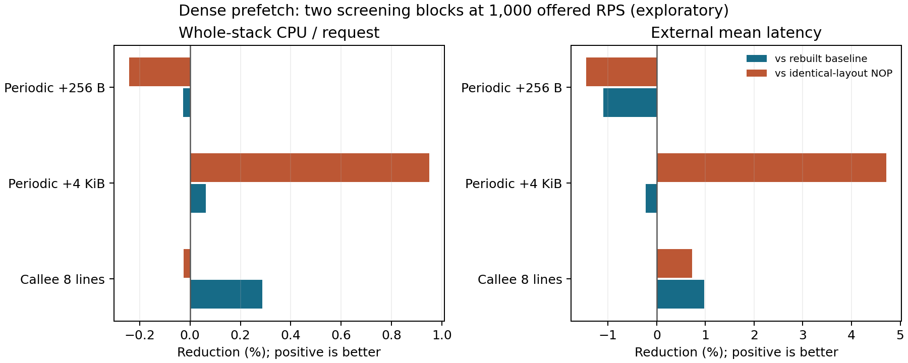
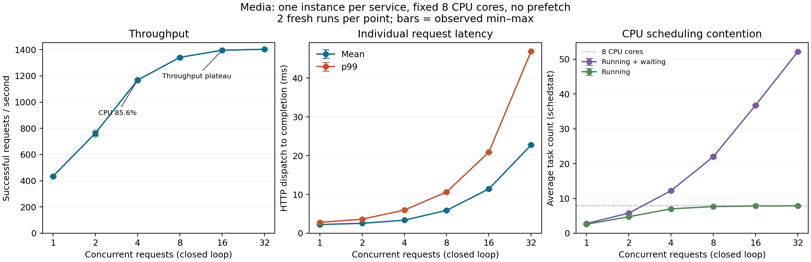

# 고밀도 프리패치와 동시 요청 수의 실측 비교

같은 8 CPU에서 동시 요청 1→32개로 늘리면 관측 처리량은 434.5→1402.6 RPS, 평균 지연은 2.241→22.744 ms, p99는 2.809→46.850 ms였다. 각 지점의 독립 2회 평균이며, 서비스 인스턴스 수와 내부 threading 구현은 고정했다.

[코드 미스·ITLB·분기와 실제 PF 커버리지 상세 진단](class_b_dense_miss_causes_20260927.md)을 별도로 정리했다.

Media 전체 스택을 새로 띄워 측정했다. MovieId·ComposeReview·Rating 세 서비스에 같은 정책을 함께 적용한 bundle 비교다. 고밀도 실험의 외부 요청 지연시간과 전체 stack CPU/request를 따로 보고한다. 절감률은 양수일 때 개선이다.

## 고밀도 구현과 대조군

| 구현 | MovieId / ComposeReview / Rating의 정적 PF 명령 수 | 방식 |
|---|---:|---|
| callee8 | 9,128 / 5,144 / 4,488 | 정의가 보이는 직접 호출 대상의 앞 8 cache lines |
| seq4k | 18,203 / 14,897 / 13,053 | eligible IR 명령 20개마다 RIP+4096, 호출 대상 4 lines |
| seq256 | 18,203 / 14,897 / 13,053 | eligible IR 명령 20개마다 RIP+256, 호출 대상 4 lines |

PREFETCHT1을 사용했다. 주기적 방식의 stride는 LLVM IR 기준이며, 일정 μs 간격이나 기계어 20개 간격을 보장하지 않는다. 서비스와 mongo-c/BSON·Thrift·yaml-cpp·OpenTracing·Jaeger를 재빌드했다. 시스템 libstdc++·libc·libmemcached, Redis 계열 기존 라이브러리 및 다른 서비스는 재계측하지 않았다. 따라서 모든 실행 명령 또는 모든 미스의 커버리지를 주장하지 않는다.

프리패치 없는 baseline도 동일 소스·도구·옵션으로 재빌드했다. 기존 FATSTATIC=1 레시피를 모든 arm에 적용했으며, 정적 libstdc++/libgcc를 포함한 이 링크 구성의 결과다. 각 PF 바이너리에는 같은 길이의 NOP로 PF만 바꾼 대조군을 만들었다. 전체 파일 크기, 치환 바이트, 역치환 시 원본 일치, 남은 PF=0을 검사했다. 삽입 위치별 원본/NOP 바이트와 SHA-256을 보존했다.

8개 공유 CPU(32–39), 2 GHz/C6 off, tracing 100%, Poisson 1,000 RPS, 50초 warmup + 90초 ROI. 각 실행마다 스택과 데이터를 새로 초기화했다. 컴파일·디스어셈블·PMU 수집은 주 지표 ROI와 겹치지 않는다. 첫 screen block의 PMU는 ROI 뒤 별도 20초/서비스 구간이다.

## 기준 측정의 변동

동일 요청 seed와 같은 설정을 쓰는 네 번의 독립 스택 측정이다.

| 지표 | 평균 | 최소–최대 | 실행 간 CV |
|---|---:|---:|---:|
| stack_cpu | 5859.315 | 5852.911–5875.160 | 0.18% |
| mean_ms | 4.444 | 4.433–4.458 | 0.26% |
| p99_ms | 15.682 | 14.779–16.054 | 3.88% |

CPU 단위는 μs/request, 지연시간 단위는 ms다. 이전 30초·서로 다른 seed의 반복과는 측정 길이 및 입력 조건이 함께 달라졌으므로 변동 감소를 측정 길이 하나의 효과로 단정하지 않는다.

## 고밀도 탐색 결과

두 새 seed block의 paired log ratio다. 아래는 탐색 점추정치이며, 두 쌍만으로 확정 개선을 주장하지 않는다. base 대비 결과는 코드 배치·크기와 PF 비용을 포함한다. NOP 대비 결과는 같은 배치에서 힌트 명령의 순효과다.

| 구현 | 대조군 | 전체 CPU/request 절감 | 평균 latency 절감 | p99 절감 |
|---|---|---:|---:|---:|
| callee8 | base | +0.29% | +0.97% | +4.58% |
| callee8 | callee8_nop | -0.03% | +0.72% | +4.19% |
| seq4k | base | +0.06% | -0.22% | +0.36% |
| seq4k | seq4k_nop | +0.95% | +4.72% | +12.24% |
| seq256 | base | -0.03% | -1.10% | -9.91% |
| seq256 | seq256_nop | -0.24% | -1.45% | -6.43% |

추가 섹션 감사에서 seq4k와 seq256의 NOP 대조군은 세 서비스 모두 실행 가능 섹션의 주소·크기·바이트가 같았다. 서로 다른 파일/매핑과 실행 시점은 유지된다. 첫 block의 서로 다른 NOP 성능을 prefetch 거리의 효과나 코드 삽입 비용의 확정값으로 해석하지 않는다. `periodic_nop_equivalence.json`에 섹션 SHA를 보존했다. 같은 baseline 파일의 짧은 A/A 반복 CV만으로 모든 대조군의 변동을 설명할 수도 없다.

CPU 절감도 동시에 요구한 초기 선택 규칙의 후보: **seq4k**, 이 규칙의 독립 확인 통과: **False**. 선택 및 보존 규칙은 `measurement_protocol.json`에 성능 측정 전에 기록했다. screen과 독립 확인 데이터는 합치지 않는다. 탈락 구현은 기본 실행에 적용하지 않았다.

독립 새 seed 7 block의 확인 결과(개별 95% t 구간, 다중 endpoint 보정 없음):

| 대조군 | 지표 | 절감률 [95% CI] |
|---|---|---:|
| base | stack_cpu | -0.14% [-0.47, +0.18] |
| base | mean_ms | -1.03% [-2.22, +0.14] |
| base | p99_ms | -5.26% [-11.60, +0.73] |
| seq4k_nop | stack_cpu | -0.23% [-0.54, +0.08] |
| seq4k_nop | mean_ms | -0.48% [-1.71, +0.73] |
| seq4k_nop | p99_ms | +0.09% [-8.43, +7.94] |

## PMU 진단

별도 진단 구간 한 번의 값이다. 서비스별 user-mode 이벤트이며 전체 스택 CPU와 범위가 다르다.

| 구현 | 서비스 | instructions/request | L2 code misses/request | MPKI | SWPF miss / hit per request |
|---|---|---:|---:|---:|---:|
| base | movie | 100,096 | 5,829.8 | 58.24 | 0.1 / 0.9 |
| base | compose | 280,175 | 10,837.4 | 38.68 | 0.1 / 2.1 |
| base | rating | 110,715 | 5,444.5 | 49.18 | 0.0 / 0.8 |
| callee8_nop | movie | 100,324 | 5,775.8 | 57.57 | 0.1 / 0.9 |
| callee8_nop | compose | 280,775 | 10,846.9 | 38.63 | 0.1 / 2.1 |
| callee8_nop | rating | 111,307 | 5,398.6 | 48.50 | 0.0 / 0.8 |
| callee8 | movie | 100,140 | 5,719.1 | 57.11 | 37.4 / 250.7 |
| callee8 | compose | 281,117 | 10,792.5 | 38.39 | 78.9 / 410.8 |
| callee8 | rating | 114,300 | 5,293.9 | 46.32 | 27.3 / 161.1 |
| seq4k_nop | movie | 101,751 | 5,851.4 | 57.51 | 0.1 / 0.8 |
| seq4k_nop | compose | 283,686 | 11,075.7 | 39.04 | 0.1 / 2.1 |
| seq4k_nop | rating | 113,361 | 5,527.2 | 48.76 | 0.0 / 0.8 |
| seq4k | movie | 101,294 | 5,767.2 | 56.94 | 343.2 / 1,228.7 |
| seq4k | compose | 283,751 | 10,612.7 | 37.40 | 669.8 / 3,073.6 |
| seq4k | rating | 114,743 | 5,357.3 | 46.69 | 291.2 / 847.2 |
| seq256_nop | movie | 101,375 | 5,734.8 | 56.57 | 0.1 / 0.9 |
| seq256_nop | compose | 283,842 | 11,119.6 | 39.18 | 0.1 / 2.1 |
| seq256_nop | rating | 112,023 | 5,482.6 | 48.94 | 0.0 / 0.8 |
| seq256 | movie | 101,364 | 5,696.7 | 56.20 | 41.9 / 1,546.3 |
| seq256 | compose | 283,864 | 10,577.5 | 37.26 | 100.9 / 3,733.9 |
| seq256 | rating | 112,003 | 5,330.5 | 47.59 | 30.8 / 1,137.2 |

seq256의 집계된 SWPF 요청 중 L2 hit 비중은 세 서비스에서 97.4–97.4%였다. 대부분 이미 L2에 있는 주소를 요청했다는 관측이며, 미래 실행 경로의 정확도나 실제 fill 성공률은 아니다. 상태가 이미 hot인 힌트를 많이 발행해도 코드 미스나 E2E 비용이 같은 비율로 줄어들지는 않는다.

MPKI는 instruction 수가 늘어도 떨어질 수 있으므로 miss/request를 함께 본다. L2_RQSTS.CODE_RD_MISS는 speculative code request의 L2 miss이며, retired miss 샘플과 같은 모집단이 아니다. SWPF_MISS/HIT는 fill buffer가 가득 차지 않았을 때의 요청을 세므로 실제 cache-fill 성공률·정확도 또는 queue 포화를 직접 측정한 값으로 해석하지 않는다. [Intel Granite Rapids 이벤트 정의](https://perfmon-events.intel.com/platforms/graniterapids/core-events/core/).

첫 screen baseline에서 세 대상 서비스의 전체 CPU 합은 스택 CPU의 31.05%, 그 서비스들의 user CPU 합은 10.44%였다. 이는 높은 user-space MPKI와 전체 요청 비용의 범위 차이를 보여준다. CPU 구성비를 latency critical path의 비중이나 프리패치 이득의 엄밀한 상한으로 사용하지 않는다.

## 동시 요청 수와 개별 요청 지연시간

이 그래프의 기준은 **동시 요청 1개**다. 모든 점에서 서비스당 인스턴스는 하나이고, 기존 내부 server/async 스레드는 유지한다. 따라서 순수 single-thread 실행이나 프로세스 수를 바꾼 실험은 아니다. 같은 8개 CPU에서 완료 즉시 다음 요청을 보내는 closed loop를 사용했다. 지연시간은 HTTP dispatch→완료이고, 고정 RPS 실험의 예정 도착→완료 지연시간과 정의가 다르다. 오류가 있거나 단일 Python client CPU 사용량이 0.8 core 이상이면 invalid로 표시한다. 수직 막대는 두 실행의 관측 최소–최대이며 신뢰구간이 아니다.

| 동시 요청 | 성공 RPS | 평균 ms | p99 ms | CPU 사용률 | 평균 runnable 대기 수 | 오류율 | 유효 실행 |
|---|---:|---:|---:|---:|---:|---:|---:|
| 1 | 434.5 | 2.241 | 2.809 | 29.8% | 0.226 | 0.000% | 2/2 |
| 2 | 761.9 | 2.557 | 3.607 | 56.2% | 1.035 | 0.000% | 2/2 |
| 4 | 1167.6 | 3.356 | 5.960 | 85.6% | 5.223 | 0.000% | 2/2 |
| 8 | 1340.9 | 5.896 | 10.625 | 94.8% | 14.314 | 0.000% | 2/2 |
| 16 | 1395.6 | 11.395 | 20.884 | 97.3% | 28.962 | 0.000% | 2/2 |
| 32 | 1402.6 | 22.744 | 46.850 | 97.9% | 44.303 | 0.000% | 2/2 |

측정한 유효 지점 중 최대 평균 처리량은 동시 요청 32개의 1402.6 RPS였다. 동시 요청 1개 대비 3.23배이며, 같은 점의 평균/p99 지연시간은 각각 10.15/16.68배다. 가장 높은 유효 동시성 32개에서는 1402.6 RPS, 평균 22.744 ms, p99 46.850 ms를 관측했다.

동시 요청 수가 CPU 수를 넘는 것만으로 runnable 과구독을 증명하지 않는다. 오른쪽 그래프는 해당 CPU들의 schedstat 실행 및 runqueue wait 시간 증가량을 관측시간으로 나눈 값이다. Running+waiting 곡선과 running 곡선의 차이가 대기 중인 runnable task의 평균 수이며, 8 CPU 기준선을 함께 그렸다. 이 동시성 측정에서는 sched_schedstats를 켰으며 매 실행 뒤 원래 설정으로 복원했다. DSB 이외의 해당 CPU 작업도 포함하고 경계에 걸친 대기가 존재할 수 있다. [Linux schedstat v15 정의](https://www.kernel.org/doc/html/v6.8/scheduler/sched-stats.html). Closed loop의 처리량과 평균 지연시간은 in-flight 요청 수로 서로 연결되므로 두 지표를 독립적인 인과 증거로 취급하지 않는다. 측정 범위에서 관측한 처리량이며, 모든 동시성·SLO에 걸친 절대 최대 지속 처리량으로 주장하지 않는다.

완료한 두 block의 12개 실행을 균형 있는 그래프에 사용했다. 추가로 끝난 동시 요청 16·32의 각 1회도 원자료에 보존했다. 사용자의 범위 조정으로 세 번째 block의 다음 warmup을 중단하고 나머지 반복 및 별도 callee8 latency 확인을 실행하지 않았다. 미실행 계획은 성공·실패 판정에 넣지 않았다. `scope_wrap.json`과 `latency_followup_status.json` 참조.

## 재현·보존

`dense_build.py prepare/build` → `dense_study.py audit/campaign` → `dense_report.py` 순서다. 모든 설정·명령·소스와 binary SHA·치환 패치·실패/탈락 이유를 남겼다. 각 빌드의 object/build tree, 끝난 실행의 request raw log·임시 데이터 volume, 탈락한 PF/NOP 실행 파일은 즉시 정리했다. 원본 패키지·소스·입력과 현재 기준 바이너리는 유지했다. NAS 전송은 없었다.

로컬 상세 결과: `/storage/prefetchit/class_b_dense_20260927`. Git evidence는 compact JSON과 검증한 archive manifest를 포함한다.
