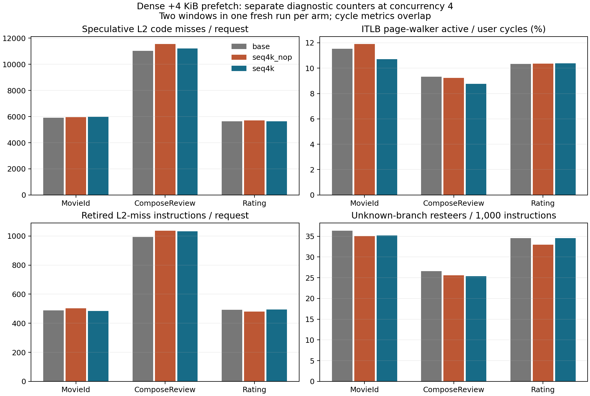
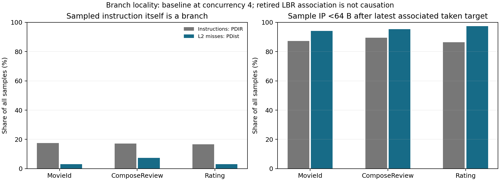

# 고밀도 프리패치의 코드 미스·ITLB·분기 원인 진단

고밀도 +4 KiB 정책은 원본 대비 순 code miss/request 감소를 만들지 못했다. MovieId 5,902→5,972, ComposeReview 11,026→11,212, Rating 5,640→5,632였다. 동일 배치 NOP 대비 감소는 각각 −0.19%, +2.89%, +1.50%로 서비스마다 달랐다. 독립 E2E 7묶음 확인에서도 10% 개선은 확인되지 않았다.

직접 관측한 구현상의 약점은 **미래 실행 경로와 PF target의 불일치**다. +4 KiB 힌트의 96–98%가 다른 함수로 향하고, 초기 pp miss 표본의 직전 관측 LBR에서 같은 miss line을 겨냥한 PF는 1.3–1.8%였다. 이는 전체 미스의 절대 커버리지 추정값이 아니라 유한한 LBR/표본에서 확인한 수치다.

PDIR/PDist 교차 확인에서는 미스 IP 자체가 branch인 비중이 3–7%이고, 직전 taken target의 64 B 안에 있는 비중은 94–97%였다. 기준 ITLB page walk active는 user cycles의 9.3–11.5%, 간접 분기 오예측률은 40.8–52.4%였다. Translation과 prediction 문제가 함께 존재한다. 현재 데이터로 각 code miss를 ITLB 또는 BTB/FDIP 원인으로 완전히 분해할 수는 없다.

[동시성·E2E 전체 결과](class_b_dense_and_concurrency_20260927.md)에서 CPU 약 86%인 동시 요청 4개와 처리량 plateau인 16개를 확인했고, 상세 진단은 동시 요청 4개에서 수행했다. 세 대상(MovieId, ComposeReview, Rating) 모두에 같은 정책을 적용했다. `seq4k`는 20 eligible IR 명령마다 RIP+4096의 PREFETCHT1 및 정의된 직접 호출 대상 4라인이다. 재빌드한 세 실행 파일의 SHA는 이전 고밀도 실험과 모두 같았다.

## 측정과 해석 범위

8 CPU/2 GHz/C6 off, 서비스당 인스턴스 하나, closed-loop 동시 요청 4. 각 arm은 fresh stack, 50초 warmup, PMU 없는 30초 ROI 뒤에 세 서비스의 user-mode cgroup PMU를 순차 수집했다. 카운터 6묶음×5초를 두 차례 수집하되 두 번째는 순서를 뒤집었다. 같은 실행의 두 window이며 독립 반복 신뢰구간이 아니다. retired L2 miss·unknown branch·일반 retired instruction을 각각 8초간 PEBS+LBR로 수집했다. 서로 다른 FRONTEND selector는 같은 MSR을 공유하므로 동시 측정하지 않았다.

모든 값은 event/request 또는 event/1,000 retired instructions로 정규화했다. Speculative L2 code request와 retired miss instruction은 서로 다른 모집단이다. 두 수의 차이를 wrong-path 비율로 계산하지 않는다. page walk active와 cache/resteer cycles는 겹칠 수 있으며, stall 손실률처럼 더하지 않는다. [Intel GNR 이벤트 정의](https://perfmon-events.intel.com/platforms/graniterapids/core-events/core/).

## Cache·translation·branch 지표

| 서비스 | arm | L2 code miss/request | retired L2 miss/request | ITLB walk/request | walk active / cycles | I-cache data stall / cycles | BACLEAR/ki | branch mispredict/ki |
|---|---|---:|---:|---:|---:|---:|---:|---:|
| movie | base | 5902.3 | 487.9 | 551.0 | 11.54% | 23.04% | 36.35 | 22.70 |
| movie | seq4k_nop | 5960.0 | 503.0 | 573.6 | 11.89% | 22.88% | 35.02 | 22.28 |
| movie | seq4k | 5971.5 | 483.9 | 505.2 | 10.72% | 22.35% | 35.18 | 22.38 |
| compose | base | 11026.2 | 993.0 | 1124.0 | 9.33% | 23.26% | 26.58 | 16.66 |
| compose | seq4k_nop | 11545.4 | 1037.1 | 1054.6 | 9.22% | 23.60% | 25.57 | 16.23 |
| compose | seq4k | 11211.7 | 1032.2 | 971.7 | 8.76% | 23.56% | 25.33 | 16.44 |
| rating | base | 5640.1 | 492.9 | 457.7 | 10.34% | 21.90% | 34.53 | 23.40 |
| rating | seq4k_nop | 5718.2 | 480.8 | 447.8 | 10.36% | 21.62% | 32.97 | 22.90 |
| rating | seq4k | 5632.4 | 494.6 | 449.3 | 10.38% | 22.20% | 34.55 | 23.07 |

| 서비스 | arm | retired ITLB miss/ki | unknown branch/ki | indirect misprediction / indirect branches | SWPF L2 hit 비중 |
|---|---|---:|---:|---:|---:|
| movie | base | 4.48 | 18.57 | 45.0% | 93.8% |
| movie | seq4k_nop | 4.42 | 17.86 | 45.2% | 93.0% |
| movie | seq4k | 4.41 | 17.91 | 45.3% | 77.7% |
| compose | base | 3.71 | 15.06 | 40.8% | 94.9% |
| compose | seq4k_nop | 3.69 | 14.26 | 39.9% | 94.3% |
| compose | seq4k | 3.62 | 14.40 | 40.0% | 81.6% |
| rating | base | 3.38 | 16.32 | 52.4% | 94.9% |
| rating | seq4k_nop | 3.36 | 15.84 | 51.8% | 95.2% |
| rating | seq4k | 3.39 | 16.21 | 52.3% | 74.0% |

BACLEAR는 instruction fetch에서 미등록 분기를 발견해 frontend가 방향을 다시 잡는 지표다. ITLB walk와 이 이벤트가 실제로 발생한다는 근거를 얻었으나, 어느 하나가 모든 L2 miss의 원인이라는 분해는 아니다. SWPF hit 비중은 수락·계수된 요청의 L2 hit 비중이고 향후 실행 정확도, fill 성공률, queue-drop 비율은 아니다.

## 어디서 미스가 발생하는가

아래 첫 표는 초기 pp 캡처의 값이다. 최종 분기 위치 비교는 이어지는 독립 PDIR/PDist 표와 그래프를 사용한다.

| 서비스 | arm | L2 샘플 수 | main ELF 비중 | 미스 IP 자체가 branch | 미스 IP가 직전 taken target에서 <64 B | 초기 ANY_P 참고치(pp)의 <64 B 비중 | 직전 분기의 misprediction 비중 |
|---|---|---:|---:|---:|---:|---:|---:|
| movie | base | 17,010 | 82.9% | 12.6% | 94.5% | 86.5% | 37.9% |
| movie | seq4k_nop | 17,901 | 84.1% | 13.0% | 94.7% | 85.3% | 38.7% |
| movie | seq4k | 17,285 | 83.1% | 12.5% | 94.1% | 85.9% | 39.8% |
| compose | base | 34,571 | 80.5% | 10.1% | 94.6% | 88.3% | 37.3% |
| compose | seq4k_nop | 37,190 | 82.5% | 10.0% | 93.9% | 87.5% | 36.5% |
| compose | seq4k | 35,806 | 81.8% | 11.6% | 94.4% | 87.2% | 37.4% |
| rating | base | 17,087 | 90.8% | 9.6% | 95.7% | 85.7% | 42.3% |
| rating | seq4k_nop | 17,145 | 91.0% | 10.8% | 94.9% | 84.6% | 40.6% |
| rating | seq4k | 17,012 | 91.1% | 11.0% | 94.4% | 84.7% | 43.0% |

초기 ANY_P pp instruction 표본은 branch 비중이 PMU의 retired branch/instruction 비율보다 높아 분포 편향의 우려가 있다. 아래 독립 PDIR 확인과 구분한다. 일반 instruction과 L2 miss의 샘플링 주기·선택 조건이 다르다. 표는 각 모집단 내부의 비중이며 단순 샘플 수를 비교하지 않는다. 분기 명령 자체의 miss와 분기 후 도착한 코드의 miss를 구별했다. 가장 최근 LBR가 샘플 IP 자체이면 그 다음 LBR를 predecessor로 사용한다. 동일 DSO 안에서 target≤IP, 거리≤64 KiB이며 그 사이에 기록되지 않은 무조건 분기/call/return이 없는 경우만 연결한다. 연결되지 않은 샘플도 전체 분모에 유지한다. 분기 직후라는 공간적 관련성만으로 그 분기의 BTB miss가 원인이었다고 단정하지 않는다.

| 서비스 | baseline miss DSO | 비중 |
|---|---|---:|
| movie | MovieIdService | 82.9% |
| movie | libc.so.6 | 9.1% |
| movie | libmemcached.so.11.0.0 | 6.9% |
| compose | ComposeReviewService | 80.5% |
| compose | libmemcached.so.11.0.0 | 10.9% |
| compose | libc.so.6 | 7.2% |
| compose | libmemcachedutil.so.2.0.0 | 1.2% |
| rating | RatingService | 90.8% |
| rating | libc.so.6 | 9.0% |

### Precise Distribution으로 표본 편향 교차 확인

새 baseline stack/seed 45002에서 L2 miss pp, L2 miss ppp(PDist), instructions ppp(PDIR)를 각각 별도 8초/서비스로 측정했다. ppp preflight의 precise_ip=3을 기록했고, workload capture 9개 모두 유실·throttle이 없었다. 위의 분기 비교 그래프는 이 독립 ppp 표본만 사용한다. 초기 pp instruction 표본을 unbiased 실행 빈도로 사용하지 않는다. [Intel의 PDIR 정의](https://github.com/intel/perfmon/blob/main/GNR/events/graniterapids_core.json), [Linux의 ppp counter 제약](https://github.com/torvalds/linux/blob/v6.8/arch/x86/events/intel/core.c#L4102).

| 서비스 | L2 pp branch IP | L2 ppp branch IP | PDIR instruction branch IP | L2 ppp target <64 B | PDIR instruction target <64 B |
|---|---:|---:|---:|---:|---:|
| movie | 12.4% | 3.1% | 17.5% | 94.0% | 87.3% |
| compose | 9.9% | 7.4% | 17.2% | 95.2% | 89.4% |
| rating | 9.8% | 3.1% | 16.7% | 97.4% | 86.4% |

main ELF에는 정적으로 링크된 C++ runtime과 의존 라이브러리도 포함되므로 main ELF 비중을 서비스 소스의 비중으로 해석하지 않는다. stripped shared library는 가장 가까운 공개 symbol 범위로만 표시될 수 있어 함수명 정확도가 제한된다.

| 서비스 | baseline의 주요 miss symbol | 샘플 비중 |
|---|---|---:|
| movie | `void std::_Destroy_aux<false>::__destroy<jaegertracing::Reference*>(jaegertracing::Reference*, jaegertracing::Reference*)` | 1.43% |
| movie | `apache::thrift::transport::TSocket::read(unsigned char*, unsigned int)` | 1.23% |
| movie | `std::__future_base::_State_baseV2::_M_set_result(std::function<std::unique_ptr<std::__future_base::_Result_base, std::__future_base::_Result_base::_De` | 1.21% |
| movie | `jaegertracing::Reference* std::vector<jaegertracing::Reference, std::allocator<jaegertracing::Reference> >::_M_allocate_and_copy<__gnu_cxx::__normal_i` | 1.20% |
| movie | `memcached_server_by_key@@Base` | 1.13% |
| movie | `jaegertracing::Tracer::analyzeReferences(std::vector<std::pair<opentracing::v2::SpanReferenceType, opentracing::v2::SpanContext const*>, std::allocato` | 1.11% |
| compose | `memcached_stat_execute@@Base` | 1.76% |
| compose | `media_service::ComposeReviewServiceProcessor::dispatchCall(apache::thrift::protocol::TProtocol*, apache::thrift::protocol::TProtocol*, std::__cxx11::b` | 1.17% |
| compose | `std::__cxx11::basic_string<char, std::char_traits<char>, std::allocator<char> >::_M_replace(unsigned long, unsigned long, char const*, unsigned long)` | 1.03% |
| compose | `apache::thrift::transport::TSocket::read(unsigned char*, unsigned int)` | 1.01% |
| compose | `unsigned int apache::thrift::transport::readAll<apache::thrift::transport::TBufferBase>(apache::thrift::transport::TBufferBase&, unsigned char*, unsig` | 0.91% |
| compose | `apache::thrift::server::TConnectedClient::run()` | 0.91% |
| rating | `jaegertracing::SpanContext::swap(jaegertracing::SpanContext&)` | 1.56% |
| rating | `apache::thrift::transport::TSocket::read(unsigned char*, unsigned int)` | 1.23% |
| rating | `std::__future_base::_State_baseV2::_M_set_result(std::function<std::unique_ptr<std::__future_base::_Result_base, std::__future_base::_Result_base::_De` | 1.06% |
| rating | `std::__cxx11::basic_string<char, std::char_traits<char>, std::allocator<char> >::_M_replace(unsigned long, unsigned long, char const*, unsigned long)` | 1.05% |
| rating | `apache::thrift::transport::TFramedTransport::readSlow(unsigned char*, unsigned int)` | 0.99% |
| rating | `__select@@GLIBC_2.2.5` | 0.99% |

| 서비스 | baseline L2 miss의 고유 sampled lines | 고유 sampled 4 KiB pages | 두 번 이상 미스 샘플된 line에 속한 샘플 비중 |
|---|---:|---:|---:|
| movie | 829 | 160 | 99.1% |
| compose | 1,218 | 190 | 99.4% |
| rating | 908 | 160 | 98.8% |

이 footprint는 8초 동안 샘플에 나타난 주소의 하한이며 동시에 cache에 있어야 하는 working set 크기는 아니다. 반복 샘플된 line은 첫 실행 한 번의 compulsory miss만으로 설명되지 않는다. 다른 CPU에서의 재진입·eviction·capacity/conflict·분기 경로 문제 중 어떤 원인인지는 이 집계만으로 분리하지 않는다.

## 왜 밀도를 높여도 미스가 남는가: 주소와 실행 이력의 커버리지

| 서비스 | seq4k의 정적으로 해석된 PF | 해석 못한 PF | +4 KiB가 다른 함수/실행 영역 밖으로 가는 비중 | miss 주소를 정적으로 겨냥한 비중 | 직전 관측 LBR 경로에서 같은 miss line을 겨냥한 PF가 있는 비중 | 직전 경로에 어떤 PF든 있는 비중 |
|---|---:|---:|---:|---:|---:|---:|
| movie | 18,203 | 0 | 97.5% | 31.8% | 1.64% | 78.8% |
| compose | 14,897 | 0 | 96.2% | 26.9% | 1.29% | 73.0% |
| rating | 13,053 | 0 | 98.0% | 26.8% | 1.79% | 61.6% |

PF target는 RIP-relative 주소와 명백한 상수 register 설정만 해석했다. 미해석 대상은 해석 성공으로 가정하지 않는다. 정적 커버리지는 실행 여부를 무시한 주소 교집합이다. 동적 열은 해당 miss 전에 기록된 retired taken-branch 사이의 직선 구간에서 PF site와 target line이 모두 일치하는 경우다. LBR 길이 밖의 힌트는 보지 못하므로 전체 실행의 절대 커버리지·정확도·prefetch 성공률이 아니다. NOP에서는 원래 PF 위치를 같은 방식으로 분석해 배치가 동일함을 이용했다. 이 PF coverage 수치는 초기 pp 캡처에서 얻었다. 추가 PDIR/PDist 확인은 baseline의 위치 특성 검증이며 PF arm의 coverage를 ppp로 재측정한 것은 아니다. 기록된 retired 순서·cycle age는 실제 fetch lead time이 아니므로 너무 늦었는지 여부를 확정하지 않는다.

현재 +4 KiB 방식은 물리적인 주소 증가를 따른다. 분기·호출이 바꾸는 미래 경로와 그 주소가 일치하는지는 별개다. PREFETCHT1으로 코드 line을 요청해도 branch predictor의 target 등록을 직접 수행하지 않으며, instruction translation 문제 해결도 보장하지 않는다. 가까운 +256 B 정책은 앞선 screen에서 수락된 SWPF의 약 97.4%가 이미 L2 hit였고, +4 KiB는 여기서 실제 경로 커버리지와 함께 판단한다.

BTB가 FDIP의 경로 추적 범위를 제한할 수 있다는 가설은 [FDIP 연구](https://arxiv.org/abs/2006.13547) 및 [shadow branch 연구](https://arxiv.org/abs/2408.12592)와 부합한다. 이번 실기계 카운터는 그 가설을 지지하는 간접 지표다. 미스별 BTB 상태나 FDIP queue를 관측하지 않았으며, 논문의 시뮬레이터 개선율을 이 서버의 예상 개선율로 옮기지 않는다.

## 재현·품질·보존

초기 27개와 추가 PDIR/PDist 9개 PEBS capture 모두 LOST/LOST_SAMPLES/THROTTLE/UNTHROTTLE=0이고, 모든 PMU window는 100% scheduled다. 명령·source/binary SHA·maps·smaps·event 정의·샘플별 집계·상위 IP·cache-line 빈도·품질·삭제 manifest를 보존한다. raw perf.data는 decode/품질 검증 뒤 제거했고, decoded copy 및 진단용 실행 파일·라이브러리 복사본도 분석 결과를 추출한 뒤 제거했다. 원본 입력·소스·패키지와 현재 baseline은 유지한다.

상세 결과: `/storage/prefetchit/class_b_dense_20260927`. 집계 스크립트: `dense_causes.py`, `dense_cause_analysis.py`, `dense_cause_report.py`.
