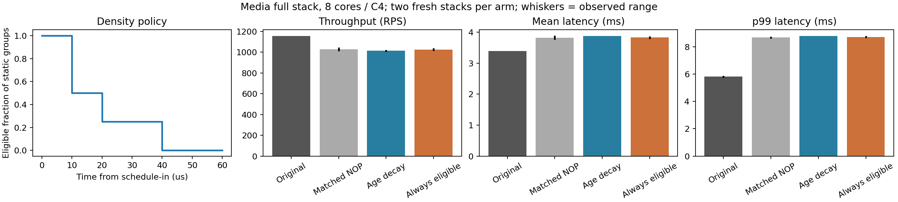

# Dominator 배치와 스케줄인 후 밀도 감쇠

실제 CFG의 분기 후 BB와 호출 대상을 앞선 dominator에 배치하고, 스케줄인 직후 발행 밀도를 높이는 정책을 구현했다. 이번 고밀도 구현은 사전 정의한 전체 요청 성능 기준을 통과하지 못했다. 기본 정책으로 승격하지 않았다.

## 구현

- 조건 분기 양쪽·switch·일반 분기 successor의 실제 `blockaddress`를 사용한다. 고정 RIP+거리나 이전 바이너리의 offset을 사용하지 않는다.
- 직접 호출은 TU 밖 선언도 포함한다. 정의가 보이는 비-COMDAT 함수의 초기 successor 최대 4개를 호출자로 올린다. 일반 호출 뒤 continuation도 BB로 분리해 대상으로 잡는다.
- 간접 호출은 기존 SSA target이 준비된 뒤에만 발행한다. 포인터 로드를 새로 추측 실행하지 않는다. EH pad, musttail continuation, 알려지지 않은 return target은 제외한다.
- BB의 dominator 체인에서 최소 24, 최대 600 IR 명령의 shortest-path lead를 찾는다. BB 길이가 달라 Dijkstra를 사용한다. 조건을 만족하지 못하면 더 짧은 위치를 사용하고 `short_lead`로 센다. IR lead는 실제 ns/기계어 lead 보장이 아니다.
- 한 위치에서 같은 target을 합치고 그룹당 최대 4개의 PREFETCHT1을 발행한다. 여러 그룹이 한 dominator를 공유할 수 있으므로 엄격한 주기나 전체 burst 상한을 보장하지 않는다.
- 커널 모듈은 incoming task가 정해진 `sched_switch`에서 CPU별 TSC/deadline만 기록한다. timer IRQ는 사용하지 않는다. userspace가 RDTSCP로 검사해 0–10 / 10–20 / 20–40 / 40µs 이후 eligible 그룹을 100 / 약 50 / 약 25 / 0%로 줄인다. 실제 동적 발행 비율은 경로마다 다르다.
- 매 스케줄인에서 다시 시작한다. thread별 등록 없이 CPU migration을 따른다. 시각은 context-switch 잔여 경로·syscall 복귀·interrupt 시간을 포함하며, 검사 중 preemption이 생기면 hint 시점이 부정확할 수 있다.

## 범위와 코드 크기

MovieId·ComposeReview·Rating 및 mongo-c/BSON·Thrift·yaml-cpp·OpenTracing·Jaeger를 재빌드했다. libstdc++/libgcc는 정적 링크되지만 재계측하지 않았고, libc·libmemcached 및 나머지 서비스도 기존 코드다. 전체 프로그램 LTO call graph나 모든 실제 machine branch의 커버리지를 주장하지 않는다.

| 서비스 | 정적 PF 수 | RIP 상대 / register | 실행 가능 section bytes |
|---|---:|---:|---:|
| movie | 136,557 | 107,948 / 28,609 | 5,409,410 |
| compose | 110,933 | 88,921 / 22,012 | 4,592,346 |
| rating | 98,661 | 79,089 / 19,572 | 4,691,138 |

## 전체 요청 측정

같은 8 CPU(32–39), 2GHz/C6 off, C4, tracing 100%, 50초 warmup + 60초 clean ROI. 서비스 내부 threading 및 인스턴스 수는 동일하다. 각 arm은 새로운 full stack·데이터로 두 seed block에서 측정했고 두 번째는 순서를 뒤집었다. latency는 dispatch→completion이다. CPU는 stack 전체 user+kernel/request다.

원본에는 시계 모듈도 없다. NOP는 PF만 같은 길이로 치환하고 gate·register pressure·clock hook을 유지한다. Always eligible은 같은 PF 바이너리에서 deadline만 무제한으로 설정한다. 모든 대조군의 바이트/역치환/SHA를 검증했다.

| 구현 | RPS | 평균 ms | p99 ms | CPU µs/request | CPU util % |
|---|---:|---:|---:|---:|---:|
| Original | 1155.9 | 3.390 | 5.817 | 5914.1 | 84.2 |
| Matched NOP | 1027.0 | 3.825 | 8.676 | 6592.2 | 83.5 |
| Age decay | 1013.0 | 3.878 | 8.792 | 6617.8 | 82.7 |
| Always eligible | 1026.1 | 3.828 | 8.717 | 6499.7 | 82.2 |

독립 2회 탐색 평균이며 확정 개선이 아니다. 아래는 block별 paired log ratio다. 절감률 양수는 개선이다.

| 구현 | 대조군 | CPU 절감 % | 평균 절감 % | p99 절감 % |
|---|---|---:|---:|---:|
| dom_decay | base | -11.90 | -14.39 | -51.15 |
| dom_decay | dom_decay_nop | -0.39 | -1.39 | -1.34 |
| flat | base | -9.90 | -12.92 | -49.86 |

## 미스와 검사 비용

첫 block의 clean ROI 뒤에 서비스마다 별도 8초 PMU를 수집했다. 아래는 해당 구간의 정확한 외부 성공 요청 수로 정규화한 값이다. 단일 진단 반복이므로 작은 차이의 인과/유의성을 주장하지 않는다.

| arm / 서비스 | instructions/request | cycles/request | L2 code miss/request | retired L2 miss/request | ITLB walk/request |
|---|---:|---:|---:|---:|---:|
| base / movie | 98444 | 273811 | 5918.6 | 494.4 | 561.4 |
| base / compose | 277256 | 564175 | 11214.2 | 985.2 | 1065.8 |
| base / rating | 104446 | 271008 | 5636.4 | 497.8 | 463.6 |
| dom_decay_nop / movie | 190477 | 604992 | 10934.7 | 428.2 | 817.3 |
| dom_decay_nop / compose | 482307 | 1285145 | 20213.2 | 913.7 | 2051.4 |
| dom_decay_nop / rating | 169399 | 506497 | 9790.5 | 427.4 | 645.0 |
| dom_decay / movie | 189576 | 598931 | 9016.5 | 279.2 | 662.6 |
| dom_decay / compose | 481847 | 1279532 | 16453.2 | 660.1 | 1385.3 |
| dom_decay / rating | 169386 | 501822 | 8243.6 | 305.5 | 429.3 |
| flat / movie | 202763 | 537371 | 7552.1 | 349.2 | 651.5 |
| flat / compose | 512557 | 1150939 | 14594.9 | 731.6 | 1073.5 |
| flat / rating | 178863 | 459144 | 6902.9 | 361.8 | 511.5 |

L2 code request와 retired miss는 서로 다른 population이다. ITLB와 branch/FDIP 원인의 비율로 분해하지 않는다. SWPF_HIT/MISS는 수락된 요청이며 발행 정확도나 실제 미스 회피 수가 아니다. 게이트는 40µs 뒤에도 실행되므로, 감쇠로 힌트를 줄여도 검사 비용과 코드 확장은 남는다.

첫 block에서 감쇠 PF는 같은 배치 NOP보다 L2 code miss/request를 MovieId 17.5%, ComposeReview 18.6%, Rating 15.8% 줄였다. 원본 대비 실행 명령 수 변화는 +62–+93%, user cycles/request 변화는 +85–+127%다. 같은 구간의 수락된 SWPF 요청은 각각 8,789 / 19,958 / 6,911건/request였다. 게이트와 코드 확장 각각의 인과 기여율은 이 대조군만으로 분리할 수 없다.

## 검증·보존

컴파일/실행/예외 경로/LLVM verifier/공유 라이브러리/간접 대상 및 실제 gate의 단계별 발행 감소: 3 tests 통과. 기존 부하·PMU·플랫폼 복구 tests: 7 통과. 읽기 전용 mmap·mprotect 제한·4 threads×40 스케줄인 초기화 및 mapping이 module unload를 막는 수명 검사를 통과했다.

원본 결과 경로: `/storage/prefetchit/class_b_dominator_20260927`. compact evidence: `llvm_prefetchit/migration/evidence/class_b_dominator_20260927`. 실패한 빌드·검증의 로그/설정/해시 및 정리 내역을 보존했다. 성능 탈락 바이너리는 판정과 분석 후 정리하며 baseline과 소스/입력은 보존한다.

Provenance 예외: 성능 측정 전에 폐기한 최초 host-glibc plugin과 flat 옵션 추가 전 smoke용 module의 교체 전 SHA는 수집하지 못했다. accepted timing에 사용한 모든 service ELF·NOP·plugin·module의 해시는 보존했다. 실패 원인과 수정 기록은 `build_recovery.json`에 있다.

스케줄러 인터페이스: [Linux tracepoints](https://www.kernel.org/doc/html/v6.8/trace/tracepoints.html). BB 주소의 의미: [LLVM blockaddress](https://llvm.org/docs/LangRef.html#addresses-of-basic-blocks). 상세 사용법은 [scheduler clock README](../llvm_prefetchit/kernel/sched_clock/README.md)에 있다.

최종 주소 감사: RIP 상대 target 275,958개가 모두 실행 가능 section 안에 있다. Register target은 실행 시 결정되므로 정적 주소 정확도 주장에 포함하지 않았다.

탈락 PF/NOP 실행 파일 6개, 139,917,632 bytes를 삭제했다. 원본 baseline과 현재 재사용할 plugin/module은 보존했다. 8회 모두 플랫폼 복구(총 288 비교), scheduler 설정 복구, clock module 해제를 확인했다.
