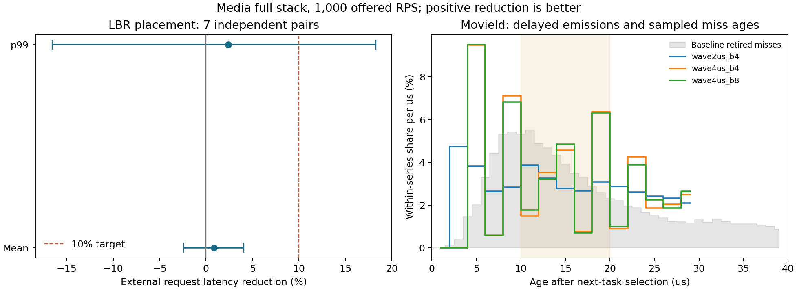

# Distributed prefetch: external request latency and timed kernel waves

Media 전체 스택에서 외부 HTTP 요청의 예정 도착→완료 평균·p99를 주 지표로 검증했다. 양수 절감률이 개선이다. CPU/request 절감을 응답시간 또는 최대 throughput 향상으로 대체하지 않는다.

## 독립 확인 결과

분기 이력 배치의 두 block screen에서 `far`를 평균 지연시간으로 선택한 뒤, 새 시드 7쌍과 새 스택으로 확인했다. MovieId·ComposeReview·Rating에 함께 적용한 bundle 결과다. 원본과 동일한 주소·크기의 NOP 공간을 치환했으므로 baseline이 정확한 NOP 대조군이다. 절대값은 실행별 지표의 산술평균, 절감률은 paired log-ratio와 개별 95% t 구간이다. 두 endpoint의 다중 비교 보정은 하지 않았으며 screen은 신뢰구간에 합치지 않았다.

| External request metric | Baseline | Selected policy | Reduction, 95% CI |
|---|---:|---:|---:|
| mean_ms | 4.4555 ms | 4.4180 ms | +0.85% [-2.44, +4.05] |
| p50_ms | 3.5594 ms | 3.5362 ms | +0.64% [-1.01, +2.26] |
| p95_ms | 9.2050 ms | 9.1571 ms | +0.54% [-3.24, +4.18] |
| p99_ms | 17.2004 ms | 16.8222 ms | +2.39% [-16.59, +18.28] |

**평균·p99의 10% E2E 개선은 입증하지 못했다.** 지연시간 CI가 0을 포함하는 endpoint는 개선이 확인된 것으로 표현하지 않는다.

1,000 RPS의 20 ms p99 gate 통과: baseline 7/7, 후보 6/7.

고정된 E2E 보존 기준 통과: **False**. 평균 또는 p99의 95% 하한이 양수이며, 두 점추정치 모두 2%를 넘게 악화되지 않아야 한다. 이는 연구 artifact의 보존 기준이며 서비스 기본 배포 설정을 바꾸지 않았다.

## 부하와 처리 용량의 범위

Media 8개 공유 코어(32–39), Poisson 1,000 RPS, upstream 입력·요청 분포, tracing 100%, 2 GHz/C6 off. 각 스택 50초 워밍업 뒤 30초의 계측 없는 요청 구간이다. 프리패치 선택 전에 baseline으로 1,000/1,100 RPS를 확인하고, p99 20 ms와 steady 오류·drop 0을 용량 gate로 고정했다.

| Baseline offered RPS | Mean | p99 | Pool utilization | 20 ms gate |
|---|---:|---:|---:|---|
| 1000 | 4.413 ms | 15.437 ms | 72.44% | True |
| 1100 | 5.801 ms | 25.876 ms | 79.80% | False |

이 두 탐색점은 비교 부하를 고르기 위한 것이다. 모든 arm의 고정 제공 부하가 같으므로 완료 RPS가 비슷한 것은 최대 처리량 향상의 증거가 아니다. 반복 capacity search를 하지 않았으므로 최대 지속 처리량 또는 그 향상률을 확정하지 않는다.

## 구현 A: 실행 경로를 따라 분산하는 LBR 배치

실제 FRONTEND_RETIRED.L2_MISS 샘플의 이전 taken-branch 경로에서 실행된 NOP를 찾고, 나중 미스 라인 하나를 RIP-relative T1/T0로 가져온다. 미스별 경로 조건을 사용하며 같은 삽입점 간 정적 거리는 64 code bytes 이상이다. 고정 μs 타이머가 아니라 실행 진행에 따라 발행한다. LBR cycles는 은퇴 시각의 lead proxy이며 실제 fetch deadline이 아니다.

| Variant | Service | Sites | Heldout miss-address/path coverage |
|---|---|---:|---:|
| far | ComposeReviewService | 19 | 1.88% |
| far | MovieIdService | 13 | 2.31% |
| far | RatingService | 11 | 1.96% |
| far_t0 | ComposeReviewService | 19 | 1.88% |
| far_t0 | MovieIdService | 13 | 2.31% |
| far_t0 | RatingService | 11 | 1.96% |
| near | ComposeReviewService | 20 | 1.43% |
| near | MovieIdService | 11 | 1.46% |
| near | RatingService | 10 | 1.04% |

`near`: 64–512 retired LBR cycles/T1/128-site cap; `far`: 256–2048 cycles/T1/256 cap; `far_t0`: far와 동일 주소의 T0. 실제 사이트 수는 cap보다 훨씬 작다. NOP 공간과 관측된 경로의 교집합이 제한되어 커버리지가 낮다. 검증 비율은 각 샘플을 한 번만 세며, 실제 실행마다 힌트가 맞는 비율이나 cache-fill 성공률이 아니다.

## 구현 B: 스케줄인 뒤 실제 μs 간격의 커널 발행

sched_switch에서 들어올 task가 선택된 뒤 첫 batch를 발행한다. 동일 CPU의 pinned hard hrtimer가 2/4 μs 간격으로 다음 batch를 발행한다. task가 바뀌면 취소하고 TGID/TID/mm/generation을 다시 확인한다. 총 최대 64라인, callback당 최대 8라인(실험 설정), 40 μs 만료로 제한했다. 커널 이미지 재부팅 대신 현재 커널에 적재한 scheduler probe 확장이다.

이번 대상 주소는 1,000 RPS의 새 PEBS+scheduler 학습 구간에서, 앞으로 실행될 시간 bin에 자주 나타난 실제 미스 IP로 정했다. 별도 heldout 구간을 보존했다. coarse process-wide 분류이므로 미래 분기를 아는 것으로 간주하지 않는다. 은퇴 시각과 실제 fetch 시각의 차이, IRQ 지연과 누적 지연은 남으며 실제 발행 나이를 별도로 기록했다.

| Kernel plan | Heldout address coverage | Nominally early coverage |
|---|---:|---:|
| wave2us_b4 | 25.16% | 18.44% |
| wave4us_b4 | 15.14% | 11.24% |
| wave4us_b8 | 24.98% | 20.08% |

다음은 한 temporal sequence의 탐색 결과이며 신뢰구간이나 확정 개선으로 해석하지 않는다. off는 앞뒤 off 구간의 log latency를 phase index로 보간했다. NOP는 타이머를 포함한 동일 경로의 모듈이고 prefetch opcode 6 bytes만 바뀐다. burst는 같은 주소 목록을 처음에 모두 발행한다. 인터럽트 비용을 포함한 외부 요청 지표다.

| Kernel plan | Mean / p99 | vs off mean / p99 reduction | vs timer NOP | vs same-target burst | Emissions aged 10–20 us |
|---|---:|---:|---:|---:|---:|
| wave2us_b4 | 5.253 / 25.142 ms | -11.09% / -31.61% | -5.93% / -32.75% | -9.30% / -36.93% | 31.31% |
| wave4us_b4 | 5.557 / 23.005 ms | -9.16% / -21.51% | -2.47% / -5.13% | -9.14% / -17.16% | 33.43% |
| wave4us_b8 | 6.116 / 25.042 ms | -10.19% / -25.02% | +1.67% / +14.31% | -2.93% / +1.36% | 33.71% |

이 지표는 프리패치 **시도**다. fetch queue 점유나 성공한 fill을 직접 측정하지 않았다. 커널 alias prefetch는 user instruction fetch/ITLB/branch predictor 훈련 자체가 아니다. [Intel GNR 이벤트 정의](https://perfmon-events.intel.com/platforms/graniterapids/core-events/core/)와 [Linux 6.8 hrtimer](https://github.com/torvalds/linux/blob/v6.8/kernel/time/hrtimer.c)를 기준으로 해석했다.

추가 CPUID 검사에서 leaf 7/subleaf 1 EDX=0xe4000, PREFETCHI bit 14=1을 확인했다. Linux cpuinfo에 flag가 보이지 않는 것만으로 지원 여부를 판정하지 않는다. 이번 새 성능 비교의 명령은 PREFETCHT1/T0이며, 기존 동일-plan PREFETCHIT1의 음성 결과는 [이전 MovieId 실험](prefetch_plan_classB_wakestream.md#7-12-round-7b--prefetchit1-vs-prefetcht1-같은-사이트같은-타깃-exe-모듈만-계측-direct-타깃-1296개-3회)에 있다. 그 결과를 ISA 미지원이나 모든 배치에서의 no-op으로 일반화하지 않는다. [Intel ISA reference](https://cdrdv2-public.intel.com/819680/architecture-instruction-set-extensions-programming-reference.pdf)는 PREFETCHIT0/1의 64-bit RIP-relative 조건과 유효한 명령 시작 주소 사용을 설명한다.

왼쪽은 독립 요청 지연시간 신뢰구간이다. 오른쪽은 실제 지연 발행 나이와 학습용 미스의 은퇴 나이를 각 계열 내부에서 정규화한 밀도다. 초기 batch와 >=30 us overflow는 wave 곡선에서 생략되므로 주소 적중률이나 cache fill 비율로 해석하지 않는다. 완전한 카운트는 JSON에 보존했다.

## 높은 MPKI가 E2E 개선으로 이어지지 않은 범위

확인 실험의 baseline 전체 stack CPU에서 MovieId가 차지한 비중은 평균 7.68%, MovieId·ComposeReview·Rating 합은 31.30%였다. 이 비중은 CPU 비용의 범위이며 요청 critical path나 latency의 상한으로 해석하지 않는다. 높은 MPKI만으로 전체 요청시간에서 제거 가능한 비용을 계산할 수 없다.

스케줄인 이후 frontend L2 miss는 관측됐고 주기 발행도 목표 시간대에 도달했다. 이 관측만으로 compulsory/capacity/conflict miss를 분해하지는 않았다. 현재 LBR 배치는 삽입 가능한 실행 NOP의 부족으로 커버리지가 작고, 커널의 시간-bin 배치는 같은 process 내 서로 다른 thread의 미래 분기를 구별하지 않는다. 후자의 heldout 주소 커버리지는 최대 약 25%, nominally early 커버리지는 약 20%이며 실제 fill 성공률은 측정하지 않았다. 따라서 queue 한계 하나로 원인을 확정할 수 없고, 이번 구현은 타이머와 힌트 발행 비용을 포함한 순이득을 보이지 못했다.

## 보존 및 검증

각 실패·탈락·대체 정책의 측정값, 설정, 명령, source/patch, SHA-256을 남기고 사용하지 않는 바이너리·인덱스·raw/decoded trace는 정리했다. 원본 benchmark/source/input과 보존 reference는 유지했다. NAS 전송은 사용하지 않았다. 주파수/C-state 복원, 데이터셋·오류 gate, 모듈 unload와 parser/ABI/lifecycle 검사를 확인했다.

상세 결과: `/storage/prefetchit/class_b_e2e_20260927`. 재현 진입점: `e2e_lbr.py`, `wave_plan.py`, `e2e_finish.py`. Git evidence에는 compact 요약과 archive SHA-256을 보존한다.
