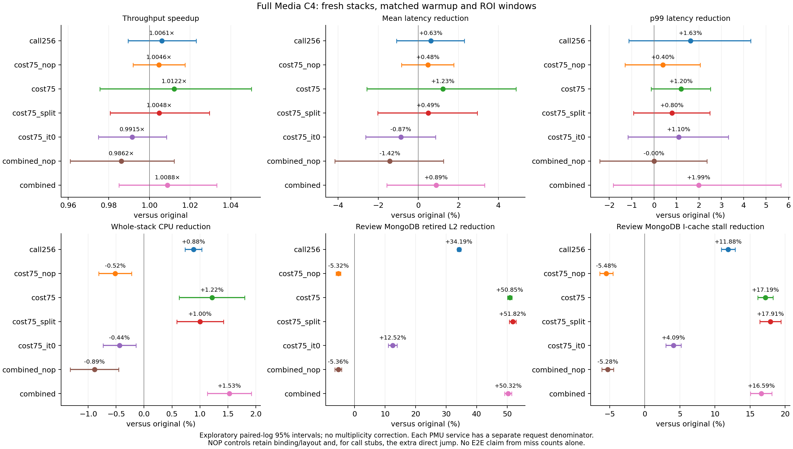
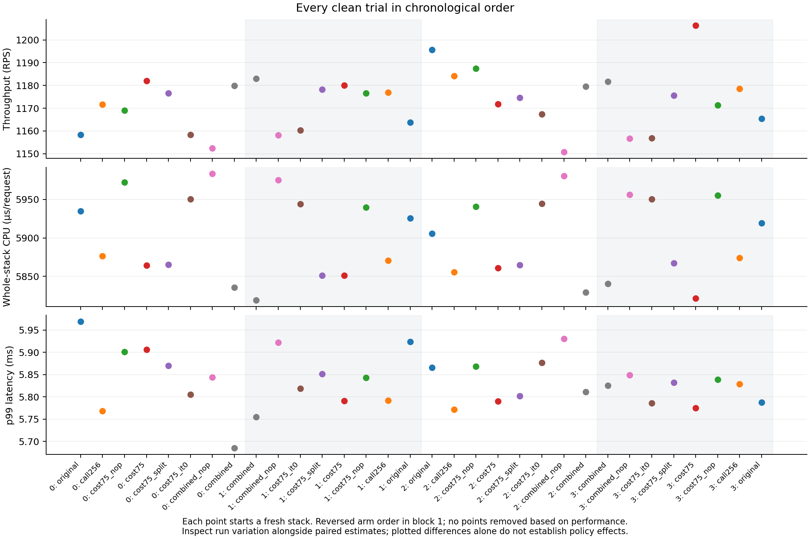
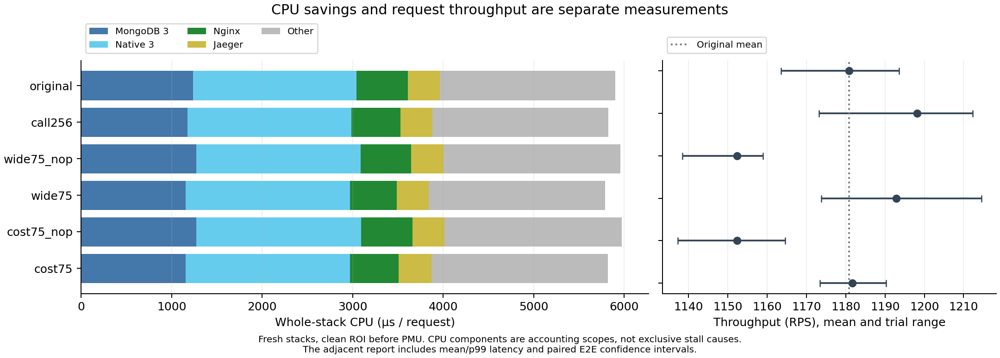
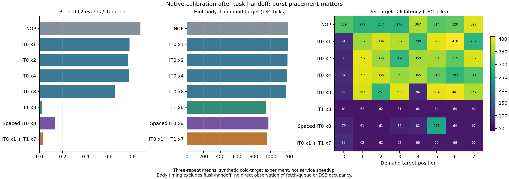
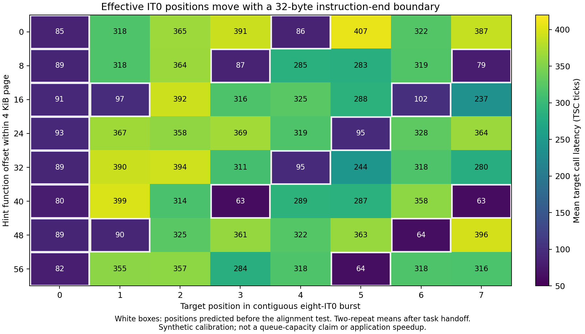

# Type B: split-instruction 주소 수정과 switch 직후 IT0/T1 혼합

Nginx worker마다 persistent connection 하나를 배정한 **32회·4-block 비교를 완료**했다. 현재의 가장 큰 처리량 점 추정은 cost75의 **1.01219× [0.97560, 1.05016]**로, 10% 향상을 달성하지 못했고 이 비교에서 원본 대비 처리량 개선도 확정되지 않았다. 반면 전체 CPU/request 절감은 T1 정책들에서 반복됐다. 개별 paired-log t95 구간이며 다중비교 보정은 없다.

| 정책 / 원본 | 처리량 speedup [95% CI] | 평균 지연 절감 | p99 절감 | 전체 CPU/request 절감 |
|---|---:|---:|---:|---:|
| call256 | 1.00608× [0.98943, 1.02300] | 0.626% | 1.631% | 0.884% [0.736, 1.032] |
| cost75 T1 | 1.01219× [0.97560, 1.05016] | 1.228% | 1.204% | 1.218% [0.628, 1.804] |
| cost75_split T1 | 1.00477× [0.98062, 1.02951] | 0.493% | 0.801% | 1.005% [0.587, 1.421] |
| 조건 없는 cost75 IT0 | 0.99149× [0.97488, 1.00839] | −0.867% | 1.098% | −0.440% [−0.735, −0.145] |
| Native-3 + MongoDB T1 결합 | 1.00881× [0.98500, 1.03319] | 0.895% | 1.992% | 1.529% [1.134, 1.922] |

원본은 **1,170.78 RPS, 평균 3.3465ms, p99 5.8864ms, CPU 5,921.41µs/request**, CPU 풀 사용률 85.43%였다. 원본 처리량 네 값은 1,158.29 / 1,163.81 / 1,195.60 / 1,165.41 RPS이고 표본 변동계수는 **1.44%**다. 작은 표본의 실행 간 변동이며 순수한 하드웨어 노이즈나 제외 기준으로 해석하지 않는다. 큰 값도 모두 포함했다.

| 정책 / 원본, MongoDB 3개 | retired L2/request 감소 | speculative L2 code-read miss 감소 | I-cache data stall 감소 |
|---|---:|---:|---:|
| cost75 T1 | 49.13% | 6.93% | 16.67% |
| cost75_split T1 | 50.07% | 6.10% | 17.54% |
| 조건 없는 cost75 IT0 | 11.44% | 0.30% | 3.56% |

뒷줄 주소 수정으로 retired L2는 더 줄었지만 기존 cost75 대비 추가 처리량·CPU 이득은 확인되지 않았다. 결합 정책은 자신의 NOP 대비 처리량 **1.02290× [1.02011, 1.02571]**였으나, 배치·점프 비용을 포함한 원본 대비는 위 표처럼 더 작고 불확실하다. cost75 NOP와 결합 NOP의 전체 CPU 비용 증가는 각각 0.518%, 0.889%였다. 미스 감소를 전체 요청 speedup으로 바꾸어 표현하지 않는다.

이번 비교도 **Full Media compose-review C4, workload CPU 8개, MovieId 포함**이다. 각 fresh stack에서 50초 warmup 뒤 60초 clean ROI를 측정하고, 이후 별도의 PMU 창을 실행했다. 최대 처리량 sweep 또는 모든 DSB API 검증은 아니다. 이전 24회 결과와 합쳐 계산하지 않는다.

자료: [32회 전체 비교와 구간](../llvm_prefetchit/migration/evidence/class_b_mechanism_20260928/balanced_completed/screen_report.md), [원본 반복별 변동](../llvm_prefetchit/migration/evidence/class_b_mechanism_20260928/balanced_completed/baseline_variation.md), [compact 원자료와 해시](../llvm_prefetchit/migration/evidence/class_b_mechanism_20260928/balanced_completed/artifacts/manifest.json).

## 이전 24회 비교: worker 배정 제어 전

75% 경로 커버리지 정책의 **24회·4-block 비교를 완료**했다. 가장 작은 call256의 처리량은 원본 대비 **1.01473× [1.00592, 1.02362]**였다. 더 넓은 wide75는 MongoDB retired L2 이벤트를 약 절반 줄였지만, 처리량 개선은 아직 불확실하다. 아래 구간은 개별 paired-log t95이며 다중비교 보정은 없다. 성능에 따라 제외한 실행은 없다.

| 정책 / 원본 | 처리량 speedup [95% CI] | 평균 지연 절감 | p99 절감 | 전체 CPU/request 절감 |
|---|---:|---:|---:|---:|
| call256 | 1.01473× [1.00592, 1.02362] | 1.493% | 0.390% | 1.287% |
| wide75 | 1.01023× [0.96581, 1.05670] | 1.039% | 0.323% | 1.892% |
| cost75 | 1.00082× [0.99074, 1.01102] | 0.087% | 0.690% | 1.351% |

원본은 1,180.79 RPS, 평균 3.317ms, p99 5.829ms, 전체 CPU 5,901.79µs/request, CPU 풀 사용률 85.96%였다. Full Media compose-review C4, workload CPU 8개, MovieId를 포함한 전체 스택이다. 최대 처리량 측정이나 DSB 모든 API 검증은 아니다. 각 실행은 새 초기 데이터와 50초 warmup, 60초 clean ROI를 사용했고 PMU는 그 뒤에 측정했다. 같은 시간 동안의 누적 쓰기 요청 수까지 동일한 것은 아니다.

| 정책 / 원본, MongoDB 3개 | retired L2/request 감소 | speculative L2 code-read miss 감소 | I-cache data stall 감소 |
|---|---:|---:|---:|
| call256 | 33.10% | 5.52% | 11.39% |
| wide75 | 50.11% | 7.31% | 17.08% |
| cost75 | 48.90% | 7.17% | 16.38% |

서로 다른 PMU 모집단이다. Retired L2 이벤트 절반 감소를 speculative code-read miss 절반 감소로 표현하지 않는다. 서비스별 PMU 합계는 별도 창을 각각 완료 요청 수로 정규화한 값이다.

cost75의 MongoDB CPU/request는 1,238.10→1,156.61µs로 약 6.58% 줄었다. 이 서비스들의 CPU 절감이 전체 요청의 같은 비율 절감을 뜻하지 않는다. 원본 Native-3와 Mongo-3 사용자 CPU 합계는 전체의 29.57%이며, 이 역시 모든 사용자 작업을 포함하므로 code-miss 대기 비중이나 달성 가능한 speedup 상한이 아니다.

wide75와 cost75는 자신의 NOP 배치 대비 각각 처리량 1.03511×, 1.02553×였다. NOP 배치 자체의 점프·코드 비용을 함께 봐야 한다. 초기 C4 클라이언트의 네 persistent connection이 Nginx worker에 3/1/0/0 등으로 배정되는 경우도 관측했다. 관측은 ROI 뒤의 스냅샷이므로 원인 전체를 입증하지 않는다. 후속 비교에서는 같은 네 worker에 한 연결씩 배정하고, 연결 재생성이 발생하면 운영 오류로 기록한다. 기존 결과와 합쳐 계산하지 않는다.

## 남은 미스의 주소가 가리키는 줄

cost75 잔여 표본을 명령어 길이와 대조했다. 두 review MongoDB의 main-image 표본 중 **52.82%, 53.19%**가 64바이트 경계를 넘는 명령어였다. 원본 heldout에서는 **23.16%, 23.46%**였다. ReviewStorage는 잔여 43.98%, 원본 23.41%였다. 비중 상승 자체는 이미 줄어든 다른 미스 때문일 수 있으므로 절대적인 증가로 부르지 않는다.

UserReview 잔여 split 표본 21,217개 중 15,276개는 시작 줄만 선택돼 있고 뒷줄은 선택되지 않았다. MovieReview는 21,074개 중 15,203개다. 선택한 주소 줄에 남은 미스를 전부 늦거나 무시된 힌트로 해석할 수 없다는 뜻이다. 전역 선택 목록에 있다는 사실이 해당 실행에서 힌트가 발행됐다는 증거도 아니다.

독립적인 native probe에서 길이 10바이트 MOVABS를 줄의 offset 61에 놓고 **뒷줄만 CLFLUSH**했다. NOP / 앞줄 T1 / 뒷줄 T1 / 둘 다 T1은 동일한 주소와 14바이트 슬롯을 사용한다. 두 힌트 슬롯 밖의 `.text`가 같은지 검증했고, 매 반복 반환 값도 검사했다.

| Probe 조건 | retired L2 / 반복, 3회 평균 | PEBS split 시작 IP 표본, 별도 250k 반복 |
|---|---:|---:|
| NOP | 1.00328 | 972 |
| 앞줄 T1 | 1.00329 | 972 |
| 뒷줄 T1 | 0.00348 | 0 |
| 두 줄 T1 | 0.00400 | 0 |

**뒷줄이 빠져도 PEBS IP는 앞줄의 명령어 시작을 기록할 수 있음**을 확인했다. 시작 주소만 줄로 내림해 학습하면 잘못된 줄을 가져올 수 있다. 이 probe는 서비스 속도 향상이 아니며, 모든 서비스 split 표본에서 뒷줄만 미스였다는 증거도 아니다. 실제 대기와 E2E는 후속 비교로 검증한다. Raw trace와 임시 실행 파일은 표본 히스토그램·명령·소스·해시를 남긴 뒤 정리했다.

## 주소만 바꾼 후보

`cost75_split`은 기존 747개 call 위치, 1,528개 힌트, 원래 코드·stub 주소를 고정한다. Train 표본에서 split 명령어는 뒷줄의 다음 실제 명령어 시작을 타깃으로 삼고, 기존 stub의 슬롯 수 안에서 타깃을 다시 배정했다. **783개 힌트의 변위만 변경, 추가 명령어 0바이트**다. 모든 변경을 되돌리면 원래 cost75와 byte-for-byte 일치하며, 힌트를 NOP로 바꾸면 이미 측정한 NOP twin의 SHA-256과 일치한다.

같은 heldout을 뒷줄 기준으로 다시 평가하면 기존의 74.35% 커버리지는 **58.85%**였다. 주소만 교체한 후보는 **60.91%**다. 이는 뒷줄 모델에 따른 관측 경로 커버리지이며 실제 미스 감소율은 아니다. 기존 위치를 유지하는 제한 때문에 재배치 여지도 남아 있다. Heldout·E2E로 타깃을 선택하지 않았다. 바이너리 검증은 통과했으며 서비스 측정은 별도로 진행한다.

## Switch 직후 IT0, 그 뒤 T1

커널의 기존 scheduler-clock 모듈이 **다음 CPU 실행 태스크가 선택된 시각**을 공유한다. 사용자 코드가 새 epoch를 0–10µs 안에 처음 관측한 계측 call에서 최대 8개 IT0를 발행하고, 나머지 호출에는 T1을 사용한다. 커널에서 physical alias에 IT0를 실행하는 구현이 아니다. IT0는 사용자 주소의 RIP-relative 명령으로 실행한다. 첫 계측 call이 첫 사용자 명령어와 같지는 않으며, migration/preemption에 따른 누락·중복 가능성이 있다.

후속 hybrid는 위의 corrected T1 주소를 기준으로 한다. Burst 확장 타깃도 train-only이며 split 명령어의 뒷줄을 반영한다. 초반도 T1인 같은 배치 대조군, all-NOP 대조군, 무조건 T1 기준을 함께 비교한다. 별도 진단에서 초기 burst를 담당하는 최대 64개 stub group만 골라 gate 검사를 줄인 정책도 검증한다. 진단용 카운터가 들어간 실행 파일을 E2E에 사용하지 않는다.

PIE/일반 ELF, full/sparse gate의 인자·플래그·반환 주소, 예외 unwind, opcode 검사 **8개가 통과**했다. 실제 서비스 진단도 **40,675건, 오류·연결 복구 0건**으로 통과했다. MongoDB의 UID/GID 999를 유지하면서 모든 clock slot의 ABI 2와 read-only 매핑을 검사했다. 진단 35초 동안 UserReview/MovieReview/ReviewStorage의 burst 진입은 각각 107,961 / 108,203 / 53,031회였다. 그중 0–5µs 진입은 각각 87.7% / 86.4% / 86.5%였다. 이는 분기 진입 횟수이며 하드웨어가 받아들인 prefetch 수가 아니다. 진단에는 첫 10초 초기화 구간도 포함되며 E2E 비교에 사용하지 않는다.

운영 사전 검사에서 이전 ABI의 모듈 경로와 udev의 device mode 갱신 경합을 찾아 수정했다. 초기 빈 DB에서 동시 사용자 생성이 duplicate-key HTTP 500으로 연결을 닫는 사례도 보존했다. 클라이언트는 warmup 중에만 같은 Nginx worker로 연결을 복구하며 오류와 복구 시도를 모두 남긴다. 성능 구간의 오류나 연결 변경은 정상 결과로 사용하지 않는다. 실제 mapping/gate 검증 및 warmup 복구 단위 검사 2개를 통과한 소스와 바이너리를 고정해 후속 비교에 사용한다.

첫 진단의 burst 90.00%를 담당한 **57개 call 위치**만 gate 검사 대상으로 남겼다. 다른 seed의 독립 진단에서는 MongoDB 3개 합계 요청당 검사가 **2,842.32→370.35회(86.97% 감소)**, burst 진입이 **6.618→6.427회**였다. Qualifying burst의 평균 진입 시각은 UserReview/MovieReview/ReviewStorage 각각 3.51/3.48/3.85µs였다. 추가 명령어 바이트는 153,736→30,780으로 줄었다. 서로 다른 카운터 계측 진단에서 얻은 값으로 E2E 성능 또는 accepted prefetch 비율이 아니다. 57개 위치는 첫 진단으로만 선택했으며 두 번째 진단이나 성능 결과로 다시 선택하지 않았다. 24회 hybrid 성능 비교를 별도로 진행한다.

## 실제 태스크 복귀 뒤 IT0 단독 검증

동일 CPU의 pipe로 다른 태스크에 실행을 넘기고 다시 block에서 돌아오는 실험을 추가했다. 대상 명령어 줄은 매번 flush하고, IT0 자체가 있는 줄은 미flush/flush로 나눴다. 미flush 조건에서도 커널 실행이 캐시·DSB 상태에 영향을 줄 수 있으므로 실제 상주 상태를 보장하지 않는다. 각 조건 20,000회씩 3번 반복했고, handoff 조건은 반복당 실제 context switch를 확인했다. 같은 7바이트 NOP/IT0/T1 슬롯 이외의 코드는 동일하며 helper 실행은 PMU 집계에서 제외했다.

| IT0 명령어 줄을 flush하지 않은 조건 | NOP retired L2/반복 | IT0 retired L2/반복 | IT0 감소 | NOP→IT0 대상 call TSC |
|---|---:|---:|---:|---:|
| 태스크 handoff 없음 | 1.01862 | 1.01772 | 0.09% | 244.54→259.20 |
| 같은 CPU에서 block 후 복귀 | 1.01012 | 0.17678 | 82.50% | 250.79→177.10 |

복귀 조건 IT0의 세 반복 retired L2는 0.1196 / 0.1907 / 0.2200으로 효과 크기의 변동도 있었다. 줄을 강제로 flush한 IT0는 handoff 없이도 전체 retired L2를 반복당 약 1개 줄였다. 이 결과는 **복귀 직후 IT0를 별도로 시험할 근거**이며 fetch queue 또는 DSB 상태를 직접 입증하지 않는다. Target call TSC는 hint 발행·handoff 비용을 제외하므로 전체 speedup이 아니다. T1은 retired L2를 더 줄였지만 이 probe의 call 시간은 늘었다. counter 감소와 요청 성능을 분리해 판단한다. 36회 PMU 모두 fully scheduled였고, 소스·disassembly·해시·카운터를 보존한 뒤 실험 실행 파일은 제거했다.

## TLB·DSB·분기 잔여 비용

독립된 fresh stack 6회, PMU 창 90개에서 cost75 T1을 조사했다. MongoDB 3개의 walk-active cycles/request는 원본보다 약 47–51% 줄었지만 retired ITLB 이벤트 수는 0.1–1.3% 감소에 그쳤다. Critical DSB 이벤트는 NOP 배치와 T1 모두 원본보다 약 3–4% 늘었고, T1과 자신의 NOP끼리는 거의 같았다. ANY_ANT/MISP_ANT도 크게 줄지 않았다. T1이 translation 대기 일부를 줄여도 DSB·분기 관련 비용까지 해결하지는 못한다는 관측이며, 배타적인 원인 비율이나 BTB/FDIP 내부 상태의 증명은 아니다.

별도로 요청 trace도 200개씩 6번 추출했지만 매 세트 177–200개 trace에 부모 span 누락이 있었다. 이 자료로 critical path 또는 E2E 인과를 비교하지 않는다. 품질 통계와 원자료는 보존한다. PMU에서는 서로 다른 FRONTEND 설정이 같은 MSR을 사용하는 조합의 multiplex를 사전에 검출했고, 중복 이벤트를 별도 창으로 분리한 뒤에만 진단을 진행했다.

## 버스트 안에서 IT0를 늘리면 모두 작동하는가

다음 단독 실험은 여덟 후보 줄을 매번 flush하고, 긴 의존 계산의 반환값으로 실제 호출 대상 하나를 결정했다. 첫 고정 순서 실험은 NOP에서도 대기가 거의 숨겨져 유효 버스트 크기 추론에서 제외했고, 그 48개 측정과 이유도 보존했다. 수정 실험은 별도 48개 fully-scheduled 측정이며 각 대상의 반환값을 매번 검사했다.

| 태스크 복귀 후 정책 | retired L2/반복 | NOP 대비 감소 | 대상 호출 TSC | hint body + 호출 TSC |
|---|---:|---:|---:|---:|
| NOP | 0.873 | — | 316.73 | 1,208.47 |
| IT0 8개 연속 | 0.652 | 25.4% | 298.13 | 1,185.45 |
| IT0 8개 분산 | 0.133 | 84.7% | 93.03 | 975.86 |
| 첫 IT0 1개 + T1 7개 | 0.029 | 96.7% | 67.23 | 959.78 |
| T1 8개 | 0.020 | 97.8% | 62.75 | 945.74 |

연속 IT0 8개에서는 대상 0·4의 호출만 세 반복 모두 짧아졌다. 이 배치에서 관측한 위치 의존성이지, fetch queue 크기나 특정 fetch block당 한 개라는 하드웨어 보장은 아니다. 분산 IT0의 speculative L2 code-read 이벤트는 연속 버스트보다 **3.57→7.47/반복으로 늘면서도** retired 미스와 호출 대기는 줄었다. Prefetch로 먼저 가져오는 요청도 포함될 수 있는 code-read 모집단을 수요 대기와 분리해야 한다.

표의 TSC는 flush·태스크 전환을 제외하고 timestamp 비용을 포함한다. 실제 서비스 speedup이 아니다. 이 인공 실험은 여덟 줄 중 하나만 소비하고 다시 모두 flush하므로, prefetch 정책의 전체 반복 CPU 비용은 오히려 늘 수 있다. 실제 프로그램의 정확도·이득은 전체 요청 측정으로 판단한다.

이 결과에 따라 hybrid E2E 시작 **전에** `hybrid_sparse_mixed`를 추가했다. 같은 sparse 바이너리에서 초기 burst의 첫 IT0만 남기고 나머지 초기 슬롯을 T1으로 바꾼다. 보통 경로 T1, 타깃, gate, 코드 크기·주소, NOP twin은 그대로다. 원래 IT0 8개 정책도 함께 유지한다. Native opcode·반환값·변경 바이트 범위 검사를 통과했다. 기존 서비스 preflight는 immutable하게 보존하고, outer campaign 외 모든 함수의 AST 및 나머지 소스 해시가 그대로임을 검사한 호환 기록으로 재사용한다.

## 효과 위치가 32바이트 경계와 함께 이동

위 관측에서 예상한 위치 규칙을 독립적으로 검사했다. Hint 함수 시작을 0–56바이트로 8바이트씩 옮기고, 각 배치마다 NOP / 연속 IT0 8개 / 예상 위치만 IT0 / 예상 위치 IT0와 나머지 T1을 두 번씩 비교했다. **64회 모두 정상 측정**했고 main과 대상 함수 주소는 고정했다. 같은 offset의 정책 사이에서는 hint opcode만 달라진다.

| Hint 함수 offset | 예상한 유효 IT0 타깃 위치 |
|---|---|
| 0, 32 | 0, 4 |
| 8, 40 | 0, 3, 7 |
| 16, 48 | 0, 1, 6 |
| 24, 56 | 0, 5 |

이는 **각 32바이트 구간에 마지막 바이트가 속하는 첫 IT0**와 일치한다. 전체 연속 IT0 실행에서 예상한 위치 40개의 반복별 대상 평균은 최대 104.45 TSC, 나머지 88개 평균은 최소 229.96 TSC였다. 개별 호출의 최대·최소나 p99가 아니라 각 반복 안의 대상별 평균이다. 내부 queue 구조를 직접 알아낸 것은 아니지만, 이 CPU의 단독 실험에서 배치에 따라 무효에 가까운 IT0가 생긴다는 근거다.

예상 위치만 IT0로 남겨도 retired 미스는 여덟 IT0와 비슷했고, 나머지 위치를 T1으로 쓰면 대부분 줄었다. 한편 태스크 handoff가 없는 이전 실험에서는 연속 IT0 8개의 retired 미스가 NOP 0.896→0.881로 거의 줄지 않았다. 따라서 이 결과를 일반적인 모든 실행 조건의 고정 규칙으로 확대하지 않고, 초기 구간에 IT0를 한정하는 서비스 정책을 검증한다.

"Fetch queue가 완전히 비어야 IT0가 동작한다"는 조건은 아직 가설이다. Intel [ISA 명세](https://cdrdv2-public.intel.com/819680/architecture-instruction-set-extensions-programming-reference.pdf)는 이를 보장하지 않는다. Queue 점유도를 직접 측정한 상태도 아니다. [Granite Rapids PMU 정의](https://perfmon-events.intel.com/platforms/graniterapids/core-events/core/)의 LATE_SWPF로 진행 중 instruction prefetch와 수요 미스가 겹친 경우를 보조 진단하되, 값이 0이라고 성공·무시·빈 queue 중 하나로 단정하지 않는다.

자료: [24회 전체 E2E·PMU 표](../llvm_prefetchit/migration/evidence/class_b_mechanism_20260928/coverage75_completed/screen_report.md), [잔여 표본·명령어 경계 분석](../llvm_prefetchit/migration/evidence/class_b_mechanism_20260928/coverage75_completed/residual_analysis.json), [자료·그림 해시](../llvm_prefetchit/migration/evidence/class_b_mechanism_20260928/coverage75_completed/manifest.json), [compact 원자료 manifest](../llvm_prefetchit/migration/evidence/class_b_mechanism_20260928/coverage75_completed/artifacts/manifest.json).

추가 자료: [Frontend 90개 창](../llvm_prefetchit/migration/evidence/class_b_mechanism_20260928/resume_frontend_completed/frontend_report.md), [복귀 probe 36회](../llvm_prefetchit/migration/evidence/class_b_mechanism_20260928/resume_frontend_completed/resume_probe_summary.json), [hybrid 실제 서비스 진단](../llvm_prefetchit/migration/evidence/class_b_mechanism_20260928/resume_frontend_completed/hybrid_preflight_result.json), [실패 기록·명령·소스·해시 archive](../llvm_prefetchit/migration/evidence/class_b_mechanism_20260928/resume_frontend_completed/artifacts/manifest.json).

버스트 자료: [연속·분산·혼합 측정](../llvm_prefetchit/migration/evidence/class_b_mechanism_20260928/burst_completed/report.md), [독립 배치 경계 검사](../llvm_prefetchit/migration/evidence/class_b_mechanism_20260928/alignment_completed/report.md).
