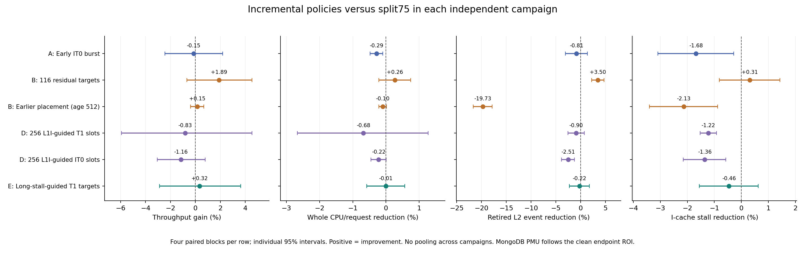
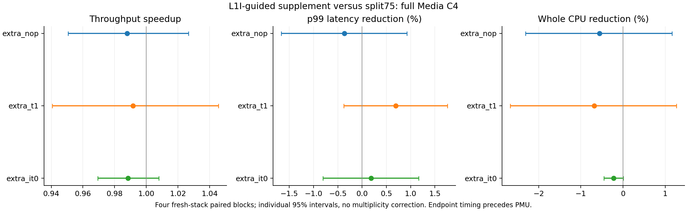
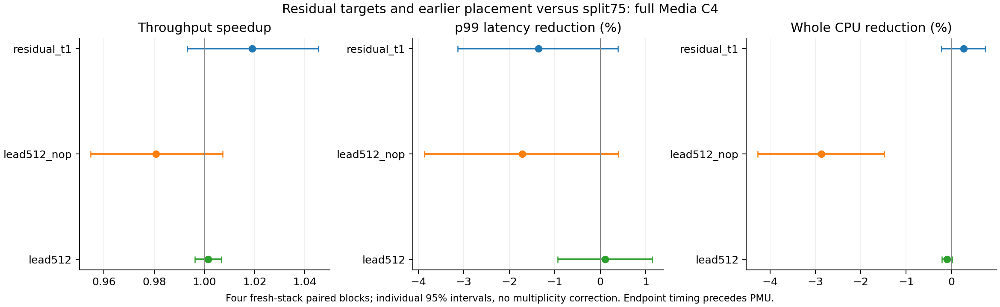
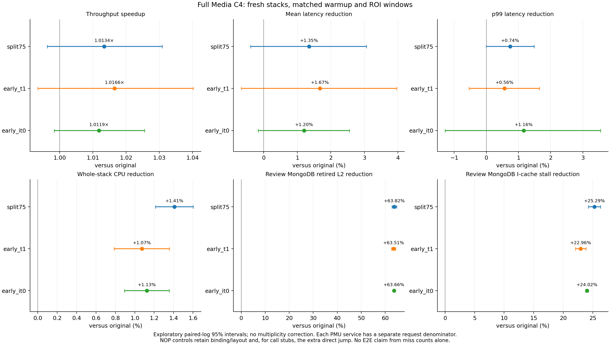
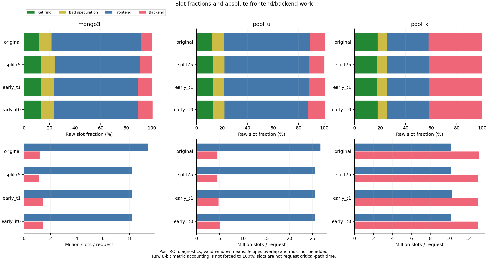
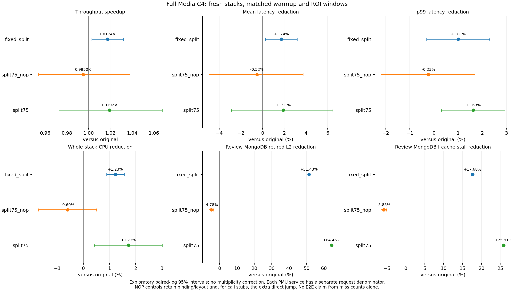
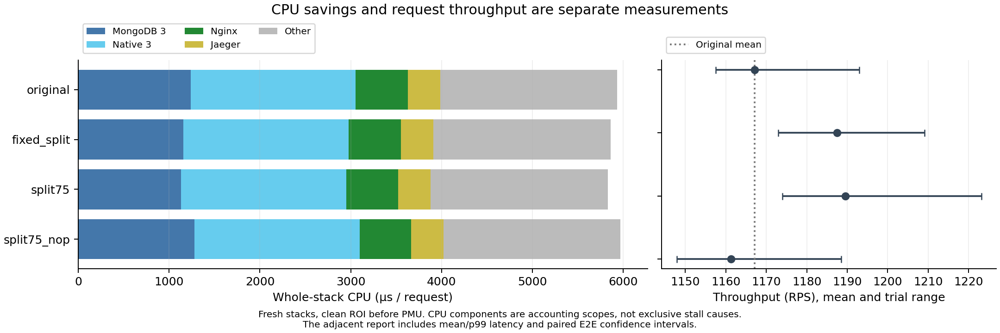
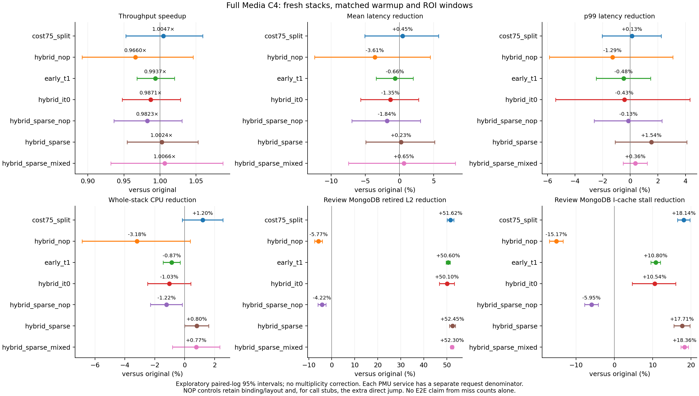
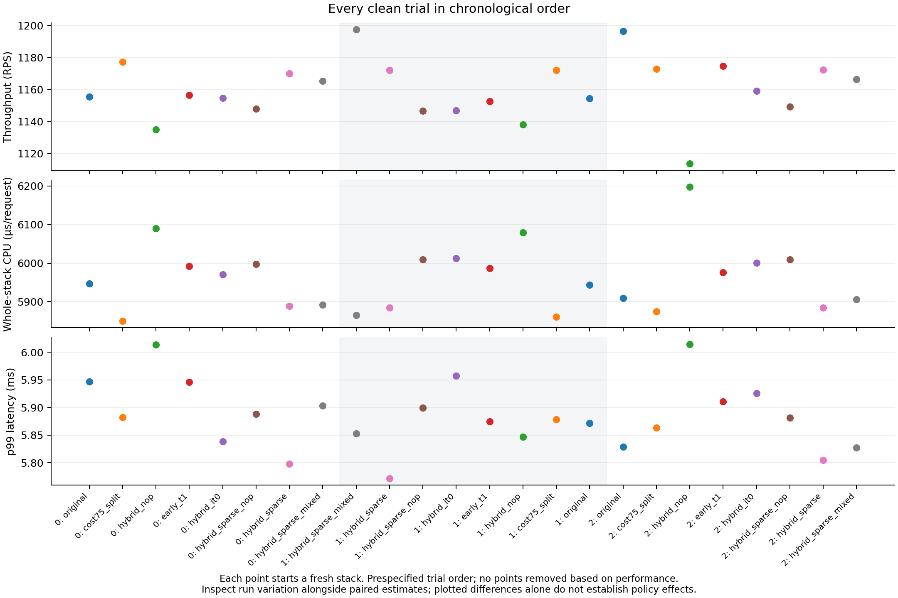

# Type B: split-instruction 주소 수정과 switch 직후 IT0/T1 혼합

## 최종 상태: 초반 IT0 결합과 원인별 정책 수정 64회 완료

**현재 기준 정책은 일반 T1 `split75`로 유지한다.** 새 split75에 초반 IT0를 결합한 뒤, 잔여 타깃·더 이른 배치·gate 없는 L1I 보강·긴 frontend 대기 타깃으로 수정하며 **4개 독립 campaign, 정상 완료 64회**를 측정했다. 추가 처리량 이득은 확인되지 않았고 10% 목표에는 도달하지 못했다. 각 campaign은 자체 대조군과 비교하며 서로 합산하지 않는다.

마지막 독립 비교에서 split75의 원본 대비 처리량은 **1.01720× [0.99845, 1.03630]**, 평균 지연 절감 **1.729% [−0.172, 3.594]**, p99 절감 **1.749% [0.631, 2.855]**, 전체 CPU/request 절감 **1.895% [0.595, 3.179]**였다. 처리량 점 추정은 +1.72%지만 구간은 1을 포함한다. 초기 IT0 추가 효과는 아래 별도 campaign에서 split75 대비 **0.99848×**였다.

그래프의 A는 초반 버스트, B는 타깃·배치 변경, D는 L1I 보강, E는 긴 대기 타깃 변경이다. C로 계획한 원본 재확인은 사전 조건을 충족하지 않아 실행하지 않았다. 각 점은 해당 campaign의 split75 대비 네 짝 비교다. 양수는 개선, 막대는 개별 paired-log t95 구간이며 다중비교 보정은 없다.

### 긴 frontend 대기 타깃으로 교체한 마지막 16회

미스 횟수 대신 **128사이클 이상 frontend uop 공급 중단 뒤의 retired instruction**을 trace로 수집했다. 이 이벤트는 backend stall로 중단된 구간을 제외하지만 code-cache miss 전용 이벤트는 아니다. 분기·주소 변환도 영향을 줄 수 있다. [Intel 이벤트 정의](https://perfmon-events.intel.com/platforms/graniterapids/core-events/core/).

기존 L1I 보강 T1의 256개 추가 슬롯을 고정하고 **21개 변위만 교체**했다. 그 대조군 대비 추가 call·hint·jump·opcode·코드 바이트는 0개이며, 기존 split75 T1 타깃은 모두 보존했다. split75 자체와 비교하면 추가 hint는 여전히 256개, 코드 순증가는 1,424바이트다. 바이트 역변환·실제 disassembly·같은 incremental-NOP SHA-256·서비스 smoke를 검증했다. 정적 명령 수를 고정한 것이 동적 방문 수까지 같다는 뜻은 아니다.

Train-only 선택은 경로 커버리지를 **5.245→11.877%**, 독립 heldout은 **4.458→10.531%**로 높였다. Heldout은 선택에 쓰지 않았다. 이 커버리지 개선이 실제 긴 대기나 성능 개선으로 이어지는지를 별도로 측정했다.

| 정책 / 대조군 | 처리량 speedup [95% CI] | 평균 지연 절감 [95% CI] | p99 절감 [95% CI] | 전체 CPU/request 절감 [95% CI] |
|---|---:|---:|---:|---:|
| split75 / 원본 | 1.01720× [0.99845, 1.03630] | +1.729% [−0.172, +3.594] | +1.749% [+0.631, +2.855] | +1.895% [+0.595, +3.179] |
| 긴 대기 타깃 T1 / 원본 | 1.02049× [0.98795, 1.05411] | +2.058% [−1.233, +5.241] | +0.859% [−0.089, +1.798] | +1.889% [+0.902, +2.865] |
| 긴 대기 타깃 T1 / split75 | 1.00324× [0.97110, 1.03645] | +0.335% [−3.011, +3.572] | −0.906% [−1.349, −0.465] | −0.007% [−0.584, +0.567] |
| 긴 대기 타깃 T1 / 같은 배치 기존 T1 | 1.00200× [0.96434, 1.04114] | +0.203% [−3.773, +4.026] | −0.567% [−1.878, +0.728] | −0.002% [−0.682, +0.674] |

원본은 **1,166.18 RPS / 평균 3.3598ms / p99 5.8813ms / CPU 5,946.99µs/request**, split75는 **1,186.20 / 3.3016 / 5.7784 / 5,834.15**, 긴 대기 타깃 T1은 **1,190.07 / 3.2906 / 5.8308 / 5,834.54**였다. 마지막 수정안은 split75 대비 CPU 비용이 같고 p99는 증가했다. 원본 대비의 개선을 타깃 교체의 추가 이득으로 가져오지 않는다. 원본 RPS/CPU 표본 CV는 **1.496% / 0.835%**, split75는 **1.201% / 0.329%**였다. 원본의 느린 반복도 그대로 포함했다.

| MongoDB 3개, 정책 / 대조군 | Retired L2 감소 [95% CI] | Code-read miss 감소 [95% CI] | I-cache stall 감소 [95% CI] | ≥128-cycle frontend 이벤트 감소 [95% CI] |
|---|---:|---:|---:|---:|
| split75 / 원본 | +62.385% [62.030, 62.737] | +9.136% [8.415, 9.851] | +25.020% [24.093, 25.936] | +57.782% [56.974, 58.574] |
| 긴 대기 타깃 T1 / split75 | −0.222% [−2.258, +1.773] | +0.108% [−0.714, +0.923] | −0.461% [−1.558, +0.623] | −0.165% [−1.530, +1.181] |
| 긴 대기 타깃 T1 / 같은 배치 기존 T1 | +0.866% [−0.402, +2.119] | +0.298% [−1.075, +1.651] | +0.884% [−0.078, +1.837] | +2.012% [−1.057, +4.988] |

긴 대기 이벤트는 요청당 원본 **2,543.93**, split75 **1,074.00**, 기존 추가 T1 **1,097.94**, 긴 대기 타깃 T1 **1,075.75**였다. 모델 커버리지가 늘어도 split75에서 실제 대기를 더 줄이지는 못했다. Retired L1I는 원본 14,797.27→split75 16,029.05/request로 **8.324% [7.936, 8.713] 증가**했다. L2·긴 대기 감소와 L1I 횟수 증가가 함께 관측되므로 이 카운터들을 같은 미스 모집단이나 배타적인 대기 시간으로 취급하지 않는다.

### Lead-time 부족인가, backend 병목인가

**대상 MongoDB가 backend 병목으로 전환됐다는 설명은 지지되지 않는다.** 마지막 비교에서도 split75의 frontend/backend는 **66.555% / 9.777%**, 긴 대기 타깃 T1은 **66.447% / 9.905%**였다. 원본→split75의 절대 FE slots/request는 **9.440M→8.213M**, BE는 **1.214M→1.211M**였다. 기존 코드 미스 감소가 backend 비용 증가로 사라진 모양이 아니다. 전체 CPU 풀의 kernel scope와 대상 MongoDB user scope는 별도로 본다.

실제 절감은 MongoDB의 CPU/request **1,238.90→1,133.61µs, 약 8.50% 감소**에 반영됐다. 그러나 원본 MongoDB 3개의 CPU는 전체 스택의 약 **20.83%**였고, 전체 CPU 절감은 위의 **1.895%**다. 이는 요청당 CPU 회계상의 적용 범위를 설명하며 요청 critical path나 latency speedup 상한은 아니다.

남은 긴 대기는 분기 경로와 강하게 연관됐다. 기존 추가 T1 바이너리의 별도 train/heldout에서 main-image 긴 대기 표본의 **55–58%는 직전 taken branch가 mispredict**, 약 **99%는 분기 도착점 64바이트 안**, **11–12%는 추가 prefetch stub**이었다. 반면 split75의 branch-misses/request 감소는 **−0.125% [−1.009, +0.751]**로 확인되지 않았다. ITLB walk-active cycles는 **50.812% [48.623, 52.908] 감소**했으므로 TLB 개선과 분기 관련 잔여 비용을 구분한다. 이 연관성만으로 BTB 부재·FDIP 실패 또는 분기 복구가 긴 구간 전체의 원인임을 확정하지 않는다.

**실제 issue-to-fetch lead 부족은 아직 직접 분리해 측정하지 않았다.** 아래의 lead512는 더 이른 retired-LBR 위치와 함께 경로 커버리지도 바뀌었으므로 순수한 timing 실험이 아니다. 다만 단순 조기 발행, 초기 IT0 버스트, gate 없는 IT0 보강, 코드 크기를 고정한 긴 대기 타깃 교체까지 추가 성능 개선으로 이어지지 않았다는 결과는 확보했다. 남은 frontend-bound를 전부 L2 miss나 부족한 lead-time 하나로 환산하지 않는다.

Full Media compose-review C4·MovieId 포함, workload CPU 8개, 평균 사용률 **85.27–85.61%**, fresh stack마다 50초 warmup·60초 clean ROI다. 최대 처리량 sweep이나 모든 DSB API 검증은 아니다. PMU는 ROI 뒤 별도 **448개 창 모두 fully scheduled**였고, top-down 제외 창 0개·최대 raw 합계 오차 **1.110%**, 설정 원복 **576개 일치**, 중단/재실행 0회였다. 새 타깃과 추가 T1 실행 파일 **167,715,936바이트**를 결과·선택·패치·해시 보존 후 제거했다. 원본·split75·그 NOP 대조군은 유지한다. 이는 전역 최적 정책을 확정했다는 뜻이 아니다.

자료: [마지막 16회 전체 결과](../llvm_prefetchit/migration/evidence/class_b_split_hybrid_20260929/latency_screen/report.md), [frontend/backend](../llvm_prefetchit/migration/evidence/class_b_split_hybrid_20260929/latency_screen/topdown.md), [CPU 회계](../llvm_prefetchit/migration/evidence/class_b_split_hybrid_20260929/latency_screen/cpu_attribution.md), [상세 PMU·trace 진단](../llvm_prefetchit/migration/evidence/class_b_split_hybrid_20260929/diagnosis/report.md), [원자료·소스·정리 기록 manifest](../llvm_prefetchit/migration/evidence/class_b_split_hybrid_20260929/manifest.json).

## Gate 없는 L1I 보강: 독립 16회 비교

**기존 split75 T1을 모두 유지하고 L1I 경로에 한 개씩 보강해도 추가 speedup을 확인하지 못했다.** IT0 보강은 split75 대비 **0.98839× [0.96932, 1.00783]**, T1 보강은 **0.99168× [0.94063, 1.04550]**였다. 초기 버스트·lead512 비교와 합산하지 않은 새 4-block 결과다.

| 보강 정책 / split75 | 처리량 speedup [95% CI] | 평균 지연 절감 [95% CI] | p99 절감 [95% CI] | 전체 CPU/request 절감 [95% CI] |
|---|---:|---:|---:|---:|
| 같은 배치의 추가 슬롯 NOP | 0.98788× [0.95064, 1.02657] | −1.254% [−5.324, +2.658] | −0.362% [−1.663, +0.923] | −0.560% [−2.310, +1.161] |
| 추가 T1 | 0.99168× [0.94063, 1.04550] | −0.859% [−6.457, +4.444] | +0.696% [−0.379, +1.758] | −0.682% [−2.671, +1.269] |
| 추가 IT0 | 0.98839× [0.96932, 1.00783] | −1.201% [−3.233, +0.792] | +0.185% [−0.807, +1.167] | −0.222% [−0.452, +0.007] |

기준 split75는 **1,191.93 RPS, 평균 3.2852ms, p99 5.8236ms, 전체 CPU 5,834.12µs/request**였다. 추가 T1은 **1,182.13 RPS, 3.3138ms, 5.7832ms, 5,874.17µs/request**, IT0는 **1,178.00 RPS, 3.3244ms, 5.8128ms, 5,847.06µs/request**다. 기준 RPS 표본 CV는 **1.367%**, CPU/request CV는 **0.189%**다. T1의 첫 실행에서 보인 처리량 +2.97%는 전체 반복에서 재현되지 않았다. 모든 정상 완료 실행을 포함하며 개별 paired-log t95 구간에 다중비교 보정은 없다.

새 L1I PEBS/LBR train/heldout capture로 기존 call 중 256개를 골랐다. **기존 T1 타깃은 유지**, 새 call·jump·시간/epoch guard는 0개다. 추가 hint 명령은 1,792바이트이며 padding 변화까지 포함한 코드 순증가는 **1,424바이트**다. 같은 배치의 NOP/T1/IT0에서 새 슬롯 opcode만 바꿨다. 각각의 정적 32바이트 구간에는 추가 IT0가 한 개뿐이지만 실제 fetch-queue 상태나 수락은 관측하지 않았다. 경로 모델 커버리지는 train **8.524%**, 독립 heldout **7.393%**였고 실제 미스 감소율과 구분한다.

| 보강 정책 / split75, MongoDB 3개 | Retired L2 감소 [95% CI] | I-cache stall 감소 [95% CI] | Retired L1I 감소 [95% CI] |
|---|---:|---:|---:|
| 추가 T1 | −0.902% [−2.569, +0.737] | −1.223% [−1.522, −0.925] | +0.085% [−0.088, +0.258] |
| 추가 IT0 | −2.508% [−3.826, −1.207] | −1.359% [−2.151, −0.572] | −0.408% [−1.334, +0.509] |

IT0는 같은 배치 NOP 대비로도 retired L2가 **1.788% [0.434, 3.161] 증가**했고, L1I 미스 감소는 확인되지 않았다. LATE_SWPF는 IT0에서 **25.32회/request**, 나머지 세 정책은 0이었다. 일부 진행 중 instruction prefetch와 수요 미스가 겹쳤다는 관측이며 전체 수락률을 뜻하지 않는다. T1은 L2 이상을 겨냥하므로 L1I 개수만으로 판단하지 않는다. 이번에는 실제 stall·E2E 추가 개선도 없었다.

Mongo3의 split75 frontend/backend는 **66.774% / 9.768%**, 추가 T1은 **66.896% / 9.769%**, 추가 IT0는 **67.094% / 9.618%**였다. FE slots/request는 각각 **8.222M / 8.247M / 8.274M**로 더 줄지 않았다. 추가 버스트의 gate를 제거해도 유용한 frontend 개선은 생기지 않았다. 이것이 IT0의 수락 실패, 부족한 실제 issue lead, cache 오염 중 무엇인지 이 자료만으로 배타적으로 확정하지 않는다.

Full Media compose-review C4·MovieId 포함, workload CPU 8개, fresh stack의 50초 warmup·60초 clean ROI다. 완료 16회의 PMU **400개 창은 fully scheduled**, 완료분 top-down 품질 제외는 0개, 최대 raw 합계 오차는 **1.243%**였다. 별도 한 시도는 ROI 뒤 top-down 합계 오차 **2.753%**로 중단됐다. 그 기록·정리 해시·원복 36개를 보존하고 같은 seed에서 한 번 재실행했다. 2% 기준을 완화하지 않았으며, 이후에는 범위 초과 창만 표시·보존하고 해당 top-down 평균에서 제외하도록 검사만 감쌌다. 원래 요청 측정 함수·바이너리와 네 묶음의 순서는 유지했다. 부적합 창 하나가 E2E·다른 PMU 통계를 바꾸지 않는지 검증 코드도 통과했다.

두 보강안 모두 사전에 고정한 원본 재확인 조건을 통과하지 못했다. IT0/NOP 실행 파일 **167,715,936바이트**를 결과·패치·해시 보존 후 즉시 제거했다. 추가 T1은 긴 frontend 대기를 기준으로 **동일 슬롯의 변위만 교체**하는 후속 준비의 소스/대조군으로 한시 유지했다.

자료: [16회 전체 결과](../llvm_prefetchit/migration/evidence/class_b_split_hybrid_20260929/l1_screen/report.md), [frontend/backend](../llvm_prefetchit/migration/evidence/class_b_split_hybrid_20260929/l1_screen/topdown.md), [기준 변동](../llvm_prefetchit/migration/evidence/class_b_split_hybrid_20260929/l1_screen/baseline_variation.md), [상세 PMU·학습 커버리지](../llvm_prefetchit/migration/evidence/class_b_split_hybrid_20260929/diagnosis/report.md).

## Lead-time과 잔여 타깃 수정: 새 16회 비교

**단순히 더 일찍 발행한 `lead512`는 split75 대비 1.00147× [0.99618, 1.00678]였고, 추가 이득을 확인하지 못했다.** 코드 크기를 유지한 `residual_t1`의 처리량 점 추정은 **1.01893×**였지만 구간 **[0.99306, 1.04547]**이 1을 포함했다. 초반 두 짝의 약 3.2% 이득은 네 짝 전체에서 확정되지 않았다. 모든 반복을 포함하며 이전 원본 비교와 합산하지 않는다.

| 수정 정책 / split75 | 처리량 speedup [95% CI] | 평균 지연 절감 [95% CI] | p99 절감 [95% CI] | 전체 CPU/request 절감 [95% CI] |
|---|---:|---:|---:|---:|
| 잔여 타깃 116개 교체 | 1.01893× [0.99306, 1.04547] | +1.905% [−0.708, +4.451] | −1.354% [−3.130, +0.392] | +0.264% [−0.219, +0.745] |
| 최소 retired age 512 | 1.00147× [0.99618, 1.00678] | +0.149% [−0.423, +0.719] | +0.107% [−0.933, +1.136] | −0.100% [−0.217, +0.017] |

split75는 **1,178.75 RPS, 평균 3.3225ms, p99 5.7974ms, 전체 CPU 5,842.80µs/request**, 잔여 타깃 교체안은 **1,201.15 RPS, 3.2594ms, 5.8762ms, 5,827.36µs/request**였다. lead512는 **1,180.48 RPS, 3.3175ms, 5.7913ms, 5,848.65µs/request**다. split75 기준 RPS의 표본 CV는 **0.241%**, CPU/request는 **0.169%**였다. 정책 쪽 변동도 있으므로 기준의 CV만으로 이득을 확정하지 않는다.

| 수정 정책 / split75, MongoDB 3개 | Retired L2 감소 [95% CI] | L2 code-read miss 감소 [95% CI] | I-cache stall 감소 [95% CI] |
|---|---:|---:|---:|
| 잔여 타깃 116개 교체 | +3.501% [+2.248, +4.738] | −0.333% [−0.963, +0.292] | +0.311% [−0.819, +1.429] |
| 최소 retired age 512 | −19.734% [−21.638, −17.860] | −0.989% [−1.873, −0.114] | −2.133% [−3.408, −0.874] |

잔여 타깃 교체안은 **힌트 116개의 변위만 수정**한다. 원래 명령어·stub 주소, 849개 call, 2,030개 힌트, 코드 크기를 유지하며 같은 all-NOP 해시로 복원된다. 기존 학습 커버리지 손실은 1%p 이내로 제한하고, 새 잔여 미스 커버리지 대비 기존 커버리지 손실을 비용으로 사용했다. 잔여 표본의 후반 검사에서는 모델 커버리지가 0.82→12.71%였지만 이는 같은 capture 안의 검사로 독립 heldout이 아니다. 독립 E2E가 위 표다. 원래 heldout 커버리지는 74.02→72.98%였다. 실제 추가 retired L2 감소는 3.50%에 그쳤고 stall·L1I·frontend slots는 뚜렷하게 줄지 않았다.

lead512는 기존 call/hint 예산 안에서 최소 LBR retired age를 512로 높였다. 846개 위치·2,030개 힌트, 추가 코드 26,419바이트로 split75의 26,588바이트보다 작다. 그러나 모델 heldout 커버리지가 **74.02→55.76%**로 줄었다. 자신의 같은 배치 NOP 대비 CPU는 **2.690% [1.373, 3.989] 절감**, p99는 **1.792% [0.714, 2.858] 절감**이므로 hint 자체가 모두 무효인 것은 아니다. split75 대비로는 이득이 없다. 더 앞선 위치를 선택하는 과정에서 경로·커버리지·실행 빈도가 바뀌므로, 이 결과로 모든 lead-time 부족 가능성을 배제하지 않는다. Retired age는 실제 issue-to-fetch 시간을 직접 잰 값이 아니다.

### 남아 있는 frontend 비용

| 정책 | Retired L1I/request | I-cache stall cycles/request | DSB→MITE penalty cycles/request | Mongo3 FE / BE slots 비율 |
|---|---:|---:|---:|---:|
| split75 | 16,011.82 | 459,861.81 | 47,811.16 | 66.778% / 9.614% |
| 잔여 타깃 교체 | 16,038.52 | 458,271.19 | 48,120.85 | 66.870% / 9.699% |
| lead512 | 15,854.30 | 470,194.34 | 47,939.65 | 67.077% / 9.651% |

**큰 backend 전환이 관측된 것이 아니라, L2 개선 뒤에도 L1I·분기/코드 공급 비용이 남았다.** 이는 관측을 종합한 해석이며 배타적 인과 분해는 아니다. split75의 frontend 66.778% 중 fetch-latency 항목은 58.370%p, fetch-bandwidth는 8.409%p였다. Fetch latency에는 분기·주소 변환 등의 영향도 포함되므로 prefetch lead-time 부족과 같은 뜻이 아니다. 요청당 FE/BE slots는 8.202M/1.184M, 잔여 타깃 교체는 8.239M/1.198M였다. 미스 수의 작은 추가 감소가 frontend 전체 비용이나 전체 요청의 확정적인 speedup으로 이어지지는 않았다. Retired L1I/L2 이벤트는 별도 창의 다른 모집단이며, 둘을 빼서 L2-hit 지연을 계산하거나 DSB penalty와 ITLB/분기 지표를 더해 총 지연을 만들지 않는다.

별도 split75 잔여 L2 진단에서 기존 선택 타깃 줄에 있는 표본은 두 review MongoDB 각각 **5.17%, 4.83%**였다. 나머지를 전부 “발행했는데 늦은 prefetch”로 해석할 수 없다. 다만 유한한 LBR 안에서 matching hint가 안 보인다는 사실만으로 실행되지 않았다고 단정하지 않는다. 독립된 L1 보강 준비 전의 추가 L2 프로파일에서는 main 표본의 약 **89%**가 직전 taken-branch 도착점 64바이트 이내, **11–13%**가 추가 stub 안에 있었다. 분기 자체의 표본과 분기 직후의 표본은 다르며, 이 연관성으로 BTB 엔트리 부재나 FDIP 실패를 증명하지 않는다.

기존 7–15바이트 NOP 공간에만 T1을 보강하는 별도 train/heldout 검사도 수행했다. 34개 타깃의 모델 커버리지는 **train 2.601%, heldout 2.228%**로 사전 train 기준 5%에 못 미쳐 실행 파일을 만들지 않았다. 21쌍의 고정 배치 lead swap과 단순 잔여 타깃 22개 교체안도 각각 제한적인 모델 변화·낮은 학습 이득 때문에 E2E 전에 교체됐다. 이 안들에 실제 speedup 수치를 부여하지 않는다.

이번 16회는 같은 full Media C4·MovieId 포함 전체 스택에서 수행했고, 모두 유효했다. 400개 post-ROI PMU 창은 fully scheduled였으며 플랫폼 원복 576개가 일치했다. 측정 소스 7개는 캠페인 동안 변경하지 않았다. 여섯 실행을 본 시점에 “최종 throughput 또는 CPU 절감의 개별 95% 하한이 양수면 원본과 독립 8회 비교”라는 후속 조건을 기록했으나, 완성된 결과는 이를 통과하지 못했다. 조건을 낮춰 추가 반복을 붙이지 않았다. 두 비채택 정책과 lead512 NOP의 **251,569,072바이트**를 결과·소스·패치·해시 보존 후 즉시 제거했다. split75와 그 대조군은 다음 실험의 기준으로 유지한다.

자료: [16회 비교](../llvm_prefetchit/migration/evidence/class_b_split_hybrid_20260929/lead_screen/report.md), [frontend/backend](../llvm_prefetchit/migration/evidence/class_b_split_hybrid_20260929/lead_screen/topdown.md), [세부 PMU와 잔여 표본](../llvm_prefetchit/migration/evidence/class_b_split_hybrid_20260929/diagnosis/report.md), [기준 변동](../llvm_prefetchit/migration/evidence/class_b_split_hybrid_20260929/lead_screen/baseline_variation.md).

## 새 split75 + 초반 IT0: 추가 16회 비교

**새 849-call split75에 초반 IT0를 결합해도 추가 speedup은 확인되지 않았다.** split75 대비 처리량은 **0.99848× [0.97553, 1.02198]**, 평균 지연 절감은 **−0.151%**, p99 절감은 **+0.424%**, 전체 CPU/request 절감은 **−0.287% [−0.479, −0.094]**였다. 평균·p99 차이의 구간은 0을 포함하고 CPU 비용은 증가했다. 이 결과에 따라 일반 split75 T1을 후속 타깃·배치 비교의 기준으로 사용했다. 아래는 이전 비교와 합치지 않은 독립적인 4-block 결과다.

| 정책 / 대조군 | 처리량 speedup [95% CI] | 평균 지연 절감 [95% CI] | p99 절감 [95% CI] | 전체 CPU/request 절감 [95% CI] |
|---|---:|---:|---:|---:|
| split75 / 원본 | 1.01340× [0.99623, 1.03087] | +1.351% [−0.393, +3.065] | +0.742% [−0.004, +1.482] | +1.408% [+1.213, +1.603] |
| 초반 IT0 + split75 / 원본 | 1.01186× [0.99835, 1.02556] | +1.203% [−0.166, +2.553] | +1.163% [−1.284, +3.551] | +1.125% [+0.894, +1.356] |
| 초반 IT0 + split75 / split75 | 0.99848× [0.97553, 1.02198] | −0.151% [−2.574, +2.216] | +0.424% [−1.996, +2.787] | −0.287% [−0.479, −0.094] |
| 초반 IT0 / 같은 배치 초반 T1 | 0.99537× [0.98347, 1.00741] | −0.479% [−1.728, +0.755] | +0.602% [−1.986, +3.123] | +0.054% [−0.441, +0.546] |

원본은 **1,171.48 RPS, 평균 3.3440ms, p99 5.8637ms, CPU 5,921.61µs/request**였다. split75는 **1,187.17 RPS, 3.2988ms, 5.8202ms, 5,838.24µs/request**, 초반 IT0 조합은 **1,185.37 RPS, 3.3038ms, 5.7957ms, 5,854.97µs/request**다. CPU 사용률은 85.46–86.04% 범위다. 원본 RPS 표본 CV는 0.977%, CPU/request CV는 0.158%였다. 4개 정책이 각 순서 위치와 block 내 직전 정책 쌍을 균형 있게 방문하도록 사전에 고정했다. 개별 paired-log t95 구간이며 다중비교 보정은 없다.

MongoDB 3개에서 split75는 원본 대비 **retired L2 62.268%, L2 code-read miss 9.134%, I-cache stall 24.757%**를 줄였다. 초반 IT0를 더하면 split75 대비 각각 **0.810%, 1.586%, 1.677% 증가**했다. IT0와 같은 배치의 초반 T1 사이에서는 L2 code-read miss가 0.673% 감소했지만, 전체 CPU와 처리량의 추가 이득으로 이어졌다는 근거는 없다. 서로 다른 이벤트 모집단을 합쳐 “L2 미스 62% 감소”로 표현하지 않는다.

Full Media compose-review C4, MovieId 포함 전체 스택, workload CPU 8개, fresh stack마다 50초 warmup·60초 clean ROI다. PMU는 ROI 뒤 별도 창에서 측정했다. 16회 모두 유효하며 성능에 따른 제외는 없다. 최대 처리량 sweep이나 모든 DSB API 검증은 아니다. 최초 원본-only 시도에서 top-down category 합의 정밀도 검사로 중단된 기록은 별도 보존했다. 8-bit metric의 커널 누적 처리를 확인한 뒤 합계 오차 sanity 기준을 0.2→2%로 고정하고 완성된 비교를 시작했다. 실제 최대 raw 합계 오차는 1.445%이며 합을 100%로 재정규화하지 않았다.

### Backend가 가려 버렸는가

**대상 MongoDB가 backend 병목으로 전환됐다는 가설은 지지되지 않았다.** split75의 frontend는 약 67.0%, backend는 9.6%였다. 원본 대비 backend의 비율은 올라갔지만 요청당 절대 backend slots는 거의 그대로였다. Frontend slots는 약 13.0% 감소했다. Retired L2 이벤트 62% 감소가 frontend의 모든 지연 62% 감소를 뜻하지 않는다.

Frontend latency에는 instruction cache·ITLB뿐 아니라 잘못 예측한 분기 뒤의 경로 재지정 비용도 포함될 수 있다. [Intel의 TMA 설명](https://www.intel.com/content/www/us/en/docs/vtune-profiler/cookbook/2024-2/top-down-microarchitecture-analysis-method.html)도 이를 별도 branch resteers 항목으로 구분한다. 따라서 높은 frontend 비율만으로 부족한 prefetch lead-time을 확정할 수 없다. 아래의 PMU와 후속 trace는 원인별 단서를 제공하지만 각 대기 시간을 배타적으로 분해한 결과는 아니다.

| MongoDB 3개 | Frontend slots 비율 | Backend slots 비율 | FE slots/request | BE slots/request |
|---|---:|---:|---:|---:|
| 원본 | 70.095% | 8.721% | 9,414,342 | 1,173,165 |
| split75 | 67.015% | 9.570% | 8,193,961 | 1,172,396 |
| 초반 T1 + split75 | 65.721% | 11.289% | 8,216,847 | 1,413,299 |
| 초반 IT0 + split75 | 65.793% | 11.261% | 8,208,085 | 1,406,630 |

초반 gate를 추가한 두 정책은 frontend 절대 작업이 더 줄지 않으면서 backend slots가 늘었다. 이는 공통 gate·배치 비용과 일치하는 관측이며 특정 명령 하나의 인과적 비용 분해는 아니다. 전체 CPU 풀의 kernel 실행은 별도로 backend 약 42%였지만, 이를 MongoDB 사용자 코드의 backend 비율로 가져오지 않는다. Scope가 겹치므로 서로 합산하지 않는다. Top-down은 실행 중 slots를 분류하며 off-CPU 대기나 요청 critical path를 재는 자료가 아니다.

Clean ROI에서 MongoDB 3개 CPU/request는 **1,236.66→1,132.20µs**, 약 **8.45% 감소**했다. 전체 스택은 **5,921.61→5,838.24µs**, 약 1.41% 감소였다. 대상 서비스 안의 개선이 다른 서비스·커널 작업까지 포함한 전체 요청에서는 작아진다. 이 CPU 회계 비중을 달성 가능한 latency speedup 상한으로 해석하지 않는다.

높은 MPKI도 이벤트별로 구분해야 한다. 같은 PMU 창의 retired user instructions로 나눈 ReviewStorage의 **speculative code-read MPKI는 96.17→87.99**, **retired L2 MPKI는 8.39→3.87**이었다. 두 review MongoDB의 code-read MPKI는 약 35→31, retired L2는 약 3.15→1.12였다. 전자는 speculative fetch 요청을 포함하는 모집단이며 retired 이벤트와 같은 수요 대기 횟수가 아니다. ReviewStorage의 clean CPU는 **173.16→157.57µs/request**로 원본 전체 CPU의 **2.92%**였다. 따라서 “MPKI 80 이상”을 전체 요청의 blocking miss 비중으로 읽을 수 없다. MPKI 분모에는 실행 명령어 변화도 반영되므로 정책 평가는 위의 request당 카운터와 E2E를 우선한다.

split75의 ITLB walk-active cycles/request는 원본 대비 **51.794% [49.971, 53.551] 감소**, unknown-branch bubble cycles는 **17.144% [16.690, 17.595] 감소**했다. 반면 branch-misses/request 변화는 감소율 **−0.974% [−3.759, +1.737]**로 불확실하다. TLB 대기는 개선됐지만 분기 관련 비용까지 모두 사라진 것은 아니다. Unknown-branch 이벤트는 BAClear bubble을 세며 BTB 엔트리 부재를 직접 관측하지 않는다. IT0 조합의 LATE_SWPF는 약 **1.37회/request**로 0보다 컸지만, 이 값으로 IT0 수락률을 계산하거나 나머지가 성공·무시·지연 중 무엇인지 확정하지 않는다.

### 초반 IT0의 실제 발행 위치

64개 gate가 최초 진단 burst의 **89.33%**를 담당했고, 같은 gate·타깃·코드 배치에서 초기 opcode만 T1/IT0로 바꿨다. 커널은 **CPU에 들어올 태스크가 선택된 시각을 공유**하며, 사용자 코드가 epoch를 처음 관측하는 0–10µs call에서 최대 8개를 발행한다. **커널 자체에서 IT0를 실행한 구현은 아니다.** Native ABI/flags/return/unwind 8개 검사와 독립 서비스 진단을 통과했다.

별도 sparse 계측 진단에서 초기 burst는 약 6.46회/request, 평균 진입 시각은 약 **3.5µs**였다. 85.49%가 0–5µs에 있었지만 첫 사용자 명령어 또는 빈 fetch queue를 관측한 것은 아니다. 진단의 gate 검사 수는 약 452.9회/request였다. 계측의 초기화 구간을 포함하므로 clean E2E 또는 accepted-prefetch 비율로 사용하지 않는다. 추가 명령어는 split75의 26,588바이트에서 hybrid 37,900바이트로 늘었다. 두 hybrid 실행 파일은 결과·소스·패치·해시를 보존한 뒤 제거했다.

[기존 switch-age 자료](../llvm_prefetchit/migration/evidence/class_b_mechanism_20260928/backend_completed/wake_summary.json)에서 review MongoDB는 10–20µs 구간이 전체 이벤트의 약 5%, 50–200µs 구간이 약 63–65%였다. 넓은 구간의 이벤트 비중과 단위 시간당 밀도 peak는 다르다. 이전 Native 서비스의 10–20µs peak를 MongoDB 전체에 그대로 적용할 수 없으므로, 초반 burst만 강화하는 대신 남은 실행 경로의 타깃과 배치를 수정해 후속 비교한다.

자료: [16회 E2E·미스 비교](../llvm_prefetchit/migration/evidence/class_b_split_hybrid_20260929/hybrid_screen/report.md), [top-down 진단](../llvm_prefetchit/migration/evidence/class_b_split_hybrid_20260929/hybrid_screen/topdown.md), [CPU 회계](../llvm_prefetchit/migration/evidence/class_b_split_hybrid_20260929/hybrid_screen/cpu_attribution.md), [원본 변동](../llvm_prefetchit/migration/evidence/class_b_split_hybrid_20260929/hybrid_screen/baseline_variation.md).

## 이전 독립 비교: split75 커버리지 수정 16회

**후속 커버리지 정책의 16회 비교까지 완료했다.** 새 `split75` T1은 원본 대비 처리량 **1.01917× [0.97275, 1.06781]**, 평균 지연 **1.908%**, p99 **1.632%**, 전체 CPU/request **1.725% 절감**이다. 처리량 구간은 1을 포함하므로 1.92%는 점 추정이며 10% 향상을 달성한 것은 아니다. MongoDB retired L2 이벤트는 **62.87%**, speculative L2 code-read miss는 **9.39%**, I-cache 대기는 **25.45%** 줄었다. 앞선 hybrid 결과와 합산하지 않는다.

| 후속 정책 / 대조군 | 처리량 speedup [95% CI] | 평균 지연 절감 | p99 절감 [95% CI] | 전체 CPU/request 절감 [95% CI] |
|---|---:|---:|---:|---:|
| 기존 위치 T1 / 원본 | 1.01743× [1.00300, 1.03208] | 1.735% | 1.011% [−0.303, 2.307] | 1.229% [0.889, 1.568] |
| 새 split75 T1 / 원본 | 1.01917× [0.97275, 1.06781] | 1.908% | 1.632% [0.307, 2.939] | 1.725% [0.414, 3.019] |
| 새 split75 / 기존 위치 T1 | 1.00171× [0.96599, 1.03875] | 0.176% | 0.627% [0.323, 0.931] | 0.502% [−0.480, 1.475] |
| 새 split75 / 같은 배치 NOP | 1.02428× [1.01678, 1.03184] | 2.416% | 1.855% [−0.071, 3.744] | 2.312% [1.821, 2.801] |

원본은 **1,167.11 RPS, 평균 3.3566ms, p99 5.8813ms, CPU 5,933.53µs/request**다. 새 정책은 **1,189.55 RPS, 3.2927ms, 5.7853ms, 5,831.23µs/request**이며 CPU 풀 사용률은 원본 85.45%, 새 정책 85.55%다. 원본 처리량의 표본 변동계수는 **1.481%**, CPU/request는 **0.336%**였다. 개별 paired-log t95 구간이며 다중비교 보정은 없다. 새 정책의 기존 T1 대비 추가 처리량·CPU 절감은 불확실하고, p99의 추가 절감은 이번 개별 비교 구간에서 양수다.

| 후속 정책 / 대조군, MongoDB 3개 | retired L2/request 감소 | speculative L2 code-read miss 감소 | I-cache data stall 감소 |
|---|---:|---:|---:|
| 기존 위치 T1 / 원본 | 49.499% | 7.362% | 17.169% |
| 새 split75 T1 / 원본 | 62.866% | 9.391% | 25.453% |
| 새 split75 / 기존 위치 T1 | 26.468% | 2.190% | 10.001% |

이번 수정은 split 명령어의 시작 줄 대신 뒷줄의 실제 명령어 주소를 모델링하고, 그 타깃을 가져올 call 위치도 다시 선택했다. 747개 위치·1,528개 힌트에서 **849개 위치·2,030개 힌트**로 바뀌었다. 추가 명령어 크기는 원본 대비 20,668→26,588바이트, 즉 기존 T1 대비 **5,920바이트 증가**다. Train-only 선택을 성능 측정 전에 고정했으며 heldout 모델 커버리지는 60.91→74.02%다. 모델 커버리지와 실제 미스 감소율은 별도 지표다. 주소와 위치를 함께 보정해 미스와 대기는 더 줄였지만, 그 감소율을 전체 speedup으로 옮겨 표현하지 않는다.

4개 정책을 각 순서 위치에 한 번씩 배치하고 block 안의 직전 정책 쌍을 모두 한 번씩 포함한 4-block 비교다. **Full Media compose-review C4, workload CPU 8개, MovieId 포함**, fresh stack마다 50초 warmup·60초 clean ROI를 사용했다. PMU는 그 뒤 MongoDB 3개에서 별도 측정했다. 16회 모두 유효하고 플랫폼 원복 검사 **576개가 일치**했으며 성능에 따른 제외는 없다. Warmup 오류는 보존하고 steady-state 오류·연결 변경은 허용하지 않았다. 동일 초기 데이터와 warmup 시간은 동일 누적 쓰기 요청 수를 뜻하지 않는다. 최대 처리량 sweep이나 모든 DSB API 검증은 아니다.

새 ELF와 같은 배치 NOP는 다음 비교의 기준으로 유지한다. 이는 통계적으로 우승 정책을 확정했다는 뜻이 아니다. 정확한 선택 목록·패치·해시·프로토콜·검사 기록을 함께 보존했다.

자료: [16회 전체 비교와 신뢰구간](../llvm_prefetchit/migration/evidence/class_b_mechanism_20260928/split_coverage_completed/report.md), [모든 반복 그래프](figures/class_b_hybrid_20260929_split_coverage_trial_order.png), [원본 변동](../llvm_prefetchit/migration/evidence/class_b_mechanism_20260928/split_coverage_completed/baseline_variation.md), [고정 프로토콜](../llvm_prefetchit/migration/evidence/class_b_mechanism_20260928/split_coverage_completed/protocol.json), [원자료·선택·소스·검사 archive](../llvm_prefetchit/migration/evidence/class_b_mechanism_20260928/split_coverage_completed/artifacts/manifest.json).

## Switch 직후 IT0/T1: 24회 비교

**Switch 직후 IT0, 이후 T1의 24회 비교를 완료했다.** Gate를 57개 지점으로 줄인 정책은 원본 대비 처리량 **1.00243×**, 평균 지연 **0.228%**, p99 **1.539%**, 전체 CPU/request **0.801% 절감**이었다. MongoDB retired L2 이벤트는 **50.43%**, I-cache 대기는 **17.00%** 줄었지만, 일반 T1 대비 추가 처리량 향상은 확인하지 못했다. 아래는 fresh full Media compose-review C4, workload CPU 8개, MovieId 포함 결과다. 최대 처리량 sweep 또는 모든 DSB API 결과는 아니다.

| Hybrid 정책 / 원본 | 처리량 speedup [95% CI] | 평균 지연 절감 | p99 절감 | 전체 CPU/request 절감 |
|---|---:|---:|---:|---:|
| 일반 cost75_split T1 | 1.00469× [0.95282, 1.05939] | 0.455% | 0.126% | 1.203% |
| 747개 gate, 초반도 T1 | 0.99373× [0.96809, 1.02005] | −0.660% | −0.483% | −0.869% |
| 747개 gate, 초반 IT0 | 0.98712× [0.94754, 1.02835] | −1.347% | −0.425% | −1.031% |
| 57개 gate, 초반 IT0 | 1.00243× [0.95433, 1.05295] | 0.228% | 1.539% | 0.801% |
| 57개 gate, 초반 첫 IT0 + 나머지 T1 | 1.00659× [0.93196, 1.08720] | 0.652% | 0.359% | 0.769% |

원본은 **1,168.70 RPS, 평균 3.3523ms, p99 5.8822ms, CPU 5,933.22µs/request**, CPU 풀 사용률 85.39%다. 57개 gate IT0는 **1,171.38 RPS, 3.3442ms, 5.7915ms, 5,885.67µs/request**다. 3개 block의 paired-log t95 구간이며 다중비교 보정은 없다. 원본 대비 처리량 구간은 모두 1을 포함한다. 10% 향상은 달성하지 못했다.

| Hybrid 정책 / 원본, MongoDB 3개 | retired L2/request 감소 | speculative L2 code-read miss 감소 | I-cache data stall 감소 |
|---|---:|---:|---:|
| 일반 T1 | 49.73% | 6.66% | 17.55% |
| 747개 gate, 초반 IT0 | 48.33% | −6.93% | 10.03% |
| 57개 gate, 초반 IT0 | 50.43% | 6.28% | 17.00% |
| 57개 gate, 첫 IT0 + 나머지 T1 | 50.46% | 5.54% | 17.93% |

전체 gate에서 축소 gate로 바꾸면 처리량은 **1.01551× [1.00143, 1.02980]**, 전체 CPU/request는 **1.813% [0.800, 2.816] 절감**이다. Full NOP의 원본 대비 CPU 증가는 3.182%, sparse NOP는 1.218%였다. 따라서 guard와 코드 배치 비용을 줄인 개선은 관측되지만, sparse IT0와 일반 T1의 처리량 차이는 **0.99775× [0.98900, 1.00657]**로 불확실하다. Sparse IT0의 자신의 NOP 대비 **1.02046× [1.01634, 1.02460]**를 IT0 자체의 추가 효과로 해석하면 안 된다. 이 비교는 보통 경로의 T1까지 포함한다.

Clean ROI의 MongoDB 3개 CPU/request는 원본 **1,242.27→sparse IT0 1,173.23µs**였다. 전체 CPU는 **5,933.22→5,885.67µs**이므로 서비스 내부 절감과 전체 절감의 크기는 다르다. 이는 CPU 사용량 집계이며 요청 critical path나 code-miss 대기의 배타적 분해가 아니다.

별도 계측 진단의 sparse burst 진입은 요청당 6.427회다. 최대 8개씩 발행하므로 그 진단의 정상 실행 경로에서는 요청당 최대 약 51.4개 초기 IT0 슬롯을 방문하는 규모다. Clean ROI 뒤 별도 PMU의 보통 경로 T1/T2 speculative 실행은 약 6,435회/request였다. 초기 IT0 변경의 적용 범위가 제한적이라는 단서이지만, 다른 seed·구간·계측 방식의 값이므로 둘의 비율을 하드웨어 수락률이나 성능 상한으로 사용하지 않는다. Full gate에는 같은 배치의 early-T1 대조군이 있고, sparse에는 NOP와 혼합 opcode 대조군이 있다. Sparse의 모든 초기 슬롯까지 T1인 대조군은 이번 비교에 없으므로 sparse IT0만의 순수 이득을 확정하지 않는다.

원본 세 반복 중 세 번째가 1,196.32 RPS로 앞선 1,155.47 / 1,154.30 RPS보다 높았다. 원본 RPS의 표본 변동계수는 **2.05%**, CPU/request는 **0.346%**다. 앞선 32회 비교에서도 같은 block 경계에 높은 원본이 있었지만, 순서·누적 요청 수·프로세스 배치 등 원인은 분리되지 않았다. 이 값도 제외하지 않는다. 후속 coverage 비교는 결과를 보기 전에 4개 정책을 각 순서 위치에 한 번씩 배치하고, block 안의 모든 직전 정책 쌍을 한 번씩 포함하는 4-block 순서로 고정했다. 앞선 자료를 새 순서로 재해석하거나 서로 합쳐 계산하지 않는다.

Frontend-bound 비율 하나로 성능을 판단하기도 어렵다. MongoDB 3개의 요청당 bubbles/slots 평균 합계로 계산하면 원본은 **70.35%**, full-gate IT0는 **61.83%**지만, full-gate의 전체 CPU는 위 표처럼 늘었다. Full NOP도 비율은 **65.77%**로 낮아지면서 bubbles/request는 **9.61M→10.07M**로 늘었다. 실행량과 분모가 바뀌므로 절대 비용을 함께 봐야 한다. Sparse IT0의 branch-misses/request는 원본 **20,004→20,287**로 줄지 않았다. 이 값들은 별도 post-ROI PMU 창이며 미스 원인의 배타적 분해는 아니다.

LATE_SWPF/request는 일반 T1에서 0, full-gate IT0에서 **15.477**, sparse IT0에서 **2.518**, sparse mixed에서 **1.737**이었다. 일부 instruction-prefetch fetch와 수요 미스가 겹쳤다는 관측이다. 진단의 gate 진입 수로 나눠 accepted-prefetch 비율을 만들거나, 0을 성공·무시·빈 queue 중 하나로 단정하지 않는다. 개선을 마친 full-gate ELF 3개는 결과·소스·해시를 보존한 뒤 **252,159,960바이트** 정리했다. Sparse 정책과 T1 비교용 파일은 후속 참고용으로 유지한다.

자료: [24회 hybrid 전체 비교](../llvm_prefetchit/migration/evidence/class_b_mechanism_20260928/hybrid_completed/screen_report.md), [gate와 instruction-prefetch 진단](../llvm_prefetchit/migration/evidence/class_b_mechanism_20260928/hybrid_completed/hybrid_diagnostic_report.md), [원본 변동](../llvm_prefetchit/migration/evidence/class_b_mechanism_20260928/hybrid_completed/baseline_variation.md), [원자료·소스·해시](../llvm_prefetchit/migration/evidence/class_b_mechanism_20260928/hybrid_completed/artifacts/manifest.json).

## 32회 비교: 일반 T1과 Native-3 결합

Nginx worker마다 persistent connection 하나를 배정한 **32회·4-block 비교를 완료**했다. 이 32회 비교의 가장 큰 처리량 점 추정은 cost75의 **1.01219× [0.97560, 1.05016]**로, 10% 향상을 달성하지 못했고 이 비교에서 원본 대비 처리량 개선도 확정되지 않았다. 반면 전체 CPU/request 절감은 T1 정책들에서 반복됐다. 개별 paired-log t95 구간이며 다중비교 보정은 없다.

| 정책 / 원본 | 처리량 speedup [95% CI] | 평균 지연 절감 | p99 절감 | 전체 CPU/request 절감 |
|---|---:|---:|---:|---:|
| call256 | 1.00608× [0.98943, 1.02300] | 0.626% | 1.631% | 0.884% [0.736, 1.032] |
| cost75 T1 | 1.01219× [0.97560, 1.05016] | 1.228% | 1.204% | 1.218% [0.628, 1.804] |
| cost75_split T1 | 1.00477× [0.98062, 1.02951] | 0.493% | 0.801% | 1.005% [0.587, 1.421] |
| 조건 없는 cost75 IT0 | 0.99149× [0.97488, 1.00839] | −0.867% | 1.098% | −0.440% [−0.735, −0.145] |
| Native-3 + MongoDB T1 결합 | 1.00881× [0.98500, 1.03319] | 0.895% | 1.992% | 1.529% [1.134, 1.922] |

원본은 **1,170.78 RPS, 평균 3.3465ms, p99 5.8864ms, CPU 5,921.41µs/request**, CPU 풀 사용률 85.43%였다. 원본 처리량 네 값은 1,158.29 / 1,163.81 / 1,195.60 / 1,165.41 RPS이고 표본 변동계수는 **1.44%**다. 작은 표본의 실행 간 변동이며 순수한 하드웨어 노이즈나 제외 기준으로 해석하지 않는다. 큰 값도 모두 포함했다.

| 정책 / 원본, MongoDB 3개 | retired L2/request 감소 | speculative L2 code-read miss 감소 | I-cache data stall 감소 |
|---|---:|---:|---:|
| cost75 T1 | 49.13% | 6.93% | 16.67% |
| cost75_split T1 | 50.07% | 6.10% | 17.54% |
| 조건 없는 cost75 IT0 | 11.44% | 0.30% | 3.56% |

뒷줄 주소 수정으로 retired L2는 더 줄었지만 기존 cost75 대비 추가 처리량·CPU 이득은 확인되지 않았다. 결합 정책은 자신의 NOP 대비 처리량 **1.02290× [1.02011, 1.02571]**였으나, 배치·점프 비용을 포함한 원본 대비는 위 표처럼 더 작고 불확실하다. cost75 NOP와 결합 NOP의 전체 CPU 비용 증가는 각각 0.518%, 0.889%였다. 미스 감소를 전체 요청 speedup으로 바꾸어 표현하지 않는다.

이번 비교도 **Full Media compose-review C4, workload CPU 8개, MovieId 포함**이다. 각 fresh stack에서 50초 warmup 뒤 60초 clean ROI를 측정하고, 이후 별도의 PMU 창을 실행했다. 최대 처리량 sweep 또는 모든 DSB API 검증은 아니다. 이전 24회 결과와 합쳐 계산하지 않는다.

자료: [32회 전체 비교와 구간](../llvm_prefetchit/migration/evidence/class_b_mechanism_20260928/balanced_completed/screen_report.md), [원본 반복별 변동](../llvm_prefetchit/migration/evidence/class_b_mechanism_20260928/balanced_completed/baseline_variation.md), [compact 원자료와 해시](../llvm_prefetchit/migration/evidence/class_b_mechanism_20260928/balanced_completed/artifacts/manifest.json).

## 이전 24회 비교: worker 배정 제어 전

75% 경로 커버리지 정책의 **24회·4-block 비교를 완료**했다. 가장 작은 call256의 처리량은 원본 대비 **1.01473× [1.00592, 1.02362]**였다. 더 넓은 wide75는 MongoDB retired L2 이벤트를 약 절반 줄였지만, 처리량 개선은 아직 불확실하다. 아래 구간은 개별 paired-log t95이며 다중비교 보정은 없다. 성능에 따라 제외한 실행은 없다.

| 정책 / 원본 | 처리량 speedup [95% CI] | 평균 지연 절감 | p99 절감 | 전체 CPU/request 절감 |
|---|---:|---:|---:|---:|
| call256 | 1.01473× [1.00592, 1.02362] | 1.493% | 0.390% | 1.287% |
| wide75 | 1.01023× [0.96581, 1.05670] | 1.039% | 0.323% | 1.892% |
| cost75 | 1.00082× [0.99074, 1.01102] | 0.087% | 0.690% | 1.351% |

원본은 1,180.79 RPS, 평균 3.317ms, p99 5.829ms, 전체 CPU 5,901.79µs/request, CPU 풀 사용률 85.96%였다. Full Media compose-review C4, workload CPU 8개, MovieId를 포함한 전체 스택이다. 최대 처리량 측정이나 DSB 모든 API 검증은 아니다. 각 실행은 새 초기 데이터와 50초 warmup, 60초 clean ROI를 사용했고 PMU는 그 뒤에 측정했다. 같은 시간 동안의 누적 쓰기 요청 수까지 동일한 것은 아니다.

| 정책 / 원본, MongoDB 3개 | retired L2/request 감소 | speculative L2 code-read miss 감소 | I-cache data stall 감소 |
|---|---:|---:|---:|
| call256 | 33.10% | 5.52% | 11.39% |
| wide75 | 50.11% | 7.31% | 17.08% |
| cost75 | 48.90% | 7.17% | 16.38% |

서로 다른 PMU 모집단이다. Retired L2 이벤트 절반 감소를 speculative code-read miss 절반 감소로 표현하지 않는다. 서비스별 PMU 합계는 별도 창을 각각 완료 요청 수로 정규화한 값이다.

cost75의 MongoDB CPU/request는 1,238.10→1,156.61µs로 약 6.58% 줄었다. 이 서비스들의 CPU 절감이 전체 요청의 같은 비율 절감을 뜻하지 않는다. 원본 Native-3와 Mongo-3 사용자 CPU 합계는 전체의 29.57%이며, 이 역시 모든 사용자 작업을 포함하므로 code-miss 대기 비중이나 달성 가능한 speedup 상한이 아니다.

wide75와 cost75는 자신의 NOP 배치 대비 각각 처리량 1.03511×, 1.02553×였다. NOP 배치 자체의 점프·코드 비용을 함께 봐야 한다. 초기 C4 클라이언트의 네 persistent connection이 Nginx worker에 3/1/0/0 등으로 배정되는 경우도 관측했다. 관측은 ROI 뒤의 스냅샷이므로 원인 전체를 입증하지 않는다. 후속 비교에서는 같은 네 worker에 한 연결씩 배정하고, 연결 재생성이 발생하면 운영 오류로 기록한다. 기존 결과와 합쳐 계산하지 않는다.

## 남은 미스의 주소가 가리키는 줄

cost75 잔여 표본을 명령어 길이와 대조했다. 두 review MongoDB의 main-image 표본 중 **52.82%, 53.19%**가 64바이트 경계를 넘는 명령어였다. 원본 heldout에서는 **23.16%, 23.46%**였다. ReviewStorage는 잔여 43.98%, 원본 23.41%였다. 비중 상승 자체는 이미 줄어든 다른 미스 때문일 수 있으므로 절대적인 증가로 부르지 않는다.

UserReview 잔여 split 표본 21,217개 중 15,276개는 시작 줄만 선택돼 있고 뒷줄은 선택되지 않았다. MovieReview는 21,074개 중 15,203개다. 선택한 주소 줄에 남은 미스를 전부 늦거나 무시된 힌트로 해석할 수 없다는 뜻이다. 전역 선택 목록에 있다는 사실이 해당 실행에서 힌트가 발행됐다는 증거도 아니다.

독립적인 native probe에서 길이 10바이트 MOVABS를 줄의 offset 61에 놓고 **뒷줄만 CLFLUSH**했다. NOP / 앞줄 T1 / 뒷줄 T1 / 둘 다 T1은 동일한 주소와 14바이트 슬롯을 사용한다. 두 힌트 슬롯 밖의 `.text`가 같은지 검증했고, 매 반복 반환 값도 검사했다.

| Probe 조건 | retired L2 / 반복, 3회 평균 | PEBS split 시작 IP 표본, 별도 250k 반복 |
|---|---:|---:|
| NOP | 1.00328 | 972 |
| 앞줄 T1 | 1.00329 | 972 |
| 뒷줄 T1 | 0.00348 | 0 |
| 두 줄 T1 | 0.00400 | 0 |

**뒷줄이 빠져도 PEBS IP는 앞줄의 명령어 시작을 기록할 수 있음**을 확인했다. 시작 주소만 줄로 내림해 학습하면 잘못된 줄을 가져올 수 있다. 이 probe는 서비스 속도 향상이 아니며, 모든 서비스 split 표본에서 뒷줄만 미스였다는 증거도 아니다. 실제 대기와 E2E는 후속 비교로 검증한다. Raw trace와 임시 실행 파일은 표본 히스토그램·명령·소스·해시를 남긴 뒤 정리했다.

## 주소만 바꾼 후보

`cost75_split`은 기존 747개 call 위치, 1,528개 힌트, 원래 코드·stub 주소를 고정한다. Train 표본에서 split 명령어는 뒷줄의 다음 실제 명령어 시작을 타깃으로 삼고, 기존 stub의 슬롯 수 안에서 타깃을 다시 배정했다. **783개 힌트의 변위만 변경, 추가 명령어 0바이트**다. 모든 변경을 되돌리면 원래 cost75와 byte-for-byte 일치하며, 힌트를 NOP로 바꾸면 이미 측정한 NOP twin의 SHA-256과 일치한다.

같은 heldout을 뒷줄 기준으로 다시 평가하면 기존의 74.35% 커버리지는 **58.85%**였다. 주소만 교체한 후보는 **60.91%**다. 이는 뒷줄 모델에 따른 관측 경로 커버리지이며 실제 미스 감소율은 아니다. 기존 위치를 유지하는 제한 때문에 재배치 여지도 남아 있다. Heldout·E2E로 타깃을 선택하지 않았다. 바이너리 검증과 별도 서비스 비교를 완료했으며, 위치까지 다시 선택한 후속 결과는 문서 첫 표에 정리했다.

## Switch 직후 IT0, 그 뒤 T1

커널의 기존 scheduler-clock 모듈이 **다음 CPU 실행 태스크가 선택된 시각**을 공유한다. 사용자 코드가 새 epoch를 0–10µs 안에 처음 관측한 계측 call에서 최대 8개 IT0를 발행하고, 나머지 호출에는 T1을 사용한다. 커널에서 physical alias에 IT0를 실행하는 구현이 아니다. IT0는 사용자 주소의 RIP-relative 명령으로 실행한다. 첫 계측 call이 첫 사용자 명령어와 같지는 않으며, migration/preemption에 따른 누락·중복 가능성이 있다.

이 절의 이전 hybrid는 **747개 위치를 유지한 cost75_split**의 corrected T1 주소를 기준으로 한다. 849개 위치 split75와 결합한 새 정책은 위의 추가 16회 비교에서 별도로 측정했다. Burst 확장 타깃도 train-only이며 split 명령어의 뒷줄을 반영한다. 초반도 T1인 같은 배치 대조군, all-NOP 대조군, 무조건 T1 기준을 함께 비교한다. 별도 진단에서 초기 burst를 담당하는 최대 64개 stub group만 골라 gate 검사를 줄인 정책도 검증한다. 진단용 카운터가 들어간 실행 파일을 E2E에 사용하지 않는다.

PIE/일반 ELF, full/sparse gate의 인자·플래그·반환 주소, 예외 unwind, opcode 검사 **8개가 통과**했다. 실제 서비스 진단도 **40,675건, 오류·연결 복구 0건**으로 통과했다. MongoDB의 UID/GID 999를 유지하면서 모든 clock slot의 ABI 2와 read-only 매핑을 검사했다. 진단 35초 동안 UserReview/MovieReview/ReviewStorage의 burst 진입은 각각 107,961 / 108,203 / 53,031회였다. 그중 0–5µs 진입은 각각 87.7% / 86.4% / 86.5%였다. 이는 분기 진입 횟수이며 하드웨어가 받아들인 prefetch 수가 아니다. 진단에는 첫 10초 초기화 구간도 포함되며 E2E 비교에 사용하지 않는다.

운영 사전 검사에서 이전 ABI의 모듈 경로와 udev의 device mode 갱신 경합을 찾아 수정했다. 초기 빈 DB에서 동시 사용자 생성이 duplicate-key HTTP 500으로 연결을 닫는 사례도 보존했다. 클라이언트는 warmup 중에만 같은 Nginx worker로 연결을 복구하며 오류와 복구 시도를 모두 남긴다. 성능 구간의 오류나 연결 변경은 정상 결과로 사용하지 않는다. 실제 mapping/gate 검증 및 warmup 복구 단위 검사 2개를 통과한 소스와 바이너리를 고정해 후속 비교에 사용한다.

첫 진단의 burst 90.00%를 담당한 **57개 call 위치**만 gate 검사 대상으로 남겼다. 다른 seed의 독립 진단에서는 MongoDB 3개 합계 요청당 검사가 **2,842.32→370.35회(86.97% 감소)**, burst 진입이 **6.618→6.427회**였다. Qualifying burst의 평균 진입 시각은 UserReview/MovieReview/ReviewStorage 각각 3.51/3.48/3.85µs였다. 추가 명령어 바이트는 153,736→30,780으로 줄었다. 서로 다른 카운터 계측 진단에서 얻은 값으로 E2E 성능 또는 accepted prefetch 비율이 아니다. 57개 위치는 첫 진단으로만 선택했으며 두 번째 진단이나 성능 결과로 다시 선택하지 않았다. 별도로 완료한 24회 성능 결과는 위 hybrid 비교표에 정리했다.

## 실제 태스크 복귀 뒤 IT0 단독 검증

동일 CPU의 pipe로 다른 태스크에 실행을 넘기고 다시 block에서 돌아오는 실험을 추가했다. 대상 명령어 줄은 매번 flush하고, IT0 자체가 있는 줄은 미flush/flush로 나눴다. 미flush 조건에서도 커널 실행이 캐시·DSB 상태에 영향을 줄 수 있으므로 실제 상주 상태를 보장하지 않는다. 각 조건 20,000회씩 3번 반복했고, handoff 조건은 반복당 실제 context switch를 확인했다. 같은 7바이트 NOP/IT0/T1 슬롯 이외의 코드는 동일하며 helper 실행은 PMU 집계에서 제외했다.

| IT0 명령어 줄을 flush하지 않은 조건 | NOP retired L2/반복 | IT0 retired L2/반복 | IT0 감소 | NOP→IT0 대상 call TSC |
|---|---:|---:|---:|---:|
| 태스크 handoff 없음 | 1.01862 | 1.01772 | 0.09% | 244.54→259.20 |
| 같은 CPU에서 block 후 복귀 | 1.01012 | 0.17678 | 82.50% | 250.79→177.10 |

복귀 조건 IT0의 세 반복 retired L2는 0.1196 / 0.1907 / 0.2200으로 효과 크기의 변동도 있었다. 줄을 강제로 flush한 IT0는 handoff 없이도 전체 retired L2를 반복당 약 1개 줄였다. 이 결과는 **복귀 직후 IT0를 별도로 시험할 근거**이며 fetch queue 또는 DSB 상태를 직접 입증하지 않는다. Target call TSC는 hint 발행·handoff 비용을 제외하므로 전체 speedup이 아니다. T1은 retired L2를 더 줄였지만 이 probe의 call 시간은 늘었다. counter 감소와 요청 성능을 분리해 판단한다. 36회 PMU 모두 fully scheduled였고, 소스·disassembly·해시·카운터를 보존한 뒤 실험 실행 파일은 제거했다.

## TLB·DSB·분기 잔여 비용

독립된 fresh stack 6회, PMU 창 90개에서 cost75 T1을 조사했다. MongoDB 3개의 walk-active cycles/request는 원본보다 약 47–51% 줄었지만 retired ITLB 이벤트 수는 0.1–1.3% 감소에 그쳤다. Critical DSB 이벤트는 NOP 배치와 T1 모두 원본보다 약 3–4% 늘었고, T1과 자신의 NOP끼리는 거의 같았다. ANY_ANT/MISP_ANT도 크게 줄지 않았다. T1이 translation 대기 일부를 줄여도 DSB·분기 관련 비용까지 해결하지는 못한다는 관측이며, 배타적인 원인 비율이나 BTB/FDIP 내부 상태의 증명은 아니다.

별도로 요청 trace도 200개씩 6번 추출했지만 매 세트 177–200개 trace에 부모 span 누락이 있었다. 이 자료로 critical path 또는 E2E 인과를 비교하지 않는다. 품질 통계와 원자료는 보존한다. PMU에서는 서로 다른 FRONTEND 설정이 같은 MSR을 사용하는 조합의 multiplex를 사전에 검출했고, 중복 이벤트를 별도 창으로 분리한 뒤에만 진단을 진행했다.

## 버스트 안에서 IT0를 늘리면 모두 작동하는가

다음 단독 실험은 여덟 후보 줄을 매번 flush하고, 긴 의존 계산의 반환값으로 실제 호출 대상 하나를 결정했다. 첫 고정 순서 실험은 NOP에서도 대기가 거의 숨겨져 유효 버스트 크기 추론에서 제외했고, 그 48개 측정과 이유도 보존했다. 수정 실험은 별도 48개 fully-scheduled 측정이며 각 대상의 반환값을 매번 검사했다.

| 태스크 복귀 후 정책 | retired L2/반복 | NOP 대비 감소 | 대상 호출 TSC | hint body + 호출 TSC |
|---|---:|---:|---:|---:|
| NOP | 0.873 | — | 316.73 | 1,208.47 |
| IT0 8개 연속 | 0.652 | 25.4% | 298.13 | 1,185.45 |
| IT0 8개 분산 | 0.133 | 84.7% | 93.03 | 975.86 |
| 첫 IT0 1개 + T1 7개 | 0.029 | 96.7% | 67.23 | 959.78 |
| T1 8개 | 0.020 | 97.8% | 62.75 | 945.74 |

연속 IT0 8개에서는 대상 0·4의 호출만 세 반복 모두 짧아졌다. 이 배치에서 관측한 위치 의존성이지, fetch queue 크기나 특정 fetch block당 한 개라는 하드웨어 보장은 아니다. 분산 IT0의 speculative L2 code-read 이벤트는 연속 버스트보다 **3.57→7.47/반복으로 늘면서도** retired 미스와 호출 대기는 줄었다. Prefetch로 먼저 가져오는 요청도 포함될 수 있는 code-read 모집단을 수요 대기와 분리해야 한다.

표의 TSC는 flush·태스크 전환을 제외하고 timestamp 비용을 포함한다. 실제 서비스 speedup이 아니다. 이 인공 실험은 여덟 줄 중 하나만 소비하고 다시 모두 flush하므로, prefetch 정책의 전체 반복 CPU 비용은 오히려 늘 수 있다. 실제 프로그램의 정확도·이득은 전체 요청 측정으로 판단한다.

이 결과에 따라 hybrid E2E 시작 **전에** `hybrid_sparse_mixed`를 추가했다. 같은 sparse 바이너리에서 초기 burst의 첫 IT0만 남기고 나머지 초기 슬롯을 T1으로 바꾼다. 보통 경로 T1, 타깃, gate, 코드 크기·주소, NOP twin은 그대로다. 원래 IT0 8개 정책도 함께 유지한다. Native opcode·반환값·변경 바이트 범위 검사를 통과했다. 기존 서비스 preflight는 immutable하게 보존하고, outer campaign 외 모든 함수의 AST 및 나머지 소스 해시가 그대로임을 검사한 호환 기록으로 재사용한다.

## 효과 위치가 32바이트 경계와 함께 이동

위 관측에서 예상한 위치 규칙을 독립적으로 검사했다. Hint 함수 시작을 0–56바이트로 8바이트씩 옮기고, 각 배치마다 NOP / 연속 IT0 8개 / 예상 위치만 IT0 / 예상 위치 IT0와 나머지 T1을 두 번씩 비교했다. **64회 모두 정상 측정**했고 main과 대상 함수 주소는 고정했다. 같은 offset의 정책 사이에서는 hint opcode만 달라진다.

| Hint 함수 offset | 예상한 유효 IT0 타깃 위치 |
|---|---|
| 0, 32 | 0, 4 |
| 8, 40 | 0, 3, 7 |
| 16, 48 | 0, 1, 6 |
| 24, 56 | 0, 5 |

이는 **각 32바이트 구간에 마지막 바이트가 속하는 첫 IT0**와 일치한다. 전체 연속 IT0 실행에서 예상한 위치 40개의 반복별 대상 평균은 최대 104.45 TSC, 나머지 88개 평균은 최소 229.96 TSC였다. 개별 호출의 최대·최소나 p99가 아니라 각 반복 안의 대상별 평균이다. 내부 queue 구조를 직접 알아낸 것은 아니지만, 이 CPU의 단독 실험에서 배치에 따라 무효에 가까운 IT0가 생긴다는 근거다.

예상 위치만 IT0로 남겨도 retired 미스는 여덟 IT0와 비슷했고, 나머지 위치를 T1으로 쓰면 대부분 줄었다. 한편 태스크 handoff가 없는 이전 실험에서는 연속 IT0 8개의 retired 미스가 NOP 0.896→0.881로 거의 줄지 않았다. 따라서 이 결과를 일반적인 모든 실행 조건의 고정 규칙으로 확대하지 않고, 초기 구간에 IT0를 한정하는 서비스 정책을 검증한다.

"Fetch queue가 완전히 비어야 IT0가 동작한다"는 조건은 아직 가설이다. Intel [ISA 명세](https://cdrdv2-public.intel.com/819680/architecture-instruction-set-extensions-programming-reference.pdf)는 이를 보장하지 않는다. Queue 점유도를 직접 측정한 상태도 아니다. [Granite Rapids PMU 정의](https://perfmon-events.intel.com/platforms/graniterapids/core-events/core/)의 LATE_SWPF로 진행 중 instruction prefetch와 수요 미스가 겹친 경우를 보조 진단하되, 값이 0이라고 성공·무시·빈 queue 중 하나로 단정하지 않는다.

자료: [24회 전체 E2E·PMU 표](../llvm_prefetchit/migration/evidence/class_b_mechanism_20260928/coverage75_completed/screen_report.md), [잔여 표본·명령어 경계 분석](../llvm_prefetchit/migration/evidence/class_b_mechanism_20260928/coverage75_completed/residual_analysis.json), [자료·그림 해시](../llvm_prefetchit/migration/evidence/class_b_mechanism_20260928/coverage75_completed/manifest.json), [compact 원자료 manifest](../llvm_prefetchit/migration/evidence/class_b_mechanism_20260928/coverage75_completed/artifacts/manifest.json).

추가 자료: [Frontend 90개 창](../llvm_prefetchit/migration/evidence/class_b_mechanism_20260928/resume_frontend_completed/frontend_report.md), [복귀 probe 36회](../llvm_prefetchit/migration/evidence/class_b_mechanism_20260928/resume_frontend_completed/resume_probe_summary.json), [hybrid 실제 서비스 진단](../llvm_prefetchit/migration/evidence/class_b_mechanism_20260928/resume_frontend_completed/hybrid_preflight_result.json), [실패 기록·명령·소스·해시 archive](../llvm_prefetchit/migration/evidence/class_b_mechanism_20260928/resume_frontend_completed/artifacts/manifest.json).

버스트 자료: [연속·분산·혼합 측정](../llvm_prefetchit/migration/evidence/class_b_mechanism_20260928/burst_completed/report.md), [독립 배치 경계 검사](../llvm_prefetchit/migration/evidence/class_b_mechanism_20260928/alignment_completed/report.md).
