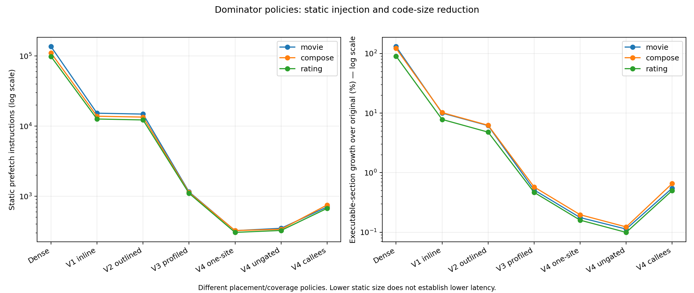

# 10–20µs 중심 저밀도 prefetch 캠페인

진행 중인 7시간 실험의 첫 체크포인트다. 목표 종료 시각은 2026-09-28 12:52:38 UTC이며, 아래 v1/v2 탐색 결과는 독립 확인 전 수치다. 10% 개선을 달성했다고 주장하지 않는다.

## 첫 비교 결과

동일한 Media 전체 스택에서 MovieId·ComposeReview·Rating 및 정적 의존성의 코드를 바꿨다. 8 CPU, C4, tracing 100%, 50초 warmup + 60초 clean ROI. v2는 7개 arm × 2개 seed block이며 두 번째 순서는 첫 번째의 정확한 역순이다. 모두 유효했고 플랫폼·scheduler·module 복구를 확인했다.

| 구현 | RPS | 평균 ms | p99 ms | 전체 CPU µs/request | util % |
|---|---:|---:|---:|---:|---:|
| base | 1139.8 | 3.4396 | 5.8961 | 6025.8 | 84.59 |
| outline_nop | 1141.6 | 3.4336 | 5.9514 | 6020.0 | 84.69 |
| outline_t1 | 1142.5 | 3.4313 | 5.9299 | 6016.3 | 84.72 |
| outline_it0 | 1156.8 | 3.3874 | 5.8587 | 5961.4 | 84.87 |
| dedup_it0 | 1150.0 | 3.4083 | 5.8675 | 6000.2 | 84.98 |
| tail_nop | 1157.3 | 3.3864 | 5.9757 | 6015.4 | 85.77 |
| tail_it0 | 1144.0 | 3.4261 | 5.8930 | 6014.1 | 84.84 |

Peak IT0의 paired log 비용 절감률은 원본 대비 CPU 1.07%, 평균 1.52%, p99 0.64%다. 같은 배치 NOP 대비 CPU 0.98%, 평균 1.35%다. 두 쌍의 탐색 결과이므로 확정 개선으로 승격하지 않았고 독립 확인 대상으로 유지했다. T1·중복 NOP thinning·40µs tail은 점추정 순위에서 뒤져 후속 후보에서 제외했다. 통계적으로 열등함을 증명한 것은 아니다.

## 코드와 발행

- Dense 과거 구현의 98,661–136,557개 힌트를 v2에서 12,262–14,868개로 줄였다. 실행 가능 section 증가는 원본 대비 약 4.8–6.3%다.
- 실제 CFG와 직접 호출 entry를 dominator에 배치한다. 함수당 최대 2곳, 그룹당 최대 8개, 최소 64 IR instruction 함수, shortest-path lead 24–600을 사용하며 짧은 lead는 건너뛴다. 일반 call continuation을 강제로 쪼개지 않는다.
- 커널은 incoming task가 결정된 sched_switch에서 CPU별 시각·구간 경계를 기록한다. 프리패치는 실행 중인 사용자 코드에서 발행한다. 실제 swap/memory page-in 훅이 아니다.
- `[5,8)` 일부, `[8,10)` 추가 그룹, `[10,20)` 전체 그룹, `[20,22)` 일부, `[22,24)` 더 적은 그룹이 eligible이다. 실제 빈도는 실행 경로에 따라 다르다. 시각은 scheduler 잔여 경로와 syscall 복귀를 포함한다.
- T1→IT0는 RIP-relative 명령의 한 바이트만 바꾼다. register 형태는 T1을 유지한다. CPUID 지원과 모든 직접 대상의 instruction boundary를 검증했다.
- 중복 NOP thinning은 크기를 줄이지 않는다. v3에서 실제 명령 삭제와 최종 주소 커버리지 확인을 구현했다. 복제된 기계어 위치는 LLVM asm uid로 구분한다.

## 미스 감소가 전체 성능으로 바로 이어지지 않는 이유

첫 v2 block의 NOP 대조군은 원본보다 대상 서비스의 retired instruction/request가 약 11–17%, user cycles/request가 약 10–14% 늘었다. IT0의 L2 code miss/request는 NOP 대비 약 1–3% 감소했지만 user cycles는 원본보다 여전히 높았다. 전체 CPU 점추정 개선만으로 이 비용이 해결됐다고 해석하지 않는다.

FE retired miss, L2 code request miss, ITLB walk, BACLEARS는 서로 다른 사건이며 합해서 원인 비율을 만들지 않는다. L1/L2/late SWPF selector는 공유 MSR 때문에 별도 PMU 창에서 측정했다. SWPF_HIT/MISS와 T1_T2_ISSUED는 IT0 발행 수가 아니다. FE_LATE_SWPF 역시 전체 IT0 수가 아니다. 각 PMU는 clean ROI 이후 별도 8초 진단이고 약 8.14초의 bracketing 요청 수로 정규화했다. 단일 PMU 반복의 작은 차이에 인과를 부여하지 않는다.

v1 inline RDTSCP peak는 원본 대비 평균 -0.50%였지만 CPU +0.76%로 탈락했다. v2는 shared preserve_all gate로 크기를 더 줄였다. v3는 RDPID/RDTSC와 epoch별 재발행 억제를 추가했고, hot 단일 지점의 synthetic gate 비용은 약 23→15–16→9 TSC ticks였다. 이는 E2E 개선 수치가 아니며 실제 스케줄/충돌/경로는 다르다.

## 검증과 보존

v2의 14회 복구를 검증했다. v3 초기 단위 검사 15개는 통과했지만 YAML 실제 빌드에서 asm 복제 라벨 충돌이 드러났다. 이를 수정하고 복제 회귀 검사까지 16개를 통과했다. 실패 빌드 트리와 plugin/test 생성물을 정리하고 원인·소스·로그·해시를 보존했다. v2의 superseded ELF 6개, 123,110,640 bytes를 삭제하고 원본·IT0 후보·NOP 대조군을 유지했다.

원본 결과: `/storage/prefetchit/class_b_lean_20260928`. Git의 compact evidence에는 설정·행별 결과·비교 통계·PMU·복구·정리 기록이 있다. 진행 중인 빌드와 후속 확인 결과는 다음 체크포인트에 추가한다.

명령 의미: [Intel ISA reference](https://cdrdv2-public.intel.com/774990/architecture-instruction-set-extensions-programming-reference.pdf). 호출 규약: [Clang preserve_all](https://clang.llvm.org/docs/AttributeReference.html#preserve-all). 복제 라벨: [LLVM inline assembly](https://www.llvm.org/docs/LangRef.html#inline-assembler-expressions). PMU 의미: [Intel Granite Rapids events](https://perfmon-events.intel.com/platforms/graniterapids/core-events/core/).

## v3 재측정과 삽입 축소

새 시드의 11개 arm × 2 block, 정확한 역순으로 22회를 완료했다. 모두 유효하고 설정 복구를 확인했다. **원본·각 NOP 양쪽에 대한 CPU/평균 점추정 기준을 통과한 후보가 없다.** v2의 약 1% 탐색 이득은 이 재측정에서 재현되지 않았다. 서로 다른 screen 결과를 합치지 않는다.

| 구현 | CPU/request 절감 vs base | 평균 절감 vs base | CPU 절감 vs own NOP |
|---|---:|---:|---:|
| reference_it0 | -0.41% | -0.33% | -0.35% |
| fast_full_it0 | -0.58% | -0.20% | +0.01% |
| compact_it0 | -0.89% | -0.24% | -0.33% |
| memo_it0 | -1.02% | -0.48% | -0.43% |
| profile_it0 | -1.07% | +0.03% | -0.80% |

위 수치는 두 block의 탐색 점추정이다. 원본 CPU는 5907.05–6044.99µs/request, 실행 간 CV 1.63%였다. 같은 profile IT0의 두 실행 사이 전체 CPU 차이 약 116µs/request 중 Nginx 차이는 약 123µs/request였다. 이는 다른 서비스의 변동도 존재함을 보여주며 JIT·worker 배치 등 특정 원인을 입증하지 않는다.

실제 명령 삭제 버전은 최종 링크 주소에서 같은 그룹의 원래 직접 대상 cache line이 모두 남는지 확인하면서 재빌드했다. compact는 논리 힌트 2945개를 제거했으며, MovieId/ComposeReview/Rating 정적 힌트는 12835/11476/10498개다. 코드 생성 복제와 재배치로 커버리지가 깨진 시도는 복원 계획·메타데이터·해시를 보존하고 ELF를 즉시 삭제했다.

미스 함수 프로파일로 삽입 함수 집합을 제한한 profile 버전은 힌트 1156/1133/1101개, executable bytes 증가 0.513/0.576/0.468%다. 과거 64B 미스 라인을 함수 범위에 배분한 순위이며, 경계가 모호한 라인이 많아 “동적 미스 80% 커버”로 해석하지 않는다.

v3 종료 후 후속 비교를 위한 profile PF/NOP 쌍만 fallback reference로 유지하고, 다른 PF/NOP ELF 24개 503,957,744 bytes를 정리했다. profile도 승격된 구현이 아니다. 다음 반복은 함수당 한 지점·더 긴 IR lead·게이트 생략·callee 프로파일과 앞당긴 발행 구간을 검증한다. 이 문서는 아직 캠페인 진행 중 체크포인트다.

## v4 정적 축소와 검증

v4 one-site는 함수당 최대 한 지점과 최소 64 IR lead를 사용하며, executable bytes 증가는 MovieId/ComposeReview/Rating에서 0.176/0.197/0.160%다. 게이트와 런타임을 완전히 뺀 ungated 비교군은 0.113/0.123/0.100%다. 직접 callee 프로파일 정책은 더 많은 caller에서 hot 함수 entry를 선행 prefetch하도록 하고, 모든 704/751/671개 힌트를 main executable의 직접 RIP-relative IT0로 검증했다. 코드 증가는 0.550/0.657/0.501%다.

Gated 정책은 가장 많은 그룹이 [5,15)µs, 일부는 [3,17), 더 적은 그룹은 [1,20)에 eligible하도록 앞당겼다. 이는 10–20µs의 과거 retirement miss peak보다 앞서 발행하려는 설정이다. 실제 fetch lead를 µs 단위로 측정한 값은 아니며, IR instruction 거리와 실제 시간도 동일하지 않다. ungated 정책은 이 시간 제한 자체를 제거한다.

PIC 선언을 직접 주소로 바꾸는 과정에서 inline-asm 제약 오류를 먼저 검출했다. 명시적 allowlist의 main-executable binding만 적용하도록 수정하고, 모든 최종 target이 원본 main image에도 정의되는지 확인했다. 이어 compiler-generated 함수 복제를 검사 fixture가 허용하도록 고쳤으며, 최종 37개 검사와 Media ELF 대상/동일 배치 NOP 검증을 통과했다. 실패 소스·로그·해시·정리 기록을 보존했다. 8개 arm × 2 block의 16회 비교를 완료했고 모두 유효했다. 이 정적 개선을 성능 개선으로 승격하지 않는다.

## v4 완료와 다음 반복

원본 CPU/request 평균은 5911.30µs, 평균 지연 3.35245ms, p99 5.87165ms, 1168.84 RPS, util 85.09%였다. 두 원본 실행의 CPU CV는 0.242%, 평균 지연 CV는 1.878%다. 변동은 지표별로 다르다.

| 후보 | CPU 절감 vs 원본 | 평균 절감 vs 원본 | p99 절감 vs 원본 | CPU 절감 vs own NOP | 평균 절감 vs own NOP |
|---|---:|---:|---:|---:|---:|
| one_far_it0 | -0.786% | -0.836% | +0.672% | -0.150% | -0.471% |
| ungated_it0 | -0.227% | +0.462% | +1.027% | -0.068% | +0.618% |
| callees_it0 | -0.668% | +0.129% | -0.175% | +0.217% | +1.483% |

원본·NOP 양쪽의 CPU/평균 점추정 기준을 모두 통과한 후보는 없었다. ungated를 가장 나은 절충안인 **진단적 검증 대상**으로 선택했으며 승자로 승격하지 않았다. C4와 C16에서 각각 새 시드 6개 block, 3개 arm의 독립 검증을 시작했다. 탐색 결과와 합치지 않는다.

별도 post-ROI PMU에서는 callee IT0의 retired L2-miss instructions/request가 원본보다 약 6–8% 적었지만 retired instructions/request는 약 3–5% 많았다. L2 instruction-fetch miss/request 자체는 같은 방향으로 일관되게 감소하지 않았다. 서로 다른 이벤트 모집단이며 한 번의 PMU 창으로 인과나 작은 이득을 확정하지 않는다.

이 관측을 근거로 **v5: 같은 callee allowlist·예산에서 gate/outline/window/runtime을 제거하는 정책**을 준비했다. 기존 C4/C16 독립 검증을 모두 마친 뒤에만 빌드하고 2개 block의 새 C4 탐색을 수행한다. outlining 제거로 최종 위치·코드 생성도 달라질 수 있어 완전히 동일한 기계어의 gate-only ablation으로 부르지 않는다. 이 후속 탐색에 시간을 배정하며 진단 범위는 MovieId PEBS 한 주기와 세 서비스의 별도 gate 카운터로 줄인다. 실행하지 않은 원래 진단 계획은 보존한다. 현재 v5는 아직 빌드·측정 전이다.

v4 종료 후 대체된 one-far/profile PF/NOP 244,020,112 bytes를 정리했다. 별도 gate 진단 빌더에서 IT0 패치 목록 생성 순서 누락을 발견해, 성공한 T1 빌드를 재사용하여 정상 감사 후 변환했다. 성능 측정에는 진입하지 않았다. 진단의 중간 T1/NOP/object 122,078,448 bytes 및 더 이상 필요 없는 기존 gated-callee PF/NOP 122,064,944 bytes도 기록 후 정리했다.

## C4 독립 확인 완료

새 seed 6개 block × 원본/동일 배치 NOP/v4 ungated의 18회를 완료했다. 모두 유효했고 사전 승격 기준은 통과하지 못했다. 원본 평균은 1170.59 RPS, 평균 3.34782ms, 실행별 p99 평균 5.87006ms, 전체 CPU/request 5928.93µs, util 85.44%였다. 후보는 1166.74 RPS, 3.35844ms, 5.83772ms, 5927.55µs였다.

| 비교 기준 | 전체 CPU 절감 [95% CI] | 평균 절감 [95% CI] | p99 절감 [95% CI] | RPS 증가 [95% CI] |
|---|---:|---:|---:|---:|
| 원본 | +0.024% [-0.350, +0.396] | -0.318% [-2.836, +2.139] | +0.554% [-1.174, +2.252] | -0.328% [-2.717, +2.120] |
| 같은 배치 NOP | -0.541% [-0.877, -0.205] | -1.804% [-3.372, -0.260] | +0.148% [-1.640, +1.904] | -1.733% [-3.189, -0.256] |

양수는 개선이며 개별 paired-log t95 구간이다. 탐색 결과와 합치지 않았다. baseline CPU CV는 0.294%, 평균 지연 CV는 1.330%였다. 세 수정 서비스 각각의 전체/user CPU 보조 구간도 원본 대비 모두 0을 걸친다. 현재 결과를 단순히 다른 서비스가 이득을 가린 경우로 해석할 근거가 없다. C16 독립 확인은 이어서 진행 중이고, 그 뒤 v5의 별도 탐색을 계속한다.
