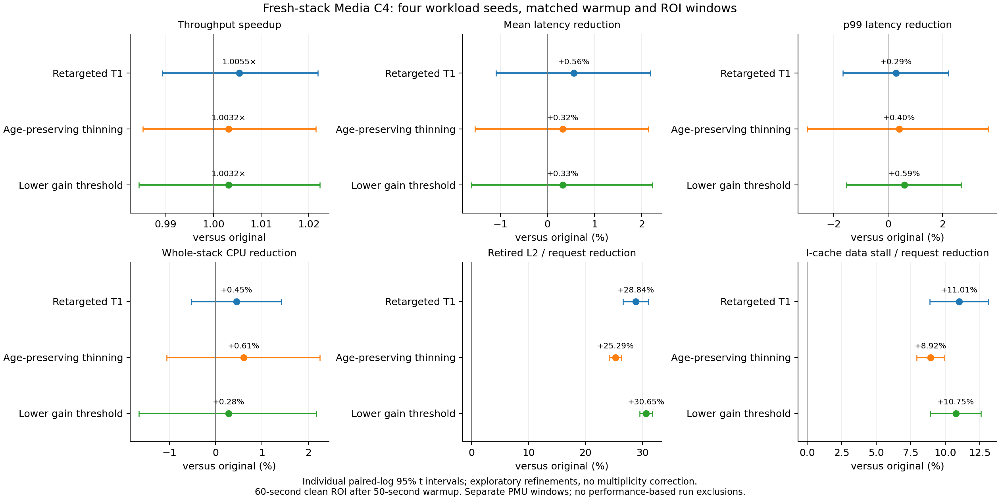
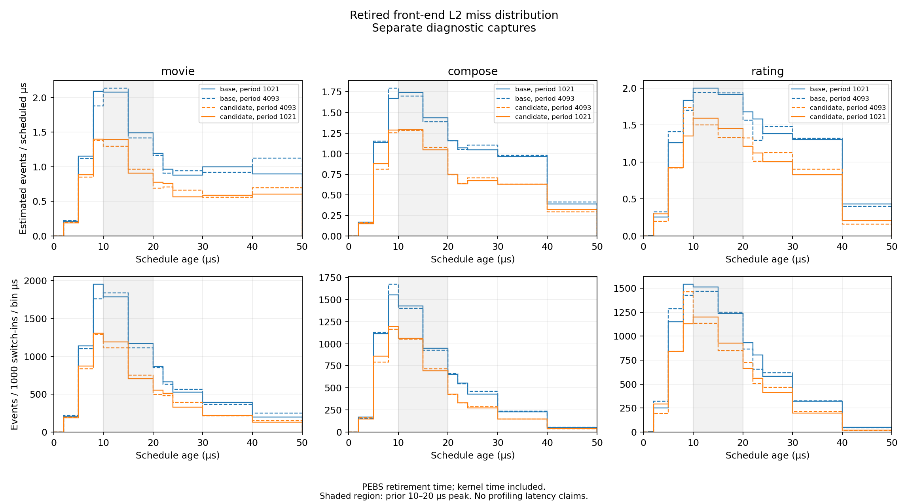
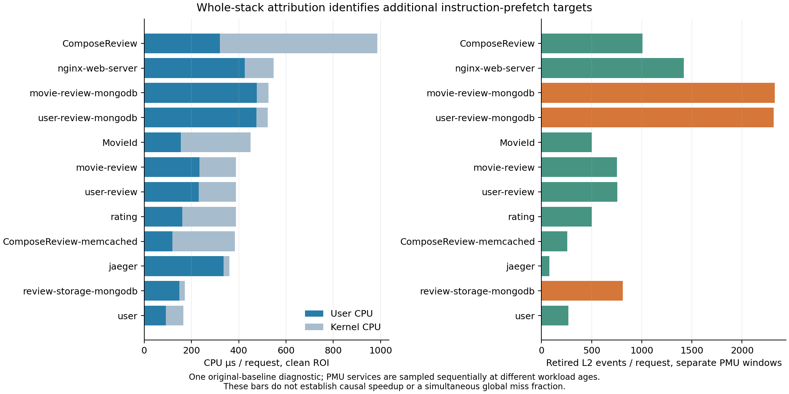
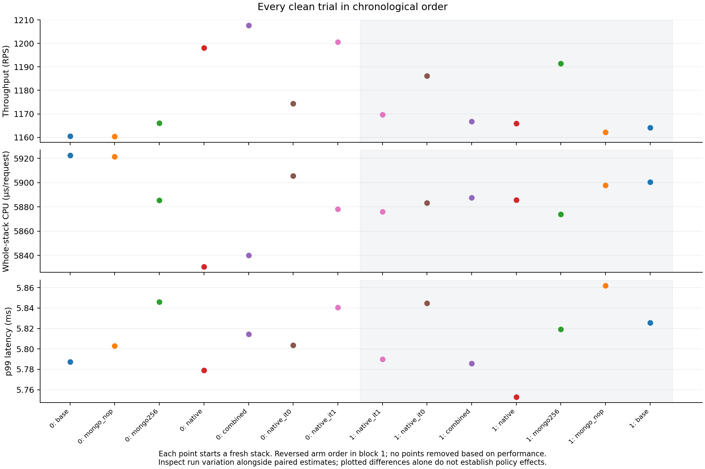
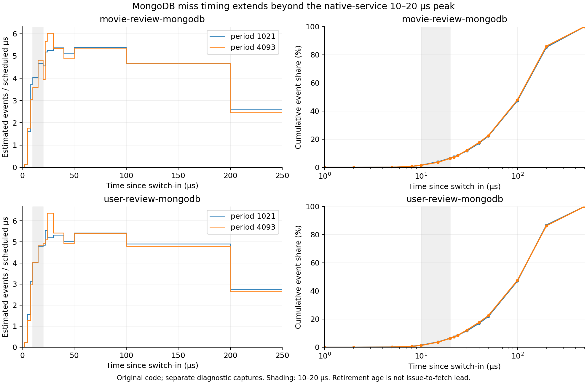
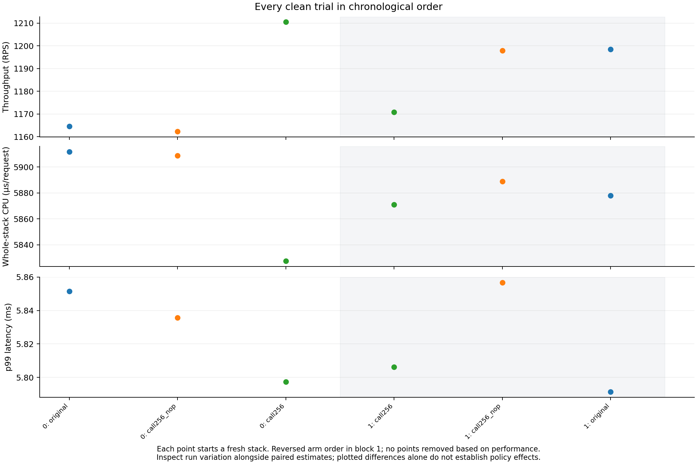
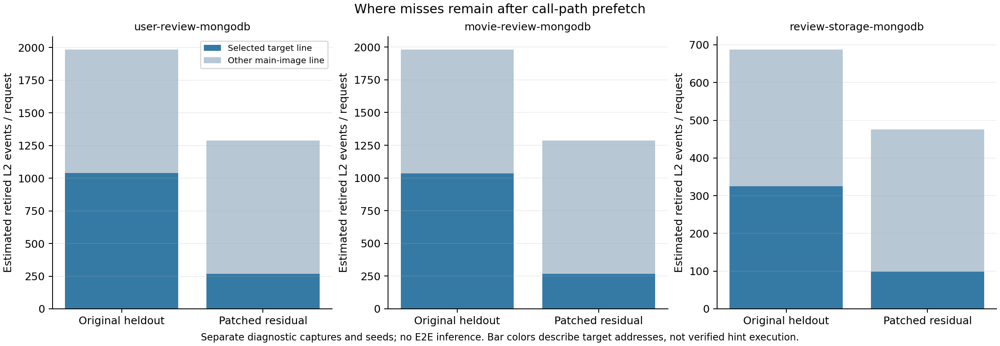

# Type B: 발행 동작, 선행 경로, 중복 힌트를 분리한 실험

진행 중인 75% 커버리지 후속 비교의 첫 block에서는 **wide75의 retired L2 감소 50.48%, 전체 CPU/request 절감 2.08%, 처리량 변화 −1.66%**를 측정했다. **cost75는 힌트 실행을 wide75 대비 74.6% 줄이면서 retired L2 감소 49.01%, CPU 절감 1.40%, 처리량 변화 −0.46%**였다. 아직 4-block 전체 결과가 아니며, 이 점 추정치로 E2E 이득을 확정하지 않는다.

후속 call-path 6회에서는 MongoDB 세 서비스의 retired L2 이벤트가 **33.12%**, I-cache stall이 **11.72%** 줄었다. 전체 처리량은 **1.0077×**, CPU/request 절감은 **0.77%**이고, 두 반복의 넓은 처리량 구간 때문에 E2E 이득을 확정하지 않는다. 남은 main-image 미스의 약 **79%가 선택하지 않은 타깃 줄**에 있었다. 이에 독립 트레이스 커버리지를 49.40→약 74.3%로 넓히고, 호출 빈도를 비용으로 반영해 발행을 줄이는 후속 정책을 준비했다.

후속 20회 fresh-stack 검증에서, 타깃을 바꾼 T1의 처리량은 원본 대비 **1.0055× [0.9893, 1.0219]**, 동일 배치 NOP 대비 **1.0026× [0.9889, 1.0165]**다. E2E 향상은 아직 확정하지 않는다. 원본 대비 retired L2 frontend event/request는 **28.84%**, I-cache data-stall/request는 **11.01%** 줄었다. 더 낮은 이득 문턱으로 타깃을 넓힌 정책은 retired L2를 **30.65%** 줄였지만 처리량은 **1.0032×**였다. 코드 미스 감소를 요청 성능 개선으로 대신 보고하지 않는다.

긴 동일 프로세스 교차 실험에서는 리뷰 데이터 누적으로 동일 NOP의 처리량이 12.7% 낮아졌다. 이 방식의 E2E 수치는 정책 효과 판정에서 제외하고, 초기 데이터 상태와 측정 시점을 맞춘 새 스택 비교로 전환했다. 아래 완료된 탐색과 후속 검증의 표본을 합치지 않는다.

그 뒤 MongoDB 적용 범위를 넓힌 14회 탐색도 완료했다. 네이티브 T1+MongoDB 패딩 T1의 처리량은 원본 대비 **1.0213×**, 전체 CPU/request 절감은 **0.80%**지만, 2-block 처리량 구간은 **[0.8046, 1.2963]×**로 넓다. 현재 확정한 10% 이득은 없다. 패딩의 낮은 실행 경로 커버리지와 서비스별로 다른 미스 발생 시점을 확인해, 앞선 direct call에서 나중에 쓸 코드를 가져오는 후속 구현으로 진행했다.

**E2E 먼저: 후속 4-block 검증**

| 정책 / 원본 비교 | 처리량 speedup [개별 95% CI] | 평균 지연 절감 | p99 절감 | 전체 CPU/request 절감 |
|---|---:|---:|---:|---:|
| Retarget T1 | 1.0055× [0.9893, 1.0219] | +0.560% | +0.289% | +0.451% |
| 나이 구간 보존 thinning | 1.0032× [0.9852, 1.0215] | +0.321% | +0.400% | +0.609% |
| 최소 이득 2표본의 공격적 교체 | 1.0032× [0.9844, 1.0223] | +0.327% | +0.593% | +0.279% |

원본은 평균 1,163.77 RPS, 평균 3.367ms, p99 5.899ms, 전체 CPU/request 5,936.37µs, 풀 사용률 85.08%였다. Retarget는 각각 1,170.11 RPS, 3.348ms, 5.882ms, 5,909.61µs였다. 이 절대값은 실행별 산술평균이고, 표의 개선율은 seed별 paired-log 비율이다. 원본 RPS 범위는 1,154.18–1,183.04로 약 2.5% 폭이었다. 완료된 실행 20개 전부 정상이며 성능에 따라 제외한 실행은 없다.

모든 arm은 같은 초기 데이터와 warmup/ROI 시간으로 비교했다. 고정 시간의 closed-loop 실행이므로 실제 누적 요청 수까지 동일한 것은 아니다. 처리량·평균 지연도 독립적인 증거가 아니다.

| 정책 / 원본 비교 | retired L2/request 감소 [95% CI] | speculative L2 code miss 감소 | I-cache data stall 감소 | retired L1I 이벤트 변화 |
|---|---:|---:|---:|---:|
| Retarget T1 | 28.84% [26.58, 31.04] | 4.44% | 11.01% | 1.66% 증가 |
| 나이 구간 보존 thinning | 25.29% [24.24, 26.33] | 3.68% | 8.92% | 2.16% 증가 |
| 공격적 교체 | 30.65% [29.51, 31.76] | 6.45% | 10.75% | 2.20% 증가 |

같은 배치 NOP 대비 CPU/request 절감은 retarget −0.149%, thinning +0.010%, 공격적 교체 −0.321%였고, p99는 각각 1.40/1.29/1.09% 증가한 점 추정치였다. 셋 모두 고정한 후속 선택 조건(CPU 악화 없음, p99 증가 ≤1%, retired L2 감소 ≥20%)을 충족하지 않는다. Retarget는 기존 기전 대조 정책으로 유지하며 E2E 승자로 부르지 않는다. Thinning·공격적 교체의 결과·계획·패치·해시를 보존하고, 후속 측정에 쓰지 않는 ELF 6개 123,171,360바이트를 수집 구간 밖에서 정리했다. 다음 적용 범위는 별도 전체 스택 진단에서 확인한 MongoDB다.

별도 switch-age 진단 12개(원본/retarget × 서비스 3개 × 표본 주기 1,021/4,093)도 완료했다. loss/throttle 없이 모든 표본을 스케줄 구간에 연결했다. 원본의 retired L2 추정 이벤트 중 40.8–43.7%가 switch-in 후 10–20µs에 있었다. 이 구간의 이벤트/request 감소는 MovieId 약 36%, ComposeReview 24–26%, Rating 22–27%로 두 표본 주기에서 같은 방향이었다. 범위는 두 주기의 결과이며 신뢰구간이 아니다. 스케줄된 시간당 밀도 정점은 서비스·주기에 따라 8–10 또는 10–15µs였다. 따라서 모든 서비스가 정확히 같은 순간에 정점을 가진다고 보지 않는다.

이 나이는 커널 복귀·인터럽트 시간을 포함한 retirement 시각이다. 실제 fetch 시각이나 힌트 발행부터 fetch까지의 선행 시간으로 환산하지 않는다. 이 진단의 부하 지연도 E2E 표에 넣지 않는다.

**앞선 2-block 탐색: 후속 검증과 합치지 않음**

| 단계 / 비교 | 처리량 speedup | 평균 지연 절감 | p99 절감 | 전체 CPU/request 절감 |
|---|---:|---:|---:|---:|
| 동일 타깃 T1 / 원본, opcode 탐색 | 1.0087× | +0.902% | +0.157% | +0.700% |
| 새 타깃 T1 / 원본, 별도 retarget 탐색 | 0.9938× | −0.638% | −1.075% | +0.606% |
| 새 타깃 T1 / 동일 배치 NOP | 1.0037× | +0.378% | −0.159% | +0.998% |
| 새 타깃 T1 / 기존 타깃 T1 | 1.0002× | +0.009% | −0.358% | +0.302% |

두 탐색은 각각 2개의 독립 seed block, 4개 arm, 총 8회의 fresh full-Media 실행이다. 개별 paired-log t95 구간이며 다중비교 보정은 없다. T1/원본 처리량 구간은 [0.9473, 1.0742]×, 새 타깃/원본은 [0.7692, 1.2839]×, 새 타깃/NOP는 [1.0002, 1.0071]×다. 두 반복만으로 좁은 구간 하나를 최종 승격 근거로 삼지 않는다. 원본 RPS도 1,194.4와 1,159.1로 달랐으며 어느 실행도 성능에 따라 제외하지 않았다.

원본은 계측되지 않은 기존 실행 파일이다. NOP는 힌트를 같은 길이의 NOP로 대체한 배치 대조군이다. T1, IT0 및 새 타깃은 이 배치에서 비교하므로 원본과 NOP 비교를 혼동하지 않는다. C4 closed-loop의 처리량과 평균 지연은 서로 연결되며, 이번 결과를 최대 처리량 측정으로 부르지 않는다.

**발행 종류가 실제 차이를 만들었다**

원래 위치와 타깃을 그대로 두고 한 바이트만 바꾼 T1은 원본 대비 retired L2 이벤트를 18.10%, I-cache data stall을 5.73% 줄였다. 같은 탐색의 IT0는 각각 3.74%, 1.04%였다. T1은 원본 T1 바이너리와 SHA-256이 완전히 일치하도록 역변환을 검사했다. 명령어 주소나 크기 변화로 설명되는 차이가 아니다.

CPU는 Xeon 6787P이며 PREFETCHI CPUID 비트가 켜져 있다. 실행 파일의 IT0/IT1은 64-bit RIP-relative 실제 명령어 경계에 있다. 따라서 'ISA 미지원' 또는 '모든 IT0가 무조건 NOP'라는 설명은 배제한다. 이 조건은 Intel의 [ISA 확장 명세](https://cdrdv2-public.intel.com/819680/architecture-instruction-set-extensions-programming-reference.pdf)와 확인했다.

네 실행 파일에서 같은 주소의 7바이트 힌트만 다르게 한 통제 실험을 3회 반복했다. 각 회 100,000번, target CLFLUSH 후 CPUID 직렬화, 64개의 의존 IMUL을 거친 target-call을 측정했다. 측정 값은 TSC tick이며 서비스 속도 향상이 아니다.

| 조건 / 힌트 | call TSC 평균 | retired L2 / iteration | L2 code-read miss / iteration | I-cache data stall / iteration |
|---|---:|---:|---:|---:|
| target만 flush / NOP | 200.24 | 1.003 | 1.044 | 283.83 |
| target만 flush / IT0 | 169.61 | 1.003 | 1.043 | 253.33 |
| target만 flush / T1 | 99.20 | 0.003 | 0.044 | 183.13 |
| target flush + 64 KiB code pad / NOP | 193.53 | 0.967 | 1.058 | 270.66 |
| target flush + 64 KiB code pad / IT0 | 74.44 | 0.008 | 1.058 | 13.34 |
| target flush + 64 KiB code pad / IT1 | 74.43 | 0.008 | 1.056 | 13.38 |
| target flush + 64 KiB code pad / T1 | 158.95 | 0.006 | 0.057 | 236.73 |

힌트 줄도 flush하면 IT0/IT1의 대기 감소가 커졌고, 8 KiB code pad에서는 64 KiB만큼의 효과가 나오지 않았다. 이는 힌트 코드의 프런트엔드 상주/재인출 상태에 민감하다는 증거다. 이 실험만으로 내부 DSB 구조 하나를 원인으로 확정하지 않는다. IMUL 개수나 retired LBR 나이를 실제 hint issue→fetch 지연으로 환산하지 않는다.

64 KiB 조건의 IT0는 target의 retired miss와 대기를 거의 없앴지만 `L2_RQSTS.CODE_RD_MISS`는 그대로였다. 따라서 이 speculative 카운터 감소율만으로 선행 인출의 성공 여부를 판단할 수 없다. 데이터용 SWPF 카운터는 IT0/IT1의 총 발행 수가 아니며, `LATE_SWPF`는 진행 중인 instruction prefetch와 겹친 수요 미스를 세는 별도 조건이다. 이벤트 정의는 [Intel Granite Rapids PMU 목록](https://perfmon-events.intel.com/platforms/graniterapids/core-events/core/)을 따른다. 서로 다른 모집단을 빼서 wrong-path 비중을 만들지 않는다.

같은 통제 실험의 software-prefetch 카운터도 보존돼 있다. Target만 flush한 NOP→T1에서 L2 code-read miss/iteration은 **1.0444→0.0444**, SWPF miss는 **0→1.0000**이었다. 64 KiB code pad 조건에서도 각각 **1.0577→0.0572**, **0→1.0000**이었다. 알려진 단일 cold target 실험에서 요청 종류가 바뀐다는 근거다. 이를 서비스 전체의 두 카운터가 언제나 서로 배타적이라는 주장으로 확장하지 않는다. Prefetch가 메모리 읽기 자체를 없애는 것이 아니라, 수요보다 먼저 완료하도록 하는 것이 핵심이므로 실제 stall과 E2E를 함께 비교한다.

**명령어를 추가하지 않고 타깃 교체**

정확히 같은 배치의 NOP 실행에서 새 FE_L2 PEBS/LBR 표본 71,547개를 수집했다. loss/throttle은 없었다. 관측한 선행 직선 경로에 있는 기존 힌트 사이트를 사용하고, miss의 실제 분기 도착점 또는 명령어 경계를 타깃으로 삼았다. 64..1024 retired-cycle 나이 범위에서 기존 커버리지 손실을 차감한 이득이 8표본 이상인 교체를 탐욕적으로 선택했다.

| 서비스 | 바꾼 사이트 / 기존 사이트 | 해당 나이 범위의 학습 표본 커버리지, 이전→이후 |
|---|---:|---:|
| MovieId | 165 / 4,161 | 1,907→7,548 / 15,242 |
| ComposeReview | 189 / 4,524 | 4,412→13,200 / 28,515 |
| Rating | 130 / 3,922 | 1,299→6,253 / 16,849 |

추가 명령어와 실행 코드 증가분은 0이다. RIP 변위와 비할당 debug metadata만 바꿨다. 원래 사이트는 dominator 정책으로 만들어졌지만, 새 타깃을 모든 실행 경로에서 지배한다고 주장하지 않는다. 유한한 retired LBR에서 관측한 경로에 대한 학습이다. 학습 커버리지는 실제 miss 감소율이 아니다.

별도 두 block에서 합산 retired L2 감소율은 원본 대비 **29.03% [27.04, 30.97]**, NOP 대비 **31.35% [27.58, 34.92]**였다. I-cache data stall은 원본 대비 **11.80% [5.38, 17.78]** 줄었다. Speculative L2I는 **2.82% [−9.10, 13.43]**여서 큰 감소를 확인하지 못했다.

| 서비스 | 원본 frontend-bound | 기존 타깃 T1 | 새 타깃 T1 |
|---|---:|---:|---:|
| MovieId | 77.32% | 76.34% | 75.77% |
| ComposeReview | 75.22% | 74.34% | 74.09% |
| Rating | 75.84% | 75.16% | 74.66% |

합산 FE_L1/request는 원본 8,611.4, 새 타깃 8,795.0이고, FE_ITLB는 1,826.0→1,780.7이다. L2 개선만큼 L1I·translation 문제가 줄어든 상태가 아니다. 이 이벤트들은 겹칠 수 있으므로 합산해 전체 손실의 원인 비중을 계산하지 않는다. 간접 분기 오예측과 BTB/FDIP 내부 상태 역시 같은 뜻이 아니다.

**전체 요청에서 어느 부분을 줄이고 있는가**

retarget 탐색의 clean ROI에서 세 수정 서비스의 사용자 CPU/request는 631.97→609.63µs, 커널 CPU는 1,188.16→1,187.87µs였다. 사용자 CPU 약 22.34µs 절감은 전체 원본 비용 5,918.19µs의 약 0.38%다. 전체 CPU 변화에는 다른 서비스의 변동도 포함되며, 이 비율을 임계 경로 지연의 상한으로 해석하지 않는다.

별도 원본 진단에서 clean CPU 비용의 99.80%를 차지하는 20개 서비스를 골라 각각 두 PMU 창을 수집했다. 40개 창 모두 counter multiplexing 없이 측정됐다.

| 서비스 | 사용자 CPU/request, µs | 커널 CPU/request, µs | retired L2/request | L2 code-read miss/request |
|---|---:|---:|---:|---:|
| ComposeReview | 319.70 | 666.24 | 1,008.67 | 11,113.14 |
| MovieId | 155.40 | 294.65 | 501.01 | 5,800.52 |
| Rating | 160.62 | 227.80 | 501.35 | 5,466.17 |
| UserReview MongoDB | 475.06 | 48.27 | 2,316.38 | 25,909.31 |
| MovieReview MongoDB | 476.20 | 48.86 | 2,324.57 | 25,579.62 |
| Nginx | 425.94 | 121.27 | 1,419.31 | 14,016.52 |

두 review MongoDB의 retired L2 이벤트 합계는 수정한 세 네이티브 서비스 합계의 약 2.31배다. 각 PMU 창의 시각·요청 분모가 다르므로 전체 미스의 동시 점유율로 환산하지 않는다. 그래도 프리패치 적용 범위를 넓힐 근거가 된다. MongoDB는 별도 두 seed의 PEBS/LBR에서 실제 실행된 선행 NOP를 고르고, 기존 7–15바이트 NOP를 같은 길이의 RIP-relative T1으로 바꾸는 실험을 준비했다. 원본 소프트웨어 프리패치와 명령어 경계, ELF 크기는 유지한다. 모든 MongoDB 컨테이너에 같은 선택 ELF를 장착해 코드 페이지 공유를 유지하며, 원본 이미지·원본 ELF 복사본 대조군을 포함한다. 이 문단은 구현 설명이며 MongoDB 성능 결과가 아니다.

해당 MongoDB 학습·heldout 수집은 완료했다. 독립 heldout의 main-image 표본 164,363개 중 선택한 50개 NOP 위치가 관측 경로로 덮는 표본은 3,889개(**2.37%**, 전체 DSO 분모로는 2.31%)였다. 긴 NOP 115,469개가 존재해도, 제한된 LBR와 64..8192 retired-cycle 범위에서 적합한 실행 위치를 찾은 학습 표본은 약 7.6%다. 정적 NOP 개수와 실행 경로 커버리지는 다르다. 미스의 약 94%는 직전 taken 도착점에서 64바이트 이내였고, 직전 direct call은 main 표본의 약 57%, 오예측으로 표시된 직전 분기는 약 31%였다. 이는 주소·분기 연관이며 BTB 부재의 직접 증거는 아니다.

이 한계를 넓히기 위해 앞선 direct call에 짧은 T1→원래 callee 점프 구간을 연결하는 후속 구현을 추가했다. 원래 call은 원래 반환 주소를 그대로 push하며, 기존 코드의 주소·명령어 길이는 바뀌지 않는다. 동일 callee·타깃 조합은 새 구간을 공유한다. 원본 대비 추가 점프와 코드 비용을 재기 위해 같은 배치의 NOP 쌍을 만든다. 목표는 **학습 표본 50% 커버리지**이고 상한은 256개 call 위치, 총 1,024개 힌트, 위치당 4개다. 이 목표를 실제 미스 50% 감소나 E2E 이득으로 부르지 않는다.

PIE/일반 ELF의 인자·플래그·반환 주소 보존, C++ 예외 처리, 새 구간의 unwind 조회 및 커버리지 선택기 등 native/알고리즘 검사 5개가 통과했다. 최초 주소 변위 오류는 바이너리 검증에서 실행 전에 차단됐으며, 원인·소스·패치를 남기고 임시 ELF를 즉시 삭제했다. 검사는 완료된 workload/platform wrapper와 다음 fresh stack 사이에서만 수행했다. 기존 unwind 항목을 보존하고 새 leaf 항목을 더하는 구조는 [LSB의 unwind 표 정의](https://refspecs.linuxfoundation.org/LSB_5.0.0/LSB-Core-generic/LSB-Core-generic.html)와 [GNU assembler의 CFI 정의](https://www.sourceware.org/binutils/docs/as/CFI-directives.html)를 따른다. 이 후속 정책의 서비스 성능 측정 6회와 잔여 미스 분석을 완료했으며 아래에 별도로 정리했다.

**MongoDB·opcode 후속 탐색: 14회 완료**

MovieId를 포함한 full Media의 compose-review 경로, C4, 8개 workload CPU에서 각 arm을 fresh stack으로 두 번 측정했다. 원본은 1,162.33 RPS, 평균 3.371ms, p99 5.806ms, CPU/request 5,911.43µs, CPU 풀 사용률 84.74%였다. 두 번째 block은 순서를 뒤집었으며 14개 모두 정상 완료했다. 이 결과는 최대 처리량 또는 DSB의 모든 API 검증이 아니다.

| 정책 / 원본 비교 | 처리량 speedup [95% CI] | 평균 지연 절감 | p99 절감 | 전체 CPU/request 절감 |
|---|---:|---:|---:|---:|
| MongoDB 패딩 T1 50개 | 1.0141× [0.9019, 1.1402] | +1.410% | −0.452% | +0.536% |
| 네이티브 retarget T1 | 1.0168× [0.8387, 1.2329] | +1.705% | +0.696% | +0.901% |
| 위 두 정책 결합 | 1.0213× [0.8046, 1.2963] | +2.116% | +0.111% | +0.805% |
| 같은 retarget 위치의 IT0 | 1.0155× [0.9721, 1.0608] | +1.555% | −0.306% | +0.288% |
| 같은 retarget 위치의 IT1 | 1.0195× [0.8468, 1.2274] | +1.946% | −0.152% | +0.581% |

두 반복의 탐색 구간은 넓고, 다중비교 보정은 없다. 결합/네이티브 단독의 처리량 차이는 +0.436%, CPU 절감은 −0.097%, p99 절감은 −0.589%다. 따라서 결합 정책의 점 추정치만으로 MongoDB 추가 이득을 확정하지 않는다. Copied-original MongoDB 대조군은 원본 이미지 대비 처리량 0.9991×였다. 성능에 따라 제외한 실행은 없다.

| 정책 / copied-original MongoDB 대조군 | 네이티브 3개 retired L2 감소 | 네이티브 I-cache stall 감소 | MongoDB 3개 retired L2 감소 | MongoDB I-cache stall 감소 |
|---|---:|---:|---:|---:|
| MongoDB 패딩 T1 | 0.62% | −0.08% | 1.26% | 0.73% |
| 네이티브 retarget T1 | 29.54% | 12.29% | −0.14% | −0.28% |
| 결합 | 30.24% | 12.57% | 1.63% | 1.15% |
| 네이티브 IT0 | 5.52% | 3.15% | 0.27% | 0.45% |
| 네이티브 IT1 | 6.64% | 2.30% | 0.31% | −0.09% |

합계는 별도 서비스 PMU 창을 각각 request로 정규화한 뒤 더한 값이다. MongoDB 3개는 UserReview/MovieReview/ReviewStorage이며, 패딩 T1의 speculative code-read miss 감소는 0.89%였다. 앞서 확인한 2.37% heldout 경로 커버리지와 함께 보면, 이 배치로 전체 미스를 절반 줄일 근거가 없다. 실제 선행 호출 경로로 발행 위치를 넓혀야 한다.

별도 original MongoDB switch-age 진단 4개를 완료했고 모든 표본을 스케줄 구간에 연결했다. 두 review MongoDB 모두 10–20µs의 이벤트 비중은 **4.89–5.00%**, 50–200µs 비중은 **63.11–64.83%**였다. 이는 앞서 네이티브 서비스의 10–20µs 비중 40.8–43.7%와 다르다. MongoDB에는 동일한 초기 시간 창만 적용하지 않고 실행 중 뒤쪽 경로에서도 발행할 필요를 검증한다. 이 범위는 두 서비스·두 표본 주기 값이며 신뢰구간이 아니다.

후속 call-path 구현은 기본 256개 위치·1,024개 힌트로 학습 커버리지 50%에 도달하지 못하면 1,024개 위치·4,096개 힌트까지 계산한다. 학습 커버리지가 5 percentage points 이상 늘어날 때만 별도 고밀도 arm과 동일 배치 NOP 쌍을 추가한다. Heldout·E2E 결과는 배치 선택에 사용하지 않는다. 새 학습에는 ReviewStorage MongoDB도 포함한다. 잔여 미스에서 선택한 타깃 줄인지, 같은 타깃의 힌트가 완료된 LBR 경로에 있는지, 관측한 retirement 나이가 얼마인지 구분한다.

업데이트한 ABI·unwind·선택기·잔여 나이 집계 검사 **6개가 통과**했다. 사용자/커널 PMU의 privilege별 파싱도 구분해 전체 CPU 풀의 I-cache, ITLB, unknown-branch bubble, DSB/MITE 공급을 별도 진단한다. 이 카운터들을 서로 배타적인 원인 비중으로 합치지 않는다. Backend 종료 후 사용하지 않는 IT0/IT1 ELF 6개 **123,171,360바이트**를 해시·패치·결과 보존 후 정리했다. 결합 정책은 탐색 후보로만 남겼다.

완료 자료: [E2E 요약](../llvm_prefetchit/migration/evidence/class_b_mechanism_20260928/backend_completed/e2e_compact.json), [PMU·E2E 전체 비교표](../llvm_prefetchit/migration/evidence/class_b_mechanism_20260928/backend_completed/screen_report.md), [해시 목록](../llvm_prefetchit/migration/evidence/class_b_mechanism_20260928/backend_completed/manifest.json).

**사용자/커널 프런트엔드 비용 분리**

이어 원본 full Media C4에서 workload CPU 32–39 전체를 사용자/커널로 나눠 16개 PMU 창을 수집했다. 모든 창은 multiplexing 없이 정상 완료했고, 각 창의 완료 요청 수로 정규화했다. 순서를 뒤집은 2회 진단의 평균이며 정책 간 E2E 비교가 아니다.

| 지표 | 사용자 모드 | 커널 모드 |
|---|---:|---:|
| cycles/request | 6,599,678 | 5,212,834 |
| retired L2 이벤트/request | 12,191 | 2,617 |
| speculative code-read miss/request | 135,161 | 45,301 |
| I-cache data stall / cycles | 22.08% | 10.95% |
| instruction page-walk active / cycles | 8.02% | 0.57% |
| frontend-bound | 67.66% | 32.47% |
| retired ITLB 이벤트/request | 8,558 | 1,207 |
| retired branch misprediction | 5.05% | 2.06% |
| unknown-branch bubble / cycles | 29.22% | 7.68% |
| DSB / (DSB + MITE) uops | 55.87% | 12.21% |

이 값들은 서로 겹치므로 원인 비중으로 합산하거나 차감하지 않는다. Unknown-branch bubble은 BTB 부재 또는 FDIP 실패 횟수를 직접 센 값이 아니다. 그래도 I-cache 대기 감소만으로 frontend-bound 전체가 같은 비율로 줄지 않는 이유를 조사할 근거다. Call-path의 추가 점프가 이 비용을 늘리는지 별도 NOP 대조군과 decoder PMU 창에서 비교한다. CPU 풀 밖의 실행은 포함되지 않고, DSB 비율에는 다른 uop 공급원이 빠져 있다. [개별 창·분모·범위](../llvm_prefetchit/migration/evidence/class_b_mechanism_20260928/privilege_completed/summary.md)를 보존했다.

**Call-path 첫 정책: 6회 완료, 잔여 미스로 다음 배치 결정**

Full Media compose-review C4에서 원본·call256 NOP·call256 T1을 각각 두 fresh stack으로 비교했다. 원본은 1,181.52 RPS, 평균 3.316ms, p99 5.821ms, 전체 CPU/request 5,894.86µs, CPU 풀 사용률 85.76%였다. T1은 각각 1,190.66 RPS, 3.290ms, 5.802ms, 5,849.31µs였다. 6회 전부 정상이며 성능에 따른 제외는 없다.

| 비교 | 처리량 speedup [95% CI] | 평균 지연 절감 | p99 절감 | 전체 CPU/request 절감 |
|---|---:|---:|---:|---:|
| T1 / 원본 | 1.00770× [0.67998, 1.49337] | +0.778% | +0.337% | +0.773% |
| T1 / 같은 배치 NOP | 1.00891× [0.67435, 1.50945] | +0.897% | +0.760% | +0.838% |
| NOP / 원본 | 0.99881× [0.98934, 1.00836] | — | −0.427% | −0.065% |

MongoDB 세 서비스 합계의 retired L2/request 감소는 원본 대비 **33.12% [31.05, 35.12]**, I-cache stall 감소는 **11.72% [4.68, 18.23]**, speculative L2 code-read miss 감소는 **4.80% [2.58, 6.97]**였다. NOP 대비로는 각각 34.08%, 12.83%, 6.26%다. PMU 감소는 반복 간 안정적이지만 전체 처리량은 그렇지 않았다. 첫 block의 좋은 점 추정치만 선택하지 않는다. 두 T1 실행의 전체 CPU 차이는 약 43.3µs/request였고, 그중 수정한 MongoDB 세 개의 차이는 약 4µs였다. 이는 변동 위치를 보여주며 다른 서비스의 인과적 원인을 확정하지 않는다.

256개 위치, 755개 힌트, 추가 실행 명령어 9,425바이트로 학습 커버리지 50.01%, 독립 heldout 49.40%에 도달했다. 별도 T1 잔여 미스 수집에서 main-image 표본 중 선택한 타깃 줄은 약 21%, 선택하지 않은 줄은 약 79%였다. 원본 heldout과 request로 정규화한 진단 비교에서는 선택한 줄의 이벤트가 약 70–74% 줄었다. 두 수집은 seed·시간 창이 다르고 유한 LBR의 관측 범위도 추가 점프로 달라지므로, 이를 E2E 결과나 전체 원인의 배타적 분해로 사용하지 않는다. 관측한 힌트 retirement는 실제 발행·수락·fill·상주를 보장하지 않는다.

커버리지와 발행 비용을 따로 개선하기 위해 원본에서 독립적인 retired near-call PEBS를 수집했다. 알려진 두 call을 반복하는 native probe에서 2,444개 표본 중 2,443개가 정확한 call 시작 주소에 있었고 나머지 하나는 taskset/libc 시작 구간이었다. 서비스 세 개의 main-image 표본은 모두 direct/indirect call로 분류됐으며 loss/throttle 없이 수집했다. 샘플이 없는 위치의 비용을 0으로 두지 않고 서비스별 3표본 규모의 regularization floor를 합산했다. 이는 신뢰구간이 아니다.

| 다음 배치 계획 | 위치 / 힌트 | 학습 / heldout 커버리지 | 예상 힌트 실행/request | 예상 추가 점프/request |
|---|---:|---:|---:|---:|
| 커버리지 우선, 최소 나이 64 | 686 / 1,380 | 75.02% / 74.32% | 19,984.4 | 7,230.5 |
| 호출 빈도 비용 반영, 최소 나이 64 | 747 / 1,528 | 75.03% / 74.35% | 5,699.7 | 2,824.3 |
| 더 이른 경로, 최소 나이 512 | 1,014 / 2,156 | 64.58% / 63.32% | 24,381.2 | 9,236.2 |

나이는 retired LBR proxy이며 실제 fetch lead time이 아니다. 비용 배치는 샘플별 miss/request 이득을 독립 호출 빈도로 나눈 값을 사용한다. 더 많은 정적 힌트를 넣어도 자주 실행되는 위치를 피하면 동적 발행은 적을 수 있다. 같은 약 74.3% heldout 커버리지에서 모델상 힌트 실행은 71.5%, 추가 점프는 60.9% 적다. 이 추정은 retired call 경로만 다루며 wrong-path 발행·하드웨어 fill 정확도 또는 성능 예측이 아니다. 더 이른 배치는 힌트가 많고 학습 커버리지가 낮아 이번 빌드 대상에서 제외했다. Heldout은 위치 선택에 사용하지 않았다.

원본·기존 T1·두 새 T1·각 새 NOP를 4 block, 총 24회 비교하는 후속 구현을 추가했다. 두 배치 모두 75% 학습 목표, 최대 1,024개 위치·4,096개 힌트·위치당 4개, 최소 나이 64를 고정한다. 이 문단은 계획이며 실제 성능 결과가 아니다. 빈도 선택기 검사 2개도 통과했다.

완료 자료: [E2E와 PMU](../llvm_prefetchit/migration/evidence/class_b_mechanism_20260928/callpath_completed/screen_report.md), [잔여 미스와 서비스별 비용](../llvm_prefetchit/migration/evidence/class_b_mechanism_20260928/callpath_completed/cause_report.md), [후속 배치 비교](../llvm_prefetchit/migration/evidence/class_b_mechanism_20260928/callpath_completed/next_plan_comparison.json), [해시 목록](../llvm_prefetchit/migration/evidence/class_b_mechanism_20260928/callpath_completed/manifest.json).

**75% 커버리지: 첫 block 중간 기록, 반복 계속 진행**

아래 값은 진행 중인 24회 비교에서 첫 6개 실행만 정리한 것이다. 성능에 따라 표본을 제외하거나 조기 종료하지 않는다. 1회라 신뢰구간은 계산하지 않는다.

| 정책 / 원본 | 처리량 speedup | 평균 지연 절감 | p99 절감 | 전체 CPU/request 절감 | MongoDB retired L2 감소 | L2 code-read miss 감소 | I-cache stall 감소 |
|---|---:|---:|---:|---:|---:|---:|---:|
| call256 | 1.01266× | +1.30% | +1.09% | +1.17% | 33.09% | 5.74% | 11.44% |
| wide75 | 0.98343× | -1.72% | -1.22% | +2.08% | 50.48% | 7.58% | 17.54% |
| cost75 | 0.99539× | -0.47% | +0.14% | +1.40% | 49.01% | 7.09% | 16.67% |

원본은 1,193.60 RPS, 평균 3.281ms, p99 5.842ms, 전체 CPU/request 5,888.31µs, CPU 사용률 86.73%다. Wide75와 cost75의 T1/T2 실행 이벤트/request 합은 각각 26,729.6과 6,785.2였다. 이는 speculative 실행 이벤트이고 accepted fill 수가 아니다. Hint 수를 줄여도 비슷한 retired L2 감소를 유지하는 방향은 실측으로 확인했으나 E2E 향상은 별도로 검증해야 한다.

첫 cost75 NOP의 전체 CPU 증가는 약 166.0µs/request였고, 이 중 수정한 MongoDB 세 개는 약 38.1µs, Nginx는 약 72.9µs였다. 전체 2.82% 증가를 모두 삽입 코드 비용으로 돌리지 않는다. Wide75 T1의 L1I 이벤트/request는 MongoDB 세 개 모두 원본보다 많았고, ITLB walk-active cycles는 줄었다. L2 미스 감소만큼 frontend-bound 전체가 줄지 않아, 다음 opcode 비교와 ITLB·critical DSB·ANT 진단을 준비했다.

현재 클라이언트는 HTTP 연결 4개를 재사용하고 Nginx는 worker 4개와 `reuseport`를 사용한다. Clean ROI 이후의 소켓 소유권 관측에서 cost75의 첫 두 실행은 **[3,1,0,0]**, 두 번째 wide75는 **[1,1,1,1]**이었다. 후자의 CPU/request는 같은 block의 cost75와 거의 같았지만 처리량은 2.48% 높았다. 정책도 다르고 단일 시점 관측이므로 연결 분포의 인과적 효과로 확정하지 않는다. 기존 결과는 모두 보존하고, 별도 비교에서 측정 전 연결을 worker별 하나씩 배정한다. 연결 재생성은 정상 결과로 숨기지 않고 운영 오류로 보존한다.

별도 비교 구현은 원본·cost75 NOP/T1/동일 주소 IT0·네이티브 T1 결합과 그 NOP를 4 block으로 평가한다. 먼저 실제 전체 스택에서 연결 배정 smoke를 수행하고, opcode 변경은 native 검증 뒤에만 사용한다. IT0는 검증된 T1 힌트의 ModRM 한 바이트만 바꾸며 위치·타깃·길이는 그대로 둔다. **이 문단은 구현과 예정된 검증이며, 아직 IT0 성능 또는 연결 통제 효과를 측정한 결과가 아니다.**

추가 점프 없이 함수 앞 패딩을 사용하는 방안도 바이트 패턴으로 검토했다. Cost75에서 최대 102/747개 호출, 모델상 추가 점프의 약 14%를 줄일 여지가 있었다. 이는 unwind gap·분기 진입점·명령어 경계 검증 전 상한이며, 새 prefix 바이너리를 만들었다는 뜻이 아니다.

중간 자료: [첫 block의 전체 지표와 결과 해시](../llvm_prefetchit/migration/evidence/class_b_mechanism_20260928/coverage75_first_block/summary.json). 완료된 4-block 결과로 대체 판정하기 전까지 이 기록은 중간 결과로만 사용한다.

**앞선 네이티브 수정과 독립 검증**

추가 NOP 학습 73,063개 표본에서 0..8192-cycle 관측을 남겼다. 새 두 정책은 최소 나이 128 또는 512인 타깃을 선택하되, 기존 힌트의 짧은 선행 거리 커버리지까지 손실 비용에 넣었다. 한 사이트가 최근과 과거에 모두 나왔을 때 오래된 발생을 버리지 않는다. 앞선 정책과는 학습 자료·보호 조건도 다르므로 단순히 나이 하나만 바꾼 비교라고 부르지 않는다.

힌트 축소는 새 타깃 정책이 관측한 covered miss의 98%를 보존하는 작은 사이트 집합을 선택했다. MovieId 177, ComposeReview 230, Rating 142개를 남겼다. 나머지를 같은 크기의 NOP로 바꿔 **발행량** 효과를 측정한다. 실행 파일 크기나 retired instruction 수를 줄였다는 주장은 하지 않는다. 관측하지 못한 경로의 힌트도 빠질 수 있으므로 독립 측정으로 판정한다.

교차 검증은 실험 전용 NOP 프로세스의 검증된 힌트 슬롯만 바꾼다. 프로세스·inode·시작 시각·원래 명령어를 확인하고, 모든 스레드를 정지한 뒤 쓰기/읽기 검증, 필요시 rollback, 재개, 20초 warmup을 거친다. 초기 NOP 쓰기로 모든 arm이 같은 private code page를 사용한다. 실행 파일 자체는 바꾸지 않는다. 10개의 native/알고리즘 검증을 통과했고 실제 세 서비스의 초기 COW 검증도 통과했다.

교차 방식은 여섯 arm을 정순·역순으로 측정하고 각 구간 clean ROI 40초 이후 같은 길이의 PMU 창을 배치했다. 4개 fresh stack을 계획했으나 첫 stack의 12개 구간에서 심한 비정상성을 확인해 두 번째 stack 도중 중단했다. 동일 NOP의 RPS는 1,159.3→1,012.2, CPU/request는 5,933.5→6,832.7µs로 달라졌다. UserReview/MovieReview MongoDB CPU/request는 536.0→944.9 및 538.2→950.3µs였고, 수정한 세 서비스는 거의 변하지 않았다. 해당 서비스의 `$push`로 리뷰 배열이 누적되는 소스 동작과 부합한다. 정순·역순만으로 이 상태 변화를 통제했다고 간주하지 않는다.

두 ReviewHandler는 앞쪽에 리뷰를 추가한 뒤 projection 없이 `_new=true`로 변경된 문서를 받아 폐기한다. 이는 사용 중인 [MongoDB C driver 1.15의 API 정의](https://raw.githubusercontent.com/mongodb/mongo-c-driver/1.15.0/src/libmongoc/doc/mongoc_collection_find_and_modify.rst)와 일치한다. 프리패치 효과를 평가하기 위해 이 요청 의미나 데이터 구조를 바꾸지는 않았다.

완료된 구간과 두 번째 stack의 부분 자료를 모두 보존했다. 교차 E2E를 승자 선택·성능 확인에 사용하지 않고, 이미 별도 fresh-stack 탐색에서 측정한 retarget를 기전 대조 정책으로 유지했다. 이후 원본/NOP/retarget와 두 수정안을 새 스택에서 4 block씩 비교했다. 같은 입력, C4, warmup 50초 뒤 clean ROI 60초를 유지했다. 타깃 밖 CPU·PMU 진단도 별도로 수집했다.

후속 수정은 두 가지다. 첫째, 같은 miss에 대한 늦은 힌트가 이른 힌트를 대신하지 못하도록 0–63/64–127/128–511/512–2047/2048–8192 나이 구간마다 학습 커버리지 98%를 보존한다. 둘째, 기존 타깃 커버리지 손실은 계속 차감하면서 최소 교체 이득을 8→2표본으로 낮춰 더 많은 miss 타깃을 시험한다. 추가 명령어와 코드 증가는 없다. 두 정책은 별도 탐색 가설이며, 단순 thinning의 악화가 선행 거리 하나로 설명된다고 미리 확정하지 않는다.

**커널 위치 확인과 자료 보존**

기존 커널 코드는 `sched_switch`에서 선택된 next task의 mm에 속하는 실행 페이지를 등록 시 pin하고, 그 페이지의 kernel direct-map 별칭으로 prefetch한다. 전환 전 현재 CR3 때문에 다른 프로세스의 같은 사용자 VA를 읽는 구조가 아니다. optional `finish_task_switch` 및 주기 timer도 current tid/tgid/mm를 확인한다. 사용자 ITLB를 직접 데우거나 유효 타깃·충분한 선행 시간을 보장한다는 뜻은 아니다. 이번에는 소스·해시를 점검했으며 새 커널 성능 측정을 했다고 주장하지 않는다.

학습에 사용한 decoded trace와 임시 DSO 복사본은 compact 관측·품질·명령·해시·계획을 남긴 후 즉시 정리했다. native test 실행 파일과 대체된 초기 calibration 파일도 정리했다. 원본, 활성 정책, 대조군은 보존했다. NAS 전송은 하지 않았다.

교차 실험의 첫 준비 실행은 clean ROI 전에 PMU 순서 보정을 위해 중단했다. 이후 재시작 1회는 기존 wrapper의 10초 종료 유예가 컨테이너 정리를 끊어 시작 검사에서 차단됐다. 두 시도 모두 완료 clean ROI는 0이며 성능 자료를 보고 제외한 것이 아니다. 정확한 private compose manifest로 정리하고 72개 복구 비교를 확인했으며, 종료 유예를 90초로 고쳤다.

원자료는 `/storage/prefetchit/class_b_mechanism_20260928`에 있다. 구현은 opcode 교정, 타깃 교체, 기존 커버리지 보호/힌트 축소, 동일 프로세스 비교로 나누어 Git에 기록했다.

그림: [동일 주소 opcode 검증](figures/class_b_mechanism_20260929_calibration.png), [초기 탐색](figures/class_b_mechanism_20260929_service_effects.png), [교차 실험의 데이터 누적](figures/class_b_mechanism_20260929_write_state_drift.png). 각 PNG와 같은 이름의 SVG도 보존한다.

완료된 네이티브 검증의 [원자료 요약](../llvm_prefetchit/migration/evidence/class_b_mechanism_20260928/confirmation_evaluation.json)과 [파일 해시 목록](../llvm_prefetchit/migration/evidence/class_b_mechanism_20260928/completed_native_manifest.json)을 저장했다.

이후 native wake 12개까지 포함한 [완료 단계 압축 기록](../llvm_prefetchit/migration/evidence/class_b_mechanism_20260928/completed_records/manifest.json)을 추가했다. 28개 묶음/파일의 해시와 7,988개 compact 기록을 검증했다. 진행 중인 backend/call-path 결과는 이 native-only 묶음에서 제외한다.

Call-path 6회·빈도 진단·후속 배치 계획까지 완료한 [전체 압축 기록](../llvm_prefetchit/migration/evidence/class_b_mechanism_20260928/completed_all_records/manifest.json)도 보존했다. 46개 묶음/파일의 SHA-256과 13087개 compact 기록을 검증했다. 이 스냅샷에는 이후 실행하는 75% 커버리지 캠페인 결과가 들어 있지 않다.
