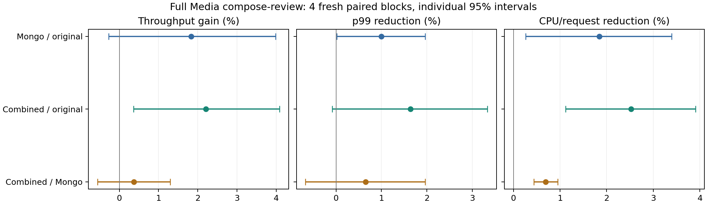

# Media 내부 서버 9개와 MongoDB 동시 적용

전체 Media 스택에 리뷰 쓰기 요청을 보냈다. C4, workload CPU 8개, 2GHz, tracing 100%를 유지했다. 각 정책마다 새 스택·데이터, 50초 warmup, 60초 clean ROI를 사용했다. 요청 처리량·평균/p99·전체 user+kernel CPU가 주 지표다. 최대 처리량 sweep은 아니다.

## 전체 요청 성능

| 정책 | RPS | 평균 ms | p99 ms | CPU µs/request | CPU util % |
|---|---:|---:|---:|---:|---:|
| original | 1181.29 | 3.3159 | 5.8160 | 5876.48 | 85.61 |
| mongo | 1202.92 | 3.2551 | 5.7580 | 5768.10 | 85.55 |
| combined_nop | 1207.24 | 3.2429 | 5.7831 | 5795.81 | 86.25 |
| combined | 1207.27 | 3.2426 | 5.7203 | 5728.10 | 85.28 |

| 정책 / 대조군 | 처리량 배율 [95% CI] | 평균 지연 절감 [95% CI] | p99 절감 [95% CI] | CPU 절감 [95% CI] |
|---|---:|---:|---:|---:|
| mongo / original | 1.01834× [0.99729, 1.03984] | +1.83% [-0.28, +3.89] | +1.00% [+0.02, +1.96] | +1.84% [+0.26, +3.40] |
| combined_nop / mongo | 1.00361× [0.97287, 1.03532] | +0.37% [-2.83, +3.48] | -0.44% [-1.80, +0.91] | -0.48% [-1.37, +0.40] |
| combined / original | 1.02207× [1.00362, 1.04087] | +2.20% [+0.35, +4.02] | +1.64% [-0.08, +3.33] | +2.52% [+1.12, +3.90] |
| combined / mongo | 1.00367× [0.99442, 1.01300] | +0.38% [-0.55, +1.30] | +0.65% [-0.67, +1.96] | +0.69% [+0.43, +0.95] |
| combined / combined_nop | 1.00006× [0.97619, 1.02451] | +0.01% [-2.50, +2.45] | +1.08% [-0.20, +2.34] | +1.17% [+0.55, +1.79] |

4개의 독립 seed block을 사전 순서로 균형 배치했다. 개별 paired-log t95 구간이며 다중비교 보정은 없다. 느린 실행을 성능 기준으로 제외하거나 이전 campaign과 합산하지 않는다.

## 적용 범위

original은 전체 원본, mongo는 기존 split75만 적용, combined는 split75와 내부 서버 9개 및 선택된 공유 라이브러리의 T1을 동시 적용했다. combined_nop는 MongoDB split75를 유지하고 내부 서버·라이브러리의 새 힌트만 같은 길이 NOP로 바꿔 점프·배치 비용을 남긴 대조군이다.

| 내부 서버 | 삽입 위치 | 힌트 수 | 코드 순증가 bytes | 학습 커버리지 % | 검증 커버리지 % | main ELF 미스 표본 비중 % |
|---|---:|---:|---:|---:|---:|---:|
| MovieIdService | 128 | 264 | 3537 | 65.08 | 63.47 | 84.19 |
| ComposeReviewService | 128 | 375 | 4380 | 55.10 | 54.72 | 83.10 |
| RatingService | 128 | 292 | 3786 | 65.03 | 62.37 | 92.24 |
| UniqueIdService | 24 | 47 | 634 | 65.70 | 63.71 | 38.45 |
| TextService | 24 | 41 | 572 | 66.80 | 66.35 | 33.37 |
| UserService | 32 | 54 | 748 | 65.10 | 60.06 | 32.50 |
| ReviewStorageService | 22 | 39 | 522 | 65.33 | 65.77 | 13.60 |
| UserReviewService | 81 | 143 | 2012 | 65.04 | 64.10 | 23.80 |
| MovieReviewService | 78 | 132 | 1859 | 65.14 | 63.45 | 23.74 |

| 공유 라이브러리 | 삽입 위치 | 힌트 수 | 코드 순증가 bytes | 학습 커버리지 % | 검증 커버리지 % |
|---|---:|---:|---:|---:|---:|
| libmongoc-1.0.so.0.0.0 | 94 | 205 | 2716 | 65.14 | 64.63 |
| libjaegertracing.so.0.4.2 | 60 | 138 | 1818 | 65.01 | 63.42 |
| libc.so.6 | 36 | 101 | 1292 | 39.09 | 38.66 |
| libstdc++.so.6.0.30 | 35 | 89 | 1132 | 65.77 | 64.78 |
| libbson-1.0.so.0.0.0 | 40 | 106 | 1345 | 56.40 | 54.87 |
| libmemcached.so.11.0.0 | 36 | 85 | 1130 | 65.17 | 63.12 |
| libthrift.so.0.12.0 | 6 | 20 | 225 | 39.72 | 37.69 |
| libmemcachedutil.so.2.0.0 | 2 | 2 | 28 | 23.08 | 19.12 |

각 ELF의 실제 미스·선행 LBR·독립 near-call 빈도를 사용했다. 코드 주소와 호출 복귀 주소를 유지하는 direct-call stub 방식이다. 65% 목표와 위치/발행 예산은 성능 측정 전에 고정했고, heldout은 선택에 사용하지 않았다. 각 커버리지는 해당 ELF의 표본 경로 커버리지이며 실제 prefetch 수락률·정확도·미스 회피율이 아니다. 라이브러리의 전체 native 미스 가중치 중 0.5% 이상을 차지한 DSO를 선택했다. 동일 DSO는 모든 대상 서버에서 같은 수정 파일로 바인딩했다. main ELF 밖에서 발생한 미스가 새 서버에서 61.5–86.4%여서, clean 성능 비교 전에 공유 라이브러리로 범위를 확장했다.

CastInfo·Plot·MovieInfo는 이번 요청의 주 경로가 아니며 원본이다. Nginx·Redis·Memcached·Jaeger 서버·선택되지 않은 DSO·커널 코드는 이번 패치 범위에서 제외됐다. 따라서 Media의 모든 실행 파일이나 모든 API를 최적화했다고 해석하지 않는다.

## 별도 PMU 진단

성능 측정이 끝난 뒤 원본/MongoDB만/동시 적용을 각각 새 스택 두 번으로 진단했다. 아래 절감률은 원본 대비 기술 통계이며 clean ROI의 paired 효과와 합산하지 않는다.
진단 전용 실행은 warmup 50초 뒤 5초 CPU 구간과 각 3초 PMU 창을 사용한다. 진단 실행의 E2E 수치는 성능 표에 넣지 않는다. Nginx의 기존 연결당 10만 요청 제한과 top-down 합계 오차 2% 기준으로 무효 처리한 시도는 별도 보존하고, 같은 seed로 재측정했다.

| 대상 | FE % 원본 → Mongo만 → 동시 | L2 code-read miss 절감 % | Retired L2 절감 % | I-cache stall cycles 절감 % |
|---|---:|---:|---:|---:|
| movie-id-service | 74.69 → 75.28 → 73.65 | +1.41 | +43.88 | +14.46 |
| compose-review-service | 73.82 → 73.74 → 73.15 | +2.54 | +32.45 | +7.88 |
| rating-service | 73.63 → 73.94 → 72.86 | +5.52 | +38.93 | +9.67 |
| unique-id-service | 81.18 → 80.71 → 81.38 | +6.41 | +50.06 | +17.76 |
| text-service | 80.50 → 81.37 → 81.54 | +8.51 | +51.97 | +19.01 |
| user-service | 78.82 → 78.89 → 78.62 | +6.94 | +48.61 | +17.53 |
| review-storage-service | 76.56 → 76.98 → 76.56 | +7.92 | +47.24 | +18.90 |
| user-review-service | 74.63 → 75.24 → 74.21 | +6.47 | +46.56 | +15.69 |
| movie-review-service | 74.44 → 75.11 → 73.97 | +6.64 | +48.05 | +18.06 |
| user-review-mongodb | 68.78 → 65.79 → 66.02 | +9.75 | +63.29 | +24.05 |
| movie-review-mongodb | 68.40 → 65.84 → 65.91 | +9.07 | +63.63 | +24.53 |
| review-storage-mongodb | 79.39 → 76.55 → 77.83 | +7.35 | +51.84 | +20.71 |
| nginx-web-server | 58.62 → 58.06 → 57.83 | -1.67 | +2.83 | +1.85 |

| 합산 범위 | FE % 원본 → Mongo만 → 동시 | L2 code-read miss 절감 % | Retired L2 절감 % | I-cache stall cycles 절감 % | ITLB walk cycles 절감 % |
|---|---:|---:|---:|---:|---:|
| native | 75.36 → 75.69 → 74.90 | +5.22 | +43.15 | +14.16 | +6.91 |
| mongo | 69.97 → 67.15 → 67.45 | +9.10 | +61.75 | +23.77 | +48.52 |
| monitored | 70.70 → 69.74 → 69.38 | +6.28 | +46.29 | +16.85 | +22.73 |

native는 애플리케이션 서버 9개, mongo는 활발한 DB 3개, monitored는 이 12개와 Nginx다. 합산 FE 비율은 slots 가중치이며, 서로 다른 시점의 request-normalized 창을 합산한 기술 통계다. L2 code-read miss는 speculative 요청, retired L2는 은퇴 명령어 이벤트로 서로 다른 모집단이다.

| 범위 / 정책 | FE slots % | BE slots % | fetch latency slots % | I-cache stall cycles % | unknown-branch cycles % | ITLB walk cycles % |
|---|---:|---:|---:|---:|---:|---:|
| native / original | 75.36 | 7.93 | 66.88 | 22.11 | 36.12 | 9.46 |
| native / mongo | 75.69 | 7.82 | 67.27 | 22.19 | 36.14 | 9.69 |
| native / combined | 74.90 | 8.03 | 65.76 | 19.60 | 37.64 | 9.13 |
| mongo / original | 69.97 | 8.74 | 62.63 | 26.76 | 32.03 | 8.35 |
| mongo / mongo | 67.15 | 9.61 | 58.58 | 22.26 | 29.55 | 4.53 |
| mongo / combined | 67.45 | 9.45 | 59.07 | 22.60 | 29.85 | 4.76 |

비율은 각각 같은 PMU 창의 slots 또는 cycles로 나눴다. 이벤트가 겹치므로 합산하지 않는다. Unknown-branch bubble은 분기 발견/전환 관련 지연이며, 이 카운터만으로 BTB 부재나 FDIP 실패의 원인을 확정하지 않는다. [Intel 이벤트 정의](https://perfmon-events.intel.com/platforms/graniterapids/core-events/core/)를 따른다.

| clean CPU 범위 | 원본 CPU µs/request | 동시 CPU µs/request | user 절감 % [95% CI] | kernel 절감 % [95% CI] |
|---|---:|---:|---:|---:|
| native | 3095.91 | 3056.17 | +3.04% [+2.45, +3.62] | -0.25% [-0.62, +0.13] |
| mongo | 1236.03 | 1134.63 | +9.30% [+8.90, +9.69] | -2.03% [-3.65, -0.45] |
| all | 5876.48 | 5728.10 | +4.36% [+2.40, +6.28] | -0.39% [-0.91, +0.13] |

| 커널 CPU 풀 | FE % | BE % | memory-bound % (BE의 부분집합) | FE slots/request | cycles/request |
|---|---:|---:|---:|---:|---:|
| original | 33.28 | 40.56 | 26.40 | 10101632 | 5058710 |
| mongo | 33.38 | 40.44 | 26.32 | 10153901 | 5070003 |
| combined | 33.41 | 40.54 | 26.40 | 10185369 | 5081933 |

서비스 간 경계는 별도 프로세스의 RPC이며 일반 함수 호출처럼 상대 서버의 주소를 prefetch할 수 없다. 현재 힌트는 각 서버의 주소 공간에서 그 서버가 실행할 코드를 대상으로 한다. 커널 진입·복귀 및 수신 태스크의 스케줄인 경로는 별도의 배치·타깃·대조군이 필요하다. 커널 FE 비율만으로 prefetch의 이득을 확정하지 않으며, 해당 scope에는 스케줄러와 interrupt도 포함된다.

PMU 창 336개 모두 fully scheduled. Top-down raw closure 최대 절댓값은 1.819%. 원자료와 배치·패치·해시는 evidence에 보존한다.

## 사용자 코드와 커널 코드의 분리 진단

각 정책을 새 스택으로 한 번 더 실행했다. CPU 풀 전체의 user/kernel을 나눠 집계했으며 각 5초 창의 완료 요청 수로 정규화했다. 각 행은 해당 모드의 이벤트/request다. PMU 창과 샘플 수집 구간은 clean 성능 측정과 별개다.
최초 커널 cycles 샘플은 throttle이 검출되어 제외했다. 두 비교 조건 모두 cycles period 1,000,003 및 retired L2 period 1,021로 다시 수집했으며 LOST/THROTTLE 없는 기록만 함수별 분석에 사용했다. 커널의 샘플링 제한 설정은 바꾸지 않았다.

| 정책 / 모드 | L2 code-read miss | retired L2 | retired L1I | I-cache stall cycles | stall periods | ITLB walk cycles | cycles/stall period |
|---|---:|---:|---:|---:|---:|---:|---:|
| original / u | 133224.27 | 12219.48 | 45058.67 | 1457258.63 | 68954.52 | 529613.16 | 21.11 |
| original / k | 44235.81 | 2650.92 | 81604.27 | 569343.31 | 61073.12 | 31700.81 | 9.32 |
| combined / u | 124495.30 | 6758.93 | 47910.72 | 1207130.91 | 76636.05 | 392975.62 | 15.75 |
| combined / k | 45270.67 | 2690.13 | 80531.62 | 575738.22 | 61533.73 | 31071.27 | 9.36 |

stall periods는 미스 개수가 아니며, cycles/period는 같은 L1 측정 창의 비율이다. 이 비율을 개별 미스 지연으로 해석하지 않는다.
이벤트 정의: [Intel Granite Rapids PMU](https://perfmon-events.intel.com/platforms/graniterapids/core-events/core/). L2 code 요청/미스와 retired 명령어 미스를 직접 나눠 잘못된 분기 경로 비중으로 해석하지 않는다.

| 정책 / 커널 표본 | 전체 표본 | 상위 10개 실제 함수와 표본 비중 |
|---|---:|---|
| original / cycles | 61781 | `intel_idle` 3.53%; `__raw_spin_lock_irqsave` 2.15%; `update_load_avg` 1.64%; `psi_group_change` 1.49%; `restore_fpregs_from_fpstate` 1.45%; `switch_mm_irqs_off` 1.41%; `_raw_spin_lock` 1.31%; `__fdget` 1.24%; `__nf_conntrack_find_get` 1.23%; `__schedule` 1.10% |
| original / l2 | 31028 | `x64_sys_call` 2.54%; `[unknown]` 0.64%; `copy_process` 0.46%; `mas_walk` 0.42%; `zap_pte_range` 0.41%; `free_unref_page_commit` 0.40%; `do_select` 0.40%; `rmqueue` 0.40%; `pipe_write` 0.39%; `free_unref_page_prepare` 0.37% |
| combined / cycles | 62921 | `intel_idle` 3.73%; `__raw_spin_lock_irqsave` 2.20%; `update_load_avg` 1.75%; `psi_group_change` 1.48%; `restore_fpregs_from_fpstate` 1.47%; `switch_mm_irqs_off` 1.38%; `_raw_spin_lock` 1.35%; `__fdget` 1.30%; `__nf_conntrack_find_get` 1.28%; `__schedule` 1.11% |
| combined / l2 | 32012 | `x64_sys_call` 2.23%; `[unknown]` 0.77%; `free_unref_page_commit` 0.60%; `mas_walk` 0.48%; `zap_pte_range` 0.48%; `rmqueue` 0.48%; `free_unref_page_prepare` 0.45%; `do_madvise` 0.38%; `sched_move_task` 0.37%; `do_select` 0.35% |

cycles와 retired L2는 서로 다른 표본이다. 함수별 비중은 측정 위치를 보여주며 호출 경로·프리패치 효과·syscall 경계의 인과적 비용을 증명하지 않는다. 커널 패치는 적용하지 않았다.

| 정책 / 커널 retired L2 | 관측 함수 수 | 상위 64개 함수의 표본 비중 % | 상위 64개 sampled-IP 64B 구간의 비중 % |
|---|---:|---:|---:|
| original | 1844 | 20.76 | 11.85 |
| combined | 1862 | 21.11 | 12.15 |

sampled-IP 64B 구간은 은퇴 명령어 주소를 묶은 값이며 실제 instruction fetch miss 주소나 prefetch 정확도가 아니다. 한 함수의 전체 코드와 몇 개의 캐시라인을 가져오는 것도 서로 다르다.

## 실제 RPC 요청 추적

각 경계 진단에서 부하와 PMU가 모두 종료된 뒤 기존 Jaeger의 마지막 5초 구간에서 최대 200개 요청을 조회했다. 아래 span 시간은 하위 호출과 대기를 포함하며 서로 겹친다. CPU 비용이나 독립적인 성능 비교로 사용하지 않는다.

| 정책 | trace 수 | parent 누락 trace | API 경고 span |
|---|---:|---:|---:|
| original | 200 | 193 | 498 |
| combined | 200 | 200 | 203 |

부모 span 누락과 API 경고가 있어 완전한 call graph로 사용하지 않았다. 아래 표는 실제 관측된 operation만 보여준다.

| 원본에서 관측된 서비스 / operation | span 수 | 평균 span µs |
|---|---:|---:|
| nginx / `/wrk2-api/review/compose` | 395 | 3052.50 |
| nginx / `ComposeReview` | 200 | 2686.32 |
| movie-id-service / `UploadMovieId` | 181 | 1975.95 |
| rating-service / `UploadRating` | 91 | 1325.80 |
| compose-review-service / `UploadRating` | 182 | 1098.85 |
| user-review-service / `UploadUserReview` | 191 | 1013.16 |
| user-review-service / `MongoFindUser` | 191 | 999.10 |
| movie-review-service / `UploadMovieReview` | 131 | 993.62 |
| movie-review-service / `MongoFindMovie` | 131 | 982.47 |
| user-service / `UploadUserWithUsername` | 164 | 515.46 |
| compose-review-service / `UploadUniqueId` | 184 | 440.67 |
| movie-review-service / `MongoUpdate.` | 133 | 421.90 |
| user-review-service / `MongoUpdate` | 191 | 415.84 |
| compose-review-service / `UploadMovieId` | 184 | 390.75 |
| compose-review-service / `UploadText` | 184 | 333.14 |

## 판정과 다음 정책

원본 대비 동시 적용의 처리량은 **+2.21%** (95% CI +0.36~+4.09%), 평균 지연은 **−2.20%**, p99는 **−1.64%**였다. p99 구간은 개선 0을 포함한다. 10% 목표에는 도달하지 않았다.
기존 MongoDB split75에 서버·라이브러리를 추가한 효과는 처리량 **+0.37%** (−0.56~+1.30%), 평균 지연 절감 **0.38%** (−0.55~+1.30%), p99 절감 **0.65%** (−0.67~+1.96%)로 확정하지 못했다. 같은 배치의 NOP 대조군 대비 처리량도 +0.006%로 차이가 확인되지 않았다. 반면 전체 CPU/request의 추가 절감 **0.69%** (0.43~0.95%)와 앱서버 9개의 사용자 CPU 절감 **3.98%** (3.31~4.64%)는 확인됐다. 추가 CPU 절감을 추가 speedup으로 표현하지 않는다.
앱서버 9개에서 MongoDB-only 대비 retired L2는 43.75%, I-cache stall cycles는 14.85% 감소했지만 L2 code-read miss는 5.68% 감소에 그쳤다. FE slots/request는 4.50% 감소했고 FE 비율은 75.69→74.90%였다. Unknown-branch cycles/request는 0.16% 증가하여 사실상 그대로이며 backend-bound는 8.03%였다. 사용자 코드에서 backend가 주원인이라는 설명은 지지되지 않는다. 남은 frontend 병목에는 이 정책이 줄이지 못한 분기 관련 지연이 크다. 이 사실만으로 BTB 부재·FDIP 실패 또는 부족한 lead time 중 하나를 확정하지 않는다.
CPU 풀 전체를 별도로 측정하면 사용자 코드의 L2 code-read miss는 6.55%, retired L2는 44.69%, I-cache stall cycles는 17.16%, ITLB walk cycles는 25.80% 감소했다. retired L1I는 6.33%, stall periods는 11.14% 증가했다. 같은 창의 cycles/stall period는 21.11→15.75로 짧아졌다. 따라서 모든 I-cache 관련 지표가 개선됐다고 주장하지 않는다. 이 두 경계 진단의 수치는 반복 E2E의 신뢰구간과 별개인 기술 통계다.
커널은 원본 전체 서비스 CPU의 38.73%였고 CPU/request가 줄지 않았다. 커널 FE는 33.28→33.41%, BE는 40.56→40.54%였다. 별도 진단에서 커널 L2 code-read miss는 요청당 44,236→45,271, retired L1I는 81,604→80,532로 코드 미스가 많이 남았다. 커널 retired L2 표본은 syscall 디스패치(x64_sys_call), 스레드 생성(copy_process), 메모리 관리 등 여러 함수에 분산됐다. 원본에서 상위 64개 sampled-IP 64B 구간도 표본의 11.85%에 그쳤다. 이 주소 구간을 정확한 fetch miss line으로 간주할 수는 없다.
이번 정책은 사용자 공간의 T1이며 커널 코드를 prefetch하지 않았다. 기존 sched_switch 모듈도 등록한 사용자 코드 페이지의 커널 alias를 대상으로 하므로, 커널 자신의 코드 미스를 직접 해결한 구현은 아니다. 서버 간 RPC는 주소 공간이 다르므로 각 수신 태스크와 syscall/복귀 경로에 맞는 타깃이 필요하다. 커널 진단은 그 경로도 후속 대상이라는 근거지만 커널 prefetch의 성능 이득을 측정한 결과는 아니다.
현재 배치는 각 ELF 내부의 선행 direct call만 이용한다. libc와 Thrift의 heldout 모델 커버리지는 각각 38.66%, 37.69%이고, 예산을 풀어도 현재 모델에서 적격 선행 호출이 있는 표본은 49.60%, 51.97%였다. 다음 배치 탐색에서는 라이브러리 경계를 넘는 호출자와 새 스레드/수신 태스크의 진입 경로를 구분해야 한다. 전체 call graph의 dominator나 실제 fetch deadline을 이미 확보했다고 주장하지 않는다. Jaeger 조회에도 부모 span 누락이 있어 완전한 critical path 복원에는 사용하지 않았다.
확장 정책은 추가 E2E 개선이 확인되지 않아 승격하지 않는다. 34개 PF/NOP 생성 바이너리와 빈 build 디렉터리를 제거하고 원자료·소스·패치·바이너리 해시·무효 시도와 제외 사유는 보존한다. 기존 split75와 원본 reference는 유지한다.
평가가 끝난 개별 LBR observation 34개(12,537,431 bytes)는 타깃·삽입 위치·분기 분포와 적격 표본 수로 요약한 뒤 제거했다. 학습/검증 커버리지, 최종 선택 계획과 정확한 패치 기록은 남겼다. 요약만으로 원래의 개별 LBR 경로를 복원할 수는 없다.

## 구현 검증과 재현

DSO 식별·배치 선택·기존 call stub 관련 16개 테스트를 통과했다. 공유 라이브러리 지원을 추가한 뒤 call stub 8개 테스트를 다시 통과했다. PT_PHDR 없는 DSO의 dlopen/dlclose 반복, 함수 인수·복귀 주소, 예외 unwind와 호스트 AT_PHDR 유지를 검사했다. 실서비스 smoke에서는 14,669개 요청을 처리했고, 각 실행에서 실제 프로세스에 매핑된 실행 파일·공유 라이브러리 해시를 확인했다.
E2E는 16개 clean 실행 전체를 보존한다. 진단은 PMU 기준을 만족한 6개 실행과 무효 시도를 함께 보존한다. 플랫폼 설정의 복구 기록, 명령, 원본/수정 바이너리 해시, 어셈블리 패치, source snapshot과 정리 내역은 재현 자료에 포함한다.

자료: [전체 성능 원자료](../llvm_prefetchit/migration/evidence/class_b_media_system_20260930/screen_evaluation.json), [서비스·커널 PMU](../llvm_prefetchit/migration/evidence/class_b_media_system_20260930/system_report.json), [재현 기록 manifest](../llvm_prefetchit/migration/evidence/class_b_media_system_20260930/records_manifest.json).
