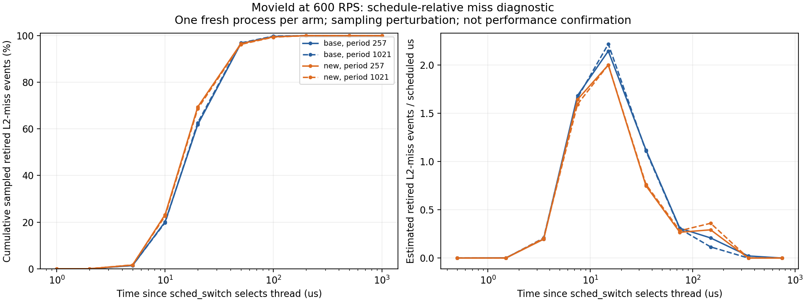

# Request latency, throughput and schedule-relative misses

기존 7개 독립 block의 완료 요청 지표를 사후 분석했고, 별도 MovieId 실행에서 스케줄인 후 미스 분포를 수집했다. 새 PMU 캡처는 계측이 있는 원인 진단이며 성능 확인 구간에 합치지 않는다.

## 요청 지연시간과 처리량

아래는 외부 HTTP 요청의 예정 도착부터 완료까지 지연시간이다. 개별 MovieId RPC 시간이 아니다. 각 가족은 Media3/Social2를 함께 바꾼 bundle이며, 같은 seed의 7쌍을 비교한다. p99 절대값은 실행별 p99의 산술평균, 절감률과 신뢰구간은 paired log-ratio로 계산했다. 개별 95% t 구간이며 사후 다중 비교 보정은 하지 않았다.

| Family | Baseline p99 | New p99 | p99 reduction vs baseline, 95% CI | Baseline / new completed RPS |
|---|---:|---:|---:|---:|
| media | 6.546 ms | 6.473 ms | +1.17% [-4.77, +6.77] | 599.880 / 599.890 |
| social | 11.573 ms | 11.922 ms | -3.11% [-11.94, +5.02] | 599.886 / 599.901 |

두 가족 모두 baseline 대비 p99 개선을 확정하지 못했다. 제공 부하가 600 RPS로 고정되어 완료 RPS도 거의 같다. 최대 처리 용량은 측정하지 않았으며 CPU 절감률의 역수를 throughput 향상으로 보고하지 않는다. 기존 baseline의 풀 사용률은 Media 약 44%, Social 약 57%이므로 이 결과는 포화 상태의 용량 비교도 아니다.

CPU/request는 여러 스레드가 소비한 CPU 시간을 합한 비용이다. 응답시간은 병렬 RPC와 대기 시간을 포함한 요청의 경과 시간이므로 CPU 비용 절감과 같은 비율로 줄어야 하는 지표가 아니다.

| Family | New p99 vs reference | New p99 vs layout NOP |
|---|---:|---:|
| media | +2.29% [-4.95, +9.03] | +1.93% [-2.30, +5.98] |
| social | -7.31% [-15.02, -0.12] | -2.68% [-12.21, +6.04] |

Social의 retained-reference 대비 p99는 이 사후 비교에서 증가했다. 여러 사후 대비 중 하나이므로 확인 실험의 확정 결론으로 승격하지 않는다. 과거 원시 요청 목록은 당시 보존 정책에 따라 compact p99 추출 후 제거되어 p50/p95/평균을 복구할 수 없다. 앞으로는 정리 전에 p50/p95/p99와 평균을 모두 compact 결과에 남기도록 공통 수집기를 수정했다.

## 높은 MPKI와 제한된 이득

- 이전 MovieId baseline PMU 1회 진단의 frontend-bound 비중은 slots의 75.54%, fetch-latency 비중은 67.80%였다. 프런트엔드 문제가 없다고 해석할 근거는 없다. slots 비중을 전체 CPU 시간이나 즉시 제거 가능한 시간으로 바꾸어 해석하지 않는다.
- 같은 PMU 진단의 코드 miss/request는 6,630.1→6,053.3 (8.70% 감소), user cycles/request는 4.06% 감소했다. 반면 독립 7쌍의 user CPU 시간 절감은 4.88%, 전체 user+kernel CPU 절감은 1.26%였다. 서로 다른 창과 지표를 합산하지 않는다.
- MovieId의 32라인 strict 정책은 검증 실행 라인 touch precision 97.82%, first-touch coverage 5.70%다. 64라인 wide 정책도 coverage 12.66%이며 precision은 66.80%로 낮아진다. 실행될 라인을 맞힌 비율은 실제 미스를 맞힌 비율이 아니다.
- 전체 MovieId CPU 중 user 영역은 약 35.29%다. 스레드 생성·종료, 동기화, 시스템 호출과 다른 서비스가 포함된 비용을 해당 코드 프리패치만으로 모두 제거할 수 없다. [MovieIdHandler 소스 확인 기록](../llvm_prefetchit/migration/evidence/class_b_followup_20260927/source_audit.json)의 함수는 요청마다 `std::async(std::launch::async, ...)` 세 경로를 실행한다. 새 스레드와 재진입 스레드를 구분한 측정이 필요하다. 기존 MovieId 커널 계획에는 clone(56) 복귀 프로파일도 있으므로 새 스레드가 전부 미지원이라고 단정하지 않는다.
- `L2_RQSTS.CODE_RD_MISS`는 speculative code-fetch 요청이고 아래 `FRONTEND_RETIRED.L2_MISS`는 L2 instruction miss를 겪은 retired instruction 이벤트다. 두 모집단의 카운트로 miss coverage를 직접 계산하지 않는다. [Intel GNR event definitions](https://perfmon-events.intel.com/platforms/graniterapids/core-events/core/).

## 스케줄인 후 미스 타임라인

기준 시각은 `sched_switch`가 next TID를 선택한 시점이며 실제 전환 완료 전이다. 디스크 swap-in이 아니다. 같은 recorder에서 scheduler trace와 user PEBS를 수집했다. PMU 이벤트는 `cpu/event=0xc6,umask=0x03,config1=0x13/upp`, 주기는 257과 1021이며 각각 15초를 기록했다. Media 8코어, 600 RPS, tracing 100%, 2 GHz/C6 off를 사용했다. MovieId만 새 정책으로 바꾸고 다른 서비스는 baseline을 유지했다. arm별 새 스택 1개, 주기별 캡처 1회로 탐색 진단이다.

Linux 6.8은 custom clock을 지정하면 PEBS TSC 변환을 사용하지 않으므로 `--clockid`를 지정하지 않았다. 이 시스템은 native TSC clocksource다. [Linux PEBS timestamp source](https://github.com/torvalds/linux/blob/v6.8/arch/x86/events/intel/ds.c). 샘플의 시각은 miss를 경험한 명령어의 은퇴 시각이며 fetch 발생 순간과 다르다.

처음 고정 TID 목록으로 필터링한 캡처는 스레드 생성·종료 때문에 통째로 제외했다. 최종 캡처는 모든 scheduler 전환과 FORK/EXIT 메타데이터를 기록해 대상 TGID의 동적 스레드 수명을 추적한다. 종료 직전 일부 PEBS raw record에는 TGID는 있지만 TID가 -1이다. 이 경우 정확히 같은 CPU/시각의 활성 대상 스레드 구간이 하나일 때만 복원한다. 추정 최근 스레드나 가까운 시간으로 붙이지 않는다. 정상 TID 샘플만 사용한 분포와의 차이도 함께 기록한다. CPU·시각·prev/next TID·state가 모두 같은 scheduler 중복 레코드만 감사 기록을 남기고 한 번 집계한다. 서로 다른 실제 전환의 불연속은 계속 기각한다. 이 decoder 수정은 완료된 baseline 부하의 원시 기록과 이후 candidate 모두에 동일하게 적용했으며 source 사본과 변경 사유를 보존했다. 완전한 switch-in/out 구간만 집계하고, 유실·throttle은 기각하며, 경계 제외 후 샘플 결합률 99% 초과를 요구한다.

| Arm | Period | Samples in complete runs | Complete runs | New threads observed | Samples joined | TID -1 resolved | Median run |
|---|---:|---:|---:|---:|---:|---:|---:|
| base | 257 | 21,083 | 123,487 | 27,472 | 100.000% | 3,059 | 32.35 us |
| base | 1021 | 5,334 | 123,243 | 27,491 | 100.000% | 789 | 32.38 us |
| new | 257 | 17,792 | 123,148 | 27,485 | 100.000% | 2,909 | 32.01 us |
| new | 1021 | 4,487 | 123,027 | 27,464 | 100.000% | 733 | 32.00 us |

| Arm / period | <5 us | <10 us | <20 us | <50 us | <100 us | New-thread first-run event share |
|---|---:|---:|---:|---:|---:|---:|
| base / 257 | 1.35% | 20.13% | 61.85% | 96.62% | 99.65% | 16.77% |
| base / 1021 | 1.41% | 19.80% | 62.65% | 96.87% | 99.81% | 16.65% |
| new / 257 | 1.57% | 23.24% | 69.41% | 96.54% | 99.48% | 16.83% |
| new / 1021 | 1.65% | 22.60% | 68.67% | 96.26% | 99.35% | 16.92% |

Baseline의 두 주기에서 스케줄인 후 20 us 이내 비중은 61.85–62.65%, 50 us 이내는 96.62–96.87%다. 초반에 미스가 집중되는 현상을 직접 관측했다. 다만 명령어 은퇴 시각 기준이므로 실제 fetch가 동일한 시각에 발생했다는 의미는 아니다. 커널 복귀 시간도 포함된다. 이 집중 현상이 기존 프리패치가 그 미스의 주소를 충분히 맞히거나 stall을 제거했다는 증거는 아니다.

Candidate의 누적 비중이 달라지는 것만으로 개선률을 정하지 않는다. 전체 미스가 줄거나 실행 시간이 짧아져도 비중·시간당 밀도는 달라질 수 있다. 절대 miss/request와 stall, 깨끗한 CPU/응답시간 창을 함께 봐야 한다.

TID=-1 샘플을 제외한 민감도 분석에서 누적 분포의 최대 차이는 4.81 percentage points다. 정상 TID만으로도 baseline의 50 us 이내 비중은 96.06–96.37%다. TID 누락이 무작위라고 가정하지 않았으며, 복원 포함/제외를 모두 보존했다.

왼쪽은 누적 샘플 비중, 오른쪽은 해당 시간 구간에 실제로 스레드가 스케줄된 노출 시간당 추정 이벤트 수다. 긴 시간 구간이 샘플을 더 많이 모으는 효과를 구분하기 위해 둘을 함께 제시했다. 노출 시간에는 커널·인터럽트가 포함되며 user 실행 시간이나 명령어 수가 아니므로 시간 구간별 MPKI라고 부르지 않는다.

추정 이벤트 수는 샘플 period 합이다. 카운터는 switch마다 초기화하지 않으며, 각 period가 여러 구간에 걸칠 수 있으므로 개별 미스의 정확한 타임라인이 아니다. 주기 변경은 이 민감도를 확인하는 진단이다. 관측된 미스를 전부 cold miss나 프리패치로 제거 가능한 stall로 간주하지 않는다. 기존 커널 alias data-load 진단과도 구분한다.

최대 처리량을 확인하려면 같은 플랫폼·입력·오류 기준과 사전 고정 p99 SLO에서 RPS를 올려 baseline과 candidate의 최대 지속 처리량을 독립 반복 비교해야 한다. 현재 600 RPS 결과만으로 그 수치를 산출하지 않았다.

## 재현과 보존

- [요청 분석기](../llvm_prefetchit/scripts/class_b/request_metrics.py)
- [타임라인 수집기](../llvm_prefetchit/scripts/class_b/capture_miss_timeline.py)
- [시간 결합 분석기](../llvm_prefetchit/scripts/class_b/wake_miss_timeline.py)
- [공개 compact evidence](../llvm_prefetchit/migration/evidence/class_b_followup_20260927/)
- [이전 전체 결과](class_b_fullset_20260926.md)

전체 compact 실행 기록과 당시 source 사본: `/storage/prefetchit/class_b_followup_20260927`. 원시 perf/decoded 파일은 집계와 SHA-256 보존 후 즉시 제거했다. 입력 데이터·참조 바이너리·유지 중인 MovieId 후보는 보존했다.
