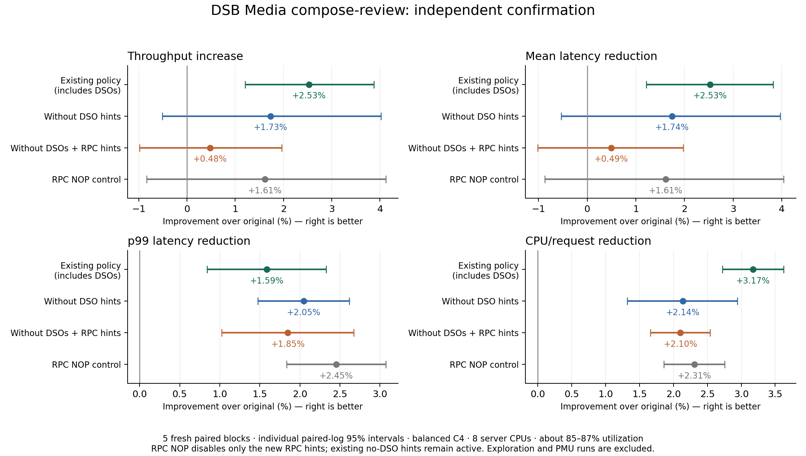

# DSB Media: DSO 제거와 RPC 다음 실행 경로 프리패치

2026-10-01. **평균 처리량은 기존 DSO 포함 정책이 가장 높았으며, 원본 대비 +2.53%였다** (개별 paired-log 95% CI +1.20–+3.87%, 독립 5쌍). DSO 제거판은 +1.73%, RPC 보강판은 +0.48%였고, 뒤 두 처리량 구간은 0을 포함한다. 10% 목표에는 도달하지 못했다.

DSO 제거, 실제 indirect target, RPC 타입으로 정해진 handler, 이전 실행 trace의 후속 경로를 모두 구현하고 측정했다. 초기 RPC 삽입에서 기존 decoder 힌트를 밀어내던 문제를 찾은 뒤, 기존 코드 배치와 힌트를 모두 유지하는 방식으로 고쳐 독립 재검증했다. 최종 RPC 추가의 처리량 이득은 확인되지 않았으며, 기존 정책을 유지한다.

## 전체 요청 성능

| 정책 | RPS | 평균 ms | p99 ms | CPU µs/request | CPU util |
|---|---:|---:|---:|---:|---:|
| 원본 | 1197.47 | 3.2700 | 5.8175 | 5850.47 | 86.46% |
| 기존 정책: DSO 포함 | 1227.77 | 3.1874 | 5.7251 | 5664.79 | 85.82% |
| DSO 제거 | 1218.19 | 3.2132 | 5.6983 | 5725.59 | 86.02% |
| DSO 제거 + RPC 보강 | 1203.15 | 3.2538 | 5.7098 | 5727.41 | 85.00% |
| RPC 추가분만 NOP | 1216.76 | 3.2172 | 5.6747 | 5715.43 | 85.78% |

산술평균이다. 아래 변화율은 같은 블록끼리의 로그 비율로 계산했다. 양수는 개선, 음수는 악화다. 각 구간은 다중 비교 보정 없는 개별 95% 구간이다.

| 비교 | 처리량 증가 | 평균 지연 절감 | p99 절감 | CPU/request 절감 |
|---|---:|---:|---:|---:|
| 기존 정책: DSO 포함 / 원본 | +2.53% [+1.20, +3.87] | +2.53% [+1.21, +3.83] | +1.59% [+0.84, +2.33] | +3.17% [+2.72, +3.62] |
| DSO 제거 / 원본 | +1.73% [-0.51, +4.02] | +1.74% [-0.53, +3.96] | +2.05% [+1.48, +2.62] | +2.14% [+1.32, +2.94] |
| DSO 제거 + RPC 보강 / 원본 | +0.48% [-0.98, +1.96] | +0.49% [-1.02, +1.98] | +1.85% [+1.02, +2.67] | +2.10% [+1.66, +2.54] |
| DSO 제거 / 기존 정책: DSO 포함 | -0.78% [-3.73, +2.26] | -0.81% [-3.98, +2.27] | +0.47% [+0.02, +0.92] | -1.07% [-2.30, +0.14] |
| DSO 제거 + RPC 보강 / 기존 정책: DSO 포함 | -2.00% [-3.39, -0.59] | -2.09% [-3.61, -0.60] | +0.27% [-0.45, +0.98] | -1.11% [-1.41, -0.80] |
| DSO 제거 + RPC 보강 / DSO 제거 | -1.23% [-3.15, +0.74] | -1.27% [-3.33, +0.75] | -0.20% [-1.04, +0.63] | -0.03% [-1.11, +1.03] |
| DSO 제거 + RPC 보강 / RPC 추가분만 NOP | -1.11% [-2.49, +0.28] | -1.14% [-2.59, +0.29] | -0.62% [-1.30, +0.06] | -0.21% [-0.39, -0.03] |
| RPC 추가분만 NOP / DSO 제거 | -0.11% [-2.63, +2.47] | -0.13% [-2.79, +2.46] | +0.41% [-0.62, +1.44] | +0.17% [-0.83, +1.17] |

RPC NOP은 추가된 RPC 힌트만 같은 길이의 NOP으로 바꾼 대조군이다. 기존 no-DSO 힌트와 추가 분기·주소·배치는 유지한다. RPC 힌트 자체를 켜면 CPU/request가 약 0.21%, 12µs 늘었다. 처리량 -1.11%의 구간은 0을 포함하므로 그 감소를 확정하지 않는다. DSO 제거 대 기존 정책의 처리량 구간도 0을 포함한다.

원본 5회의 RPS 변동계수는 1.24%, 범위는 1174.72–1210.90다. 유효 실행을 성능에 따라 제외하거나 재시도하지 않았다.

## 구현과 수정

| 구현 | 미리 아는 정보와 삽입 위치 | 검증 |
|---|---|---|
| `no_dso` | 공유 라이브러리 수정과 GOT를 이용한 DSO 타깃 힌트를 모두 제거. 앱 9개와 MongoDB의 main ELF 안쪽 힌트 유지 | 탐색 3회 + 확인 5회 |
| `rpc_live` | Thrift의 RPC별 `process_METHOD`에서 argument decoder 호출 직전. 살아 있는 processor→iface→vtable→slot을 읽어 실제 handler의 첫 4라인에 T1 | 탐색 3회 |
| `rpc_type` | 이미 선택된 RPC 타입으로 handler를 결정. handler 진입 2라인 + 이전 원본 PEBS의 handler 내부 hot line, 최대 8개 | 탐색 3회 |
| `rpc_trace` | 진입 2라인 + 원본 LBR에서 handler 이후에 관측한 main-ELF 미스. 64–8192 completed-branch cycle 경로와 최소 3개 훈련 표본 | 탐색 3회 |
| `rpc_stable` | `rpc_type`을 두 번째 appended stub으로 구현. 기존 decoder 힌트·주소·stub 배치를 유지하고, 원래 decoder 호출로 연결 | 독립 확인 5회, 정확한 NOP 5회 |

RPC 이름 dispatch → RPC별 process 함수 → **여기서 미래 handler 코드 prefetch** → argument decoding → 실제 handler indirect call 순서다. 실제 handler를 미리 실행하지 않는다. 평가 요청의 미래 결과를 훔쳐보는 oracle도 사용하지 않았다. 이미 알 수 있는 타입·실제 함수 포인터와 별도 원본 실행에서 얻은 경로를 이용했다. 한 프로세스에서 다른 RPC 서버의 가상주소를 프리패치한 것은 아니다.

초기 RPC 3종은 기존 8개 삽입 위치에서 decoder 타깃 9개를 교체했다. 해당 타깃은 `readI64_virt` 8개와 `readFieldBegin_virt` 1개였다. 뒤의 수정판은 앱의 기존 힌트 1,935개를 모두 같은 주소에 보존한다. RPC 21개 지점에 힌트 101개, 코드 946바이트를 더하며, 기존 힌트와 합친 한 지점의 최대 타깃 수는 8개다. 8개 지점은 기존 stub을 거쳐 decoder로 간다.

| 정책 | 수정 ELF 수 | 원본 callsite 수 | 힌트 수 | 추가 명령 바이트 |
|---|---:|---:|---:|---:|
| 기존 DSO 포함 | 18 | 2,504 | 7,152 | 86,905 |
| DSO 제거 | 10 | 1,958 | 5,332 | 62,610 |
| DSO 제거 + RPC 보강 | 10 | 1,971 | 5,433 | 63,556 |

바이트는 고유 ELF의 추가 명령 크기이며 런타임 working set 또는 전체 프로세스 크기가 아니다. 간접 포인터 체인은 불변 live-object 근거를 요구하고 r11·flags·CFI를 보존한다. PIE/non-PIE, 허용 base register 6개, 실제 두 virtual target, 예외 unwind, 정확한 NOP, 두 번째 패치 후 기존 힌트 보존을 포함한 native 테스트 28개가 통과했다. 6개 후보의 전체 스택 smoke도 통과했고, no-DSO 후보의 로딩된 라이브러리 해시는 원본과 일치했다.

## 어디서 이득이 사라졌나

별도 PMU는 정책당 2회, 두 번째 블록에서 정책·이벤트 순서를 뒤집었다. 앱 서버 9개와 바쁜 MongoDB 3개의 사용자 코드 이벤트를 서비스별 3초 창에서 수집하고 같은 창의 HTTP 완료 요청 수로 나눈 뒤 합산했다. 아래 변화율은 두 반복의 평균 카운터 비율이다. 모든 창의 카운터가 완전히 스케줄됐다. 동시 전체 시스템 카운트나 요청 latency 분해는 아니다. 두 반복 각각의 변화도 `pmu_contrasts.json`에 보존했다.

DSO를 빼면 앱 서버의 T1/T2 실행은 -67.69%, DTLB load walk는 -33.84% 변했다. 동시에 raw L2 code-read miss는 +5.62%, I-cache stall cycle은 +17.62% 변했다. 발행·주소 변환 비용을 줄인 효과와 유용한 코드 커버리지를 잃은 효과가 함께 관찰된다.

RPC 힌트/NOP의 앱 raw L2 변화는 두 블록에서 +0.74%, -0.33%, retired L2 변화는 -0.84%, +0.27%였다. 일관된 L2 감소를 확인하지 못했다. 새 힌트 때문에 DTLB walk가 크게 증가했다는 관찰도 없다. 힌트 비용의 작은 CPU 증가를 특정한 TLB·발행 병목 하나로 단정하지 않는다.

### DSO 제거 / 기존 정책

| 요청당 이벤트 또는 비율 | 앱 서버: 기준 → 변경 (변화) | MongoDB: 기준 → 변경 (변화) |
|---|---:|---:|
| L2 code-read miss | 45,337.72 → 47,885.08 (+5.62%) | 52,729.90 → 52,474.72 (-0.48%) |
| Retired L2 code miss | 1,657.18 → 3,224.17 (+94.56%) | 1,093.22 → 1,181.11 (+8.04%) |
| Retired L1I miss | 20,794.77 → 19,073.03 (-8.28%) | 16,586.15 → 16,519.41 (-0.40%) |
| I-cache data stall cycles | 427,787.40 → 503,167.84 (+17.62%) | 399,510.22 → 405,204.61 (+1.43%) |
| ITLB page-walk active cycles | 163,815.94 → 208,354.39 (+27.19%) | 79,768.89 → 83,003.17 (+4.05%) |
| DTLB load page-walk 완료 | 4,943.47 → 3,270.50 (-33.84%) | 3,803.29 → 3,677.41 (-3.31%) |
| DTLB store page-walk 완료 | 262.00 → 264.53 (+0.97%) | 136.56 → 142.76 (+4.55%) |
| T1/T2 실행 | 40,570.77 → 13,109.88 (-67.69%) | 33,948.64 → 33,070.16 (-2.59%) |
| Software-prefetch miss 이벤트 | 3,751.07 → 1,795.86 (-52.12%) | 5,677.79 → 5,548.60 (-2.28%) |
| Software-prefetch hit 이벤트 | 36,084.80 → 10,904.31 (-69.78%) | 27,243.03 → 26,522.02 (-2.65%) |
| L1D fill-buffer full 이벤트 | 5,125.65 → 4,573.44 (-10.77%) | 16,487.79 → 16,419.90 (-0.41%) |
| Frontend-bound slots | 10,577,981.85 → 10,995,993.67 (+3.95%) | 7,919,359.94 → 7,980,574.64 (+0.77%) |
| Frontend-bound slots % | 74.13 → 74.54 (+0.42%p) | 66.58 → 66.85 (+0.27%p) |
| Backend-bound slots % | 8.17 → 8.18 (+0.01%p) | 9.67 → 9.48 (-0.19%p) |

### RPC 힌트 / 동일 배치 NOP

| 요청당 이벤트 또는 비율 | 앱 서버: 기준 → 변경 (변화) | MongoDB: 기준 → 변경 (변화) |
|---|---:|---:|
| L2 code-read miss | 48,176.66 → 48,272.66 (+0.20%) | 52,741.08 → 52,803.84 (+0.12%) |
| Retired L2 code miss | 3,256.74 → 3,247.59 (-0.28%) | 1,162.71 → 1,183.73 (+1.81%) |
| Retired L1I miss | 19,064.61 → 19,052.50 (-0.06%) | 16,523.48 → 16,512.04 (-0.07%) |
| I-cache data stall cycles | 509,065.61 → 507,845.94 (-0.24%) | 404,599.98 → 407,254.85 (+0.66%) |
| ITLB page-walk active cycles | 210,130.46 → 206,543.12 (-1.71%) | 81,303.09 → 81,354.10 (+0.06%) |
| DTLB load page-walk 완료 | 3,268.40 → 3,260.62 (-0.24%) | 3,703.99 → 3,669.21 (-0.94%) |
| DTLB store page-walk 완료 | 263.34 → 263.30 (-0.02%) | 135.88 → 134.50 (-1.02%) |
| T1/T2 실행 | 13,093.58 → 13,137.42 (+0.33%) | 32,988.99 → 33,054.57 (+0.20%) |
| Software-prefetch miss 이벤트 | 1,826.40 → 1,883.46 (+3.12%) | 5,511.13 → 5,527.77 (+0.30%) |
| Software-prefetch hit 이벤트 | 10,844.11 → 10,846.40 (+0.02%) | 26,477.50 → 26,521.62 (+0.17%) |
| L1D fill-buffer full 이벤트 | 4,455.56 → 4,514.60 (+1.33%) | 16,643.60 → 16,380.77 (-1.58%) |
| Frontend-bound slots | 11,089,713.11 → 11,102,567.43 (+0.12%) | 7,971,822.37 → 8,008,307.53 (+0.46%) |
| Frontend-bound slots % | 74.78 → 74.81 (+0.04%p) | 66.70 → 66.88 (+0.19%p) |
| Backend-bound slots % | 8.03 → 7.97 (-0.05%p) | 9.72 → 9.44 (-0.28%p) |

Retired L2 code miss와 speculative fetch도 포함하는 raw L2 code-read miss는 다른 이벤트다. I-cache stall은 **cycle 수**이며 구간 발생 횟수가 아니다. DTLB page walk 전체를 software-prefetch 때문에 생긴 주소 변환으로 분류할 수 없다. Frontend/backend-bound는 사용자 코드 slot 비율이며 전체 요청 지연 비율이 아니다. 이벤트 정의·인코딩과 원시 perf CSV를 보존했다.

새 RPC 타깃 101라인 중 19라인은 기존 다른 지점에서도 타깃으로 사용하던 라인이다. 이전의 독립 heldout 원본 trace에서 새 타깃과 겹치는 retired L2 miss 표본은 요청당 37.04/3,916.69, **0.95%**다. 이전 DSO 포함 정책의 잔여 trace에서는 26.06/1,442.14, **1.81%**다. schedule-in 후 0–20µs만 봐도 각각 1.48%, 2.23%다. 후자의 전체 미스 중 37.97%는 main ELF 밖이었다.

이는 주소별 **정적 겹침**이다. 새 RPC 정책의 실제 미스 감소율·prefetch 완료율·속도 향상 상한이 아니다. 원본 명령이 두 캐시라인에 걸치면 두 라인을 검사했고 서비스별 표본 period와 요청 수를 정규화했다. RPC handler를 정확히 알아도, 그 handler 코드가 전체 남은 미스의 큰 부분이라는 보장은 없다. 이 결과는 handler 입구 중심의 추가 발행보다 남은 내부 경로와 자주 반복되는 힌트의 비용을 함께 다뤄야 한다는 근거다. 정확한 fetch lead-time, fetch queue 점유율, BTB miss 비율은 측정하지 않았다.

## 탐색 결과와 측정 범위

| 초기 정책 | RPS | 평균 ms | p99 ms | CPU µs/request |
|---|---:|---:|---:|---:|
| original | 1186.55 | 3.3017 | 5.8366 | 5851.06 |
| full_dso | 1212.62 | 3.2280 | 5.6709 | 5680.89 |
| no_dso | 1222.80 | 3.2015 | 5.7200 | 5709.46 |
| rpc_live | 1207.95 | 3.2412 | 5.7154 | 5717.47 |
| rpc_type | 1209.10 | 3.2384 | 5.7522 | 5723.19 |
| rpc_trace | 1200.86 | 3.2603 | 5.7434 | 5729.71 |

각 3회 탐색값이며 위 독립 5회 확인값과 합산하지 않았다. `rpc_type`/`rpc_trace` 중 탐색 처리량이 높았던 `rpc_type`을 배치 보존 수정의 대상으로 정했다. 초기 세 RPC 정책의 수치에는 decoder 교체와 배치 변경도 포함돼 있어, 간접 포인터 방식과 정적 타입 방식의 순수 비용 차이로 해석하지 않는다.

대상은 DeathStarBench Media **compose-review 전체 HTTP 요청**이다. MovieId를 포함한 앱 서버 9개, MongoDB 실행 파일(컨테이너 8개 배포)을 함께 최적화했다. Nginx·Redis·Memcached·Jaeger 서버와 커널 텍스트는 수정하지 않았지만 전체 CPU/request에는 포함한다. 새 RPC 힌트는 앱 서버에만 추가했다. no-DSO에서는 라이브러리 자체의 힌트와 다른 DSO로 향하는 GOT 힌트를 모두 제거했다. 커널 schedule-in burst나 IT0 정책은 아니다.

Balanced C4 지속 연결, 서버 CPU 32–39의 8개 CPU, 2GHz, tracing 100%. 서버·부하·controller CPU 모두 같은 NUMA node0/package0임을 확인했다. 매번 새 스택·데이터, 50초 warmup, 60초 clean ROI를 사용했다. CPU 활용률은 약 85–87%다. 최대 처리량을 찾는 새 부하 스윕이나 모든 Media API의 검증은 아니다. 고정 closed-loop 동시성에서는 처리량과 평균 지연이 연관되므로 독립적인 두 성능 증거로 세지 않는다. 공유 호스트의 다른 작업은 변경하지 않았고, 측정 중 빌드나 무거운 분석은 실행하지 않았다.

총 clean E2E 43회(탐색 18 + 확인 25), 유효 PMU 8회, 전체 스택 smoke 6회를 완료했다. 별도 PMU의 역순 no-DSO 첫 시도 1회는 top-down 합계 오차 2.085%로 사전 2% 한도를 넘어 중단했다. 부분 카운터·명령·복원·정리 기록을 보존하고, 같은 seed·역순 이벤트·소스·검증 기준으로 해당 조건부터 새 스택에서 재실행했다. 유효 PMU 평균에서 중단된 시도 전체를 제외했으며 clean E2E에는 영향이 없다. 확인 실험은 각 정책이 다섯 순서 위치를 한 번씩 차지하도록 순환 배치했다. 미채택 RPC ELF와 테스트 생성물은 수치·소스·patch·해시를 보존한 뒤 제거했고, 기존 최선 정책과 유용한 no-DSO 대조 바이너리를 남겼다. 공유 NAS에는 전송하거나 그 경로에서 측정하지 않았다.

[전체 수치](../llvm_prefetchit/migration/evidence/class_b_rpc_future_20261001/report.json), [PMU 대비](../llvm_prefetchit/migration/evidence/class_b_rpc_future_20261001/pmu_contrasts.json), [주소별 겹침](../llvm_prefetchit/migration/evidence/class_b_rpc_future_20261001/rpc_target_footprint.json), [복원·정리 감사](../llvm_prefetchit/migration/evidence/class_b_rpc_future_20261001/final_restoration_audit.json), [보존 기록](../llvm_prefetchit/migration/evidence/class_b_rpc_future_20261001/records_manifest.json). 각 압축 기록의 모든 구성 파일을 크기와 SHA-256으로 검증했다. 실행 파일·입력 데이터·전체 요청 목록은 Git에 넣지 않았다.

구현: [정책 생성](../llvm_prefetchit/scripts/class_b/rpc_future_study.py), [live target stub](../llvm_prefetchit/tools/call_stub_prefetch.py), [진단](../llvm_prefetchit/scripts/class_b/rpc_future_diagnostics.py), [타깃 겹침](../llvm_prefetchit/scripts/class_b/rpc_future_footprint.py). 각 trial의 정확한 명령·seed·운영 설정·소스 버전은 보존 기록에 있다.
