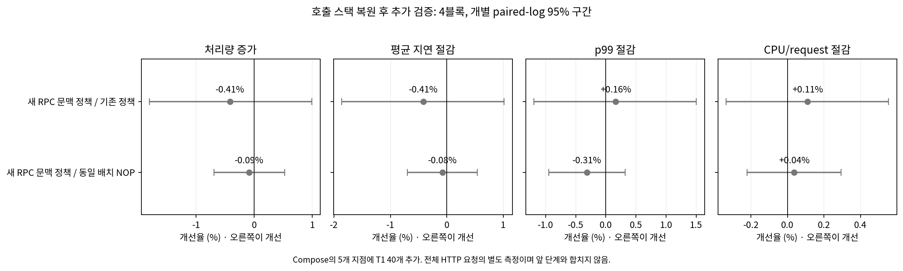
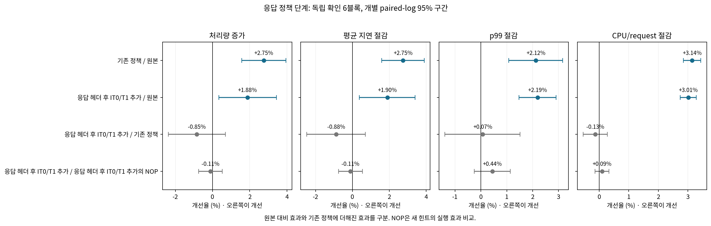
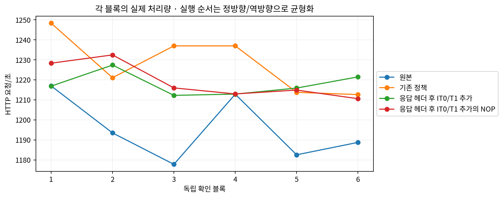
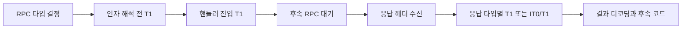
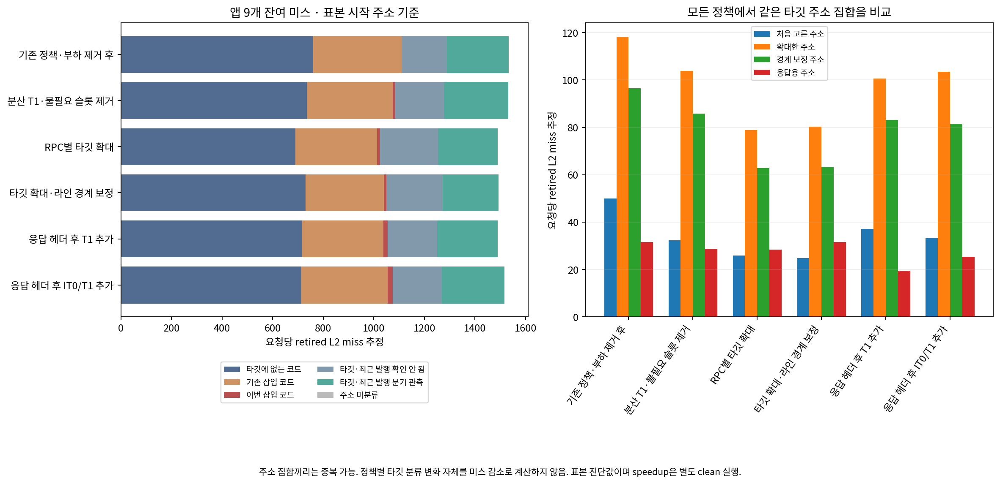
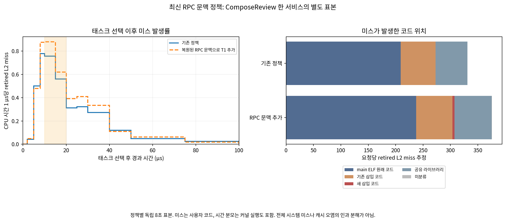
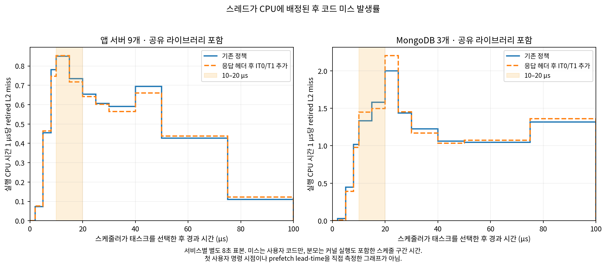
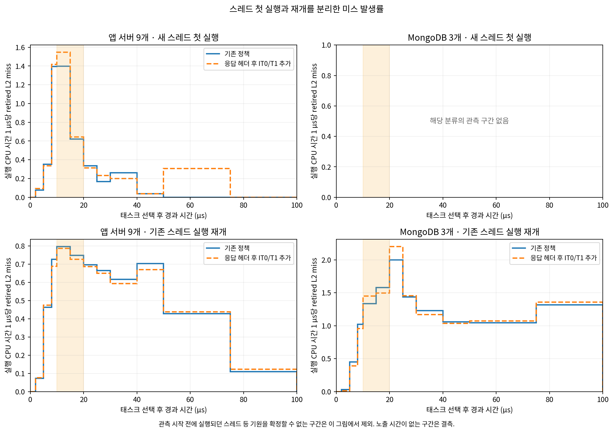

# RPC의 알려진 실행 단계를 이용한 코드 프리패치

2026-10-02 UTC 실험. Media compose-review 전체 HTTP 요청을 측정했다. 원본 대비 이득과 기존 정책에 더해진 이득을 따로 비교한다.

최신 추가 검증인 **복원된 RPC 문맥으로 T1 추가**의 처리량은 기존 정책 대비 **-0.41% [-1.80, +0.99]**, 같은 배치의 NOP 대비 **-0.09% [-0.69, +0.53]**다. 승격 기준을 충족하지 않아 기존 정책을 유지한다.

이 추가 검증에는 원본 실행이 없다. 아래 앞 단계의 원본 대비 효과와 곱하거나 합산하지 않는다.

## 호출 스택 복원 후 추가 정책 · 4블록 12회

| 정책 | RPS | 평균 ms | p99 ms | CPU µs/request | CPU util |
|---|---|---|---|---|---|
| 기존 정책 | 1222.27 | 3.2019 | 5.6561 | 5659.84 | 85.28% |
| 복원된 RPC 문맥으로 T1 추가 | 1217.15 | 3.2150 | 5.6468 | 5653.59 | 84.91% |
| 복원된 RPC 문맥으로 T1 추가의 NOP | 1218.20 | 3.2126 | 5.6293 | 5655.66 | 85.00% |

| 비교 | 처리량 증가 | 평균 절감 | p99 절감 | CPU/request 절감 |
|---|---|---|---|---|
| 복원된 RPC 문맥으로 T1 추가 / 기존 정책 | -0.41% [-1.80, +0.99] | -0.41% [-1.86, +1.02] | +0.16% [-1.19, +1.50] | +0.11% [-0.34, +0.55] |
| 복원된 RPC 문맥으로 T1 추가 / 복원된 RPC 문맥으로 T1 추가의 NOP | -0.09% [-0.69, +0.53] | -0.08% [-0.70, +0.54] | -0.31% [-0.95, +0.32] | +0.04% [-0.22, +0.29] |

ComposeReview 하나의 main ELF에만 T1 40개를 5개 발행 지점에 추가했다. 추가 명령은 317바이트이며 기존 힌트 642개는 바이트 단위로 보존했다. NOP은 새 40개만 끈다. 나머지 앱·MongoDB·공유 라이브러리 정책은 기존과 같다. 복원된 물리 호출 스택에서 RPC가 하나로 식별되고 최근 분기 기록만으로는 식별되지 않은 표본을 사용했다. 실제 handler 프레임이 첫 direct call 이후인 표본만 허용하고, 해당 타깃의 발행 분기가 이미 관측된 경우는 제외했다. RPC별 최소 10표본인 상위 8개 라인을 골라 handler의 첫 direct call에 발행한다. 스택 수집은 훈련 때만 하며 실제 요청 처리 중에는 호출 스택을 걷지 않는다. 훈련은 별도 과거 capture이며 이 12회 결과로 타깃을 바꾸지 않았다.

## 앞 단계: 응답 타입을 이용한 정책 · 독립 확인 6블록 24회

응답 정책 후보 **응답 헤더 후 IT0/T1 추가**의 처리량은 원본 대비 **+1.88% [+0.35, +3.44]**, 기존 정책 대비 **-0.85% [-2.38, +0.70]**다. 같은 코드 배치의 NOP 대비 변화는 **-0.11% [-0.75, +0.53]**다.

사전에 정한 추가 이득의 승격 기준을 충족하지 않아 기존 정책을 유지한다.

| 정책 | RPS | 평균 ms | p99 ms | CPU µs/request | CPU util |
|---|---|---|---|---|---|
| 원본 | 1195.41 | 3.2757 | 5.7895 | 5835.76 | 86.04% |
| 기존 정책 | 1228.32 | 3.1855 | 5.6667 | 5652.38 | 85.63% |
| 응답 헤더 후 IT0/T1 추가 | 1217.82 | 3.2133 | 5.6626 | 5659.88 | 85.05% |
| 응답 헤더 후 IT0/T1 추가의 NOP | 1219.23 | 3.2100 | 5.6878 | 5665.20 | 85.24% |

| 비교 | 처리량 증가 | 평균 절감 | p99 절감 | CPU/request 절감 |
|---|---|---|---|---|
| 기존 정책 / 원본 | +2.75% [+1.57, +3.95] | +2.75% [+1.59, +3.90] | +2.12% [+1.08, +3.16] | +3.14% [+2.85, +3.44] |
| 응답 헤더 후 IT0/T1 추가 / 원본 | +1.88% [+0.35, +3.44] | +1.90% [+0.37, +3.40] | +2.19% [+1.47, +2.90] | +3.01% [+2.74, +3.28] |
| 응답 헤더 후 IT0/T1 추가 / 기존 정책 | -0.85% [-2.38, +0.70] | -0.88% [-2.49, +0.71] | +0.07% [-1.39, +1.51] | -0.13% [-0.54, +0.28] |
| 응답 헤더 후 IT0/T1 추가 / 응답 헤더 후 IT0/T1 추가의 NOP | -0.11% [-0.75, +0.53] | -0.11% [-0.76, +0.54] | +0.44% [-0.25, +1.14] | +0.09% [-0.14, +0.33] |

표의 절대값은 산술평균, 개선율은 같은 블록의 로그 비율이다. 구간은 다중 비교 보정 없는 개별 paired-log t95다. 응답 정책 확인은 탐색과 별도의 6블록이며 단계별 결과를 합치지 않는다. 고정 closed-loop 동시성에서 처리량과 평균 지연은 서로 연관된다. 최대 처리량을 다시 찾는 부하 스윕 결과는 아니다.

## 무엇을 바꾸고 어떻게 구분했나

처음에는 RPC별 동일한 타깃 4개를 인자 해석 전, 핸들러의 첫 direct call, 두 단계 분산으로 각각 발행했다. 두 발행 stub과 8개 슬롯을 모두 유지하고 힌트/NOP 바이트만 바꿔 발행 시점과 코드 배치 효과를 구분했다. 이후 활성 힌트만 남긴 작은 구현, RPC별 최대 16개 타깃, 응답 헤더를 받은 뒤의 타입별 재발행, 응답 지점의 첫 2개를 IT0로 바꾼 구현을 비교했다.

응답 정책은 Thrift Client::recv_METHOD에서 readMessageBegin과 헤더 검사를 지난 presult.read 호출을 이용한다. 이미 알고 있는 RPC 메서드와 응답 처리 타입으로 주소를 고른다. 현재 요청의 미래 결과나 미실행 분기 결과를 사용하지 않는다. 응답 본문을 읽다가 추가로 기다릴 수 있으므로 이 지점이 모든 네트워크 대기 이후라고 가정하지 않는다.

각 정책의 타깃은 해당 성능 검증 전 별도 PEBS/LBR 훈련 자료에서 선택했다. 호출 스택 추가 정책은 아래 보정한 진단을 새 훈련 자료로 삼았다. 새 힌트는 9개 앱의 main ELF에만 추가했고 기존 MongoDB·DSO 정책은 유지했다. 커널이나 schedule-in hook은 바꾸지 않았다. 직접 호출 stub을 사용하므로 RPC 이름이나 간접 함수 포인터를 요청마다 검색하는 런타임 코드는 추가하지 않았다.

정적 검토에서 새 RPC 생성기가 명령의 시작 라인을 골랐고 기존 전체 경로 생성기는 경계에 걸친 명령의 다음 라인을 고려했다는 차이를 발견했다. 후속 성능 측정이 시작되기 전에 `wide_span`을 추가했다. 동일한 과거 훈련 자료에서 명령 길이를 디코딩하고, 경계에 걸친 경우 다음 명령의 라인으로 타깃을 재선정한다. RPC별 최대 16개·최소 표본 3개 규칙은 유지한다. 실제 선택 개수와 타깃도 달라지므로 wide와의 차이를 경계 처리 하나만의 효과로 단정하지 않는다.

응답 정책 NOP의 범위: 새 응답 힌트만 끄며 입력 RPC 힌트는 유지한다.

## 구현별 탐색 결과

### 동일 배치의 발행 시점 비교

| 정책 | RPS | 기존 대비 처리량 | 평균 ms | p99 ms | CPU µs/request |
|---|---|---|---|---|---|
| 기존 정책 | 1230.80 | 기준 | 3.1795 | 5.6424 | 5649.95 |
| 인자 해석 전 T1 | 1226.74 | -0.33% [-0.94, +0.28] | 3.1899 | 5.6389 | 5648.74 |
| 핸들러 진입 T1 | 1219.22 | -0.93% [-6.11, +4.54] | 3.2100 | 5.6882 | 5660.60 |
| 두 단계 분산 T1 | 1232.86 | +0.17% [-4.52, +5.10] | 3.1741 | 5.6702 | 5645.38 |
| 동일 배치 NOP | 1236.64 | +0.48% [-7.57, +9.22] | 3.1645 | 5.6578 | 5641.47 |

### 발행 시점 후보의 독립 확인

| 정책 | RPS | 기존 대비 처리량 | 평균 ms | p99 ms | CPU µs/request |
|---|---|---|---|---|---|
| 기존 정책 | 1226.70 | 기준 | 3.1902 | 5.6710 | 5658.64 |
| 두 단계 분산 T1 | 1219.52 | -0.57% [-2.58, +1.47] | 3.2089 | 5.6624 | 5659.82 |
| 원본 | 1177.22 | -4.02% [-6.14, -1.85] | 3.3265 | 5.7968 | 5855.08 |

### 외부 부하 제거 후 전체 후보 재탐색

| 정책 | RPS | 기존 대비 처리량 | 평균 ms | p99 ms | CPU µs/request |
|---|---|---|---|---|---|
| 기존 정책 | 1225.05 | 기준 | 3.1940 | 5.6673 | 5672.23 |
| 분산 T1·불필요 슬롯 제거 | 1231.40 | +0.51% [-1.50, +2.56] | 3.1775 | 5.6586 | 5649.89 |
| RPC별 타깃 확대 | 1225.80 | +0.05% [-2.06, +2.21] | 3.1927 | 5.6580 | 5652.68 |
| 타깃 확대·라인 경계 보정 | 1237.32 | +0.99% [-1.66, +3.72] | 3.1626 | 5.6707 | 5641.98 |
| 응답 헤더 후 T1 추가 | 1231.58 | +0.53% [-1.98, +3.10] | 3.1772 | 5.6694 | 5655.74 |
| 응답 헤더 후 IT0/T1 추가 | 1243.25 | +1.49% [+0.31, +2.68] | 3.1464 | 5.6468 | 5636.68 |

동일 배치 비교는 다음과 같다. 기존 정책과의 비교에는 추가 stub의 실행 비용도 포함되며, 아래 NOP 비교는 새 힌트의 효과를 분리한다.

| 동일 배치 비교 | 처리량 증가 | CPU/request 절감 |
|---|---|---|
| 인자 해석 전 T1 / 핸들러 진입 T1 | +0.61% [-4.18, +5.63] | +0.21% [-0.73, +1.14] |
| 인자 해석 전 T1 / 동일 배치 NOP | -0.80% [-8.25, +7.26] | -0.13% [-1.47, +1.19] |
| 핸들러 진입 T1 / 동일 배치 NOP | -1.40% [-4.34, +1.63] | -0.34% [-0.74, +0.05] |
| 두 단계 분산 T1 / 동일 배치 NOP | -0.30% [-5.18, +4.83] | -0.07% [-1.28, +1.13] |

후속 구현끼리의 비교도 별도로 남긴다. IT0/T1 대 T1은 응답 지점의 ModRM 18바이트만 다르다. 경계 보정 대 타깃 확대는 선택된 타깃 개수·주소도 달라져 경계 처리 하나만의 인과 효과가 아니다.

| 후속 구현 비교 | 처리량 증가 | CPU/request 절감 |
|---|---|---|
| 응답 헤더 후 IT0/T1 추가 / 응답 헤더 후 T1 추가 | +0.95% [-0.58, +2.50] | +0.34% [+0.07, +0.60] |
| 응답 헤더 후 T1 추가 / 분산 T1·불필요 슬롯 제거 | +0.02% [-3.73, +3.91] | -0.10% [-1.00, +0.79] |
| RPC별 타깃 확대 / 분산 T1·불필요 슬롯 제거 | -0.46% [-1.85, +0.96] | -0.05% [-0.38, +0.28] |
| 타깃 확대·라인 경계 보정 / RPC별 타깃 확대 | +0.94% [-2.76, +4.79] | +0.19% [-0.79, +1.15] |

| 구현 | 변경 ELF 수 | 해당 추가 단계의 정적 힌트 수 | 해당 추가 단계 코드 B |
|---|---|---|---|
| 분산 T1·불필요 슬롯 제거 | 9 | 52 | 715 |
| RPC별 타깃 확대 | 9 | 173 | 1441 |
| 타깃 확대·라인 경계 보정 | 9 | 196 | 1568 |
| 응답 헤더 후 T1 추가 | 6 | 43 | 370 |
| 응답 헤더 후 IT0/T1 추가 | 6 | 43 | 370 |

reply와 reply_it0는 lean 위에 응답 힌트를 추가한다. 정적 힌트 수는 요청당 실행 횟수가 아니다. 상세 patch·타깃·소스 해시는 보존했다.

## 남은 L2 미스

타깃 주소 집합을 고정한 비교다. 각 열은 모든 정책에서 똑같은 원래 코드 주소를 세며, 네 주소 집합은 서로 중복될 수 있다.

| 정책 | 처음 고른 주소 miss/request | 확대한 주소 miss/request | 경계 보정 주소 miss/request | 응답용 주소 miss/request |
|---|---|---|---|---|
| 기존 정책·부하 제거 후 | 50.03 | 118.31 | 96.58 | 31.66 |
| 분산 T1·불필요 슬롯 제거 | 32.33 | 103.89 | 85.85 | 28.77 |
| RPC별 타깃 확대 | 25.97 | 78.87 | 62.82 | 28.39 |
| 타깃 확대·라인 경계 보정 | 24.84 | 80.36 | 63.11 | 31.58 |
| 응답 헤더 후 T1 추가 | 37.06 | 100.69 | 83.21 | 19.44 |
| 응답 헤더 후 IT0/T1 추가 | 33.37 | 103.39 | 81.56 | 25.40 |

입력·응답 타깃 주소의 합집합에서 관측한 미스는 요청당 81.23 → 58.02다. 기존 정책의 전체 앱 표본에서 이 주소들이 차지한 비중은 5.30%다. 중복 주소를 한 번만 센 고정 주소 집합의 관측 비중이며, 동적 prefetch 성공률이나 성능 향상 상한은 아니다.

### 타깃 선택 전에 빠지는 범위

아래는 별도의 과거 훈련 자료에 적용한 선택 규칙이다. 이번 검증 미스 감소율이나 성능 상한이 아니다.

| 훈련 잔여 표본의 분류 | 비중 |
|---|---|
| main ELF 밖·새 타깃 범위에서 제외 | 37.97% |
| 두 발행 시점 비교를 위해 decoder/processor 제외 | 1.77% |
| 최근 32개 분기에서 RPC 문맥 미복원 | 43.89% |
| RPC 문맥에 연결됨 | 16.37% |

RPC 문맥에 연결된 표본 중에서도 전체의 4.97%는 기존 정책의 타깃 목록에 이미 있다는 이유로 입력 RPC 후보에서 제외했다. 정적으로 타깃에 있다는 것과 해당 요청에서 제때 발행됐다는 것은 다르다. 응답 힌트는 동일 발행 지점의 기존 타깃만 제외하며, 다른 지점에서 이미 타깃인 코드의 재발행은 허용한다. 문맥을 복원하지 못한 코드를 소프트웨어가 예측할 수 없는 코드라고 해석하지 않는다. 긴 공통 함수 경로와 비동기 작업은 더 긴 실행 문맥이 필요하다.

### ComposeReview 호출 스택으로 RPC 문맥을 더 복원할 수 있나

응답 정책 검증 뒤 기존 정책에서 별도의 8초 진단을 수행했다. 같은 L2 미스 표본에 최근 분기 기록과 8192바이트 사용자 스택의 DWARF unwind를 함께 수집했다. 이 추가 진단은 주기 257을 사용하며, 일반 L2 시간축 표본의 주기는 1021이다. 현재 살아 있는 handler/processor 프레임의 주소 범위로만 RPC를 붙인다. 첫 진단은 물리 프레임이 2개 이상 복원된 비율이 16.87%에 불과했고 main ELF 표본은 모두 1개에서 끊겼다.

**원인은 perf 6.8의 ELF 기준 주소 계산이었다.** libunwind 경로가 여러 mapping의 `start - pgoff` 중 최솟값을 쓴다. 삽입 코드의 PT_LOAD는 파일 오프셋이 가상주소보다 훨씬 커서 이 값이 실제 기준 주소보다 작아졌고 CFI 조회가 실패했다. [Linux perf 6.8 구현](https://raw.githubusercontent.com/torvalds/linux/v6.8/tools/perf/util/unwind-libunwind-local.c).

두 번째 진단의 **같은 14,411개 표본**을 두 방식으로 해석해 확인했다. 오프라인 전용 ELF 사본에서 파일 배치만 가상주소 기준으로 정규화하고 perf 기록의 해당 MMAP 파일 오프셋만 맞췄다. 코드·CFI·할당 섹션의 주소와 바이트, SAMPLE 기록, 표본 식별자와 leaf 주소의 동일성을 검사했다. 실행 프로그램이나 하드웨어 카운터를 바꾼 실험이 아니다. 이 문제는 새 DWARF 진단의 호출 스택 복원에 해당하며, 앞선 E2E 측정과 PT_LOAD별 주소를 처리하던 일반 PEBS 분석이 이 잘못된 기준 주소를 사용한 것은 아니다.

| 같은 표본의 위치 | 표본 수 | 2개 이상 물리 프레임·보정 전 | 보정 후 |
|---|---|---|---|
| main ELF 원래 코드 | 8910 | 0.00% | 98.57% |
| main ELF 삽입 코드 | 2909 | 0.00% | 100.00% |
| 공유 라이브러리 | 2592 | 98.26% | 98.26% |

전체의 2개 이상 물리 프레임 복원율은 **17.67% → 98.81%**, 스택에서 RPC 하나를 식별한 비율은 **14.78% → 62.14%**다. 아래는 보정 후 결과다. 분기 기록에서 놓쳤지만 스택으로 복원한 39.00%를 새 타깃 후보로 삼았다.

| 같은 표본의 RPC 문맥 비교 | 표본 수 | 전체 표본 내 비중 |
|---|---|---|
| 분기 기록·스택 모두 같은 RPC | 3321 | 23.04% |
| 스택에서만 RPC 하나 복원 | 5620 | 39.00% |
| 분기 기록에서만 RPC 하나 복원 | 436 | 3.03% |
| 양쪽 RPC가 다름 | 0 | 0.00% |
| 양쪽 문맥 중첩·복수 후보 | 34 | 0.24% |
| 스택만 복수 후보 | 0 | 0.00% |
| 분기 기록만 복수 후보 | 25 | 0.17% |
| 양쪽 모두 미복원 | 4975 | 34.52% |

프레임 출력 자체가 완전한 unwind를 보장하지는 않는다. 분기 기록에는 이미 끝난 호출도 남고, 스택에는 비동기 작업의 부모 RPC가 없을 수 있다. 따라서 서로 다른 라벨을 즉시 어느 한쪽의 오분류로 판정하지 않았다.

정적 stub 기록도 확인했다. 여러 원 호출 지점이 하나의 stub을 공유하는데 마지막 지점 하나로 귀속하면 RPC 종류를 잘못 붙일 수 있다. 이번 추가 진단은 가능한 원 호출 지점들을 모두 보존해 복수 RPC를 명시한다. 기존에 측정한 바이너리를 사후 변경하지 않았다.

추가 정책의 정적 힌트 40개는 서로 다른 코드 라인 19개를 가리킨다. 여러 RPC에서 같은 함수를 부르므로 RPC별 발행 위치가 다르다. 별도 훈련 표본에서 이 고정 라인의 비중은 시작 라인 기준 4.66%, 끝 라인 가정 기준 9.85%다. 훈련상 주소 비중이며 새 검증에서 줄어든 미스 비율이나 예측 정확도가 아니다. 타깃의 bounded symbol에는 ComposeReviewHandler::_ComposeAndUpload, future 결과 대기·정리, Jaeger 추적 문맥·vector, 로그 attribute, C++ stream 초기화가 있다. 모두 해당 main ELF에 포함된 코드이며 새 DSO 힌트는 추가하지 않았다.

### 복원된 RPC 문맥 정책의 새 미스 측정

이 표는 추가 성능 검증 뒤 ComposeReview 하나에서 각각 수집한 독립 PEBS 표본이다. 전체 앱이나 전체 시스템의 L2 미스 감소율이 아니다. 타깃 라인 집합은 두 정책에서 고정했으며 시작 라인과 명령 마지막 바이트의 라인 두 가정을 함께 남겼다.

| ComposeReview miss/request | 기존 정책 | 추가 정책 | 변화 |
|---|---|---|---|
| 전체·DSO 포함 | 330.93 | 375.52 | +13.47% |
| main ELF | 272.85 | 307.63 | +12.75% |
| 고정 타깃·시작 라인 | 15.45 | 8.90 | -42.41% |
| 고정 타깃·끝 라인 | 34.59 | 15.52 | -55.13% |

| ComposeReview 코드 위치 | 기존 miss/request | 추가 정책 miss/request |
|---|---|---|
| main ELF 원래 코드 | 209.03 | 237.64 |
| 기존 삽입 코드 | 63.82 | 65.90 |
| 새 삽입 코드 | 0.00 | 4.08 |
| 공유 라이브러리 | 57.99 | 67.62 |
| 미분류 | 0.09 | 0.27 |

코드 위치별 관측 변화이며 캐시 오염을 원인으로 확정하는 표는 아니다. 각 정책 1회의 perturbing 표본만으로 작은 변화의 재현성을 판단하지 않는다.

아래 전체 앱·MongoDB 진단표와 시간축 그래프는 앞 단계의 응답 정책 후보를 비교한 것이다. 추가 정책의 진단값과 합치지 않는다.

### 명령이 캐시라인 경계에 걸치는 경우

| 정책 | 경계 표본 비중 | 시작 라인 미타깃 | 끝 라인 가정 미타깃 | 발행 분기 관측·시작 라인 | 발행 분기 관측·끝 라인 | 길이 미분류 |
|---|---|---|---|---|---|---|
| 기존 정책·부하 제거 후 | 33.70% | 760.77 | 1002.89 | 244.69 | 10.76 | 0.02% |
| RPC별 타깃 확대 | 33.00% | 689.38 | 926.61 | 234.41 | 10.67 | 0.03% |
| 타깃 확대·라인 경계 보정 | 32.21% | 729.53 | 929.16 | 220.13 | 10.94 | 0.03% |
| 응답 헤더 후 IT0/T1 추가 | 33.78% | 712.74 | 962.52 | 247.90 | 10.51 | 0.03% |

비중 외의 수치는 miss/request다. 시작 라인에 대한 발행 분기가 있어도 경계를 넘어선 라인까지 가져왔다는 뜻은 아니다. 

표본 IP는 명령의 시작 주소다. 두 라인에 걸친 명령에서 어느 라인이 실제로 미스했는지는 이 이벤트만으로 확정할 수 없다. 따라서 시작 라인 분류와 마지막 바이트가 있는 라인으로 옮긴 민감도 분석을 함께 보존한다. 전체 L2 미스 수는 바뀌지 않는다. 아래 위치 표는 시작 주소 기준이며, 이 분류 변경을 실제 미스 감소로 계산하지 않는다.

### 앱 서버 9개 · 공유 라이브러리 포함

| 위치 | 기존 miss/request | 후보 miss/request | 후보 내 비중 |
|---|---|---|---|
| 타깃에 없는 코드 | 760.77 | 712.74 | 46.98% |
| 기존 삽입 코드 | 349.15 | 341.87 | 22.53% |
| 이번 삽입 코드 | 0.00 | 20.63 | 1.36% |
| 타깃·최근 발행 확인 안 됨 | 178.91 | 193.58 | 12.76% |
| 타깃·최근 발행 분기 관측 | 244.69 | 247.90 | 16.34% |
| 주소 미분류 | 0.37 | 0.45 | 0.03% |
| 전체 | 1533.89 | 1517.18 | 100% |

기존 정책 표본에서 관측한 서로 다른 서비스·이미지·시작 라인은 4,072개다. 가장 큰 1개 라인의 비중은 0.29%, 상위 100개 합은 14.05%다. 동일 주소의 발행 관측 여부 분류는 합쳤다. 표본의 분산 정도이며 전체 실행 footprint나 성능 상한은 아니다.

후보 표본 중 최근 taken branch의 타깃 뒤 64바이트 안에 잡힌 비중은 92.67%다. 실행되는 코드의 위치 관계이며 BTB miss 비율이 아니다.

표본 명령 자체가 분기인 비중은 13.70%, prefetch 명령인 비중은 21.46%, 명령 종류 미분류는 0.03%다. 분기 명령의 코드 fetch 미스와 분기 예측 실패는 다른 사건이다.

| 타깃 코드의 최근 발행 분기와 거리 | miss/request |
|---|---|
| 0_64 | 18.92 |
| 64_256 | 61.15 |
| 256_1024 | 128.07 |
| 1024_4096 | 39.76 |
| 4096_16384 | 0.00 |
| 16384_plus | 0.00 |
| unavailable_cycles | 0.00 |
| no_bounded_witness | 193.58 |

거리 숫자는 최근 retired branch들 사이의 유효한 cycle 필드 합계다. 단위는 cycles이며 prefetch와 fetch 사이의 실제 lead time이 아니다. 마지막 분기부터 표본까지의 간격과 prefetch부터 stub 끝 분기까지의 간격은 빠져 있고 fetch·retirement도 겹친다. cycle 필드가 없거나 포화된 경우, 최근 32분기에 발행 분기가 없는 경우를 따로 보존했다.

| 주요 잔여 위치 | 이미지 | 영역 | miss/request |
|---|---|---|---|
| `no_bounded_symbol` | libmemcached.so.11.0.0 | 기존 함수 | 19.43 |
| `no_bounded_symbol` | libc.so.6 | 기존 함수 | 11.86 |
| `no_bounded_symbol` | libmongoc-1.0.so.0.0.0 | 기존 함수 | 11.11 |
| `no_bounded_symbol` | libc.so.6 | 기존 함수 | 10.61 |
| `no_bounded_symbol` | libmongoc-1.0.so.0.0.0 | 기존 함수 | 10.43 |
| `no_bounded_symbol` | ComposeReviewService | 기존 함수 | 9.49 |
| `no_bounded_symbol` | libmemcached.so.11.0.0 | 삽입 코드 → 원 호출 함수 | 8.85 |
| `no_bounded_symbol` | libc.so.6 | 기존 함수 | 8.66 |
| `no_bounded_symbol` | UserReviewService | 기존 함수 | 7.82 |
| `no_bounded_symbol` | MovieReviewService | 기존 함수 | 7.72 |

심볼은 실제 표본 IP가 ELF 심볼 크기 범위에 포함될 때만 붙였다. 삽입 코드 표본은 patch 기록을 따라 원래 호출 지점의 함수로 연결했다. 같은 stub을 여러 호출 지점이 공유하면 특정 함수 하나로 추정하지 않았다. 긴 심볼의 원문은 전체 수치 JSON에 보존했다.

### MongoDB 3개 · 공유 라이브러리 포함

| 위치 | 기존 miss/request | 후보 miss/request | 후보 내 비중 |
|---|---|---|---|
| 타깃에 없는 코드 | 462.17 | 442.00 | 48.91% |
| 기존 삽입 코드 | 293.08 | 308.79 | 34.17% |
| 이번 삽입 코드 | 0.00 | 0.00 | 0.00% |
| 타깃·최근 발행 확인 안 됨 | 76.77 | 73.33 | 8.11% |
| 타깃·최근 발행 분기 관측 | 72.09 | 78.98 | 8.74% |
| 주소 미분류 | 0.45 | 0.56 | 0.06% |
| 전체 | 904.56 | 903.65 | 100% |

기존 정책 표본에서 관측한 서로 다른 서비스·이미지·시작 라인은 3,077개다. 가장 큰 1개 라인의 비중은 0.32%, 상위 100개 합은 17.98%다. 동일 주소의 발행 관측 여부 분류는 합쳤다. 표본의 분산 정도이며 전체 실행 footprint나 성능 상한은 아니다.

후보 표본 중 최근 taken branch의 타깃 뒤 64바이트 안에 잡힌 비중은 91.76%다. 실행되는 코드의 위치 관계이며 BTB miss 비율이 아니다.

표본 명령 자체가 분기인 비중은 12.16%, prefetch 명령인 비중은 32.36%, 명령 종류 미분류는 0.06%다. 분기 명령의 코드 fetch 미스와 분기 예측 실패는 다른 사건이다.

| 타깃 코드의 최근 발행 분기와 거리 | miss/request |
|---|---|
| 0_64 | 2.60 |
| 64_256 | 16.50 |
| 256_1024 | 51.45 |
| 1024_4096 | 8.43 |
| 4096_16384 | 0.00 |
| 16384_plus | 0.00 |
| unavailable_cycles | 0.00 |
| no_bounded_witness | 73.33 |

거리 숫자는 최근 retired branch들 사이의 유효한 cycle 필드 합계다. 단위는 cycles이며 prefetch와 fetch 사이의 실제 lead time이 아니다. 마지막 분기부터 표본까지의 간격과 prefetch부터 stub 끝 분기까지의 간격은 빠져 있고 fetch·retirement도 겹친다. cycle 필드가 없거나 포화된 경우, 최근 32분기에 발행 분기가 없는 경우를 따로 보존했다.

| 주요 잔여 위치 | 이미지 | 영역 | miss/request |
|---|---|---|---|
| `mongo::CurOp::CurOp(mongo::OperationContext*, mongo::CurOp::CurOpStack*)` | mongod | 기존 함수 | 5.84 |
| `mongo::ServiceEntryPointCommon::handleRequest(mongo::OperationContext*, mongo::Message const&, mongo::Servi…` | mongod | 삽입 코드 → 원 호출 함수 | 4.82 |
| `mongo::CurOp::CurOp(mongo::OperationContext*, mongo::CurOp::CurOpStack*)` | mongod | 기존 함수 | 4.63 |
| `no_bounded_symbol` | libc-2.27.so | 기존 함수 | 4.26 |
| `mongo::PlanEnumerator::prepMemo(mongo::MatchExpression*, mongo::PlanEnumerator::PrepMemoContext)` | mongod | 삽입 코드 → 원 호출 함수 | 4.26 |
| `mongo::CurOp::CurOp(mongo::OperationContext*, mongo::CurOp::CurOpStack*)` | mongod | 기존 함수 | 4.08 |
| `no_bounded_symbol` | libc-2.27.so | 기존 함수 | 4.07 |
| `mongo::(anonymous namespace)::receivedCommands(mongo::OperationContext*, mongo::Message const&, mongo::Serv…` | mongod | 기존 함수 | 3.61 |
| `mongo::rpc::TrackingMetadata::readFromMetadata(mongo::BSONElement const&)` | mongod | 기존 함수 | 3.34 |
| `mongo::(anonymous namespace)::computeSortsForScan(mongo::IndexEntry const&, int, mongo::IndexBounds const&,…` | mongod | 기존 함수 | 3.33 |

심볼은 실제 표본 IP가 ELF 심볼 크기 범위에 포함될 때만 붙였다. 삽입 코드 표본은 patch 기록을 따라 원래 호출 지점의 함수로 연결했다. 같은 stub을 여러 호출 지점이 공유하면 특정 함수 하나로 추정하지 않았다. 긴 심볼의 원문은 전체 수치 JSON에 보존했다.

위 표는 retired L2 miss PEBS 표본의 위치 분류다. 삽입 코드 내부 미스도 실제 코드 fetch의 일부이지만, 그 숫자를 prefetch가 새로 유발한 미스 수로 해석하지 않는다. LBR에 stub 실행 분기가 있으면 발행 경로 실행의 증거가 되지만 하드웨어의 prefetch 수용·완료를 뜻하지 않는다. 최근 32분기에 발행이 없다는 것만으로 미발행을 확정하지 않는다.

시간 그래프는 각 구간의 스케줄된 CPU 시간으로 나눈 발생률이다. 구간 길이가 다른 원시 표본 수를 직접 비교하지 않았다. 분모에는 커널 실행 구간도 포함되지만 PMU 미스 표본은 사용자 코드에서만 수집한다. 시간 0은 스케줄러의 태스크 선택 시점이며 첫 사용자 명령 실행 시점이 아니다. 서비스별 8초 표본 1회이므로 작은 차이는 기술적 관측값이다.

시간별 발생률 그래프와 별도로, 각 구간에 속한 요청당 미스 수를 비교한다. 아래 변화율은 감소가 음수다. 각 서비스의 별도 표본 창을 요청 수로 정규화한 추정값이다.

| 프로그램 | 태스크 선택 후 µs | 기존 miss/request | 후보 miss/request | 변화 |
|---|---|---|---|---|
| 앱 서버 9개 | 0–5 | 19.90 | 21.29 | +6.96% |
| 앱 서버 9개 | 5–10 | 251.79 | 249.77 | -0.80% |
| 앱 서버 9개 | 10–20 | 559.43 | 556.40 | -0.54% |
| 앱 서버 9개 | 20–50 | 588.29 | 570.82 | -2.97% |
| 앱 서버 9개 | 50 이상 | 114.48 | 118.91 | +3.87% |
| MongoDB 3개 | 0–5 | 0.54 | 0.19 | -65.62% |
| MongoDB 3개 | 5–10 | 20.95 | 18.72 | -10.61% |
| MongoDB 3개 | 10–20 | 85.22 | 83.60 | -1.90% |
| MongoDB 3개 | 20–50 | 201.82 | 199.83 | -0.99% |
| MongoDB 3개 | 50 이상 | 596.03 | 601.31 | +0.89% |

### 대기를 사이에 둔 CPU 이동

| 서비스 | 기존 CPU 이동 비율 | 후보 CPU 이동 비율 | 기존 실행 구간 중앙값 µs | 기존 비실행 구간 중앙값 µs |
|---|---|---|---|---|
| 앱 compose | 43.05% | 41.76% | 23.84 | 73.60 |
| 앱 movie | 48.00% | 46.14% | 30.53 | 238.13 |
| 앱 moviereview | 49.06% | 49.84% | 23.67 | 159.33 |
| 앱 rating | 48.06% | 48.29% | 23.00 | 152.08 |
| 앱 storage | 55.26% | 53.95% | 42.92 | 548.26 |
| 앱 text | 51.95% | 52.38% | 32.03 | 556.08 |
| 앱 unique | 49.32% | 49.54% | 31.67 | 547.24 |
| 앱 user | 50.49% | 48.97% | 29.88 | 268.54 |
| 앱 userreview | 48.92% | 48.96% | 23.75 | 159.13 |
| MongoDB mongo_movie | 39.72% | 42.34% | 197.03 | 114.30 |
| MongoDB mongo_storage | 46.73% | 49.64% | 139.73 | 710.42 |
| MongoDB mongo_user | 39.83% | 42.58% | 197.44 | 117.85 |

CPU 이동 비율의 분모는 이전 switch-out CPU를 확인할 수 있는 실행 재개 횟수다. 미스 표본의 비율이 아니다. 대기 전에 한 CPU에서 발행한 프리패치와 다른 CPU에서의 후속 실행을 같게 취급할 수 없다는 근거지만, 이 기록만으로 특정 미스의 원인이 CPU 이동이라고 확정하지 않는다. 응답 헤더 뒤에도 본문 읽기가 다시 대기할 수 있어, 응답 지점 이동의 효과에는 lead-time과 대기 위치가 함께 관여할 수 있다.

## 별도 PMU 진단

아래는 기존 정책과 최종 후보의 별도 진단이다. 성능 표에는 PMU·PEBS 실행의 처리량을 섞지 않았다. 각 서비스·이벤트 창을 같은 창의 HTTP 완료 수로 정규화한 후 합산했다. 서비스별·이벤트별 진단 1회이므로 작은 차이의 반복 일관성은 검증하지 않았다.

품질 기준으로 제외한 PMU 시도 1회는 별도 보존했다. Top-down 합계 오차의 기존 2% 기준을 유지하고, 같은 seed·이벤트·순서·측정 코드로 새 스택에서 해당 진단 전체를 다시 실행했다. 제외된 시도의 부분 카운터는 평균에 넣지 않았고 clean 성능 회차는 반복하지 않았다.

| 제외 시도 | 합계 오차 |
|---|---|
| full_core | 2.778% |

### 앱 서버 9개 · 사용자 코드와 공유 라이브러리

| 지표 | 기존 | 후보 | 변화 |
|---|---|---|---|
| L2 code-read miss/request | 46,541.71 | 47,068.72 | +1.13% |
| L2 code-read lookups/request | 113,813.20 | 112,765.40 | -0.92% |
| L2 code-read miss % | 40.89 | 41.74 | +0.85%p |
| I-cache stall cycles/period | 12.94 | 13.16 | +1.65% |
| Retired L2 miss/request | 1,743.23 | 1,763.04 | +1.14% |
| Retired L1I miss/request | 20,839.75 | 20,883.61 | +0.21% |
| I-cache stall cycles/request | 437,519.51 | 442,003.96 | +1.02% |
| I-cache stall periods/request | 33,801.39 | 33,592.84 | -0.62% |
| ITLB walk active cycles/request | 175,378.70 | 180,420.41 | +2.87% |
| ITLB STLB hits/request | 4,169.00 | 4,203.45 | +0.83% |
| ITLB walks completed/request | 2,879.81 | 2,849.56 | -1.05% |
| Instructions/request (cache 창) | 1,209,840.62 | 1,210,174.81 | +0.03% |
| T1/T2 executed/request | 40,403.90 | 40,578.34 | +0.43% |
| NTA/T0/T1/T2 L2 misses/request | 3,723.40 | 3,820.99 | +2.62% |
| NTA/T0/T1/T2 L2 hits/request | 35,981.38 | 36,029.31 | +0.13% |
| Late IT-prefetch retired tags/request | 0.00 | 0.03 | — |
| DSB uops/request | 550,566.98 | 547,369.56 | -0.58% |
| MITE uops/request | 1,130,869.73 | 1,131,362.05 | +0.04% |
| L2 code-read MPKI | 38.47 | 38.89 | +1.10% |
| Retired L2 MPKI | 1.44 | 1.46 | +1.11% |
| Retired L1I MPKI | 17.31 | 17.28 | -0.18% |
| Frontend-bound % | 73.99 | 74.21 | +0.22%p |
| Fetch-latency-bound % | 64.31 | 64.62 | +0.30%p |
| Frontend-bound slots/request | 10,585,165.60 | 10,623,569.22 | +0.36% |
| Fetch-latency-bound slots/request | 9,200,446.40 | 9,249,481.49 | +0.53% |
| Backend-bound slots/request | 1,177,159.90 | 1,185,870.06 | +0.74% |
| Backend-bound % | 8.23 | 8.28 | +0.06%p |
| Unknown-branch cycles % | 38.54 | 38.75 | +0.20%p |
| Recovery cycles % | 3.73 | 3.75 | +0.01%p |
| Clear-resteer cycles % | 17.25 | 17.22 | -0.03%p |

### MongoDB 3개 · 사용자 코드와 공유 라이브러리

| 지표 | 기존 | 후보 | 변화 |
|---|---|---|---|
| L2 code-read miss/request | 53,271.97 | 54,212.28 | +1.77% |
| L2 code-read lookups/request | 100,048.73 | 100,936.32 | +0.89% |
| L2 code-read miss % | 53.25 | 53.71 | +0.46%p |
| I-cache stall cycles/period | 13.16 | 13.35 | +1.51% |
| Retired L2 miss/request | 1,058.69 | 1,106.28 | +4.50% |
| Retired L1I miss/request | 16,566.29 | 16,550.23 | -0.10% |
| I-cache stall cycles/request | 395,126.18 | 402,852.50 | +1.96% |
| I-cache stall periods/request | 30,036.08 | 30,166.49 | +0.43% |
| ITLB walk active cycles/request | 76,979.97 | 73,382.83 | -4.67% |
| ITLB STLB hits/request | 4,966.21 | 5,010.64 | +0.89% |
| ITLB walks completed/request | 1,318.30 | 1,420.18 | +7.73% |
| Instructions/request (cache 창) | 1,443,053.50 | 1,983,082.12 | +37.42% |
| T1/T2 executed/request | 32,237.54 | 34,930.79 | +8.35% |
| NTA/T0/T1/T2 L2 misses/request | 5,613.66 | 5,725.93 | +2.00% |
| NTA/T0/T1/T2 L2 hits/request | 25,622.49 | 28,158.95 | +9.90% |
| Late IT-prefetch retired tags/request | 0.00 | 0.00 | — |
| DSB uops/request | 1,778,187.33 | 907,062.63 | -48.99% |
| MITE uops/request | 1,100,663.13 | 1,072,457.26 | -2.56% |
| L2 code-read MPKI | 36.92 | 27.34 | -25.95% |
| Retired L2 MPKI | 0.73 | 0.56 | -23.96% |
| Retired L1I MPKI | 11.03 | 10.54 | -4.47% |
| Frontend-bound % | 67.09 | 65.34 | -1.74%p |
| Fetch-latency-bound % | 57.65 | 56.23 | -1.42%p |
| Frontend-bound slots/request | 7,860,040.70 | 7,965,038.98 | +1.34% |
| Fetch-latency-bound slots/request | 6,754,594.30 | 6,854,564.07 | +1.48% |
| Backend-bound slots/request | 1,094,334.01 | 1,231,588.32 | +12.54% |
| Backend-bound % | 9.34 | 10.10 | +0.76%p |
| Unknown-branch cycles % | 28.72 | 32.14 | +3.42%p |
| Recovery cycles % | 4.08 | 4.27 | +0.19%p |
| Clear-resteer cycles % | 15.98 | 16.89 | +0.91%p |

### 전체 요청에서의 CPU 시간

| 정책 | 앱 9개 user µs | 앱 9개 kernel µs | Mongo 3개 user µs | Mongo 3개 kernel µs | 나머지 µs |
|---|---|---|---|---|---|
| 원본 | 1432.01 | 1642.68 | 1124.61 | 117.45 | 1519.01 |
| 기존 정책 | 1371.56 | 1647.83 | 984.75 | 120.40 | 1527.84 |
| 응답 헤더 후 IT0/T1 추가 | 1376.43 | 1649.45 | 983.88 | 119.32 | 1530.79 |

모두 요청당 clean 실행의 cgroup CPU 회계다. 사용자 코드의 frontend 슬롯 비율을 전체 요청 시간 비율로 곱하지 않는다. 여러 서비스가 병렬로 실행되므로 CPU 합계의 비중도 요청 지연의 비중이나 speedup 상한이 아니다.

Raw L2 code-read miss와 retired L2 miss는 서로 다른 이벤트 집합이다. 둘의 차를 잘못 예측한 경로의 미스 수로 환산하지 않는다. Frontend/backend는 슬롯 비율이며 전체 요청 지연의 비율이 아니다. Unknown-branch와 분기 직후 표본도 BTB miss 점유율을 직접 측정하지 않는다. 스톨 지표끼리는 중첩되므로 합산하지 않는다. LATE_SWPF는 PREFETCHIT에 관한 이벤트이며 일반 T1 데이터 힌트의 지연 지표로 쓰지 않는다. SWPF HIT/MISS는 fill buffer가 가득 차지 않은 경우의 NTA/T0/T1/T2 요청 카운트이며 IT0 수용·완료 횟수로 쓰지 않는다. [Intel Granite Rapids 이벤트 정의](https://perfmon-events.intel.com/platforms/graniterapids/core-events/core/).

## 해석과 다음 수정의 근거

**현재 유지할 정책은 기존 `full`이다.** 응답 타입 정책은 탐색에서 기존 대비 +1.49%였지만 별도의 6블록에서 −0.85%로 재현되지 않았다. 호출 스택 복원 후의 추가 정책도 4블록에서 −0.41% [−1.80, +0.99]였고, 같은 배치 NOP 대비 −0.09% [−0.69, +0.53]였다. 추가 이득을 확인하지 못했으며, 유의한 악화를 입증한 결과도 아니다. 기존 정책의 원본 대비 +2.75% [1.57, 3.95], 평균 지연 −2.75%, p99 −2.12%, CPU/request −3.14%는 앞 단계의 별도 비교다. 종전 약 2%와의 차이를 새 RPC 정책의 이득으로 더하지 않는다. 10% 목표에는 도달하지 못했다.

**확인한 문제는 예측 가능한 코드가 타깃 선정에서 빠졌다는 점이다.** 과거 훈련의 43.89%는 최근 32개 분기만으로 RPC 문맥을 복원하지 못했다. 추가 DWARF 진단에서는 perf의 ELF 기준 주소 계산 문제까지 발견했다. 같은 표본의 오프라인 해석을 바로잡아 2개 이상 물리 프레임 복원율을 17.67%에서 98.81%로, 스택 기반 단일 RPC 식별을 14.78%에서 62.14%로 높였다. 이는 분석 품질 개선이며 성능 향상이 아니다. 이 결과로 실제 뒤에 실행된 RPC별 타깃을 골라 T1 40개·317바이트를 추가했고, 새 12회 E2E 검증까지 수행했다.

앞 단계의 입력·응답 타깃 합집합에서는 미스가 81.23 → 58.02/request로 **28.57% 감소**했다. 그러나 이 주소들은 기존 전체 앱 표본의 **5.30%**였고, 나머지 주소에서는 합계 약 6.50/request가 늘어 전체 PEBS 감소는 **1.09%**에 그쳤다. 별도 perf-stat의 앱 retired L2 miss/request는 오히려 **1.14% 증가**했다. 따라서 특정 주소의 개선을 전체 코드 미스의 확실한 감소로 확대 해석하지 않는다. 두 진단은 독립 창이며 PEBS 요청수의 시간 경계에도 근사 오차가 있다.

최신 RPC 문맥 정책은 ComposeReview의 고정 타깃 미스를 시작 라인 기준 **42.41%**, 끝 라인 가정 기준 **55.13%** 줄였다. 그러나 해당 서비스 전체 미스는 **330.93 → 375.52/request, +13.47%**였다. 전체 증가 44.59/request 중 새 삽입 코드는 +4.08, 원래 앱 코드는 +28.61, 공유 라이브러리는 +9.63, 기존 삽입 코드는 +2.08이었다. 새 stub 자체의 미스는 증가분의 약 9.16%에 해당한다. 따라서 직접 추가한 코드의 미스만으로 전체 증가를 설명할 수 없다. 타깃 밖 증가와 간접적인 캐시 영향 등을 다음 검증에서 구분해야 하며, 정책별 단일 표본만으로 캐시 오염을 원인으로 확정하지 않는다. 스레드 이동 비율은 두 표본에서 41.75%와 41.60%였다.

**현재 결과로 backend가 이득을 가렸다고 단정하기 어렵다.** 앱 PMU의 frontend 슬롯 비율은 약 74%, backend는 약 8%였다. 반대로 초기 lead-time 부족 하나가 원인이라는 증거도 충분하지 않다. 동일 배치의 인자 해석 전/handler 진입/분산 발행 비교에서 뚜렷한 E2E 개선을 확인하지 못했다. 응답 헤더 뒤에도 본문을 기다리며 다시 잠들 수 있고, 알려진 재개 구간의 약 43–55%에서 앱 스레드가 다른 CPU로 이동했다. 이 비율은 미스의 원인별 비중이 아니며, 최근 retired 분기의 cycle 합도 실제 prefetch-to-fetch 시간은 아니다.

남은 코드 미스는 미타깃 코드, 기존 삽입 코드, 공유 라이브러리, 타깃이지만 최근 발행을 확인하지 못한 코드에 분산돼 있다. 시작 주소 기준 기존 앱 미스의 약 49.60%가 미타깃이며, 경계에 걸친 명령을 끝 라인으로 해석하면 약 65.38%다. 실제로 어느 라인이 미스했는지는 표본 IP만으로 확정할 수 없다. 경계 보정 정책도 별도로 구현·측정했지만 유의한 처리량 이득은 확인하지 못했다. 명령 표본이나 unknown-branch 지표를 BTB/TLB 원인별 미스 비중으로 바꿔 세지 않는다.

MongoDB에서는 MPKI가 약 26% 낮아졌지만 요청당 명령 수가 약 37% 늘었고 raw L2 code-read miss/request는 약 1.8% 늘었다. FE 비율 하락과 달리 FE 슬롯/request도 약 1.34% 늘었다. 분모가 달라진 수치를 prefetch 개선으로 해석하지 않는다. 이번 후속 정책은 MongoDB를 변경하지 않았다.

다음 수정의 우선순위는 무조건 힌트 수를 늘리는 것보다 **복원된 RPC 문맥으로 타깃을 넓히되, 마지막 대기 이후 실행 CPU에서 재발행할 위치를 구분하는 것**이다. RPC 타입은 긴 공통 함수 경로를 예측하는 데 쓸 수 있고, 응답 본문 처리 완료는 다음 단계가 정해지는 별도 발행 후보다. 이번에는 전자의 문맥 복원과 handler 진입 발행, 앞 단계에서는 응답 헤더 뒤 발행까지 검증했다. 본문 처리 완료 뒤 발행이나 실행 CPU 이동을 반영한 재발행의 이득은 아직 측정하지 않았으므로 성능 주장에 포함하지 않는다. 보존된 ComposeReview 소스에는 다섯 입력이 모였음을 나타내는 `counter_value == NUM_COMPONENTS`일 때만 `_ComposeAndUpload`와 후속 future 작업으로 들어가는 조건도 있다. 따라서 RPC 이름뿐 아니라 이 완료 상태를 이용해 무거운 후속 경로의 발행을 제한하는 후보가 있다. 이번 정책은 handler 첫 호출에서 발행했으며 이 상태 조건을 사용한 정책은 아직 검증하지 않았다.

## 측정과 보존

서버 CPU32–39, 부하 CPU16–19, 제어 CPU84–85, 2GHz, balanced C4 지속 연결, tracing100%, 매회 새 스택·데이터, 50초 warmup·60초 clean ROI다. MovieId를 포함한 compose-review 경로를 평가했으며 다른 Media API 전체를 검증한 것은 아니다. 타이밍 탐색 후 구조를 확장한 각 정책은 해당 실행 전에 기록했다. 응답 정책 후보는 커버리지 탐색에서 고정하고 독립 확인 결과로 재선택하지 않았다. 추가 호출 스택 진단의 주소 계산 문제를 확인·보정한 뒤 한 개의 후속 정책을 별도 사전 규칙으로 고정해 12회 더 측정했다. 기존 측정에 추가 확인 결과를 합치지 않았다. 유효 실행은 성능에 따라 제외하거나 재시도하지 않았다. 외부 부하가 발생한 단계는 전부 별도 보존하고 전체 후보를 새 단계에서 다시 측정했다.

경계 보정판 추가를 위해 후속 코디네이터만 기능 검사 사이에서 교체했다. 진행 중이던 wide 기능 검사는 정상 종료와 설정 복원을 기다렸으며, 완료된 lean·lean NOP·wide 검사는 보존하고 반복하지 않았다. 이때 커버리지 성능 측정은 아직 시작하지 않았다. 수정된 탐색은 6개 정책×4블록이며, 최종 독립 확인 4개 정책×6블록은 유지했다. 교체 전 코디네이터 로그와 변경 사유를 모두 보존했다.

### 외부 부하와 재측정

후속 탐색 중 다른 작업으로 서버 밖 CPU가 거의 100% 사용되고 클라이언트 CPU도 포화됐다. 사용자 지시에 따라 외부 계산 작업과 재실행 배치를 종료했다. 진행 중인 실험 회차는 정상 종료·설정 복원까지 기다렸다. 기존 탐색의 완료된 19회는 외부 부하 및 전환 조건의 보조 자료로 모두 보존했다. 후보 선택에는 사용하지 않았으며, 여섯 정책 모두 새 seed로 4블록을 다시 수행했다. 최종 확인은 별도 6블록이다.

초기 split PEBS 9개는 외부 부하와 겹친다. 앞서 언급한 특정 타깃 미스 41% 감소는 같은 조건의 인과 비교로 사용할 수 없어 철회한다. 초기 full·early·late·NOP 표본과 이 split 표본을 묶어 감소율을 계산하지 않는다. 최종 앱 그래프는 새 full_quiet 표본과 같은 외부 부하 제거 조건의 후보 표본만 비교한다. 관측 조건 분류는 사후 환경 주석이며 사전 성능 제외 규칙이 아니다. 최초 탐색 일부에는 관측 기록이 부족해 조용했다고 단정하지 않는다.

| 단계 | 관측 조건 | 회차 수 |
|---|---|---|
| screen | incomplete_observation | 7 |
| screen | observed_quiet | 8 |
| confirmation | observed_quiet | 15 |
| coverage_screen | co_loaded | 18 |
| coverage_screen | observed_quiet | 1 |
| quiet_coverage_screen | observed_quiet | 24 |
| production_confirmation | observed_quiet | 24 |

screen: 기존 정책 RPS 변동계수 1.78%.

confirmation: 원본 RPS 변동계수 0.26%, 기존 정책 RPS 변동계수 1.99%.

quiet_coverage_screen: 기존 정책 RPS 변동계수 0.42%.

production_confirmation: 원본 RPS 변동계수 1.34%, 기존 정책 RPS 변동계수 1.19%.

호출 스택 후속 검증의 관측 조건도 같은 사후 정의로 따로 남긴다. 성능에 따른 제외나 재시도에 쓰지 않았다.

| 후속 검증 관측 조건 | 회차 수 |
|---|---|
| observed_quiet | 12 |

후속 검증: 기존 정책 RPS 변동계수 0.97%, 복원된 RPC 문맥으로 T1 추가 RPS 변동계수 0.25%, 복원된 RPC 문맥으로 T1 추가의 NOP RPS 변동계수 0.20%.

단계별 불필요 ELF·임시 object·decoded trace를 수치·명령·소스·patch·해시 보존 후 정리했다. 현재 실행에 필요한 원본·기존 정책·유효 후보만 유지하고 입력 자료와 공유 의존성은 보존했다. NAS I/O는 사용하지 않았다. 최종 감사는 CPU 설정의 정확한 복원, 소유 실험 컨테이너·네트워크·볼륨 정리, 오류 없는 요청과 매핑 유지, trace 품질을 검사한다.

완료된 주 측정은 E2E 90회, 기능 검사 15회, 일반 PEBS capture 107개다. 별도 외부 부하·전환 조건의 E2E 19회, 호출 스택 진단 2개도 보존했다. PMU 진단은 유효 4회이며, top-down 검증에서 거부된 1회는 부분 결과와 제외 사유를 보존했다.

저장소의 파일당 10MiB 제한에 따라 전체 압축 기록은 `/storage/prefetchit/class_b_rpc_predict_20261002/compact_records.tar.gz`에 로컬 보존한다. Git에는 구현·수치·그래프·설정 복원 감사와 모든 압축 기록의 SHA-256 목록을 저장한다. 압축 파일의 위치·크기·해시는 evidence의 manifest.json에 있다.

[전체 수치](../llvm_prefetchit/migration/evidence/class_b_rpc_predict_20261002/report.json), [최종 결정](../llvm_prefetchit/migration/evidence/class_b_rpc_predict_20261002/final_decision.json), [설정 복원 감사](../llvm_prefetchit/migration/evidence/class_b_rpc_predict_20261002/final_restoration_audit.json), [압축 기록 목록](../llvm_prefetchit/migration/evidence/class_b_rpc_predict_20261002/records_manifest.json).
