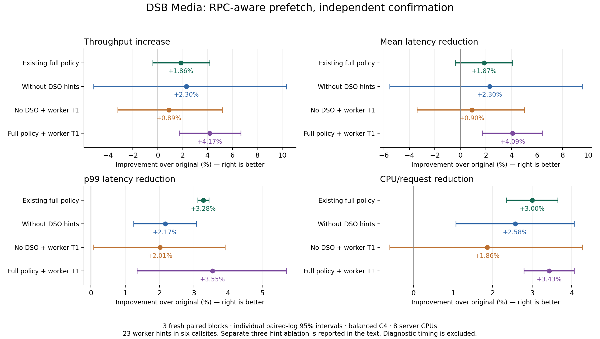
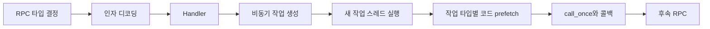

# RPC 타입·실행 단계·비동기 작업을 활용한 프리패치

2026-10-01 후속 캠페인. 오전 확인 실험 중단 후 호스트 재부팅을 확인했고, 사용자의 재개 요청에 따라 같은 후보로 새 독립 확인을 수행했다. 전체 Media compose-review 처리량·평균·p99·CPU/request를 기준으로 평가했다. 아래 독립 확인값은 두 탐색 단계와 별도로 얻었다.

기존 정책에 RPC 작업 스레드 힌트를 결합한 버전의 처리량 변화는 원본 대비 **+4.17% [+1.72, +6.67]**, 기존 정책 대비 **+2.27% [-1.93, +6.65]**다. DSO 제거판에 같은 힌트를 더한 변화는 DSO 제거 대조군 대비 **-1.38% [-5.26, +2.67]**다.

기존 정책을 넘는 RPC 추가 이득은 확정되지 않아 기존 정책을 유지한다.

별도 두 블록의 동일 배치 비교에서 23-hint / NOP 처리량 차이는 +0.08% [-22.16, +28.67], 3개를 제거한 20-hint / 기존 정책 차이는 +0.76% [-7.02, +9.19]였다. 이 확인도 기존 정책을 넘는 추가 이득을 확정하지 못했다.

| 정책 | RPS | 평균 ms | p99 ms | CPU µs/request | CPU util |
|---|---:|---:|---:|---:|---:|
| 원본 | 1191.71 | 3.2856 | 5.8146 | 5838.38 | 85.82% |
| 기존 DSO 포함 | 1213.83 | 3.2242 | 5.6239 | 5663.19 | 84.82% |
| DSO 제거 | 1219.21 | 3.2105 | 5.6887 | 5688.03 | 85.43% |
| DSO 제거 + 작업 스레드 T1 | 1202.32 | 3.2559 | 5.6974 | 5729.78 | 84.98% |
| 기존 정책 + 작업 스레드 T1 | 1241.49 | 3.1514 | 5.6083 | 5638.28 | 86.30% |

원본 대비 처리량 증가의 최대 점추정은 +4.17%다. 10% 목표에는 도달하지 못했다.

표는 산술평균, 아래 변화율은 같은 블록의 로그 비율이다. 양수는 개선, 음수는 악화다. 구간은 다중 비교 보정 없는 개별 paired-log t95다. 3회 반복이면 작은 차이의 불확실성이 크다.

| 비교 | 처리량 증가 | 평균 지연 절감 | p99 절감 | CPU/request 절감 |
|---|---:|---:|---:|---:|
| 기존 DSO 포함 / 원본 | +1.86% [-0.41, +4.18] | +1.87% [-0.40, +4.08] | +3.28% [+3.12, +3.44] | +3.00% [+2.35, +3.65] |
| DSO 제거 / 원본 | +2.30% [-5.16, +10.34] | +2.30% [-5.54, +9.55] | +2.17% [+1.25, +3.08] | +2.58% [+1.07, +4.06] |
| DSO 제거 + 작업 스레드 T1 / 원본 | +0.89% [-3.23, +5.18] | +0.90% [-3.39, +5.02] | +2.01% [+0.08, +3.91] | +1.86% [-0.60, +4.27] |
| 기존 정책 + 작업 스레드 T1 / 원본 | +4.17% [+1.72, +6.67] | +4.09% [+1.71, +6.42] | +3.55% [+1.34, +5.70] | +3.43% [+2.79, +4.06] |
| DSO 제거 + 작업 스레드 T1 / DSO 제거 | -1.38% [-5.26, +2.67] | -1.42% [-5.66, +2.64] | -0.16% [-2.22, +1.87] | -0.73% [-3.04, +1.53] |
| 기존 정책 + 작업 스레드 T1 / 기존 DSO 포함 | +2.27% [-1.93, +6.65] | +2.27% [-2.03, +6.38] | +0.28% [-1.99, +2.49] | +0.44% [-0.70, +1.57] |
| 기존 정책 + 작업 스레드 T1 / DSO 제거 + 작업 스레드 T1 | +3.25% [-3.29, +10.23] | +3.22% [-3.49, +9.49] | +1.56% [+1.00, +2.12] | +1.59% [-1.19, +4.30] |

독립 확인 원본 RPS의 변동계수는 1.09%, 범위는 1177.89–1203.59다. 탐색의 가장 빠른 실행 하나를 최종 speedup으로 사용하지 않았다.

## RPC에서 무엇을 이용했나

Thrift RPC 타입이 정해진 decoder 호출, 실제 handler의 첫 direct call, 그리고 타입이 고정된 `std::async` 작업의 `_M_run` 첫 direct call을 후보로 삼았다. 이전 전체 정책의 잔여 L2 PEBS와 최근 32개 분기 LBR에서 RPC/handler/작업 타입을 식별해 main ELF의 다음 코드 라인을 골랐다. 이번에는 handler 입구 두 라인을 의무적으로 넣지 않고 미스가 관측된 내부 경로를 우선했다.

본 확인 후보는 MovieId·ComposeReview·Rating의 6개 호출 지점에 힌트 23개, 코드 220바이트를 추가한다. 부모 스레드에만 발행하던 방식과 달리 실제 작업 스레드 안에서 타입별 후속 코드를 가져온다. 발행 후 CPU migration을 금지하거나 정확한 fetch lead-time을 측정한 것은 아니다. 이미 선택된 코드 타입과 별도 과거 trace를 사용하며, 현재 요청의 미래 결과를 읽거나 handler를 미리 실행하지 않는다.

| 탐색 정책 | 추가 지점 | 추가 힌트 | 추가 코드 B | 내용 |
|---|---:|---:|---:|---|
| `rpc_route` | 13 | 95 | 770 | RPC별 decoder 직전에 후속 경로 타깃 발행 |
| `rpc_worker` | 6 | 23 | 220 | 실제 typed async worker의 첫 direct call 직전에 T1 |
| `rpc_staged` | 31 | 137 | 1343 | decoder·handler·작업 스레드에 나눠 발행 |
| `rpc_worker_it0` | 6 | 23 | 220 | 같은 위치·주소·분기를 유지하고 새 worker 힌트만 IT0 |
| `full_rpc_worker` | 6 | 23 | 220 | 선택한 worker 힌트를 기존 DSO 포함 정책에 결합 |

모든 이전 힌트와 원래 명령 주소를 그대로 보존하는 두 번째 stub 삽입이다. worker의 기존 local 힌트까지 합해 지점당 최대 8개다. IT0 비교는 추가 힌트의 ModRM 23바이트만 바뀐 것을 검사했다. 커널이나 schedule-in hook을 바꾸지 않았고 새 DSO 타깃도 추가하지 않았다. 결합판은 이미 확인된 기존 DSO·MongoDB 정책을 유지한다.

훈련 잔여 표본과의 정적 주소 겹침은 route 6.88%, worker 2.08%, staged 8.78%였다. 이 값은 이번 타깃 선택에 사용한 훈련 자료의 수치다. 실제 미스 감소율이나 독립 검증 커버리지, 속도 향상 상한으로 해석하지 않는다. 기존 handler 입구 위주 정책의 1.81%와는 선택 규칙도 다르다.

## 두 탐색 단계

각 단계에서 같은 seed 블록끼리 비교하며 서로 다른 단계의 값을 합산하지 않는다. 첫 단계의 worker 처리량 +1.61%는 두 번째 단계에서 재현되지 않았다. 두 번째 단계에서는 no-DSO 대조군이 앞섰으며, T1은 결합 실험의 확인 대상으로 고정했을 뿐 성능 향상이 확인된 정책으로 승격하지 않았다.

| 단계 | 정책 | RPS | 평균 ms | p99 ms | CPU µs/request |
|---|---|---:|---:|---:|---:|
| screen | no_dso | 1201.35 | 3.2593 | 5.7666 | 5728.71 |
| screen | rpc_route | 1207.22 | 3.2441 | 5.7330 | 5762.06 |
| screen | rpc_worker | 1220.81 | 3.2061 | 5.7609 | 5716.24 |
| screen | rpc_staged | 1203.35 | 3.2534 | 5.6973 | 5726.10 |
| screen2 | no_dso | 1234.70 | 3.1691 | 5.7157 | 5696.11 |
| screen2 | rpc_worker | 1216.66 | 3.2176 | 5.7325 | 5721.78 |
| screen2 | rpc_worker_it0 | 1204.96 | 3.2486 | 5.7095 | 5722.57 |

잔여 훈련 표본을 RPC 문맥에 연결하는 단계에서도 커버리지가 제한됐다. decoder·handler·worker 중 하나로 분류된 비중은 20.50%였다. 최근 32개 분기에서 문맥을 찾는 방식으로는 긴 공통 함수 경로의 RPC 타입을 모두 복원하지 못한다. 아래는 요청 수로 정규화한 훈련 표본 분포이며 실제 raw L2 miss의 원인 분해가 아니다.

| 훈련 표본 영역 | 비중 |
|---|---:|
| main ELF 밖 | 37.97% |
| 원본 ELF에서 명령어로 해석되지 않은 주소 | 12.71% |
| main ELF이지만 RPC 문맥 미분류 | 28.81% |
| RPC decoder 문맥 | 4.98% |
| handler 문맥 | 10.13% |
| typed worker 문맥 | 5.39% |

원본 명령어로 해석되지 않은 주소의 실제 위치는 추가 주소 감사로 확인했다. 이 분류와 최종 타깃의 2.08% 주소 겹침은 타깃 선정 범위가 좁다는 증거이며, BTB miss 비중이나 속도 개선 상한은 아니다.

추가 주소 범위 감사에서는 훈련 표본의 12.71%가 기존 정책이 생성한 prefetch stub 안에 있었다. 그중 prefetch 명령 IP에 잡힌 비중은 전체의 11.22%다. 기존 stub의 코드 fetch도 잔여 표본에 포함됨을 확인했으며, 이를 target prefetch가 유발한 miss 수나 동등한 성능 손실로 환산하지 않는다. 원본 압축 trace를 읽어 patch 기록의 정확한 stub 범위와 비교했고 별도 decoded trace는 생성하지 않았다.

## 이번 추가가 겨냥한 CPU 비용

Clean E2E 실행의 cgroup CPU 회계다. 변경한 세 앱의 사용자 시간에는 프리패치로 줄일 수 없는 명령 실행도 포함된다. 커널 시간에는 해당 프로세스가 실행한 커널 코드가 포함되며, 아래 비중을 latency 개선 상한으로 해석하지 않는다.

| 정책 | 세 앱 사용자 µs/request | 세 앱 커널 µs/request | 세 앱 사용자 / 전체 CPU |
|---|---:|---:|---:|
| 원본 | 627.52 | 1141.51 | 10.75% |
| 기존 DSO 포함 | 602.48 | 1149.88 | 10.64% |
| 기존 정책 + 작업 스레드 T1 | 599.70 | 1143.45 | 10.64% |

## Prefetch 자체의 PMU 효과

결합판과 새 23개 힌트만 NOP으로 바꾼 동일 배치 대조군을 별도로 측정했다. 이 PMU 실행의 처리량·지연은 위 speedup 계산에서 제외한다. 아래는 실제 바꾼 앱 서버 3개(MovieId·ComposeReview·Rating)의 사용자 코드 합계이며, 앱 서버 전체 9개나 MongoDB의 합계가 아니다. 서비스·이벤트별 3초 창의 HTTP 완료 수로 정규화했다. 정책당 진단 1회이므로 작은 PMU 차이는 반복 일관성이 검증된 값이 아니다.

| 요청당 이벤트 | RPC NOP | RPC prefetch | 변화 |
|---|---:|---:|---:|
| L2 code-read miss | 20,249.39 | 20,284.30 | +0.17% |
| Retired L2 code miss | 810.74 | 811.22 | +0.06% |
| Retired L1I miss | 9,664.05 | 9,739.85 | +0.78% |
| I-cache data stall cycles | 198,039.76 | 201,338.37 | +1.67% |
| ITLB page-walk active cycles | 81,733.72 | 88,093.89 | +7.78% |
| DTLB load walk 완료 | 2,213.60 | 2,214.25 | +0.03% |
| DTLB store walk 완료 | 142.16 | 143.61 | +1.02% |
| T1/T2 실행 | 18,899.10 | 18,873.76 | -0.13% |
| Software-prefetch L2 miss | 1,598.77 | 1,596.17 | -0.16% |
| Software-prefetch L2 hit | 16,866.61 | 16,845.49 | -0.13% |
| L1D fill-buffer full | 369.27 | 372.59 | +0.90% |
| Frontend-bound slots | 4,435,584.99 | 4,476,664.04 | +0.93% |
| Frontend-bound slots % | 72.55 | 73.14 | +0.59%p |
| Backend-bound slots % | 10.04 | 10.02 | -0.02%p |

새 힌트를 켰을 때 raw L2 code-read miss는 +0.17%, retired L2 이벤트는 +0.06% 변했다. 이 진단에서 새 RPC 타깃이 미스를 크게 줄였다고 해석할 근거는 없다. 선정된 worker 타깃과 훈련 잔여 표본의 주소 겹침 자체가 2.08%로 좁았고, 추가 23개 중 3개는 발행 지점과 같은 캐시 라인이었다. 타깃 선정의 제한은 확인했지만, 정확한 hint-to-fetch 시간과 하드웨어 수용 여부는 측정하지 않았다.

수정한 세 앱의 사용자 slot 비중은 frontend 73.14%, backend 10.02%다. 이 둘을 전체 요청 시간 비중으로 바꾸거나 남은 frontend 비용을 전부 BTB miss로 분류하지 않는다. 앞의 원본 대비 E2E 이득과 새 힌트 자체의 효과는 별도 비교이며, 아래 동일 배치 NOP의 clean E2E 결과로 후자를 추가 점검했다.

Raw L2 code-read와 retired L2 miss는 다른 이벤트다. I-cache stall 표는 cycle 수이며 발생 구간 수가 아니다. T1/T2 실행은 speculative 카운트이며 기존 데이터 프리패치도 포함한다. L1D fill-buffer 지표는 instruction fetch queue의 점유율이 아니다. DTLB walk 전체를 software-prefetch 탓으로 분류하지 않는다. Frontend/backend 비율은 사용자 slot 비율이며 요청 지연 비중이 아니다. 이 자료만으로 fetch queue가 비었는지, 정확한 hint-to-fetch 시간, BTB miss 비율을 판정하지 않는다.

## 측정·보존

Clean E2E 37회, 별도 PMU 2회, 전체 스택 smoke 6회를 완료했다. MovieId 포함 Media compose-review 전체 HTTP 요청, balanced C4 지속 연결, 서버 CPU32–39의 8개 CPU, 2GHz, tracing100%, 매번 새 스택·데이터와 50초 warmup·60초 ROI다. 최대 처리량을 다시 찾는 부하 스윕이나 다른 Media API 검증은 아니다. 고정 closed-loop 동시성의 처리량과 평균 지연은 연관되므로 독립 증거 두 개로 세지 않는다.

공유 호스트의 다른 작업은 건드리지 않았다. 측정 중 빌드나 무거운 분석을 겹치지 않았다. 유효한 실행을 성능에 따라 제외·재시도하거나 확인값을 보고 RPC 구현을 다시 선택하지 않았다. 기존 native 테스트 28개를 통과한 stub writer의 소스 해시가 동일함을 확인했고, 이번 ELF별 기존 힌트 보존·타깃 경계·정확한 IT0 byte 변경 및 전체 요청 기능을 검증했다.

단계별 탈락 정책은 수치·명령·소스·patch·해시·사유를 보존한 뒤 생성 ELF를 제거했다. 최종 설정 복원과 실험 컨테이너·네트워크·볼륨 제거를 감사했다. 원본 입력과 공유 의존성은 유지했고 NAS I/O는 없었다.

[전체 수치](../llvm_prefetchit/migration/evidence/class_b_rpc_route_20261001/report.json), [최종 결정](../llvm_prefetchit/migration/evidence/class_b_rpc_route_20261001/final_decision.json), [복원 감사](../llvm_prefetchit/migration/evidence/class_b_rpc_route_20261001/final_restoration_audit.json), [검증된 기록 목록](../llvm_prefetchit/migration/evidence/class_b_rpc_route_20261001/records_manifest.json). 압축 기록의 모든 구성 파일을 SHA-256으로 검증했다.

구현: [RPC/worker 타깃 선정](../llvm_prefetchit/scripts/class_b/rpc_route_study.py), [기존 정책 결합·진단](../llvm_prefetchit/scripts/class_b/rpc_route_followup.py), [독립 검증](../llvm_prefetchit/scripts/class_b/rpc_route_finish.py).

## 중단과 재개 기록

오전 독립 확인은 8회가 완료되고 9번째 실행 중 중단됐다. 중단된 실행의 시작보다 뒤인 호스트 boot 시간을 확인했다. 완료 8회의 원자료·설정·해시는 보존하고 중단된 확인 묶음 전체를 최종 확인 통계에서 제외했다. 성능값에 따라 재시도 대상을 고르지 않았으며, 고정한 5개 후보와 3개 블록 순서를 유지해 재부팅 후 15회를 새 seed로 실행했다. 재개 전 생성된 실험 컨테이너와 임시 DB 볼륨을 제거했고, 원본 입력은 유지했다.

정상 완료된 실행은 설정 복원을 검증했다. 재부팅으로 끊긴 실행은 정상적인 MSR/sysfs 복원을 했다고 주장하지 않는다. 재개 후 실행은 새 부팅 상태를 각각 기록하고 그 상태로 복원했다. 따라서 clean E2E 집계 37회 외에, 통계에서 제외한 중단 전 완료 8회와 미완료 1회의 기록이 별도로 남아 있다.

[재개·정리 기록](../llvm_prefetchit/migration/evidence/class_b_rpc_route_20261001/resumption.json), [재개 구현](../llvm_prefetchit/scripts/class_b/rpc_route_resume.py).

## 이미 실행한 캐시 라인 힌트 3개 제거

별도 정적 점검에서 MovieId의 2개, Rating의 1개 추가 힌트가 원래 발행 callsite와 같은 64바이트 라인을 가리켰다. 기존 검증 도중 코드나 후보를 바꾸지 않고, 그 검증과 PMU 종료 후 3개만 같은 길이 NOP으로 바꾼 20-hint 버전을 만들었다. 다른 바이트·주소·분기·CFI·기존 힌트는 모두 같음을 검사하고 smoke 후 새 두 블록 8회로 비교했다. 이는 발행 제거 효과를 분리하는 실험이며 파일 크기나 코드 배치를 줄인 실험은 아니다.

향후 타깃 생성기에서도 발행 라인을 제외하도록 수정했다. 이 20-hint 측정에서는 차순위 타깃을 채우지 않고 기존 목록의 3개만 제거했다.

| 정책 | RPS | 평균 ms | p99 ms | CPU µs/request |
|---|---:|---:|---:|---:|
| 기존 정책 | 1234.80 | 3.1692 | 5.6727 | 5644.99 |
| 작업 힌트 23개 | 1214.13 | 3.2244 | 5.6803 | 5707.45 |
| 새 힌트만 모두 NOP | 1212.99 | 3.2259 | 5.6800 | 5665.96 |
| 작업 힌트 20개 | 1244.10 | 3.1438 | 5.6516 | 5631.92 |

| 20-hint 비교 | 처리량 증가 | 평균 지연 절감 | p99 절감 | CPU/request 절감 |
|---|---:|---:|---:|---:|
| 기존 정책 대비 | +0.76% [-7.02, +9.19] | +0.79% [-7.74, +8.65] | +0.37% [-2.11, +2.79] | +0.23% [-0.74, +1.19] |
| 23-hint 대비 | +2.48% [-9.99, +16.69] | +2.49% [-11.37, +14.62] | +0.51% [-16.96, +15.36] | +1.32% [-11.56, +12.71] |
| 새 힌트 전부 NOP 대비 | +2.56% [-9.17, +15.81] | +2.55% [-10.26, +13.88] | +0.50% [-8.12, +8.43] | +0.60% [-2.83, +3.91] |

23-hint / NOP의 clean 처리량 증가는 +0.08% [-22.16, +28.67]다. NOP 대조군도 기존 프리패치는 그대로 유지하며, 새 힌트만 끈다. 추가 stub과 주소 배치가 같으므로 이 비교로 새 prefetch 자체의 효과를 분리한다.

위 PMU 표는 23-hint 버전의 결과다. 20-hint의 PMU 감소율로 인용하지 않는다. 두 블록 비교는 앞의 세 블록과 합산하지 않으며, 개별 95% 구간과 사전 기록한 승격 규칙을 적용했다. 20-hint의 추가 이득도 승격 규칙을 충족하지 않아 기존 결정을 유지한다.

[같은 라인 제거 기록](../llvm_prefetchit/migration/evidence/class_b_rpc_route_20261001/same_line_encoding_validation.json), [구현](../llvm_prefetchit/scripts/class_b/rpc_route_prune.py).
