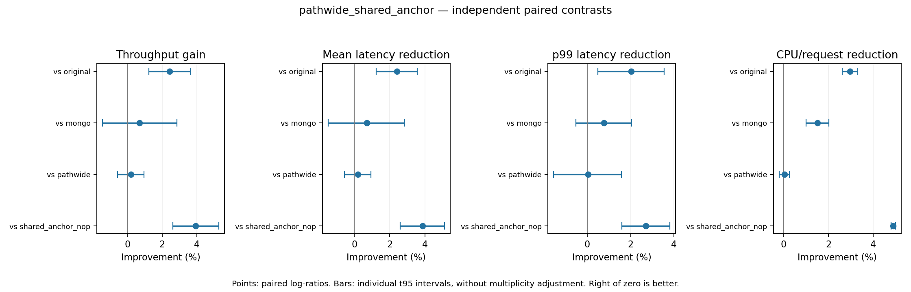
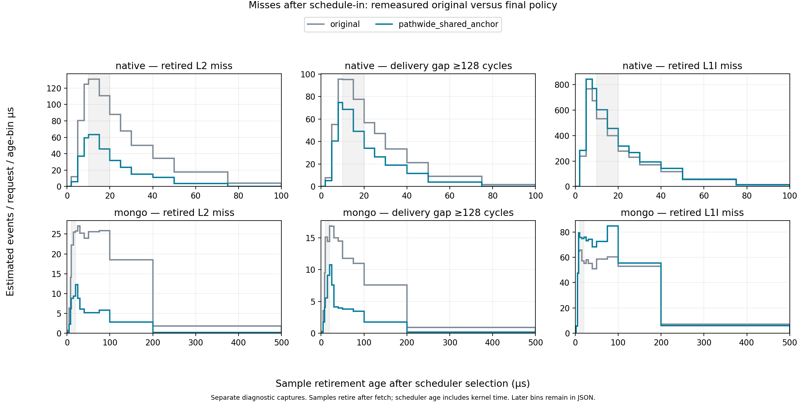
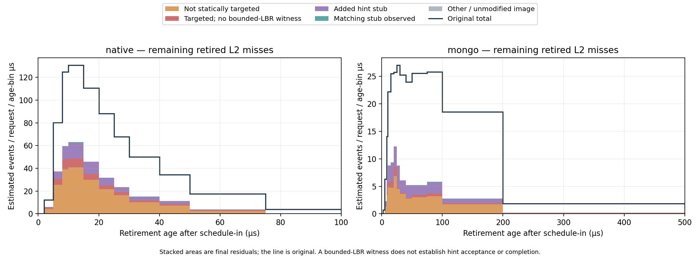
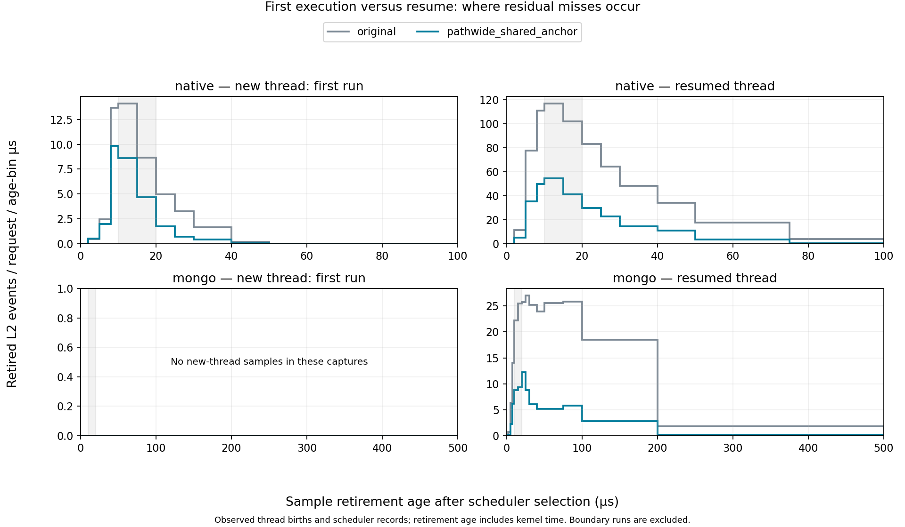
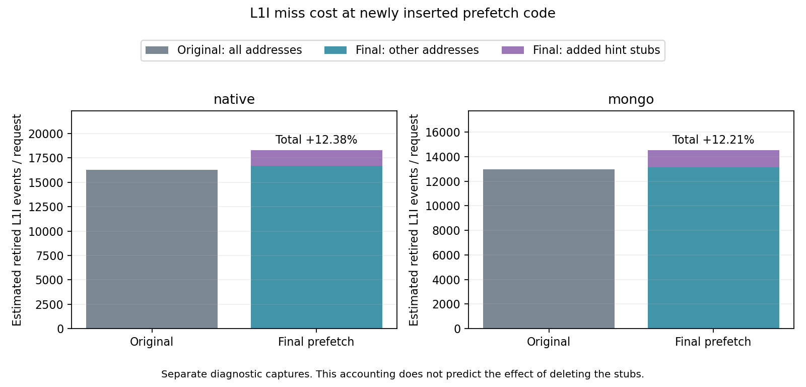

# DSB Media: schedule-in 이후 코드 미스와 전체 요청 성능

2026-10-01, 01:52–08:52 UTC의 7시간 캠페인. 최종 정책은 `pathwide_shared_anchor`다. 원본 대비 독립 재검증 처리량 변화는 **+2.42%** (개별 paired-log 95% CI +1.23–+3.63%, 5쌍), 평균 지연 절감은 **+2.40%**, p99 절감은 **+2.03%**, 전체 CPU/request 절감은 **+2.96%**다. 지연·CPU 절감이 음수이면 악화다.

이 운영점의 개별 처리량 대비에서 95% 구간 하한도 0보다 높다.

10% 처리량 향상 목표에는 도달하지 못했다.

초기 탐색의 `pathwide`는 원본 대비 +5.50%였지만 3쌍의 탐색값이다. 최종 성능 주장은 위의 새 5쌍 확인값을 사용한다. 서로 다른 시드·측정 시점의 차이를 하나의 원인으로 단정하거나 두 단계를 합산하지 않았다.

MongoDB만 기존 split75로 최적화한 `mongo` 기준 대비 추가 처리량 변화는 +0.70% (95% CI -1.42–+2.86%)다. 이 비교에는 앱·라이브러리 변경과 MongoDB의 추가 타깃이 함께 포함된다. 공유 GOT 개선 자체의 `pathwide` 대비 변화는 +0.20% (95% CI -0.56–+0.96%)다. 두 추가 대비는 원본 대비 전체 변경의 이득과 구분한다.

최종 원본 5회 RPS의 변동계수는 0.98%, 범위는 1163.97–1188.19다. 탐색과 확인을 합쳐 65개의 새 스택 실행을 완료했으며, 서로 다른 탐색 단계의 성능 수치는 합치지 않았다.

## 무엇을 바꿨나

실행 trace의 이전 호출과 실제 코드 미스 주소를 연결하고, 정적 direct-call/CFG 분석으로 삽입 가능한 경로를 확인했다. 최종 18개 ELF에 호출 지점 2,504개, 힌트 명령 7,152개를 사용한다. 원본에 덧붙인 코드 합계는 86,905바이트다. 이는 서비스별 메모리 사용량이나 전체 프로세스 크기가 아니라 수정한 ELF별 추가 코드의 합계다.

같은 요청을 처리하는 앱 서버 9개, 공유 라이브러리 8종, MongoDB 실행 파일을 함께 최적화했다. MovieId도 포함했다. 아래 모든 E2E 수치는 compose-review 전체 요청을 잰 결과다.

| 단계 | 정책 | 반복/정책 | RPS | 평균 지연 ms | p99 ms | CPU µs/request |
|---|---|---:|---:|---:|---:|---:|
| screen1 | `original` | 3 | 1172.09 | 3.3421 | 5.8070 | 5901.44 |
| screen1 | `mongo` | 3 | 1216.12 | 3.2193 | 5.7896 | 5760.98 |
| screen1 | `combined` | 3 | 1198.89 | 3.2664 | 5.7547 | 5789.12 |
| screen1 | `path64` | 3 | 1209.89 | 3.2357 | 5.7568 | 5687.60 |
| screen1 | `path512` | 3 | 1215.20 | 3.2216 | 5.7249 | 5706.21 |
| screen1 | `pathwide` | 3 | 1236.61 | 3.1642 | 5.7512 | 5661.60 |
| screen2 | `original` | 2 | 1196.29 | 3.2733 | 6.0499 | 5862.97 |
| screen2 | `pathwide` | 2 | 1222.91 | 3.2001 | 5.8707 | 5678.14 |
| screen2 | `pathwide_aligned` | 2 | 1219.37 | 3.2091 | 5.9348 | 5701.01 |
| screen2 | `pathwide_neighbor` | 2 | 1220.79 | 3.2063 | 5.9350 | 5680.40 |
| screen2 | `pathwide_shared_anchor` | 2 | 1242.41 | 3.1487 | 5.9131 | 5680.10 |
| screen2 | `pathwide_native_it0` | 2 | 1220.28 | 3.2067 | 5.9950 | 5775.30 |
| screen2 | `pathwide_compact` | 2 | 1208.24 | 3.2389 | 5.8638 | 5691.65 |
| screen2 | `pathwide_compact16` | 2 | 1205.54 | 3.2469 | 5.9330 | 5692.13 |
| screen3 | `pathwide_shared_anchor` | 3 | 1221.77 | 3.2036 | 5.9024 | 5687.63 |
| screen3 | `pathwide_repair` | 3 | 1210.35 | 3.2341 | 5.9101 | 5704.72 |

`pathwide`는 넓은 trace 경로를 이용한다. `aligned`는 stub의 캐시라인 배치, `neighbor`는 인접 라인 1개 추가, `shared_anchor`는 DSO 주소 계산용 GOT load 공유, `native_it0`는 앱/라이브러리의 RIP-relative T1을 IT0으로 교체, `compact`·`compact16`은 호출 지점 감소를 시험했다. `repair`는 공유 GOT 방식을 유지하면서 잔여 미스의 다른 호출 경로에 힌트 347개를 추가했다. 이 보강은 호출 지점 수를 늘리지 않았다.

탐색 단계에서는 미리 정한 CPU·p99 제한 안에서 처리량이 높은 정책을 선택했다. 선택 이후의 확인 실험으로 다시 승자를 고르지 않았다. 실패·탈락 결과도 모두 보존했다.

## 시간에 따른 미스와 남은 위치

10–20µs가 모든 서비스의 동일한 최적 구간은 아니었다. 앱의 짧은 실행 구간과 MongoDB의 긴 실행 구간을 나눴고, 초반뿐 아니라 이후 호출 경로에서도 힌트를 발행했다. 아래 잔여 미스 그래프는 타깃 밖 코드, 대응 힌트가 최근 LBR에 보이지 않는 코드, 삽입한 stub 자체, 대응 힌트가 보이는 코드를 구분한다.

앱에 남은 retired L2 miss 표본 중 66.30%는 정적 타깃 밖 라인, 20.79%는 새 hint stub 코드, 11.85%는 타깃이지만 최근 32개 분기에 대응 hint stub이 보이지 않는 경우다. 대응 stub을 실제로 거친 흔적이 있는 경우는 0.68%다.

대상 라인과 무관하게 어떤 hint stub이든 최근에 거친 표본은 93.95%다. 최근 힌트 발행의 흔적과 이번에 필요한 라인에 대한 힌트 발행은 다르다.

MongoDB에 남은 retired L2 miss 표본 중 58.70%는 정적 타깃 밖 라인, 32.81%는 새 hint stub 코드, 7.04%는 타깃이지만 최근 32개 분기에 대응 hint stub이 보이지 않는 경우다. 대응 stub을 실제로 거친 흔적이 있는 경우는 1.40%다.

대상 라인과 무관하게 어떤 hint stub이든 최근에 거친 표본은 88.25%다. 최근 힌트 발행의 흔적과 이번에 필요한 라인에 대한 힌트 발행은 다르다.

이 분류에서 타깃 밖 비중이 높으면 다른 경로·주소의 커버리지를, stub 비중이 높으면 추가 실행 코드 자체의 비용을 먼저 다뤄야 한다. 단, 이 비중은 이미 크게 줄어든 잔여 집합의 구성이다. 대응 힌트가 보이는 표본도 늦은 발행·이후 축출·주소 변환 문제 중 어느 하나로 확정할 수 없다.

스케줄 인을 전부 같은 상황으로 다루지 않기 위해, 새 스레드의 첫 실행과 기존 스레드의 재실행도 나눴다. MovieId·ComposeReview 소스는 요청 경로에서 여러 `std::async(std::launch::async, ...)`를 사용하며, 실제 FORK·스케줄 기록에서도 짧게 실행하는 새 스레드가 관찰된다. 이 구분은 초반 미스와 커널 CPU 비중을 해석하는 데 도움이 되지만, 스레드 생성이 커널 CPU의 얼마를 차지하는지 직접 측정한 것은 아니다.

[서비스별 L2 시간 그래프](figures/class_b_temporal_20261001_matched_miss_age_per_request.png)와 [실제 schedule 시간으로 정규화한 그래프](figures/class_b_temporal_20261001_matched_miss_age_exposure.png), [L1I](figures/class_b_temporal_20261001_matched_l1_age_per_request.png), [128-cycle 이상 delivery gap](figures/class_b_temporal_20261001_matched_lat128_age_per_request.png)도 함께 보존했다.

retired L2 true-miss 태그는 해당 미스를 겪은 retired 명령을 센다. L2 code-read miss는 speculative instruction-fetch 요청도 포함하는 별도 이벤트다. 하나의 감소율을 다른 이벤트 전체의 감소율로 바꿔 말하지 않는다. 힌트가 실행된 흔적은 캐시 채움 완료의 증명이 아니며, 이 자료만으로 실제 fetch queue 점유율이나 정확한 hint-to-fetch lead-time을 계산할 수는 없다. 주소별 잔여 분류도 precise retired 이벤트에 대한 것이며, 전체 speculative code-read miss의 주소 지도는 아니다. [Intel 이벤트 정의](https://perfmon-events.intel.com/platforms/graniterapids/core-events/core/)

## 실제 성능 및 PMU 세부 결과

| 정책 | RPS | 평균 지연 ms | p99 ms | 전체 CPU µs/request | CPU util |
|---|---:|---:|---:|---:|---:|
| `original` | 1178.07 | 3.3240 | 6.0401 | 5876.86 | 85.33% |
| `mongo` | 1198.28 | 3.2670 | 5.9636 | 5790.73 | 85.52% |
| `pathwide` | 1204.23 | 3.2503 | 5.9194 | 5704.58 | 84.70% |
| `pathwide_shared_anchor` | 1206.62 | 3.2441 | 5.9176 | 5703.01 | 84.85% |
| `pathwide_shared_anchor_nop` | 1161.07 | 3.3743 | 6.0823 | 5997.01 | 85.86% |

각 수치는 독립 실행의 산술평균이다. 아래 변화율과 구간은 같은 블록끼리의 로그 비율을 사용한다.

| 최종 정책의 비교 대상 | 처리량 증가, 95% CI | 평균 지연 절감, 95% CI | p99 절감, 95% CI | CPU/request 절감, 95% CI |
|---|---:|---:|---:|---:|
| `original` | +2.42% [+1.23, +3.63] | +2.40% [+1.24, +3.55] | +2.03% [+0.49, +3.54] | +2.96% [+2.61, +3.30] |
| `mongo` | +0.70% [-1.42, +2.86] | +0.70% [-1.49, +2.84] | +0.77% [-0.53, +2.05] | +1.51% [+1.00, +2.03] |
| `pathwide` | +0.20% [-0.56, +0.96] | +0.19% [-0.57, +0.95] | +0.03% [-1.55, +1.58] | +0.03% [-0.20, +0.26] |
| `pathwide_shared_anchor_nop` | +3.93% [+2.61, +5.26] | +3.85% [+2.59, +5.10] | +2.71% [+1.59, +3.81] | +4.90% [+4.81, +5.00] |

CI는 개별 대비의 paired-log t95이며 다중 비교 보정은 하지 않았다. p99 절감이 음수이면 악화다.

| 전체 CPU/request 구성 | 원본 µs | 최종 µs | 변화 |
|---|---:|---:|---:|
| 사용자 코드 | 3598.36 | 3414.01 | -5.12% |
| 커널 | 2277.61 | 2288.33 | +0.47% |
| 앱 서버 9개 | 3099.19 | 3034.03 | -2.10% |
| MongoDB 컨테이너 전체 | 1244.97 | 1119.42 | -10.08% |
| 그 외 서비스 | 1531.81 | 1548.89 | +1.11% |

사용자/커널 행과 서비스 그룹 행은 서로 다른 분류이므로 함께 더하지 않는다. 요청의 순차 critical path를 뜻하지 않는다.

| 별도 PMU 진단, 요청당 | 앱 서버 9개: 원본 → 최종 (변화) | MongoDB 3개: 원본 → 최종 (변화) |
|---|---:|---:|
| Retired L2 code miss | 4,455.8 → 1,633.7 (-63.34%) | 5,388.5 → 1,055.4 (-80.41%) |
| L2 code-read miss | 49,756.0 → 45,211.0 (-9.13%) | 59,411.7 → 52,165.9 (-12.20%) |
| L2 code-read 요청 | 108,903.6 → 112,931.1 (+3.70%) | 94,441.5 → 100,198.9 (+6.10%) |
| Retired L1I miss | 18,491.6 → 20,980.6 (+13.46%) | 14,741.5 → 16,542.1 (+12.21%) |
| I-cache data stall cycles | 564,247.4 → 425,030.9 (-24.67%) | 607,456.2 → 392,498.8 (-35.39%) |
| I-cache stall periods | 29,198.7 → 33,565.1 (+14.95%) | 24,673.8 → 29,961.8 (+21.43%) |
| I-cache tag stall cycles | 365,402.9 → 311,149.0 (-14.85%) | 291,858.2 → 179,782.7 (-38.40%) |
| ITLB miss → STLB hit | 1,691.5 → 4,214.6 (+149.16%) | 2,534.3 → 5,055.1 (+99.47%) |
| ITLB page walk 완료 | 4,588.7 → 2,751.5 (-40.04%) | 3,620.9 → 1,310.3 (-63.81%) |
| ITLB page walk active cycles | 250,068.1 → 177,087.5 (-29.18%) | 199,540.8 → 79,780.6 (-60.02%) |
| Branch misprediction | 21,727.8 → 20,869.9 (-3.95%) | 19,445.9 → 19,465.0 (+0.10%) |
| Recovery cycles | 93,179.5 → 89,185.7 (-4.29%) | 81,331.5 → 81,529.3 (+0.24%) |
| Clear → 첫 uop cycles | 576,262.5 → 412,787.9 (-28.37%) | 432,291.4 → 318,593.7 (-26.30%) |
| Unknown-branch bubble cycles | 929,635.0 → 918,578.5 (-1.19%) | 739,851.2 → 612,036.6 (-17.28%) |
| µop cache (DSB) 공급 uops | 562,700.5 → 551,796.0 (-1.94%) | 1,807,885.4 → 1,796,239.4 (-0.64%) |
| Decoder (MITE) 공급 uops | 1,125,154.7 → 1,136,135.0 (+0.98%) | 1,078,706.2 → 1,102,281.2 (+2.19%) |
| User cycles | 2,536,574.7 → 2,391,982.6 (-5.70%) | 2,231,404.6 → 1,961,202.0 (-12.11%) |
| Retired instructions | 1,161,199.1 → 1,210,008.6 (+4.20%) | 1,506,454.2 → 1,570,626.0 (+4.26%) |
| Frontend-bound slots | 11,481,203.3 → 10,670,883.2 (-7.06%) | 9,531,998.5 → 7,866,689.9 (-17.47%) |

| PMU 비율 | 앱 서버: 원본 → 최종 | MongoDB: 원본 → 최종 |
|---|---:|---:|
| Frontend-bound slots % | 75.44 → 74.35 | 71.20 → 66.85 |
| Backend-bound slots % | 7.94 → 8.24 | 8.26 → 9.73 |
| Fetch-latency-bound slots % | 67.00 → 64.72 | 63.52 → 57.54 |
| Memory-bound slots % | 4.28 → 4.53 | 3.72 → 4.54 |
| Bad-speculation slots % | 7.28 → 7.62 | 9.47 → 10.76 |
| Recovery / cycles % | 3.67 → 3.74 | 3.74 → 4.22 |
| Clear-resteer / cycles % | 22.72 → 17.32 | 19.87 → 16.51 |
| Unknown-branch bubbles / cycles % | 36.21 → 38.40 | 30.38 → 28.55 |
| Code-read MPKI | 42.73 → 37.43 | 42.64 → 36.17 |
| Retired L2 MPKI | 3.83 → 1.35 | 3.87 → 0.73 |
| Retired L1I MPKI | 16.00 → 17.34 | 9.83 → 10.62 |
| Code-read miss / 요청 % | 45.69 → 40.03 | 62.91 → 52.06 |
| Cycles / I-cache stall period | 19.32 → 12.66 | 24.62 → 13.10 |

PMU는 독립된 짧은 진단 구간이다. 서로 다른 이벤트 그룹은 다른 시간에 측정했다. 중첩되는 stall cycle 비율은 합산할 수 없고, frontend-bound slots %를 요청 지연 비중으로 해석하면 안 된다.

| 같은 코드 배치의 NOP와 비교, 요청당 | 원본 | NOP | Prefetch | Prefetch/NOP 변화 |
|---|---:|---:|---:|---:|
| native / L2 code-read miss | 49,756.0 | 52,092.8 | 45,211.0 | -13.21% |
| native / Retired L2 miss | 4,455.8 | 4,803.6 | 1,633.7 | -65.99% |
| native / Retired L1I miss | 18,491.6 | 21,056.4 | 20,980.6 | -0.36% |
| native / I-cache stall cycles | 564,247.4 | 610,399.7 | 425,030.9 | -30.37% |
| native / Branch misprediction | 21,727.8 | 20,892.1 | 20,869.9 | -0.11% |
| native / Recovery cycles | 93,179.5 | 88,964.6 | 89,185.7 | +0.25% |
| native / Clear-resteer cycles | 576,262.5 | 559,256.0 | 412,787.9 | -26.19% |
| native / Unknown-branch bubbles | 929,635.0 | 1,025,291.1 | 918,578.5 | -10.41% |
| mongo / L2 code-read miss | 59,411.7 | 63,430.5 | 52,165.9 | -17.76% |
| mongo / Retired L2 miss | 5,388.5 | 5,917.0 | 1,055.4 | -82.16% |
| mongo / Retired L1I miss | 14,741.5 | 16,837.8 | 16,542.1 | -1.76% |
| mongo / I-cache stall cycles | 607,456.2 | 669,164.5 | 392,498.8 | -41.34% |
| mongo / Branch misprediction | 19,445.9 | 19,416.5 | 19,465.0 | +0.25% |
| mongo / Recovery cycles | 81,331.5 | 80,864.7 | 81,529.3 | +0.82% |
| mongo / Clear-resteer cycles | 432,291.4 | 444,220.7 | 318,593.7 | -28.28% |
| mongo / Unknown-branch bubbles | 739,851.2 | 848,419.4 | 612,036.6 | -27.86% |

NOP은 추가 분기·GOT 접근·코드 배치를 유지하고 삽입한 prefetch 명령만 같은 길이의 NOP으로 바꾼 대조군이다.

| 서비스별 결과 | E2E CPU µs/request: 원본 → 최종 | FE-bound slots %: 원본 → 최종 | L2 code-read miss 변화 | Retired L2 변화 | Retired L1I 변화 | ITLB page walk 완료 변화 |
|---|---:|---:|---:|---:|---:|---:|
| movie-id-service | 439.79 → 431.85 | 74.49 → 74.00 | -6.82% | -59.66% | +14.05% | -32.99% |
| compose-review-service | 963.73 → 952.15 | 73.97 → 71.96 | -10.96% | -60.94% | +12.28% | -45.70% |
| rating-service | 380.23 → 373.32 | 73.32 → 73.32 | -9.14% | -55.66% | +7.54% | -46.29% |
| unique-id-service | 115.72 → 112.04 | 80.58 → 80.35 | -7.36% | -68.20% | +12.31% | -27.97% |
| text-service | 111.04 → 107.05 | 81.39 → 80.15 | -7.26% | -61.78% | +16.55% | -15.23% |
| user-service | 161.91 → 157.84 | 78.90 → 77.69 | -10.49% | -63.22% | +14.38% | -32.45% |
| review-storage-service | 160.80 → 153.87 | 76.74 → 75.31 | -12.15% | -69.32% | +15.42% | -35.22% |
| user-review-service | 383.36 → 373.11 | 74.61 → 73.71 | -9.35% | -66.26% | +16.43% | -41.02% |
| movie-review-service | 382.60 → 372.82 | 74.85 → 73.88 | -6.83% | -66.66% | +13.69% | -50.32% |
| user-review-mongodb | 530.58 → 478.07 | 70.10 → 65.78 | -11.41% | -81.03% | +12.02% | -62.36% |
| movie-review-mongodb | 528.95 → 477.24 | 69.90 → 65.45 | -13.45% | -81.30% | +12.55% | -64.22% |
| review-storage-mongodb | 172.62 → 151.64 | 79.25 → 75.50 | -10.87% | -76.04% | +11.74% | -66.48% |
| nginx-web-server | 567.62 → 575.69 | 57.89 → 59.36 | +1.84% | +2.41% | -1.14% | -2.34% |

CPU는 clean E2E 실행의 cgroup 값이고 PMU는 별도 진단 실행이다. 음의 미스 변화율은 감소를 뜻한다. Nginx 실행 파일은 수정하지 않은 관찰 대조군이다.

| 서비스 CPU의 사용자/커널 분해 | 원본의 커널 CPU 비중 | User CPU/request 변화 | Kernel CPU/request 변화 | 전체 CPU/request 변화 |
|---|---:|---:|---:|---:|
| movie-id-service | 64.92% | -4.73% | -0.22% | -1.81% |
| compose-review-service | 66.76% | -4.61% | +0.49% | -1.20% |
| rating-service | 58.93% | -4.51% | +0.06% | -1.82% |
| unique-id-service | 40.24% | -5.38% | +0.08% | -3.18% |
| text-service | 42.27% | -6.56% | +0.45% | -3.60% |
| user-service | 42.63% | -4.97% | +0.78% | -2.52% |
| review-storage-service | 27.16% | -5.81% | -0.29% | -4.31% |
| user-review-service | 38.64% | -4.51% | +0.25% | -2.67% |
| movie-review-service | 38.85% | -4.45% | +0.42% | -2.56% |
| user-review-mongodb | 9.15% | -11.25% | +3.51% | -9.90% |
| movie-review-mongodb | 9.18% | -11.16% | +3.91% | -9.78% |
| review-storage-mongodb | 12.66% | -13.94% | +0.20% | -12.15% |
| nginx-web-server | 21.49% | +1.96% | -0.55% | +1.42% |

위 PMU frontend 비율은 사용자 코드에서 측정한 값이다. 이 표의 커널 CPU 비중과 분모를 혼동하지 않는다.

| 시간대별 진단 | 전체 이벤트/request 변화 | 0–20µs 변화 | 20–100µs 변화 | ≥100µs 변화 |
|---|---:|---:|---:|---:|
| native / l2 | -63.10% | -54.18% | -70.19% | -74.61% |
| native / lat128 | -38.50% | -29.59% | -46.66% | -66.32% |
| native / l1 | +12.38% | +13.06% | +11.72% | -2.46% |
| mongo / l2 | -80.03% | -61.62% | -75.86% | -85.78% |
| mongo / lat128 | -70.25% | -51.27% | -65.69% | -78.03% |
| mongo / l1 | +12.21% | +18.70% | +32.93% | -1.33% |

시간축은 scheduler가 다음 태스크를 선택한 뒤 샘플 명령이 retire할 때까지다. fetch 시점이나 prefetch lead-time 자체가 아니다. 요청당 값은 perf 시작·종료를 둘러싼 요청 구간으로 정규화한 추정치다.

| L2 진단의 스케줄 특성 | 원본 → 최종 중앙 실행 구간 µs | 새 스레드 첫 실행의 미스 비중 | 재실행 때 코어 이동 비율 | 샘플 스케줄 연결률 |
|---|---:|---:|---:|---:|
| compose | 24.12 → 23.84 | 6.27 → 9.46 | 43.10 → 43.13 | 100.00 → 100.00 |
| mongo_movie | 231.97 → 203.09 | 0.00 → 0.00 | 42.36 → 42.41 | 100.00 → 100.00 |
| mongo_storage | 159.40 → 143.32 | 0.00 → 0.00 | 48.28 → 50.52 | 100.00 → 100.00 |
| mongo_user | 230.13 → 202.55 | 0.00 → 0.00 | 42.79 → 41.73 | 100.00 → 100.00 |
| movie | 30.80 → 30.75 | 17.88 → 24.80 | 47.75 → 47.62 | 100.00 → 100.00 |
| moviereview | 24.06 → 23.88 | 0.00 → 0.00 | 49.67 → 49.11 | 100.00 → 100.00 |
| rating | 23.81 → 23.54 | 20.54 → 22.03 | 48.83 → 49.25 | 100.00 → 100.00 |
| storage | 44.08 → 42.78 | 0.00 → 0.00 | 55.43 → 55.35 | 100.00 → 100.00 |
| text | 33.10 → 32.16 | 0.00 → 0.00 | 52.75 → 52.87 | 100.00 → 100.00 |
| unique | 32.94 → 32.41 | 0.00 → 0.00 | 50.25 → 50.73 | 100.00 → 100.00 |
| user | 30.67 → 29.67 | 0.00 → 0.00 | 50.15 → 50.64 | 100.00 → 100.00 |
| userreview | 23.94 → 23.82 | 0.00 → 0.00 | 48.83 → 49.75 | 100.00 → 100.00 |

새 스레드 첫 실행은 FORK 기록 이후의 첫 스케줄 구간이다. 코어 이동 비율의 분모는 직전 실행 코어를 확인할 수 있는 재실행 구간이며, 전체 요청 수나 미스 수가 아니다. 후반 세 열의 단위는 %다.

| 남은 미스의 샘플 분포 | 정적 타깃 밖 | 타깃이지만 LBR에 대응 힌트 없음 | 삽입한 hint stub | 대응 힌트가 LBR에 있음 | 미수정·타깃 없는 ELF |
|---|---:|---:|---:|---:|---:|
| native / l2 | 66.30% | 11.85% | 20.79% | 0.68% | 0.38% |
| native / lat128 | 40.52% | 16.82% | 9.93% | 30.89% | 0.23% |
| native / l1 | 41.62% | 12.33% | 8.93% | 35.68% | 0.17% |
| mongo / l2 | 58.70% | 7.04% | 32.81% | 1.40% | 0.00% |
| mongo / lat128 | 30.96% | 13.01% | 16.86% | 37.97% | 0.01% |
| mongo / l1 | 24.90% | 19.62% | 9.73% | 45.13% | 0.00% |

LBR는 최근 32개 분기로 제한된다. 대응 힌트가 보이지 않는다고 발행되지 않았다고 단정할 수 없고, 보인다고 캐시 채움이 완료됐다는 뜻도 아니다. 잔여 미스의 구성 비율과 원본 대비 절대 미스 감소율은 다른 지표다.

| 잔여 샘플과 직전 taken branch의 관계 | 타깃 이후 64B 안 | 직전 분기가 mispredicted | 직전 분기가 correctly predicted |
|---|---:|---:|---:|
| native / l2 | 92.79% | 34.07% | 58.72% |
| native / lat128 | 96.09% | 71.21% | 24.87% |
| native / l1 | 92.17% | 31.29% | 60.88% |
| mongo / l2 | 89.66% | 22.07% | 67.59% |
| mongo / lat128 | 97.97% | 62.84% | 35.13% |
| mongo / l1 | 93.62% | 22.01% | 71.61% |

분모는 해당 그룹의 전체 잔여 샘플이다. 뒤 두 열은 첫 열의 부분집합이며, 미스 원인의 배타적 분해나 BTB miss 비율이 아니다. 실제 미스 명령 종류와 ELF 주소별 잔여 위치도 final_summary.json에 보존했다.

## 해석 및 남은 제약

앱의 I-cache stall 구간 수는 +14.95% 변했지만, 총 stall cycle 변화는 -24.67%다. 평균 구간 길이는 19.32→12.66 cycle이다. MongoDB의 I-cache stall 구간 수는 +21.43% 변했지만, 총 stall cycle 변화는 -35.39%다. 평균 구간 길이는 24.62→13.10 cycle이다. 구간 수와 평균 길이를 구분해야 하며, 구간 수 증가만으로 비용 증가를 판단하지 않는다.

앱: recovery cycle는 원본 대비 -4.29%, 같은 배치 NOP 대비 +0.25%다. clear→첫 uop cycle는 원본 대비 -28.37%, 같은 배치 NOP 대비 -26.19%다. L1I miss는 원본 대비 +13.46%, 같은 배치 NOP 대비 -0.36%다.

MongoDB: recovery cycle는 원본 대비 +0.24%, 같은 배치 NOP 대비 +0.82%다. clear→첫 uop cycle는 원본 대비 -26.30%, 같은 배치 NOP 대비 -28.28%다. L1I miss는 원본 대비 +12.21%, 같은 배치 NOP 대비 -1.76%다.

분기 예측 실패 뒤의 복구 자체와 첫 uop 공급까지의 지연을 분리한 관찰이다. 같은 배치 NOP 대비 recovery는 거의 그대로인데 clear→첫 uop 비용은 줄어, prefetch가 복구 이후 코드 공급을 도울 수 있다는 해석과 맞는다. 반면 L1I miss는 NOP과 거의 같아, 추가 배치와 실행 경로에서 생긴 L1I 비용이 남았다. 각 카운터는 별도 진단 창에서 얻었고 서로 겹칠 수 있으므로 더해서 요청 지연으로 환산하지 않는다.

시간 추적의 주소별 분해로 보면 앱의 L1I miss 증가분은 요청당 약 2,016건이고, 최종 정책의 새 stub 주소에서는 약 1,635건이 발생했다. 증가분의 약 81%에 해당하는 규모다. MongoDB의 L1I miss 증가분은 요청당 약 1,581건이고, 최종 정책의 새 stub 주소에서는 약 1,414건이 발생했다. 증가분의 약 89%에 해당하는 규모다. 이는 별도 진단의 주소별 산술 분해이며, stub을 없애면 그만큼 성능이 회복된다는 인과 추정은 아니다. stub을 없애면 프리패치 커버리지도 바뀐다.

CPU 기준으로 원본에서 MongoDB가 차지한 비중은 21.19%다. 이 그룹의 CPU/request가 10.08% 줄어 전체 CPU를 약 2.14%p 줄이는 데 기여했다. 앱 서버 합계의 기여는 약 1.11%p다. 이는 CPU 작업량의 분해이며 각 서비스의 요청 지연을 순서대로 더한 결과가 아니다.

T1은 L1I에 직접 채우는 정책이 아니므로 L2에서 가져오는 지연을 줄여도 L1I 미스 횟수가 같이 줄어든다고 보장되지 않는다. 분기 복구, target을 다시 찾는 시간, ITLB 변환, 삽입 코드 fetch 비용도 구별해야 한다. NOP 대비는 같은 코드 배치에서 prefetch 자체의 순효과를 보며, 원본 대비는 삽입 비용까지 포함한 시스템 이득을 본다.

이 CPU의 코어별 L1I는 64KiB이고, MongoDB에 덧붙인 코드만 39.96KiB다. 추가 바이트 전부가 동시에 실행되는 working set이라는 뜻은 아니지만, 전체 ELF 대비 크기 증가율만으로 I-cache 비용을 판단할 수는 없다. 추가 코드·분기·GOT 접근의 합산 비용은 NOP 비교로 확인한다. `analysis/cache_topology.json`에 실제 workload CPU의 sysfs 기록을 보존했다.

최종 정책의 NOP 대비 처리량 변화는 +3.93%이고, NOP 자체의 원본 대비 처리량 변화는 -1.45%다. 각 대비의 오차 범위는 위 표와 원자료에 있다.

추가 명령의 실행 빈도도 작지 않다. T1/T2 실행 카운터는 요청당 앱 40,712회, MongoDB 35,007회다. 동일 이벤트의 원본·NOP 값은 0이었다. 힌트 수를 더 늘리는 정책보다, 반복 발행과 새 stub fetch를 줄이면서 실제로 남은 경로를 커버하는 정책이 다음 우선순위다. 이는 다음 탐색 방향이며, 아직 측정하지 않은 정책의 성능을 예측한 수치는 아니다.

최종 사용자 코드의 frontend/backend-bound slots는 앱 74.35%/8.24%, MongoDB 66.85%/9.73%다. 별도로 전체 cgroup CPU/request 중 커널 시간은 40.13%다. 사용자 코드 PMU의 비율과 전체 요청의 CPU 구성은 분모가 다르다. 커널 시간은 이번 사용자 코드 힌트로 직접 최적화한 대상이 아니다. 이 집계에서는 심한 사용자 코드 backend-bound가 주원인이라는 해석을 지지하지 않는다. 그렇다고 남은 frontend 시간을 전부 lead-time 부족으로 분류할 수는 없다.

요청당 frontend-bound slot 수 자체의 변화는 앱 -7.06%, MongoDB -17.47%다. 실행 시간이 줄면 전체 slot 수도 줄기 때문에, frontend-bound 비율이 여전히 높다는 사실과 요청당 frontend 비용이 줄었다는 사실은 동시에 성립할 수 있다.

IT0 교체 진단에서는 T1 중간 정책보다 앱의 ITLB page walk 완료가 약 51%, clear-to-first-uop cycle이 약 20% 늘었고 L1I 미스도 줄지 않았다. 그때 MongoDB는 T1을 그대로 유지했으며 해당 수치가 거의 변하지 않았다. 서로 다른 진단 실행의 관찰이므로 주소 변환 준비가 성능에 영향을 준다는 단서로 해석한다. IT0가 TLB miss에서 반드시 버려진다거나 fetch queue가 완전히 비어야만 동작한다는 하드웨어 조건을 입증한 것은 아니다.

frontend-bound 비중 전체를 BTB miss라고 볼 수 없다. branch-miss, recovery, clear-resteer, unknown-branch bubble은 서로 다른 이벤트이며 일부 시간이 겹친다. 분기 타깃 근처의 미스가 많다는 사실도 그 미스가 분기 명령 자체에서 났거나 BTB 부재 때문에 났다는 뜻은 아니다. 위 표의 절대 횟수·cycle과 잔여 trace 관계를 함께 봐야 한다.

## 측정 방법과 재현 자료

최종 PMU는 정책별로 서비스·이벤트 그룹당 5초 진단 1회, 시간 분포는 서비스·이벤트당 8초 capture를 사용했다. PMU 변화율에는 반복 실험의 신뢰구간을 부여하지 않았다. 95% 구간은 별도로 수행한 clean E2E 반복에서 계산한 것이다.

측정 범위는 DeathStarBench Media의 compose-review 전체 요청이다. MovieId를 포함한 앱 서버 9개, 그 안에서 실행되는 공유 라이브러리 8종, MongoDB 실행 파일을 함께 수정했다. 같은 MongoDB 파일을 MongoDB 컨테이너 8개에 배포했고, 세부 PMU·시간대별 추적은 이 요청에서 바쁜 UserReview·MovieReview·ReviewStorage DB 3개에서 수집했다. Nginx·Redis·Memcached·Jaeger 서버와 커널 텍스트는 이번 정책에서 수정하지 않았다. 이들의 CPU 비용은 전체 요청 성능에 포함된다.

운영점은 balanced C4 지속 HTTP 연결, 서버 CPU 32–39의 8개 코어, 2GHz, tracing 100%다. 각 실행마다 스택과 데이터를 새로 만들고 50초 워밍업 후 60초를 계측했다. 이전에 정한 CPU 활용률 약 80–90%의 운영점을 사용했으며, 최대 처리량을 찾는 새 부하 스윕이나 다른 Media API 검증은 아니다. 동일한 closed-loop 동시성에서는 처리량과 평균 지연이 서로 연관되므로 둘을 별개의 독립 증거로 세지 않았다.

실제 retired-branch history와 각 ELF의 정적 direct-call/CFG를 함께 사용했다. 같은 함수에서 해석 가능한 normal CFG의 dominator와 함수·DSO를 넘는 관측 경로를 구별했다. 전체 프로그램의 dominance가 증명됐다고 주장하지 않는다. call 빈도는 원본의 별도 near-call 표본에서 추정했고, 코드 미스 표본으로 빈도를 대신하지 않았다. 훈련과 heldout 원본 스택을 분리했다. 잔여 미스 프로파일을 사용한 보강은 새 훈련으로 취급하고, 이후 새 스택의 처리량·지연으로 검증했다.

원래 direct call을 hint stub으로 연결한 뒤 원래 callee로 이동한다. 기존 명령의 주소와 return address를 유지한다. DSO 간 타깃은 실행 시 GOT 주소에 검증된 ELF 상대 오프셋을 더해서 구한다. 레지스터·flags·CFI 보존과 실제 로딩 주소를 검사했다. lazy GOT가 아직 해석되지 않은 항목은 따로 기록했다. NOP 대조군은 분기·GOT 접근·코드 배치를 유지하고 추가한 힌트만 같은 길이의 NOP으로 바꾼다.

현재 정책은 사용자 코드의 여러 호출 지점에서 반복 발행한다. 커널을 수정한 schedule-in burst나 시간 게이트를 배포한 정책은 아니다. 10–20µs를 모든 프로그램에 동일하게 적용하지 않았다. 앱과 DB의 실행 구간 길이가 달랐고, MongoDB의 미스는 더 늦은 구간에도 많이 분포했다. 시간 그래프는 scheduler 선택부터 표본 명령의 retirement까지이며 fetch 시점 자체는 아니다. LBR의 completed-branch cycle 간격도 정확한 hint-to-fetch lead-time이 아니다.

시간대별 비교의 주 대조군은 공유 호스트 부하 변화 이후 다시 얻은 baseline2다. 03:57 UTC경 별도 사용자의 CPU 작업 40개가 시작됐다. 해당 작업은 변경하지 않았고, 기존 측정도 제외하지 않았다. clean ROI에서는 controller CPU의 1초 간격 /proc 관찰만 사용했다. 순간적인 CPU 겹침과 공유 캐시·메모리 간섭을 완전히 배제할 수 없으므로 완전 격리 호스트의 결과라고 해석하지 않는다. 초기 탐색과 독립 재검증은 합쳐서 성능 수치를 계산하지 않았다.

L2 code-read miss와 retired L2 true-miss 태그는 서로 다른 이벤트다. I-cache data/tag stall은 원래 cycle 카운터이며, stall 구간 시작 횟수는 data-stall에 cmask=1·edge=1을 적용해 별도로 측정했다. recovery와 clear-resteer도 분리했다. unknown-branch bubble 비중은 BTB 점유율이나 BTB miss 비율이 아니다. 이벤트 인코딩과 정의는 [Intel Granite Rapids PMU 문서](https://perfmon-events.intel.com/platforms/graniterapids/core-events/core/) 및 [Intel perfmon 원본](https://github.com/intel/perfmon/blob/main/GNR/events/graniterapids_core.json)을 확인하고 버전·해시를 보존했다.

Jaeger 요청 trace도 수집했지만 일부 parent span이 누락돼 있어 exclusive critical path를 계산하지 않았다. 실제 힌트 배치에는 LBR 경로를 사용했다. stripped 라이브러리의 가까운 export symbol 이름을 정확한 소스 함수 이름으로 단정하지 않았다.

[전체 수치](../llvm_prefetchit/migration/evidence/class_b_temporal_20261001/final_summary.json), [독립 재검증](../llvm_prefetchit/migration/evidence/class_b_temporal_20261001/confirmation.json), [PMU 원본/NOP/prefetch 요약](../llvm_prefetchit/migration/evidence/class_b_temporal_20261001/final_pmu_summary.json), [보존 기록 목록](../llvm_prefetchit/migration/evidence/class_b_temporal_20261001/records_manifest.json). 각 archive 구성 파일은 크기와 SHA-256으로 검증했다. 원본 입력·현재 참조/최종 바이너리·재사용 가능한 compact branch observations는 로컬에 남겼다. 탈락한 실행 파일과 원시/디코딩 trace는 필요한 수치·명령·소스·해시를 뽑은 뒤 제거했다.

실험 코드는 [temporal_path_confirm.py](../llvm_prefetchit/scripts/class_b/temporal_path_confirm.py), [잔여 경로 보강](../llvm_prefetchit/scripts/class_b/temporal_path_repair.py), [잔여 미스 분석](../llvm_prefetchit/scripts/class_b/temporal_path_residual.py)에 있다. 각 실험의 정확한 명령·설정·소스 스냅샷·바이너리 해시는 evidence archive에 포함했다.
